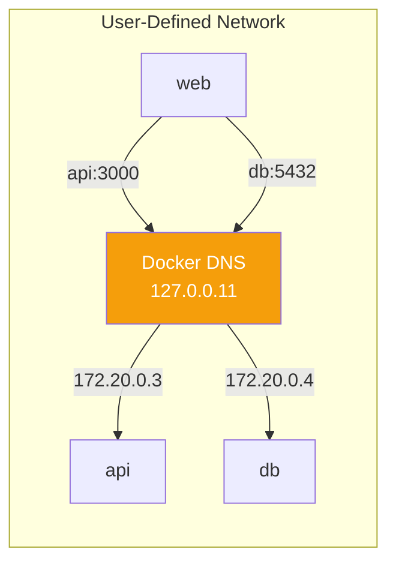
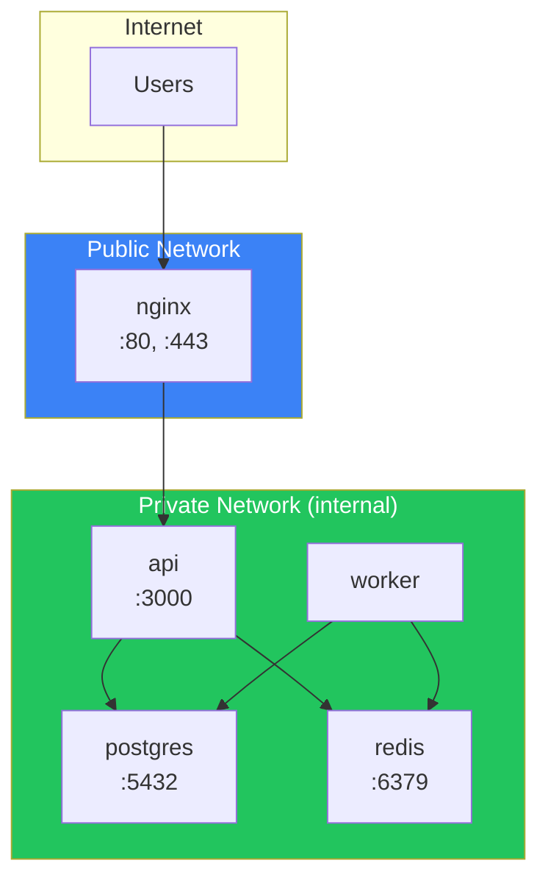

Docker networking enables containers to communicate with each other and the outside world. This article covers network types, port mapping, DNS, and best practices for building secure containerized applications.

## Container Network Model (CNM)

Docker's networking is based on the Container Network Model, which has three main components:


| Component | Description |
|-----------|-------------|
| **Sandbox** | Isolated network stack (interfaces, routing, DNS) |
| **Endpoint** | Virtual network interface connecting sandbox to network |
| **Network** | Software-defined network connecting multiple endpoints |

## Network Drivers

Docker provides several built-in network drivers:

```bash
# List available networks
docker network ls

# Output:
NETWORK ID     NAME      DRIVER    SCOPE
abc123         bridge    bridge    local
def456         host      host      local
ghi789         none      null      local
```

| Driver | Description | Use Case |
|--------|-------------|----------|
| `bridge` | Default, isolated network | Most applications |
| `host` | Share host's network stack | Performance-critical apps |
| `none` | No networking | Security, isolated processing |
| `overlay` | Multi-host networking | Docker Swarm, Kubernetes |
| `macvlan` | Assign MAC address | Legacy apps requiring direct LAN |

## Bridge Networks

The bridge network is Docker's default and most commonly used network type.

### Default Bridge Network

```bash
# Run container on default bridge
docker run -d --name web nginx

# Inspect default bridge
docker network inspect bridge
```

The default bridge has limitations:
- Containers communicate only by IP address (not names)
- All containers share the same bridge

### User-Defined Bridge Networks

User-defined bridges are superior:

```bash
# Create a custom bridge
docker network create mynetwork

# Run containers on custom network
docker run -d --name web --network mynetwork nginx
docker run -d --name api --network mynetwork myapi

# Containers can reach each other by name
docker exec web curl http://api:3000
```

**Advantages of user-defined bridges:**

| Feature | Default Bridge | User-Defined Bridge |
|---------|---------------|---------------------|
| DNS resolution | ❌ (IP only) | ✅ (by name) |
| Isolation | Shared | Per network |
| Connect/disconnect | Restart required | Live connect |
| Link containers | Manual `--link` | Automatic |

### Creating and Managing Networks

```bash
# Create network with options
docker network create \
  --driver bridge \
  --subnet 172.20.0.0/16 \
  --gateway 172.20.0.1 \
  --ip-range 172.20.240.0/20 \
  mynetwork

# Connect running container to network
docker network connect mynetwork existing-container

# Disconnect from network
docker network disconnect mynetwork container-name

# Remove network
docker network rm mynetwork

# Remove all unused networks
docker network prune
```

## Host Network

The host network removes network isolation - the container shares the host's network stack:

```bash
# Use host network
docker run -d --network host nginx

# Container binds directly to host ports
# No port mapping needed - nginx is on host:80
```

**When to use host networking:**

| Use Case | Reason |
|----------|--------|
| Performance-critical apps | No NAT overhead |
| Apps needing host network access | Port scanning, network tools |
| When port mapping is problematic | Many dynamic ports |

**Caution:** Host networking reduces isolation and only works on Linux.

## None Network

The none network provides complete network isolation:

```bash
docker run -d --network none --name isolated alpine sleep infinity

# Container has no network interfaces (except loopback)
docker exec isolated ip addr
# Shows only lo interface
```

Use cases:
- Processing sensitive data
- Batch jobs that don't need networking
- Maximum security isolation

## Port Mapping

Port mapping exposes container ports to the host:

```bash
# Map host port 8080 to container port 80
docker run -d -p 8080:80 nginx

# Map to specific interface
docker run -d -p 127.0.0.1:8080:80 nginx

# Map random host port
docker run -d -p 80 nginx

# Map multiple ports
docker run -d -p 80:80 -p 443:443 nginx

# Map UDP port
docker run -d -p 53:53/udp dns-server

# Map port range
docker run -d -p 8000-8010:8000-8010 myapp
```

### Viewing Port Mappings

```bash
# List port mappings
docker port container-name

# Output:
80/tcp -> 0.0.0.0:8080

# Or use docker ps
docker ps --format "table {{.Names}}\t{{.Ports}}"
```

## Container DNS

Docker provides automatic DNS resolution within user-defined networks:



### DNS Features

```bash
# Create network and containers
docker network create mynet
docker run -d --name db --network mynet postgres
docker run -d --name api --network mynet myapi

# api container can reach db by name
docker exec api ping db
```

### Custom DNS Configuration

```bash
# Use custom DNS servers
docker run -d \
  --dns 8.8.8.8 \
  --dns 8.8.4.4 \
  --dns-search example.com \
  myapp

# Add host entries
docker run -d \
  --add-host myhost:192.168.1.100 \
  --add-host db:192.168.1.50 \
  myapp
```

## Network Configuration in Docker Compose

```yaml
services:
  frontend:
    build: ./frontend
    networks:
      - frontend-net
    ports:
      - "80:80"

  api:
    build: ./api
    networks:
      - frontend-net
      - backend-net
    expose:
      - "3000"  # Only internal, not mapped to host

  db:
    image: postgres:15
    networks:
      - backend-net
    # No ports exposed - only accessible from backend-net

networks:
  frontend-net:
    driver: bridge
  backend-net:
    driver: bridge
    internal: true  # No external access
```

### Network Aliases

```yaml
services:
  api:
    networks:
      frontend:
        aliases:
          - backend
          - api-service

networks:
  frontend:
```

Containers can reach `api` using any of these names: `api`, `backend`, `api-service`.

## Multi-Tier Architecture Example

```yaml
# docker-compose.yml
services:
  # Public tier - accessible from outside
  nginx:
    image: nginx:alpine
    ports:
      - "80:80"
      - "443:443"
    networks:
      - public
    volumes:
      - ./nginx.conf:/etc/nginx/nginx.conf:ro

  # Application tier - internal only
  api:
    build: ./api
    networks:
      - public    # Receives traffic from nginx
      - private   # Connects to database
    environment:
      DATABASE_URL: postgres://db:5432/mydb
    expose:
      - "3000"

  worker:
    build: ./worker
    networks:
      - private   # Only database access
    environment:
      DATABASE_URL: postgres://db:5432/mydb

  # Data tier - most restricted
  db:
    image: postgres:15
    networks:
      - private
    volumes:
      - postgres_data:/var/lib/postgresql/data
    # No ports exposed to host

  redis:
    image: redis:7-alpine
    networks:
      - private

networks:
  public:
    driver: bridge
  private:
    driver: bridge
    internal: true  # Cannot reach internet

volumes:
  postgres_data:
```



## Inspecting Networks

```bash
# Detailed network information
docker network inspect mynetwork

# Find container's IP address
docker inspect -f '{{range.NetworkSettings.Networks}}{{.IPAddress}}{{end}}' container-name

# List containers on a network
docker network inspect mynetwork -f '{{range .Containers}}{{.Name}} {{end}}'
```

## Troubleshooting Networking

### Debug with a Network Tools Container

```bash
# Use nicolaka/netshoot for debugging
docker run -it --rm --network container:myapp nicolaka/netshoot

# Inside the debug container:
curl localhost:3000
ping db
nslookup api
tcpdump -i eth0
```

### Common Issues and Solutions

| Problem | Possible Cause | Solution |
|---------|---------------|----------|
| Cannot reach container by name | Using default bridge | Use user-defined network |
| Connection refused | Wrong port or service not running | Check logs, verify port |
| Cannot reach external internet | Internal network | Remove `internal: true` |
| Port already in use | Host port conflict | Use different host port |

### Check Container Connectivity

```bash
# View container's network configuration
docker exec myapp ip addr
docker exec myapp ip route
docker exec myapp cat /etc/resolv.conf

# Test connectivity
docker exec myapp ping other-container
docker exec myapp curl http://api:3000/health
```

## Best Practices

### 1. Use User-Defined Networks

```bash
# Always create custom networks
docker network create app-network
docker run -d --network app-network myapp
```

### 2. Isolate by Function

```yaml
networks:
  frontend:   # Web servers
  backend:    # App servers
  data:       # Databases
    internal: true
```

### 3. Use Internal Networks for Sensitive Services

```yaml
networks:
  database:
    internal: true  # No internet access
```

### 4. Expose Only What's Necessary

```yaml
services:
  api:
    expose:
      - "3000"  # Internal only
    # Don't use 'ports' unless external access needed
```

### 5. Bind to Localhost for Development

```bash
# Only accessible from host machine
docker run -d -p 127.0.0.1:5432:5432 postgres
```

## Summary Table

| Network Type | Isolation | DNS | External Access | Use Case |
|--------------|-----------|-----|-----------------|----------|
| Bridge (default) | Medium | IP only | Via port mapping | Basic |
| Bridge (custom) | Medium | By name | Via port mapping | Most apps |
| Host | None | Host's | Direct | Performance |
| None | Complete | None | None | Security |
| Internal | High | By name | None | Data tier |

## Key Takeaways

1. **Always use user-defined networks** - Better DNS and isolation
2. **Design with security in mind** - Use internal networks for sensitive services
3. **Limit port exposure** - Use `expose` for internal, `ports` for external
4. **Leverage Docker DNS** - Reference containers by name, not IP
5. **Isolate by function** - Separate frontend, backend, and data tiers
6. **Use debug containers** - `nicolaka/netshoot` is invaluable for troubleshooting

## Next Steps

In the next article, we'll learn about multi-stage builds for creating optimized production images.

## References

- Docker Deep Dive, 5th Edition - Nigel Poulton
- The Ultimate Docker Container Book, 3rd Edition - Dr. Gabriel N. Schenker
- [Docker Networking Documentation](https://docs.docker.com/network/)
