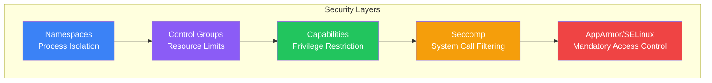

Security is critical in containerized environments. This article covers Docker security from the kernel level to application practices, helping you build and run secure containers.

## Docker Security Architecture

Docker security relies on multiple layers of Linux kernel features:



## Running as Non-Root User

Running containers as root is the most common security mistake.

### Why Non-Root Matters

| Risk | Running as Root | Running as Non-Root |
|------|-----------------|---------------------|
| Container escape | Full host access | Limited access |
| File system damage | Can modify anything | Restricted |
| Privilege escalation | Easy | Much harder |

### Creating Non-Root Users in Dockerfile

```dockerfile
FROM node:18-alpine

# Create a non-root user and group
RUN addgroup -S appgroup && adduser -S appuser -G appgroup

WORKDIR /app
COPY --chown=appuser:appgroup . .

# Switch to non-root user
USER appuser

CMD ["node", "server.js"]
```

### Using Numeric UID

```dockerfile
# More portable across systems
USER 1000:1000

# Or reference existing user
FROM node:18-alpine
USER node  # Built-in non-root user in node images
```

### Verify Container User

```bash
# Check which user is running
docker exec mycontainer whoami
docker exec mycontainer id
```

## Linux Capabilities

Capabilities break root privileges into smaller units. Docker drops many by default.

### Default Capabilities

```bash
# View default capabilities
docker run --rm alpine sh -c 'apk add -q libcap && capsh --print'
```

Docker drops these dangerous capabilities:
- `CAP_SYS_ADMIN` - Mount filesystems, configure namespaces
- `CAP_NET_ADMIN` - Network configuration
- `CAP_SYS_PTRACE` - Process tracing

### Dropping All Capabilities

```dockerfile
# In docker-compose.yml
services:
  app:
    cap_drop:
      - ALL
    cap_add:
      - NET_BIND_SERVICE  # Only add what's needed
```

```bash
# Command line
docker run --cap-drop=ALL --cap-add=NET_BIND_SERVICE nginx
```

### Common Capabilities

| Capability | Purpose | Drop Unless Needed |
|------------|---------|-------------------|
| `CHOWN` | Change file ownership | Yes |
| `SETUID` | Change user ID | Yes |
| `NET_RAW` | Use RAW sockets | Yes |
| `SYS_CHROOT` | Use chroot | Yes |
| `MKNOD` | Create special files | Yes |

## Read-Only Filesystem

Make containers immutable for better security:

```bash
# Read-only root filesystem
docker run --read-only nginx

# Allow writes to specific paths
docker run --read-only \
  --tmpfs /tmp \
  --tmpfs /var/run \
  -v logs:/var/log \
  nginx
```

```yaml
# docker-compose.yml
services:
  app:
    read_only: true
    tmpfs:
      - /tmp
      - /var/run
    volumes:
      - logs:/var/log
```

## Seccomp Profiles

Seccomp filters system calls the container can make.

### Default Seccomp Profile

Docker's default profile blocks ~44 dangerous syscalls including:
- `reboot`
- `mount`
- `ptrace`
- `settimeofday`

### Custom Seccomp Profile

```json
{
  "defaultAction": "SCMP_ACT_ERRNO",
  "architectures": ["SCMP_ARCH_X86_64"],
  "syscalls": [
    {
      "names": ["read", "write", "open", "close", "stat"],
      "action": "SCMP_ACT_ALLOW"
    }
  ]
}
```

```bash
docker run --security-opt seccomp=custom-profile.json nginx
```

## AppArmor and SELinux

### AppArmor (Ubuntu/Debian)

```bash
# Check if AppArmor is active
docker info | grep -i apparmor

# Use custom profile
docker run --security-opt apparmor=docker-nginx nginx
```

### SELinux (RHEL/CentOS)

```bash
# Run with SELinux labels
docker run --security-opt label=type:container_t nginx
```

## Image Security

### Scanning for Vulnerabilities

```bash
# Docker Scout
docker scout cves myimage:latest
docker scout quickview myimage:latest

# Trivy
trivy image myimage:latest
trivy image --severity HIGH,CRITICAL myimage:latest

# Grype
grype myimage:latest
```

### Trusted Base Images

```dockerfile
# Use official images
FROM node:18-alpine

# Use verified publishers
FROM bitnami/nginx:latest

# Pin to specific digest for immutability
FROM node@sha256:abc123...
```

### Image Signing with Docker Content Trust

```bash
# Enable content trust
export DOCKER_CONTENT_TRUST=1

# Sign and push
docker push myregistry.com/myimage:v1.0

# Pull only signed images
docker pull myregistry.com/myimage:v1.0
```

## Secrets Management

### Never Do This

```dockerfile
# BAD - secrets in image layers
ENV API_KEY=secret123
COPY .env /app/.env
RUN echo "password=secret" > /app/config
```

### Docker Secrets (Swarm)

```bash
# Create secret
echo "mypassword" | docker secret create db_password -

# Use in service
docker service create \
  --secret db_password \
  --env DB_PASSWORD_FILE=/run/secrets/db_password \
  myapp
```

### Docker Compose Secrets

```yaml
services:
  app:
    secrets:
      - db_password
    environment:
      DB_PASSWORD_FILE: /run/secrets/db_password

secrets:
  db_password:
    file: ./secrets/db_password.txt
```

### BuildKit Secret Mounts

```dockerfile
# syntax=docker/dockerfile:1.4
RUN --mount=type=secret,id=npmrc,target=/root/.npmrc \
    npm install
```

```bash
docker build --secret id=npmrc,src=.npmrc -t myapp .
```

## Network Security

### Use Internal Networks

```yaml
services:
  db:
    networks:
      - internal

networks:
  internal:
    internal: true  # No external access
```

### Disable Inter-Container Communication

```bash
# On daemon level
dockerd --icc=false

# Per network
docker network create --opt com.docker.network.bridge.enable_icc=false secure-net
```

### Don't Expose Unnecessary Ports

```yaml
services:
  db:
    # DON'T expose to host
    # ports:
    #   - "5432:5432"

    # Other services connect via internal network
    expose:
      - "5432"
```

## Resource Limits

Prevent DoS attacks and resource exhaustion:

```yaml
services:
  app:
    deploy:
      resources:
        limits:
          cpus: '0.5'
          memory: 512M
          pids: 100  # Prevent fork bombs
        reservations:
          memory: 256M
```

```bash
docker run -d \
  --memory=512m \
  --cpus=0.5 \
  --pids-limit=100 \
  myapp
```

## Rootless Docker

Run Docker daemon without root privileges:

```bash
# Install rootless Docker
curl -fsSL https://get.docker.com/rootless | sh

# Start rootless daemon
systemctl --user start docker

# Set environment
export DOCKER_HOST=unix://$XDG_RUNTIME_DIR/docker.sock
```

## Security Scanning in CI/CD

```yaml
# GitHub Actions example
jobs:
  security-scan:
    runs-on: ubuntu-latest
    steps:
      - uses: actions/checkout@v4

      - name: Build image
        run: docker build -t myapp:${{ github.sha }} .

      - name: Run Trivy scan
        uses: aquasecurity/trivy-action@master
        with:
          image-ref: myapp:${{ github.sha }}
          severity: 'CRITICAL,HIGH'
          exit-code: '1'  # Fail build on vulnerabilities
```

## Security Checklist

| Category | Check |
|----------|-------|
| **User** | Running as non-root? |
| **Capabilities** | Dropped unnecessary capabilities? |
| **Filesystem** | Read-only where possible? |
| **Image** | Scanned for vulnerabilities? |
| **Secrets** | Not in image or environment? |
| **Network** | Minimal port exposure? |
| **Resources** | Limits configured? |
| **Base image** | From trusted source? |

## Complete Secure Dockerfile

```dockerfile
FROM node:18-alpine

# Create non-root user
RUN addgroup -S nodejs && adduser -S nodejs -G nodejs

WORKDIR /app

# Copy with proper ownership
COPY --chown=nodejs:nodejs package*.json ./
RUN npm ci --only=production && npm cache clean --force

COPY --chown=nodejs:nodejs . .

# Remove unnecessary files
RUN rm -rf .git .env* *.md

# Switch to non-root
USER nodejs

# Read-only filesystem compatible
ENV NODE_ENV=production

EXPOSE 3000

# Health check
HEALTHCHECK --interval=30s --timeout=3s \
  CMD wget --no-verbose --tries=1 --spider http://localhost:3000/health || exit 1

CMD ["node", "server.js"]
```

```yaml
# docker-compose.yml
services:
  app:
    build: .
    read_only: true
    tmpfs:
      - /tmp
    cap_drop:
      - ALL
    security_opt:
      - no-new-privileges:true
    deploy:
      resources:
        limits:
          memory: 512M
          cpus: '0.5'
```

## Key Takeaways

1. **Never run as root** - Always create and use non-root users
2. **Drop capabilities** - Remove all, add only what's needed
3. **Use read-only filesystems** - Prevent runtime modifications
4. **Scan images regularly** - Find vulnerabilities before production
5. **Manage secrets properly** - Use Docker secrets or external vaults
6. **Limit resources** - Prevent DoS and resource exhaustion
7. **Network isolation** - Use internal networks, minimize exposure

## Next Steps

In the next article, we'll explore Docker Swarm for container orchestration.

## References

- Docker Deep Dive, 5th Edition - Nigel Poulton
- [Docker Security Documentation](https://docs.docker.com/engine/security/)
- [CIS Docker Benchmark](https://www.cisecurity.org/benchmark/docker)
