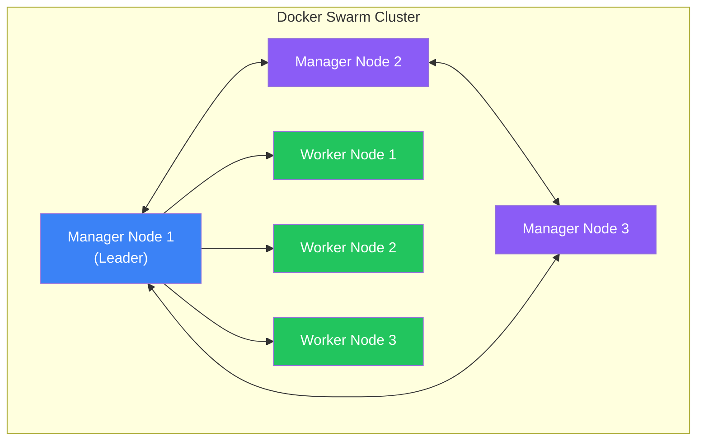

Docker Swarm is Docker's native orchestration solution for managing containers across multiple hosts. It's simpler than Kubernetes and perfect for small to medium deployments.

## What is Docker Swarm?

Docker Swarm turns a group of Docker hosts into a single virtual host:



### Key Concepts

| Term | Description |
|------|-------------|
| **Node** | Docker host participating in the swarm |
| **Manager** | Node that manages cluster state |
| **Worker** | Node that runs containers |
| **Service** | Definition of tasks to run |
| **Task** | Container running as part of a service |
| **Stack** | Group of related services |

## Setting Up a Swarm

### Initialize the Swarm

```bash
# On the first manager node
docker swarm init --advertise-addr <MANAGER-IP>

# Output includes join tokens:
# To add a worker: docker swarm join --token SWMTKN-1-xxx... <MANAGER-IP>:2377
# To add a manager: docker swarm join-token manager
```

### Join Nodes

```bash
# On worker nodes
docker swarm join --token SWMTKN-1-xxx... <MANAGER-IP>:2377

# On additional manager nodes
docker swarm join --token SWMTKN-1-yyy... <MANAGER-IP>:2377
```

### Verify Cluster

```bash
# List nodes
docker node ls

# Output:
ID                           HOSTNAME    STATUS    AVAILABILITY   MANAGER STATUS
abc123...   *                manager1    Ready     Active         Leader
def456...                    manager2    Ready     Active         Reachable
ghi789...                    worker1     Ready     Active
```

## Services

Services are the primary abstraction in Swarm.

### Creating Services

```bash
# Create a simple service
docker service create --name web --replicas 3 -p 80:80 nginx

# Create with more options
docker service create \
  --name api \
  --replicas 5 \
  --publish 3000:3000 \
  --env NODE_ENV=production \
  --mount type=volume,source=data,target=/app/data \
  --constraint 'node.role==worker' \
  myapp:latest
```

### Managing Services

```bash
# List services
docker service ls

# Inspect a service
docker service inspect web --pretty

# View service logs
docker service logs web
docker service logs -f web  # Follow logs

# Scale a service
docker service scale web=5

# Update a service
docker service update --image nginx:1.25 web

# Remove a service
docker service rm web
```

### Service Modes

```bash
# Replicated (default) - specific number of replicas
docker service create --mode replicated --replicas 3 nginx

# Global - one task per node
docker service create --mode global prometheus/node-exporter
```

## Stacks

Stacks let you deploy multi-service applications using Compose files.

### Stack File (docker-compose.yml)

```yaml
version: "3.8"

services:
  web:
    image: nginx:alpine
    deploy:
      replicas: 3
      update_config:
        parallelism: 1
        delay: 10s
      restart_policy:
        condition: on-failure
    ports:
      - "80:80"
    networks:
      - frontend

  api:
    image: myapp:latest
    deploy:
      replicas: 2
      placement:
        constraints:
          - node.role == worker
    environment:
      DATABASE_URL: postgres://db:5432/mydb
    networks:
      - frontend
      - backend

  db:
    image: postgres:15
    deploy:
      replicas: 1
      placement:
        constraints:
          - node.labels.db == true
    volumes:
      - db_data:/var/lib/postgresql/data
    networks:
      - backend
    secrets:
      - db_password

networks:
  frontend:
  backend:
    internal: true

volumes:
  db_data:

secrets:
  db_password:
    external: true
```

### Deploying Stacks

```bash
# Deploy a stack
docker stack deploy -c docker-compose.yml myapp

# List stacks
docker stack ls

# List services in a stack
docker stack services myapp

# List tasks in a stack
docker stack ps myapp

# Remove a stack
docker stack rm myapp
```

## Overlay Networks

Overlay networks enable communication between containers across nodes.

```bash
# Create overlay network
docker network create --driver overlay --attachable mynetwork

# Use in service
docker service create --network mynetwork --name web nginx
```

### Encrypted Overlay

```bash
# Create encrypted overlay
docker network create \
  --driver overlay \
  --opt encrypted \
  secure-network
```

## Rolling Updates

```yaml
services:
  web:
    image: nginx:latest
    deploy:
      replicas: 10
      update_config:
        parallelism: 2        # Update 2 at a time
        delay: 10s            # Wait 10s between batches
        failure_action: rollback
        monitor: 60s          # Monitor for 60s
        max_failure_ratio: 0.1  # Rollback if >10% fail
      rollback_config:
        parallelism: 2
        delay: 5s
```

### Update Commands

```bash
# Update image
docker service update --image nginx:1.25 web

# Update with rollback on failure
docker service update \
  --image nginx:1.25 \
  --update-failure-action rollback \
  web

# Rollback to previous version
docker service rollback web
```

## Placement Constraints

Control where tasks run:

```yaml
services:
  api:
    deploy:
      placement:
        constraints:
          - node.role == worker
          - node.labels.region == us-east
          - node.hostname == worker1
        preferences:
          - spread: node.labels.zone
```

### Add Node Labels

```bash
# Add label to node
docker node update --label-add region=us-east worker1
docker node update --label-add db=true worker2

# Use in constraint
docker service create \
  --constraint 'node.labels.db==true' \
  postgres
```

## Secrets Management

```bash
# Create secret from file
docker secret create db_password ./db_password.txt

# Create from stdin
echo "mypassword" | docker secret create db_password -

# List secrets
docker secret ls

# Use in service
docker service create \
  --secret db_password \
  --env DB_PASSWORD_FILE=/run/secrets/db_password \
  myapp
```

### Secrets in Stack

```yaml
services:
  app:
    secrets:
      - db_password
      - api_key

secrets:
  db_password:
    external: true
  api_key:
    file: ./api_key.txt
```

## Configs

Store non-sensitive configuration:

```bash
# Create config
docker config create nginx_conf ./nginx.conf

# Use in service
docker service create \
  --config source=nginx_conf,target=/etc/nginx/nginx.conf \
  nginx
```

## Health Checks

```yaml
services:
  web:
    image: myapp:latest
    healthcheck:
      test: ["CMD", "curl", "-f", "http://localhost:3000/health"]
      interval: 30s
      timeout: 10s
      retries: 3
      start_period: 40s
    deploy:
      replicas: 3
```

## Resource Limits

```yaml
services:
  api:
    deploy:
      resources:
        limits:
          cpus: '0.5'
          memory: 512M
        reservations:
          cpus: '0.25'
          memory: 256M
```

## Monitoring the Swarm

```bash
# Cluster info
docker info

# Node details
docker node inspect worker1 --pretty

# Service tasks
docker service ps web

# Check for unhealthy tasks
docker service ps web --filter "desired-state=running" \
  --format "{{.Name}} {{.CurrentState}}"
```

## High Availability

### Manager Nodes

| Managers | Fault Tolerance |
|----------|-----------------|
| 1 | 0 (no HA) |
| 3 | 1 node failure |
| 5 | 2 node failures |
| 7 | 3 node failures |

```bash
# Promote worker to manager
docker node promote worker1

# Demote manager to worker
docker node demote manager3
```

### Drain Nodes for Maintenance

```bash
# Drain node (migrate tasks away)
docker node update --availability drain worker1

# Bring back online
docker node update --availability active worker1
```

## Complete Stack Example

```yaml
version: "3.8"

services:
  traefik:
    image: traefik:v2.10
    command:
      - "--providers.docker.swarmMode=true"
      - "--entrypoints.web.address=:80"
    ports:
      - "80:80"
    volumes:
      - /var/run/docker.sock:/var/run/docker.sock:ro
    deploy:
      placement:
        constraints:
          - node.role == manager
    networks:
      - traefik-public

  api:
    image: myapp:latest
    deploy:
      replicas: 3
      labels:
        - "traefik.enable=true"
        - "traefik.http.routers.api.rule=Host(`api.example.com`)"
      update_config:
        parallelism: 1
        delay: 10s
    networks:
      - traefik-public
      - backend
    secrets:
      - db_password

  postgres:
    image: postgres:15
    deploy:
      replicas: 1
      placement:
        constraints:
          - node.labels.db == true
    environment:
      POSTGRES_PASSWORD_FILE: /run/secrets/db_password
    volumes:
      - postgres_data:/var/lib/postgresql/data
    networks:
      - backend
    secrets:
      - db_password

networks:
  traefik-public:
    driver: overlay
  backend:
    driver: overlay
    internal: true

volumes:
  postgres_data:

secrets:
  db_password:
    external: true
```

## Key Takeaways

1. **Simple setup** - Initialize with one command
2. **Declarative** - Define desired state, Swarm maintains it
3. **Built-in load balancing** - Automatic routing mesh
4. **Rolling updates** - Zero-downtime deployments
5. **Secrets management** - Secure handling of sensitive data
6. **Service discovery** - Automatic DNS for services

## Next Steps

In the next article, we'll cover debugging and troubleshooting Docker containers.

## References

- Docker Deep Dive, 5th Edition - Nigel Poulton
- [Docker Swarm Documentation](https://docs.docker.com/engine/swarm/)
