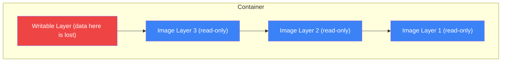
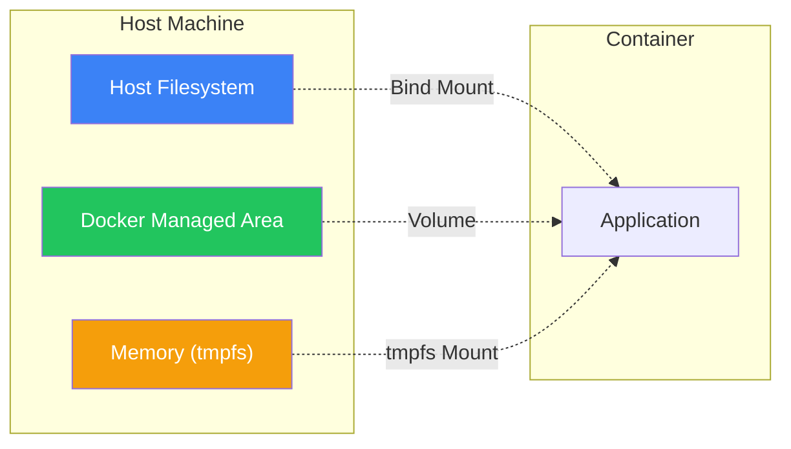
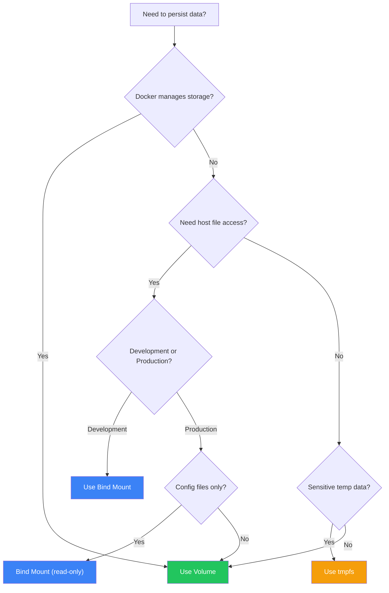

Containers are ephemeral by design - when a container is removed, its data is lost. Docker provides several mechanisms to persist data beyond container lifecycles. This article covers volumes, bind mounts, and tmpfs mounts.

## The Container Filesystem Problem

By default, all files in a container are stored in a writable container layer:



**Problems with this approach:**
- Data is lost when the container is removed
- Data can't be easily shared between containers
- Writing to the container layer is slower (due to storage driver)
- Container size grows with data

## Types of Mounts

Docker provides three ways to persist data:



| Type | Stored In | Use Case |
|------|-----------|----------|
| **Volume** | Docker managed area | Production data, databases |
| **Bind Mount** | Any host path | Development, config files |
| **tmpfs Mount** | Host memory | Sensitive data, temp files |

## Docker Volumes

Volumes are the preferred way to persist data. Docker manages the volume storage completely.

### Creating Volumes

```bash
# Create a named volume
docker volume create mydata

# List volumes
docker volume ls

# Inspect a volume
docker volume inspect mydata

# Output:
[
    {
        "Name": "mydata",
        "Driver": "local",
        "Mountpoint": "/var/lib/docker/volumes/mydata/_data",
        "Labels": {},
        "Scope": "local"
    }
]
```

### Using Volumes with Containers

```bash
# Mount volume with -v
docker run -d \
  -v mydata:/var/lib/mysql \
  --name mysql \
  mysql:8

# Mount volume with --mount (more explicit)
docker run -d \
  --mount source=mydata,target=/var/lib/mysql \
  --name mysql \
  mysql:8

# Create volume on the fly
docker run -d \
  -v newvolume:/data \
  alpine
```

### Volume Syntax Comparison

```bash
# -v syntax: name:path[:options]
-v mydata:/app/data
-v mydata:/app/data:ro

# --mount syntax: key=value pairs
--mount source=mydata,target=/app/data
--mount source=mydata,target=/app/data,readonly
```

| Aspect | `-v` | `--mount` |
|--------|------|-----------|
| Syntax | Shorter | More verbose |
| Missing volume | Auto-creates | Errors |
| Recommended | Quick use | Production |

### Volume in Docker Compose

```yaml
services:
  db:
    image: postgres:15
    volumes:
      - postgres_data:/var/lib/postgresql/data
      - db_backup:/backup

volumes:
  postgres_data:
  db_backup:
    driver: local
    driver_opts:
      type: none
      o: bind
      device: /mnt/backup
```

### Sharing Volumes Between Containers

```bash
# Container 1 writes data
docker run -d \
  -v shared_data:/data \
  --name writer \
  alpine sh -c "while true; do date >> /data/log.txt; sleep 1; done"

# Container 2 reads data
docker run --rm \
  -v shared_data:/data \
  alpine tail -f /data/log.txt
```

### Volume Drivers

```bash
# Use a different driver
docker volume create \
  --driver local \
  --opt type=nfs \
  --opt o=addr=192.168.1.1,rw \
  --opt device=:/path/to/dir \
  nfs_volume

# Cloud storage drivers (plugins required)
docker volume create \
  --driver rexray/ebs \
  --opt size=100 \
  aws_volume
```

## Bind Mounts

Bind mounts map a host directory to a container path. They're ideal for development workflows.

### Using Bind Mounts

```bash
# Mount current directory
docker run -d \
  -v $(pwd):/app \
  --name dev \
  node:18 npm run dev

# Mount with --mount
docker run -d \
  --mount type=bind,source=$(pwd),target=/app \
  node:18

# Read-only bind mount
docker run -d \
  -v $(pwd)/config:/app/config:ro \
  myapp
```

### Bind Mounts in Docker Compose

```yaml
services:
  app:
    build: .
    volumes:
      # Bind mount for development
      - ./src:/app/src
      # Read-only config
      - ./config:/app/config:ro
      # Exclude node_modules
      - /app/node_modules
```

### Development Workflow Example

```yaml
# docker-compose.yml
services:
  app:
    build:
      context: .
      target: development
    volumes:
      - .:/app
      - /app/node_modules  # Anonymous volume for node_modules
    ports:
      - "3000:3000"
    command: npm run dev
```

This pattern:
1. Mounts source code for live reloading
2. Uses anonymous volume for `node_modules` (prevents host overwrite)
3. Changes in your editor appear immediately in the container

## tmpfs Mounts

tmpfs mounts store data in memory. Data is never written to the host filesystem.

### Using tmpfs

```bash
# Create tmpfs mount
docker run -d \
  --tmpfs /app/temp \
  myapp

# With size limit
docker run -d \
  --mount type=tmpfs,target=/app/temp,tmpfs-size=100m \
  myapp
```

### When to Use tmpfs

| Use Case | Why tmpfs |
|----------|-----------|
| Sensitive data | Never persisted to disk |
| Temporary files | Fast access, auto-cleanup |
| Session data | Memory-fast, container-scoped |

```yaml
# docker-compose.yml
services:
  app:
    image: myapp
    tmpfs:
      - /app/temp
      - /app/cache:size=100m
```

## Practical Examples

### PostgreSQL with Persistent Data

```yaml
services:
  postgres:
    image: postgres:15-alpine
    environment:
      POSTGRES_PASSWORD: ${DB_PASSWORD}
    volumes:
      # Data persistence
      - postgres_data:/var/lib/postgresql/data
      # Init scripts (read-only)
      - ./init:/docker-entrypoint-initdb.d:ro
    healthcheck:
      test: ["CMD-SHELL", "pg_isready -U postgres"]
      interval: 5s

volumes:
  postgres_data:
```

### Redis with Persistence Options

```yaml
services:
  redis:
    image: redis:7-alpine
    command: redis-server --appendonly yes
    volumes:
      - redis_data:/data

volumes:
  redis_data:
```

### MySQL Backup Pattern

```yaml
services:
  mysql:
    image: mysql:8
    volumes:
      - mysql_data:/var/lib/mysql
      - ./backup:/backup

  backup:
    image: mysql:8
    volumes:
      - ./backup:/backup
    depends_on:
      - mysql
    entrypoint: >
      sh -c "mysqldump -h mysql -u root -p$$MYSQL_ROOT_PASSWORD --all-databases > /backup/backup.sql"

volumes:
  mysql_data:
```

### Multi-Container File Sharing

```yaml
services:
  # Application generates files
  generator:
    image: myapp
    volumes:
      - shared_files:/output

  # Worker processes files
  processor:
    image: processor
    volumes:
      - shared_files:/input:ro

  # Web server serves files
  nginx:
    image: nginx:alpine
    volumes:
      - shared_files:/usr/share/nginx/html:ro
    ports:
      - "80:80"

volumes:
  shared_files:
```

## Managing Volumes

### Listing and Inspecting

```bash
# List all volumes
docker volume ls

# List with filter
docker volume ls -f dangling=true

# Detailed information
docker volume inspect mydata
```

### Backing Up Volumes

```bash
# Backup a volume
docker run --rm \
  -v mydata:/data \
  -v $(pwd):/backup \
  alpine tar cvf /backup/mydata.tar /data

# Restore a volume
docker run --rm \
  -v mydata:/data \
  -v $(pwd):/backup \
  alpine sh -c "cd /data && tar xvf /backup/mydata.tar --strip 1"
```

### Copying Data

```bash
# Copy from container to host
docker cp container_name:/path/to/data ./local/path

# Copy from host to volume
docker run --rm \
  -v mydata:/data \
  -v $(pwd)/source:/source \
  alpine cp -r /source/. /data/
```

### Removing Volumes

```bash
# Remove a volume
docker volume rm mydata

# Remove all unused volumes
docker volume prune

# Force remove
docker volume prune -f

# Remove volumes when removing container
docker rm -v container_name
```

## Volume vs Bind Mount Decision Guide



| Scenario | Recommendation |
|----------|----------------|
| Database data | Named volume |
| Development source code | Bind mount |
| Configuration files | Bind mount (read-only) |
| Temporary/sensitive data | tmpfs |
| Shared data between containers | Named volume |
| Cloud/NFS storage | Volume with driver |

## Best Practices

### 1. Always Use Named Volumes for Important Data

```bash
# Bad - anonymous volume
docker run -v /var/lib/mysql mysql

# Good - named volume
docker run -v mysql_data:/var/lib/mysql mysql
```

### 2. Use Read-Only When Possible

```yaml
volumes:
  - ./config:/app/config:ro
  - ./nginx.conf:/etc/nginx/nginx.conf:ro
```

### 3. Separate Code and Data

```yaml
services:
  app:
    volumes:
      - app_data:/app/data      # Persistent data
      - ./src:/app/src          # Development code
```

### 4. Back Up Regularly

```bash
# Automated backup script
#!/bin/bash
VOLUME_NAME=$1
BACKUP_DIR=/backups
DATE=$(date +%Y%m%d_%H%M%S)

docker run --rm \
  -v ${VOLUME_NAME}:/data \
  -v ${BACKUP_DIR}:/backup \
  alpine tar cvf /backup/${VOLUME_NAME}_${DATE}.tar /data
```

### 5. Don't Store Secrets in Bind Mounts

```yaml
# Bad
volumes:
  - ./secrets:/app/secrets

# Good - use Docker secrets or environment
secrets:
  db_password:
    file: ./secrets/db_password.txt
```

## Summary Table

| Feature | Volume | Bind Mount | tmpfs |
|---------|--------|------------|-------|
| Location | Docker area | Any host path | Memory |
| Persistence | Yes | Yes | No |
| Sharing | Easy | Possible | No |
| Performance | Good | Best (SSD) | Fastest |
| Portability | High | Low | N/A |
| Use case | Production data | Development | Temp data |

## Key Takeaways

1. **Volumes are preferred for production** - Docker manages them, easy to backup
2. **Bind mounts for development** - See changes immediately
3. **tmpfs for sensitive/temporary data** - Never touches disk
4. **Always name your volumes** - Anonymous volumes are hard to manage
5. **Use read-only when possible** - Reduces security risk
6. **Back up volumes regularly** - Data loss is real

## Next Steps

In the next article, we'll explore Docker networking - connecting containers, exposing services, and building multi-tier architectures.

## References

- Docker Deep Dive, 5th Edition - Nigel Poulton
- The Ultimate Docker Container Book, 3rd Edition - Dr. Gabriel N. Schenker
- [Docker Volumes Documentation](https://docs.docker.com/storage/volumes/)
