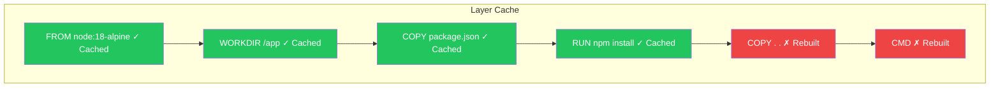

A Dockerfile is a text file containing instructions for building a Docker image. In this article, you'll learn the essential Dockerfile instructions and best practices for creating efficient, production-ready images.

## What is a Dockerfile?

A Dockerfile is a recipe for building Docker images. Each instruction in the file creates a layer in the final image:

```dockerfile
# Example Dockerfile
FROM node:18-alpine
WORKDIR /app
COPY package*.json ./
RUN npm install
COPY . .
EXPOSE 3000
CMD ["node", "server.js"]
```

## Building an Image

```bash
# Basic build
docker build -t myapp:v1 .

# Build with a specific Dockerfile
docker build -t myapp:v1 -f Dockerfile.prod .

# Build with no cache
docker build --no-cache -t myapp:v1 .

# Build with build arguments
docker build --build-arg VERSION=1.0 -t myapp:v1 .
```

## Essential Instructions

### FROM - Base Image

Every Dockerfile must start with `FROM`. It sets the base image:

```dockerfile
# Official image
FROM node:18

# Specific version with tag
FROM node:18.19.0-alpine

# Minimal base image
FROM alpine:3.19

# Empty base (for static binaries)
FROM scratch
```

**Best Practice**: Always use specific tags, not `latest`:

```dockerfile
# Bad - unpredictable
FROM node:latest

# Good - reproducible
FROM node:18.19.0-alpine
```

### RUN - Execute Commands

`RUN` executes commands during the build process:

```dockerfile
# Shell form
RUN apt-get update && apt-get install -y curl

# Exec form (preferred for clarity)
RUN ["apt-get", "update"]

# Multi-line with backslash
RUN apt-get update && \
    apt-get install -y \
        curl \
        wget \
        git && \
    rm -rf /var/lib/apt/lists/*
```

**Best Practice**: Combine related commands to reduce layers:

```dockerfile
# Bad - creates multiple layers
RUN apt-get update
RUN apt-get install -y curl
RUN apt-get install -y wget

# Good - single layer, includes cleanup
RUN apt-get update && \
    apt-get install -y curl wget && \
    rm -rf /var/lib/apt/lists/*
```

### COPY vs ADD

Both copy files into the image, but they differ:

```dockerfile
# COPY - simple file/directory copy
COPY package.json /app/
COPY src/ /app/src/

# ADD - additional features (avoid unless needed)
ADD https://example.com/file.tar.gz /app/  # Downloads URL
ADD archive.tar.gz /app/                     # Auto-extracts archives
```

| Feature | COPY | ADD |
|---------|------|-----|
| Copy files | ✅ | ✅ |
| Copy directories | ✅ | ✅ |
| URL download | ❌ | ✅ |
| Auto-extract archives | ❌ | ✅ |
| Recommended | ✅ | Only when needed |

**Best Practice**: Use `COPY` unless you specifically need ADD's features.

### WORKDIR - Set Working Directory

Sets the working directory for subsequent instructions:

```dockerfile
WORKDIR /app

# All following commands run in /app
COPY . .
RUN npm install
CMD ["node", "server.js"]
```

**Best Practice**: Use `WORKDIR` instead of `RUN cd`:

```dockerfile
# Bad
RUN cd /app && npm install

# Good
WORKDIR /app
RUN npm install
```

### ENV - Environment Variables

Sets environment variables available in the container:

```dockerfile
# Single variable
ENV NODE_ENV=production

# Multiple variables
ENV NODE_ENV=production \
    PORT=3000 \
    DEBUG=false

# Using variables
ENV APP_HOME=/app
WORKDIR $APP_HOME
```

### ARG - Build-time Variables

Variables available only during build:

```dockerfile
ARG NODE_VERSION=18
FROM node:${NODE_VERSION}-alpine

ARG BUILD_DATE
ARG GIT_SHA
LABEL build-date=$BUILD_DATE
LABEL git-sha=$GIT_SHA
```

```bash
# Pass values during build
docker build --build-arg NODE_VERSION=20 --build-arg GIT_SHA=$(git rev-parse HEAD) -t myapp .
```

| Aspect | ENV | ARG |
|--------|-----|-----|
| Available during build | ✅ | ✅ |
| Available at runtime | ✅ | ❌ |
| Can be overridden at runtime | ✅ (with `-e`) | ❌ |

### EXPOSE - Document Ports

Documents which ports the container listens on:

```dockerfile
# Single port
EXPOSE 3000

# Multiple ports
EXPOSE 80 443

# UDP port
EXPOSE 53/udp
```

**Note**: `EXPOSE` is documentation only. You still need `-p` to publish ports:

```bash
docker run -p 8080:3000 myapp
```

### CMD vs ENTRYPOINT

Both specify the default command, but serve different purposes:

#### CMD - Default Command

```dockerfile
# Exec form (preferred)
CMD ["node", "server.js"]

# Shell form
CMD node server.js

# As default parameters for ENTRYPOINT
CMD ["--port", "3000"]
```

CMD can be overridden at runtime:
```bash
docker run myapp node other-script.js  # Overrides CMD
```

#### ENTRYPOINT - Fixed Command

```dockerfile
# Exec form
ENTRYPOINT ["node", "server.js"]

# Shell form (not recommended)
ENTRYPOINT node server.js
```

ENTRYPOINT arguments are appended:
```bash
docker run myapp --port 8080  # Runs: node server.js --port 8080
```

#### Combined Pattern

```dockerfile
ENTRYPOINT ["node"]
CMD ["server.js"]
```

```bash
docker run myapp                    # Runs: node server.js
docker run myapp other-script.js    # Runs: node other-script.js
```

### Comparison Table

| Aspect | CMD | ENTRYPOINT |
|--------|-----|------------|
| Purpose | Default command/args | Fixed executable |
| Override at runtime | Replaced | Arguments appended |
| Use case | Flexible defaults | Container as executable |

## Complete Example: Node.js Application

```dockerfile
# Build stage
FROM node:18-alpine AS builder

WORKDIR /app

# Copy package files first (better caching)
COPY package*.json ./

# Install dependencies
RUN npm ci --only=production

# Copy source code
COPY . .

# Production stage
FROM node:18-alpine

# Create non-root user
RUN addgroup -S appgroup && adduser -S appuser -G appgroup

WORKDIR /app

# Copy from builder
COPY --from=builder /app/node_modules ./node_modules
COPY --from=builder /app .

# Set ownership
RUN chown -R appuser:appgroup /app

# Switch to non-root user
USER appuser

# Environment
ENV NODE_ENV=production
ENV PORT=3000

# Documentation
EXPOSE 3000

# Health check
HEALTHCHECK --interval=30s --timeout=3s --start-period=5s --retries=3 \
    CMD wget --no-verbose --tries=1 --spider http://localhost:3000/health || exit 1

# Start command
CMD ["node", "server.js"]
```

## Complete Example: Python Application

```dockerfile
FROM python:3.11-slim

# Prevent Python from writing .pyc files
ENV PYTHONDONTWRITEBYTECODE=1
# Prevent Python from buffering stdout/stderr
ENV PYTHONUNBUFFERED=1

WORKDIR /app

# Install system dependencies
RUN apt-get update && \
    apt-get install -y --no-install-recommends gcc && \
    rm -rf /var/lib/apt/lists/*

# Copy requirements first for caching
COPY requirements.txt .
RUN pip install --no-cache-dir -r requirements.txt

# Copy application
COPY . .

# Create non-root user
RUN useradd --create-home appuser && \
    chown -R appuser:appuser /app
USER appuser

EXPOSE 8000

CMD ["gunicorn", "--bind", "0.0.0.0:8000", "app:app"]
```

## Additional Instructions

### LABEL - Metadata

```dockerfile
LABEL maintainer="developer@example.com"
LABEL version="1.0"
LABEL description="My application"

# OCI standard labels
LABEL org.opencontainers.image.source="https://github.com/user/repo"
LABEL org.opencontainers.image.version="1.0.0"
```

### USER - Set User

```dockerfile
# Create and switch to non-root user
RUN addgroup -S mygroup && adduser -S myuser -G mygroup
USER myuser

# Or use numeric UID
USER 1000
```

### VOLUME - Declare Mount Points

```dockerfile
VOLUME /data
VOLUME ["/var/log", "/var/data"]
```

### HEALTHCHECK - Container Health

```dockerfile
HEALTHCHECK --interval=30s --timeout=3s --retries=3 \
    CMD curl -f http://localhost:3000/health || exit 1

# Disable health check
HEALTHCHECK NONE
```

### SHELL - Change Default Shell

```dockerfile
# Change to PowerShell on Windows
SHELL ["powershell", "-Command"]

# Or use bash
SHELL ["/bin/bash", "-c"]
```

## Build Context and .dockerignore

The build context is the directory sent to the Docker daemon. Use `.dockerignore` to exclude files:

```
# .dockerignore
node_modules
npm-debug.log
.git
.gitignore
Dockerfile
.dockerignore
*.md
.env
.env.*
coverage/
.nyc_output/
```

## Layer Caching

Docker caches each layer. Order instructions from least to most frequently changing:

```dockerfile
# Good order (stable → changing)
FROM node:18-alpine          # Rarely changes
WORKDIR /app                 # Rarely changes
COPY package*.json ./        # Changes when deps change
RUN npm install              # Cached if package.json unchanged
COPY . .                     # Changes frequently
CMD ["node", "server.js"]    # Rarely changes
```



## Best Practices Summary

| Practice | Description |
|----------|-------------|
| Use specific base image tags | Ensures reproducible builds |
| Minimize layers | Combine RUN commands |
| Order by change frequency | Put stable instructions first |
| Use .dockerignore | Reduce build context size |
| Don't install unnecessary packages | Smaller images, less attack surface |
| Use non-root user | Security best practice |
| Use COPY over ADD | Unless you need ADD features |
| Clean up in same layer | Remove package manager caches |

## Dockerfile Linting

Use hadolint to check Dockerfiles:

```bash
# Install hadolint
brew install hadolint

# Lint Dockerfile
hadolint Dockerfile

# Or use Docker
docker run --rm -i hadolint/hadolint < Dockerfile
```

## Quick Reference

```dockerfile
FROM image:tag              # Base image
WORKDIR /path               # Set working directory
COPY src dest               # Copy files
ADD src dest                # Copy with extras
RUN command                 # Execute command
ENV KEY=value               # Set environment variable
ARG NAME=default            # Build argument
EXPOSE port                 # Document port
USER username               # Set user
VOLUME /path                # Declare volume
HEALTHCHECK CMD command     # Health check
CMD ["executable", "arg"]   # Default command
ENTRYPOINT ["executable"]   # Fixed command
```

## Key Takeaways

1. **Start simple** - Begin with a working Dockerfile, then optimize
2. **Use specific tags** - Never use `latest` in production
3. **Leverage caching** - Order instructions by change frequency
4. **Minimize image size** - Use alpine images, multi-stage builds
5. **Run as non-root** - Create and use a non-root user
6. **Clean up** - Remove caches and unnecessary files

## Next Steps

In the next article, we'll learn Docker Compose - defining and running multi-container applications with a single configuration file.

## References

- Docker Deep Dive, 5th Edition - Nigel Poulton
- Docker in Action, 2nd Edition - Jeffrey Nickoloff
- [Dockerfile Reference](https://docs.docker.com/engine/reference/builder/)
