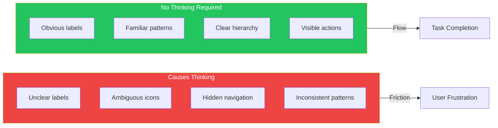
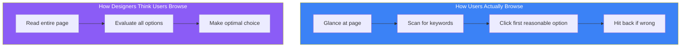

## Introduction

"Don't make me think" is the most important principle in web usability, coined by Steve Krug in his influential book of the same name. This simple yet powerful idea has guided interface designers for over two decades.

The principle states: **every time a user has to stop and think about how to use your interface, you've created friction**. Good design should be self-evident—users should be able to "get it" without any effort.

## What "Thinking" Looks Like

When users encounter your interface, any of these mental questions represent unwanted cognitive load:

- "Where am I?"
- "Where should I start?"
- "What are the most important things on this page?"
- "Why did they call it that?"
- "Is this clickable?"
- "Where's the thing I'm looking for?"



## Krug's Three Laws of Usability

### First Law: Don't Make Me Think

Every question mark that pops up in a user's mind adds to their cognitive workload. This includes:

| Thinking Type | Example | Solution |
|--------------|---------|----------|
| Label confusion | "Jobs" vs "Employment Opportunities" vs "Careers" | Use the most common term |
| Click uncertainty | Is this text a link? | Make clickable elements obvious |
| Feature discovery | Where's the search? | Follow conventions |
| Navigation doubt | How do I go back? | Provide clear wayfinding |

### Second Law: It Doesn't Matter How Many Clicks

Users don't mind clicking—they mind **thinking about clicking**. Three mindless clicks are better than one click that requires thought.

```typescript
// Bad: One click but requires thinking
<Dropdown
  options={['View', 'Edit', 'Delete', 'Share', 'Archive', 'Export', 'Duplicate']}
/>

// Good: More clicks but obvious path
<Button onClick={viewItem}>View Details</Button>
// Then on details page: clear Edit, Delete, Share buttons
```

### Third Law: Get Rid of Half the Words

Omit needless words. Then get rid of half of what's left. Most web pages contain too much text that users will never read.

## How Users Actually Use the Web

Understanding real user behavior is crucial for applying these principles.

### Users Don't Read—They Scan



### Users Don't Make Optimal Choices—They Satisfice

"Satisficing" (satisfy + suffice) means users don't look for the best option—they click the **first reasonable option**. Design for this behavior:

```tsx
// Design for satisficing behavior
function SearchResults({ results }) {
  return (
    <div>
      {/* Most relevant result should be visually prominent */}
      <FeaturedResult result={results[0]} />

      {/* Other results clearly secondary */}
      <div className="other-results">
        {results.slice(1).map(result => (
          <ResultItem key={result.id} result={result} />
        ))}
      </div>
    </div>
  );
}
```

### Users Don't Figure Out How Things Work—They Muddle Through

Users rarely read instructions. They start using things immediately and figure it out as they go. Design interfaces that work even when users don't understand the "right" way to use them.

## Practical Implementation

### Make Pages Self-Evident

A self-evident page answers these questions instantly:

1. **What site is this?** (Identity)
2. **What page am I on?** (Location)
3. **What are the major sections?** (Navigation)
4. **What are my options at this level?** (Content)
5. **Where am I in the scheme of things?** (Position)
6. **How can I search?** (Search)

```tsx
function PageLayout({ children, title, breadcrumbs }) {
  return (
    <div>
      {/* Identity - always visible */}
      <Header logo={<Logo />} />

      {/* Position - where am I? */}
      <Breadcrumbs items={breadcrumbs} />

      {/* Location - what page is this? */}
      <h1>{title}</h1>

      {/* Navigation - major sections */}
      <MainNav />

      {/* Content - current options */}
      <main>{children}</main>

      {/* Search - always accessible */}
      <SearchBox />
    </div>
  );
}
```

### Create Clear Visual Hierarchy

Visual hierarchy tells users what's important without them having to think:

```css
/* Clear hierarchy through visual weight */
.page-title {
  font-size: 2rem;
  font-weight: 700;
  color: #111;
}

.section-title {
  font-size: 1.5rem;
  font-weight: 600;
  color: #333;
}

.subsection-title {
  font-size: 1.25rem;
  font-weight: 500;
  color: #555;
}

.body-text {
  font-size: 1rem;
  font-weight: 400;
  color: #666;
}
```

### Use Conventions

Web conventions are powerful because users already know them. Fighting conventions forces users to think:

| Convention | User Expectation | Don't Do This |
|------------|------------------|---------------|
| Logo position | Top left, links to home | Logo in center or right |
| Search icon | Magnifying glass | Binoculars or flashlight |
| Shopping cart | Top right | Bottom of page |
| Primary action | Prominent button, right side | Text link on left |
| Navigation | Top or left side | Bottom only |

### Make Clickable Things Obvious

Users shouldn't have to guess what's clickable:

```tsx
// Bad: Is this clickable?
<span className="text-blue-500">Learn more</span>

// Good: Obviously a link
<a href="/learn" className="text-blue-500 underline hover:text-blue-700">
  Learn more →
</a>

// Bad: Flat, unclear button
<div className="p-2 bg-gray-100">Submit</div>

// Good: Obviously a button
<button className="px-4 py-2 bg-blue-600 text-white rounded hover:bg-blue-700
                   shadow-sm active:shadow-inner transition">
  Submit
</button>
```

## Testing for "Think" Moments

### The Trunk Test

Imagine landing on a random page of your site. Can you immediately answer:

1. What site is this?
2. What page am I on?
3. What are the major sections?
4. What are my options at this level?
5. How did I get here?
6. How can I search?

### The Five-Second Test

Show someone your page for five seconds, then hide it. Ask:

- What was the page about?
- What were the main options?
- What would you click first?

If they can't answer confidently, your page requires too much thinking.

## Summary

| Principle | Action |
|-----------|--------|
| Don't make me think | Eliminate every question mark |
| Users scan, don't read | Create clear visual hierarchy |
| Users satisfice | Put best options first |
| Users muddle through | Design for misuse |
| Clicks vs. thinking | Easy clicks beat hard decisions |
| Words | Cut half, then cut half again |

The goal isn't to dumb down your interface—it's to make it **self-evident**. When users don't have to think about how to use your product, they can focus on what they came to do.

## References

- Krug, Steve. "Don't Make Me Think: A Common Sense Approach to Web Usability" (2nd Edition)
- Nielsen Norman Group - Usability 101
- Laws of UX - https://lawsofux.com
