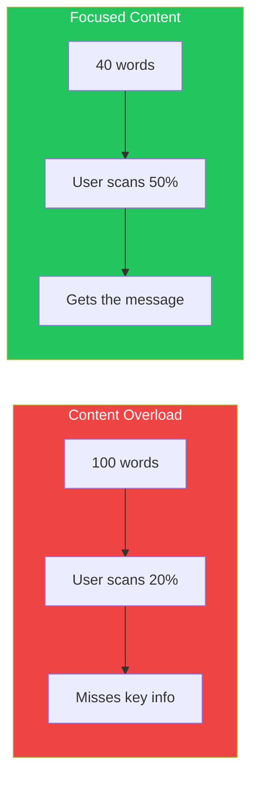

## Introduction

Of the many lessons that have benefited web design, one of the most powerful comes from E.B. White's "The Elements of Style":

> **"Omit needless words."**
>
> Vigorous writing is concise. A sentence should contain no unnecessary words, a paragraph no unnecessary sentences, for the same reason that a drawing should have no unnecessary lines and a machine no unnecessary parts.

Steve Krug adapted this principle for the web: **Get rid of half the words on each page, then get rid of half of what's left.**

This article shows you how to identify and eliminate content waste that makes your pages harder to use.

## Why Words Matter on the Web

Users don't read web pages—they scan them. Every unnecessary word:

- Competes for attention with important content
- Increases cognitive load
- Makes pages feel overwhelming
- Reduces the chance of key messages being seen



## Types of Content Waste

### 1. Happy Talk

Introductory text that says nothing useful—the web equivalent of small talk.

```markdown
## Before (Happy Talk)
"Welcome to our revolutionary new platform! We're so excited to have you here.
At Acme Corp, we believe in putting customers first. Our team has worked
tirelessly to bring you the best experience possible. We hope you'll find
everything you're looking for and more!"

## After (Useful Content)
"Acme helps teams manage projects in half the time. Start your free trial."

---

## Before (Happy Talk)
"Thank you for visiting our About page! We're thrilled that you want to learn
more about our amazing company and the incredible journey that brought us here."

## After (Useful Content)
"Founded in 2020, Acme serves 50,000 teams worldwide."
```

### 2. Instructions that Tell Users What They Already Know

Users know how to use the web. Don't explain basic interactions.

```markdown
## Unnecessary Instructions
❌ "Please fill out the form below and click the Submit button to send us your information."
❌ "Use the navigation menu above to explore our site."
❌ "Click on any item to view more details."
❌ "Scroll down to see more content."

## Just Do It
✓ [Show the form]
✓ [Show the navigation]
✓ [Show the items]
✓ [Show the content]
```

### 3. Marketing Fluff

Empty superlatives that add no information.

```markdown
## Before (Fluff)
"Our world-class, industry-leading, cutting-edge solution leverages
innovative technology to deliver best-in-class results that exceed
your expectations and transform your business."

## After (Specific)
"Reduce report generation time from 4 hours to 10 minutes."

---

## Fluff Words to Eliminate
- "Revolutionary" → What does it actually do?
- "Seamless" → How specifically?
- "Robust" → What capabilities?
- "Intuitive" → Let users judge that
- "Best-in-class" → According to whom?
- "World-class" → Compared to what?
```

### 4. Redundant Phrases

Common phrases that can be shortened.

| Before | After |
|--------|-------|
| "In order to" | "To" |
| "Due to the fact that" | "Because" |
| "At this point in time" | "Now" |
| "In the event that" | "If" |
| "Is able to" | "Can" |
| "Has the ability to" | "Can" |
| "The reason why is that" | "Because" |
| "In spite of the fact that" | "Although" |
| "For the purpose of" | "To" |
| "In the near future" | "Soon" |

### 5. Obvious Statements

Things that go without saying should go without saying.

```markdown
## Unnecessary
❌ "About Us: Learn more about our company"
❌ "Contact: Get in touch with us"
❌ "FAQ: Frequently Asked Questions"
❌ "Search: Search our site"

## Just the Label
✓ "About"
✓ "Contact"
✓ "FAQ"
✓ "Search"
```

## Applying the Principle

### The Editing Process

```tsx
function ContentEditor({ initialContent }) {
  const [content, setContent] = useState(initialContent);
  const [round, setRound] = useState(0);

  const wordCount = content.split(/\s+/).length;
  const targetWords = Math.floor(initialContent.split(/\s+/).length * 0.25);

  return (
    <div>
      <h2>Round {round + 1}: Cut 50% of remaining words</h2>

      <textarea
        value={content}
        onChange={(e) => setContent(e.target.value)}
        className="w-full h-64"
      />

      <div className="flex justify-between mt-4">
        <div>
          <p>Current: {wordCount} words</p>
          <p>Target: ~{targetWords} words</p>
        </div>

        <button onClick={() => setRound(r => r + 1)}>
          Next round of cuts
        </button>
      </div>

      <div className="mt-4">
        <h3>Cutting Guide:</h3>
        <ul>
          <li>Round 1: Remove happy talk and introductions</li>
          <li>Round 2: Shorten phrases and remove redundancy</li>
          <li>Round 3: Cut any remaining fluff</li>
          <li>Round 4: Question every remaining word</li>
        </ul>
      </div>
    </div>
  );
}
```

### Before and After Examples

**Homepage Hero:**

```markdown
## Before (68 words)
"Welcome to CloudSync, the revolutionary cloud storage solution that will
transform the way you work! Our cutting-edge technology provides seamless
synchronization across all your devices, ensuring that you always have
access to your important files wherever you are. Join millions of satisfied
customers who have already discovered the power of CloudSync. Sign up today
and experience the future of file storage!"

## After (17 words)
"CloudSync: Your files, everywhere. Works on all devices, syncs automatically.
Join 2 million users. Try free for 30 days."
```

**Feature Description:**

```markdown
## Before (52 words)
"Our advanced analytics dashboard provides you with the ability to gain
deep insights into your data through the use of sophisticated visualization
tools and comprehensive reporting capabilities. With our intuitive interface,
you'll be able to make data-driven decisions that will help drive your
business forward and achieve your goals."

## After (15 words)
"Analytics dashboard: See trends, track KPIs, export reports.
Make faster decisions with real-time data."
```

**Error Message:**

```markdown
## Before (34 words)
"We're sorry, but we were unable to process your request at this time.
An error has occurred that prevented us from completing the action you
requested. Please try again later or contact our support team for assistance."

## After (13 words)
"Something went wrong. Please try again or contact support@example.com
for help."
```

## Guidelines for Different Content Types

### Navigation Labels

```tsx
const navigationGuidelines = {
  do: [
    "Products",      // Not "Our Products"
    "Pricing",       // Not "Pricing Information"
    "Blog",          // Not "Our Blog"
    "Help",          // Not "Help Center" or "Customer Support"
    "Sign in",       // Not "Sign in to your account"
  ],
  dont: [
    "Home",          // Logo already does this
    "Click here",    // Never say this
    "Learn more",    // About what?
    "Get started",   // Without context
  ]
};
```

### Button Text

```tsx
const buttonGuidelines = {
  good: [
    "Save",
    "Send",
    "Download",
    "Buy now",
    "Add to cart",
    "Create account",
  ],
  avoid: [
    "Submit",                    // Submit what?
    "Click here",               // Never
    "Continue",                 // To where?
    "Process",                  // Too vague
    "Submit your information",  // Redundant
  ]
};
```

### Form Labels

```markdown
## Verbose
❌ "Please enter your email address:"
❌ "Your full name (first and last):"
❌ "Create a password for your account:"

## Concise
✓ "Email"
✓ "Full name"
✓ "Password"
```

### Error Messages

```tsx
const errorMessagePatterns = {
  // Pattern: What happened + What to do
  good: [
    "Email already registered. Sign in or use a different email.",
    "Password too short. Use at least 8 characters.",
    "Payment declined. Try a different card.",
  ],
  bad: [
    "Error: An error has occurred.",
    "Invalid input. Please check your information and try again.",
    "Something went wrong. We apologize for the inconvenience.",
  ]
};
```

## Making the Case for Brevity

### Readability Metrics

```tsx
function ContentAnalyzer({ text }) {
  const words = text.split(/\s+/).length;
  const sentences = text.split(/[.!?]+/).length;
  const avgWordsPerSentence = words / sentences;

  // Flesch-Kincaid reading ease (simplified)
  const readingEase = 206.835 - (1.015 * avgWordsPerSentence);

  return (
    <div className="space-y-4">
      <div>
        <h3>Content Stats</h3>
        <p>Words: {words}</p>
        <p>Sentences: {sentences}</p>
        <p>Avg words/sentence: {avgWordsPerSentence.toFixed(1)}</p>
      </div>

      <div>
        <h3>Recommendations</h3>
        {avgWordsPerSentence > 20 && (
          <p className="text-red-600">
            ⚠️ Sentences too long. Target: under 20 words each.
          </p>
        )}
        {words > 100 && (
          <p className="text-yellow-600">
            ⚠️ Consider breaking into smaller sections.
          </p>
        )}
      </div>
    </div>
  );
}
```

### The Scanning Test

Test your content by seeing what stands out:

```tsx
function ScanningTest({ content }) {
  const [showHighlights, setShowHighlights] = useState(false);

  // Simulate what users actually see when scanning
  const highlightKeywords = (text: string) => {
    const keywords = extractKeywords(text);
    return text.split(' ').map((word, i) => (
      <span
        key={i}
        className={keywords.includes(word.toLowerCase())
          ? 'bg-yellow-200 font-bold'
          : 'text-gray-400'
        }
      >
        {word}{' '}
      </span>
    ));
  };

  return (
    <div>
      <button onClick={() => setShowHighlights(!showHighlights)}>
        {showHighlights ? 'Show full text' : 'Show scanning view'}
      </button>

      <div className="mt-4 p-4 border rounded">
        {showHighlights ? highlightKeywords(content) : content}
      </div>

      {showHighlights && (
        <p className="mt-2 text-sm text-gray-600">
          This is roughly what users see when scanning. Do your key
          messages stand out?
        </p>
      )}
    </div>
  );
}
```

## Checklist for Content Editing

```markdown
## Before Publishing Checklist

### Happy Talk
- [ ] Removed "Welcome to..."
- [ ] Removed "Thank you for..."
- [ ] Removed "We're excited to..."
- [ ] Cut self-congratulatory language

### Instructions
- [ ] Removed obvious instructions
- [ ] Users don't need to be told to "click" or "scroll"
- [ ] Form instructions are minimal

### Marketing Fluff
- [ ] Replaced superlatives with specifics
- [ ] Numbers instead of vague claims
- [ ] Benefits are concrete, not abstract

### Redundancy
- [ ] No repeated information
- [ ] Phrases shortened to single words
- [ ] No stating the obvious

### Final Test
- [ ] Read aloud—does it sound natural?
- [ ] Can any sentence be deleted without losing meaning?
- [ ] Would a user actually read this?
```

## Summary

| Content Type | Goal | Example |
|--------------|------|---------|
| Headlines | 3-8 words | "Track time. Bill clients. Get paid." |
| Subheadings | 5-12 words | "See where your hours really go" |
| Body paragraphs | 2-3 short sentences | One idea per paragraph |
| Button text | 1-3 words | "Start free trial" |
| Error messages | Problem + solution | "Password too short. Use 8+ characters." |
| Navigation | 1-2 words | "Pricing", "Help", "Blog" |

Remember: **Every word you cut is a gift to your users.** Less text means faster comprehension, quicker decisions, and better experiences.

The goal isn't just shorter content—it's content that users will actually read.

## References

- Krug, Steve. "Don't Make Me Think", Chapter 5
- Strunk & White. "The Elements of Style"
- Nielsen Norman Group - How Users Read on the Web
- Redish, Janice. "Letting Go of the Words"
