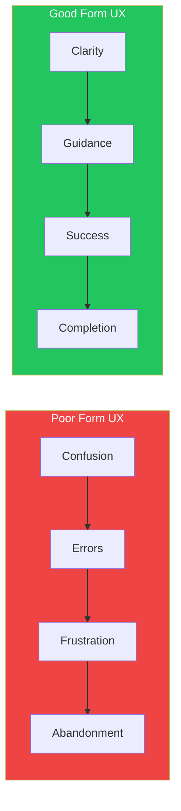
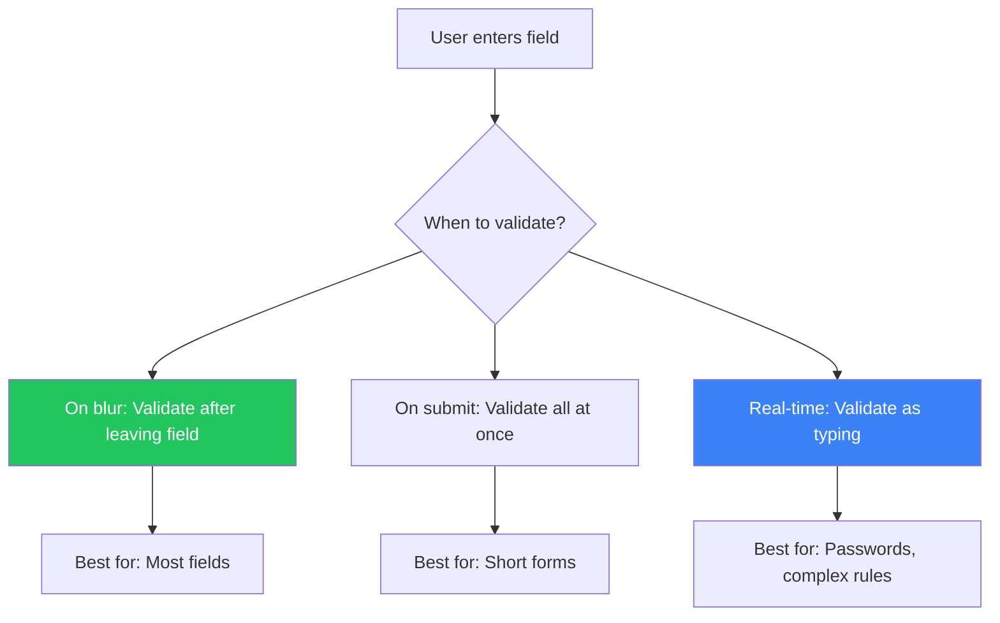

## Introduction

Forms are critical touchpoints in any application. They're how users sign up, make purchases, provide feedback, and complete essential tasks. Yet forms are often sources of frustration—poorly designed forms can destroy conversion rates and user satisfaction.

This article covers proven patterns for creating forms that users can complete quickly and accurately.

## The Challenge of Form Design

Forms seem simple at first glance. We have decades of form design examples, and UI frameworks provide ready-made form elements. However, poor form design leads to:

- Abandoned sign-ups and checkouts
- User frustration and support tickets
- Invalid data entering your system
- Accessibility barriers



## Essential Form Patterns

### 1. Good Defaults and Smart Prefills

Pre-fill fields whenever possible to reduce user effort.

```tsx
function ShippingForm({ user, recentOrders }) {
  // Smart defaults based on user data
  const defaultValues = {
    // Use saved address
    address: user.savedAddress || '',
    city: user.savedCity || '',

    // Infer country from locale
    country: user.locale?.split('-')[1] || 'US',

    // Use most recent shipping method
    shippingMethod: recentOrders[0]?.shippingMethod || 'standard',
  };

  return (
    <form>
      <Input
        name="address"
        label="Address"
        defaultValue={defaultValues.address}
      />
      <Input
        name="city"
        label="City"
        defaultValue={defaultValues.city}
      />
      <Select
        name="country"
        label="Country"
        defaultValue={defaultValues.country}
        options={countries}
      />
      <RadioGroup
        name="shippingMethod"
        label="Shipping"
        defaultValue={defaultValues.shippingMethod}
        options={shippingOptions}
      />
    </form>
  );
}
```

**When to use defaults:**

| Scenario | Default Strategy |
|----------|------------------|
| Returning users | Pre-fill from saved data |
| Location fields | Detect from IP/browser |
| Date pickers | Today's date or logical start |
| Quantity | 1 (most common) |
| Currency | Based on user's locale |
| Country code | Based on location |

### 2. Forgiving Format

Accept input in multiple formats. Don't force users to guess your expected format.

```tsx
function PhoneInput({ value, onChange }) {
  const normalizePhone = (input: string) => {
    // Strip all non-digits
    const digits = input.replace(/\D/g, '');

    // Format for display
    if (digits.length <= 3) return digits;
    if (digits.length <= 6) return `(${digits.slice(0, 3)}) ${digits.slice(3)}`;
    return `(${digits.slice(0, 3)}) ${digits.slice(3, 6)}-${digits.slice(6, 10)}`;
  };

  return (
    <div>
      <label>Phone Number</label>
      <input
        type="tel"
        value={value}
        onChange={(e) => onChange(normalizePhone(e.target.value))}
        placeholder="(555) 123-4567"
      />
      <span className="text-sm text-gray-500">
        Any format works: 5551234567, 555-123-4567, (555) 123-4567
      </span>
    </div>
  );
}

function DateInput({ value, onChange }) {
  const parseDate = (input: string) => {
    // Accept multiple formats
    const formats = [
      /^(\d{4})-(\d{2})-(\d{2})$/,     // 2024-01-15
      /^(\d{2})\/(\d{2})\/(\d{4})$/,   // 01/15/2024
      /^(\d{2})-(\d{2})-(\d{4})$/,     // 01-15-2024
      /^(\w+)\s+(\d{1,2}),?\s*(\d{4})$/, // January 15, 2024
    ];

    for (const format of formats) {
      const match = input.match(format);
      if (match) {
        // Convert to standard format
        return normalizeToISO(match);
      }
    }
    return input;
  };

  return (
    <input
      type="text"
      value={value}
      onChange={(e) => onChange(parseDate(e.target.value))}
      placeholder="Enter date (any format)"
    />
  );
}
```

### 3. Input Hints and Placeholders

Guide users with helpful hints, but don't rely on placeholders alone.

```tsx
function FormField({ label, hint, error, children }) {
  return (
    <div className="space-y-1">
      <label className="block font-medium text-gray-900">
        {label}
      </label>

      {/* Hint appears above input for visibility */}
      {hint && (
        <p className="text-sm text-gray-500">{hint}</p>
      )}

      {children}

      {/* Error appears below input */}
      {error && (
        <p className="text-sm text-red-600" role="alert">
          {error}
        </p>
      )}
    </div>
  );
}

// Usage
<FormField
  label="Username"
  hint="3-20 characters, letters and numbers only"
  error={errors.username}
>
  <input
    name="username"
    placeholder="e.g., john_doe123"  // Example, not instruction
    className="w-full px-3 py-2 border rounded"
  />
</FormField>

<FormField
  label="Password"
  hint="At least 8 characters with one number and one special character"
>
  <input
    type="password"
    name="password"
    className="w-full px-3 py-2 border rounded"
  />
</FormField>
```

**Hint guidelines:**

| Do | Don't |
|----|-------|
| Show format requirements before input | Hide requirements until error |
| Use examples in placeholders | Put instructions in placeholders |
| Keep hints visible while typing | Remove hints on focus |
| Explain why info is needed | Ask without context |

### 4. Structured Format

For complex inputs, provide structure to prevent errors.

```tsx
function CreditCardInput() {
  const [cardNumber, setCardNumber] = useState(['', '', '', '']);

  const handleChange = (index: number, value: string) => {
    const digits = value.replace(/\D/g, '').slice(0, 4);
    const newCardNumber = [...cardNumber];
    newCardNumber[index] = digits;
    setCardNumber(newCardNumber);

    // Auto-advance to next field
    if (digits.length === 4 && index < 3) {
      document.getElementById(`card-${index + 1}`)?.focus();
    }
  };

  return (
    <div>
      <label className="block font-medium mb-2">Card Number</label>
      <div className="flex gap-2">
        {cardNumber.map((segment, index) => (
          <input
            key={index}
            id={`card-${index}`}
            type="text"
            inputMode="numeric"
            maxLength={4}
            value={segment}
            onChange={(e) => handleChange(index, e.target.value)}
            className="w-16 px-2 py-2 border rounded text-center"
            placeholder="••••"
          />
        ))}
      </div>
    </div>
  );
}

function ExpiryDateInput() {
  return (
    <div className="flex items-center gap-2">
      <select name="expiry-month" className="px-3 py-2 border rounded">
        <option value="">MM</option>
        {Array.from({ length: 12 }, (_, i) => (
          <option key={i} value={String(i + 1).padStart(2, '0')}>
            {String(i + 1).padStart(2, '0')}
          </option>
        ))}
      </select>
      <span>/</span>
      <select name="expiry-year" className="px-3 py-2 border rounded">
        <option value="">YY</option>
        {Array.from({ length: 10 }, (_, i) => {
          const year = new Date().getFullYear() + i;
          return (
            <option key={year} value={String(year).slice(-2)}>
              {String(year).slice(-2)}
            </option>
          );
        })}
      </select>
    </div>
  );
}
```

### 5. Autocompletion

Reduce typing and prevent typos with intelligent suggestions.

```tsx
function AddressAutocomplete({ onSelect }) {
  const [query, setQuery] = useState('');
  const [suggestions, setSuggestions] = useState([]);
  const [isOpen, setIsOpen] = useState(false);

  useEffect(() => {
    if (query.length < 3) {
      setSuggestions([]);
      return;
    }

    const timer = setTimeout(async () => {
      const results = await fetchAddressSuggestions(query);
      setSuggestions(results);
      setIsOpen(true);
    }, 300); // Debounce

    return () => clearTimeout(timer);
  }, [query]);

  return (
    <div className="relative">
      <input
        type="text"
        value={query}
        onChange={(e) => setQuery(e.target.value)}
        onFocus={() => suggestions.length && setIsOpen(true)}
        placeholder="Start typing your address..."
        className="w-full px-3 py-2 border rounded"
        aria-autocomplete="list"
        aria-expanded={isOpen}
      />

      {isOpen && suggestions.length > 0 && (
        <ul
          className="absolute z-10 w-full mt-1 bg-white border rounded shadow-lg
                     max-h-60 overflow-auto"
          role="listbox"
        >
          {suggestions.map((suggestion, index) => (
            <li
              key={index}
              onClick={() => {
                onSelect(suggestion);
                setQuery(suggestion.formatted);
                setIsOpen(false);
              }}
              className="px-3 py-2 cursor-pointer hover:bg-gray-100"
              role="option"
            >
              <div className="font-medium">{suggestion.primary}</div>
              <div className="text-sm text-gray-500">{suggestion.secondary}</div>
            </li>
          ))}
        </ul>
      )}
    </div>
  );
}
```

### 6. Error Messages

Show helpful, specific error messages that guide users to success.

```tsx
function validateEmail(email: string): string | null {
  if (!email) {
    return 'Email is required';
  }
  if (!email.includes('@')) {
    return 'Please include an @ symbol in your email';
  }
  if (!email.match(/^[^\s@]+@[^\s@]+\.[^\s@]+$/)) {
    return 'Please enter a valid email address (e.g., name@example.com)';
  }
  return null;
}

function validatePassword(password: string): string | null {
  const issues = [];

  if (password.length < 8) {
    issues.push('at least 8 characters');
  }
  if (!/\d/.test(password)) {
    issues.push('one number');
  }
  if (!/[!@#$%^&*]/.test(password)) {
    issues.push('one special character (!@#$%^&*)');
  }

  if (issues.length > 0) {
    return `Password needs ${issues.join(', ')}`;
  }
  return null;
}

function FormInput({ name, label, validate, type = 'text' }) {
  const [value, setValue] = useState('');
  const [error, setError] = useState<string | null>(null);
  const [touched, setTouched] = useState(false);

  const handleBlur = () => {
    setTouched(true);
    setError(validate(value));
  };

  return (
    <div className="space-y-1">
      <label className="block font-medium">{label}</label>
      <input
        type={type}
        name={name}
        value={value}
        onChange={(e) => {
          setValue(e.target.value);
          // Clear error while typing
          if (error) setError(null);
        }}
        onBlur={handleBlur}
        className={`
          w-full px-3 py-2 border rounded transition
          ${touched && error
            ? 'border-red-500 bg-red-50'
            : 'border-gray-300'
          }
        `}
        aria-invalid={touched && !!error}
        aria-describedby={error ? `${name}-error` : undefined}
      />
      {touched && error && (
        <p
          id={`${name}-error`}
          className="text-sm text-red-600 flex items-center gap-1"
          role="alert"
        >
          <span aria-hidden="true">⚠</span>
          {error}
        </p>
      )}
    </div>
  );
}
```

**Error message guidelines:**

| Bad Example | Good Example |
|-------------|--------------|
| "Invalid input" | "Please enter a valid email (e.g., name@example.com)" |
| "Error" | "Password must be at least 8 characters" |
| "Required field" | "Please enter your name to continue" |
| "Format error" | "Phone number should be 10 digits" |

### 7. Password Strength Meter

Give real-time feedback on password quality.

```tsx
function PasswordStrengthMeter({ password }) {
  const getStrength = (pwd: string) => {
    let score = 0;
    if (pwd.length >= 8) score++;
    if (pwd.length >= 12) score++;
    if (/[a-z]/.test(pwd) && /[A-Z]/.test(pwd)) score++;
    if (/\d/.test(pwd)) score++;
    if (/[^a-zA-Z0-9]/.test(pwd)) score++;
    return score;
  };

  const strength = getStrength(password);
  const levels = ['Very weak', 'Weak', 'Fair', 'Good', 'Strong'];
  const colors = ['bg-red-500', 'bg-orange-500', 'bg-yellow-500', 'bg-blue-500', 'bg-green-500'];

  return (
    <div className="mt-2">
      {/* Visual bar */}
      <div className="flex gap-1">
        {[0, 1, 2, 3, 4].map((index) => (
          <div
            key={index}
            className={`
              h-1 flex-1 rounded
              ${index < strength ? colors[strength - 1] : 'bg-gray-200'}
            `}
          />
        ))}
      </div>

      {/* Text label */}
      {password && (
        <p className={`text-sm mt-1 ${
          strength <= 2 ? 'text-red-600' : 'text-green-600'
        }`}>
          {levels[strength - 1] || 'Very weak'}
        </p>
      )}

      {/* Requirements checklist */}
      <ul className="mt-2 text-sm space-y-1">
        <Requirement met={password.length >= 8}>
          At least 8 characters
        </Requirement>
        <Requirement met={/[A-Z]/.test(password)}>
          One uppercase letter
        </Requirement>
        <Requirement met={/[a-z]/.test(password)}>
          One lowercase letter
        </Requirement>
        <Requirement met={/\d/.test(password)}>
          One number
        </Requirement>
        <Requirement met={/[^a-zA-Z0-9]/.test(password)}>
          One special character
        </Requirement>
      </ul>
    </div>
  );
}

function Requirement({ met, children }) {
  return (
    <li className={`flex items-center gap-2 ${met ? 'text-green-600' : 'text-gray-500'}`}>
      <span>{met ? '✓' : '○'}</span>
      {children}
    </li>
  );
}
```

## Form Layout Best Practices

### Single Column Layout

Single-column forms are easier to scan and complete.

```tsx
function RegistrationForm() {
  return (
    <form className="max-w-md mx-auto space-y-6">
      {/* Single column, logical order */}
      <FormField label="Full Name" name="name" />
      <FormField label="Email" name="email" type="email" />
      <FormField label="Password" name="password" type="password" />
      <FormField label="Confirm Password" name="confirmPassword" type="password" />

      <button type="submit" className="w-full btn-primary">
        Create Account
      </button>
    </form>
  );
}
```

### Group Related Fields

```tsx
function CheckoutForm() {
  return (
    <form className="space-y-8">
      {/* Contact group */}
      <fieldset>
        <legend className="text-lg font-semibold mb-4">
          Contact Information
        </legend>
        <div className="space-y-4">
          <FormField label="Email" name="email" />
          <FormField label="Phone" name="phone" />
        </div>
      </fieldset>

      {/* Shipping group */}
      <fieldset>
        <legend className="text-lg font-semibold mb-4">
          Shipping Address
        </legend>
        <div className="space-y-4">
          <FormField label="Street Address" name="address" />
          <div className="grid grid-cols-2 gap-4">
            <FormField label="City" name="city" />
            <FormField label="Postal Code" name="postalCode" />
          </div>
        </div>
      </fieldset>

      {/* Payment group */}
      <fieldset>
        <legend className="text-lg font-semibold mb-4">
          Payment Details
        </legend>
        <div className="space-y-4">
          <FormField label="Card Number" name="cardNumber" />
          <div className="grid grid-cols-2 gap-4">
            <FormField label="Expiry" name="expiry" />
            <FormField label="CVV" name="cvv" />
          </div>
        </div>
      </fieldset>
    </form>
  );
}
```

## Form Validation Timing



```tsx
function SmartValidationForm() {
  return (
    <form>
      {/* Real-time: Password needs immediate feedback */}
      <PasswordField validateOnChange />

      {/* On blur: Email validated when leaving field */}
      <EmailField validateOnBlur />

      {/* On submit: Optional fields validated at end */}
      <OptionalField validateOnSubmit />
    </form>
  );
}
```

## Summary

| Pattern | Purpose | Key Benefit |
|---------|---------|-------------|
| Good Defaults | Pre-fill known values | Reduces typing |
| Forgiving Format | Accept multiple input formats | Prevents format errors |
| Input Hints | Guide expected input | Reduces confusion |
| Structured Format | Break complex inputs into parts | Prevents errors |
| Autocompletion | Suggest valid values | Speeds completion |
| Error Messages | Explain what went wrong | Guides to success |
| Password Meter | Show password quality | Real-time feedback |

The goal of form design is to make completion effortless. Every field should justify its existence, every interaction should feel natural, and every error should be recoverable.

## References

- Tidwell, Jenifer, et al. "Designing Interfaces" (3rd Edition), Chapter 10
- Luke Wroblewski. "Web Form Design"
- Nielsen Norman Group - Form Design Guidelines
- Baymard Institute - Checkout UX Research
