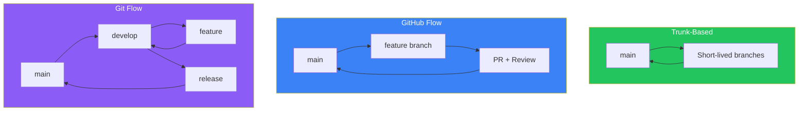
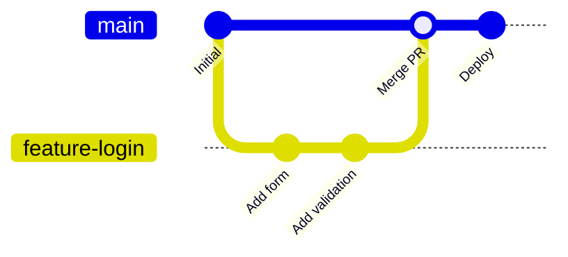
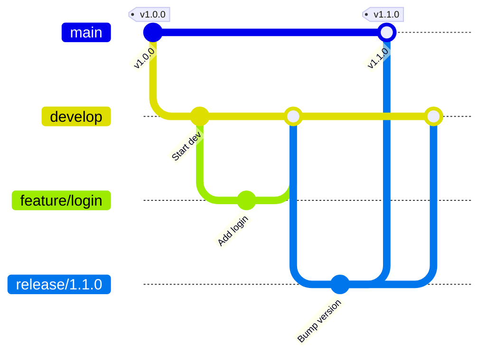
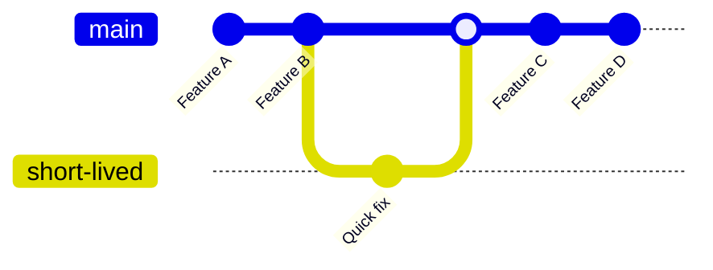
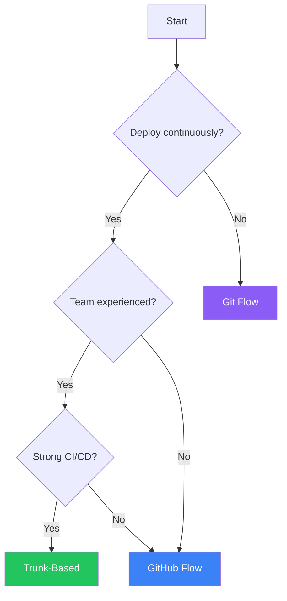
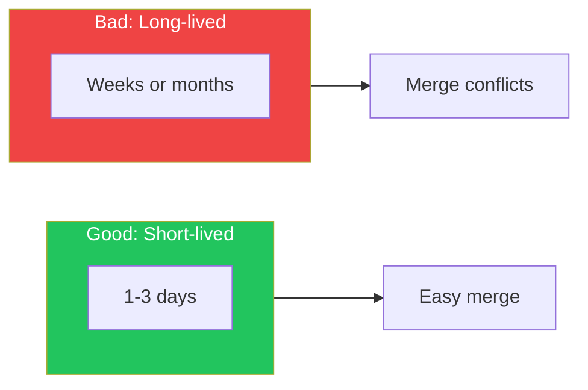

## Introduction

A branching strategy defines how your team organizes code changes, collaborates, and releases software. The right strategy depends on your team size, release frequency, and project complexity.

This article compares the three most popular strategies and helps you choose the right one.

## The Three Main Strategies



## GitHub Flow

### Overview

GitHub Flow is a simple, lightweight workflow perfect for continuous deployment:



### The Process

1. **Create a branch** from `main`
2. **Make changes** with descriptive commits
3. **Open a Pull Request** for discussion
4. **Review and discuss** the code
5. **Deploy** from the branch to test (optional)
6. **Merge** to `main` after approval
7. **Deploy** to production

### When to Use GitHub Flow

| Good For | Not Ideal For |
|----------|---------------|
| Continuous deployment | Scheduled releases |
| Small to medium teams | Multiple versions in production |
| Web applications | Mobile apps with store review |
| SaaS products | Regulatory environments |

### Implementation

```yaml
# Branch naming convention
feature/user-authentication
fix/login-validation-bug
docs/api-endpoints
refactor/database-queries
```

```yaml
# .github/workflows/github-flow.yml
name: GitHub Flow CI/CD

on:
  push:
    branches: [main]
  pull_request:
    branches: [main]

jobs:
  test:
    runs-on: ubuntu-latest
    steps:
      - uses: actions/checkout@v4
      - run: npm test

  deploy:
    if: github.ref == 'refs/heads/main'
    needs: test
    runs-on: ubuntu-latest
    steps:
      - uses: actions/checkout@v4
      - run: ./deploy.sh
```

## Git Flow

### Overview

Git Flow is a more structured workflow for scheduled releases:



### Branch Types

| Branch | Purpose | Lifetime |
|--------|---------|----------|
| `main` | Production-ready code | Permanent |
| `develop` | Integration branch | Permanent |
| `feature/*` | New features | Until merged |
| `release/*` | Release preparation | Until released |
| `hotfix/*` | Production fixes | Until merged |

### The Process

1. **Develop** on `feature/` branches from `develop`
2. **Merge features** into `develop` via PR
3. **Create release branch** from `develop` when ready
4. **Finalize release** (version bump, changelog)
5. **Merge release** to both `main` and `develop`
6. **Tag** the release on `main`
7. **Hotfix** from `main` if needed, merge back to both

### When to Use Git Flow

| Good For | Not Ideal For |
|----------|---------------|
| Scheduled releases | Continuous deployment |
| Multiple versions | Fast iteration |
| Large teams | Small teams |
| Open source with versioning | SaaS products |

### Implementation

```bash
# Initialize Git Flow
git flow init

# Start a feature
git flow feature start user-authentication

# Finish a feature
git flow feature finish user-authentication

# Start a release
git flow release start 1.2.0

# Finish a release
git flow release finish 1.2.0

# Hotfix
git flow hotfix start 1.2.1
git flow hotfix finish 1.2.1
```

### Workflow Configuration

```yaml
# .github/workflows/git-flow.yml
name: Git Flow CI

on:
  push:
    branches: [main, develop, 'release/**', 'hotfix/**']
  pull_request:
    branches: [develop]

jobs:
  test:
    runs-on: ubuntu-latest
    steps:
      - uses: actions/checkout@v4
      - run: npm test

  release:
    if: startsWith(github.ref, 'refs/heads/release/')
    needs: test
    runs-on: ubuntu-latest
    steps:
      - uses: actions/checkout@v4
      - run: npm run build
      - run: ./deploy-staging.sh

  production:
    if: github.ref == 'refs/heads/main'
    needs: test
    runs-on: ubuntu-latest
    steps:
      - uses: actions/checkout@v4
      - run: npm run build
      - run: ./deploy-production.sh
```

## Trunk-Based Development

### Overview

Trunk-Based Development emphasizes small, frequent commits directly to the main branch:



### Key Principles

1. **Short-lived branches** (< 1 day ideally)
2. **Feature flags** for incomplete features
3. **Continuous integration** with fast feedback
4. **Small, frequent commits** to main

### When to Use Trunk-Based

| Good For | Not Ideal For |
|----------|---------------|
| High-performing teams | Inexperienced teams |
| Continuous deployment | Regulated releases |
| Strong CI/CD | Weak test coverage |
| Experienced developers | Junior-heavy teams |

### Feature Flags

Essential for trunk-based development:

```typescript
// Feature flag implementation
const features = {
  newCheckout: process.env.FEATURE_NEW_CHECKOUT === 'true',
  darkMode: process.env.FEATURE_DARK_MODE === 'true',
};

function CheckoutPage() {
  if (features.newCheckout) {
    return <NewCheckout />;
  }
  return <LegacyCheckout />;
}
```

### Implementation

```yaml
# .github/workflows/trunk-based.yml
name: Trunk-Based CI

on:
  push:
    branches: [main]

jobs:
  # Fast feedback is critical
  quick-check:
    runs-on: ubuntu-latest
    timeout-minutes: 5
    steps:
      - uses: actions/checkout@v4
      - run: npm run lint
      - run: npm run test:unit

  # Deploy continuously
  deploy:
    needs: quick-check
    runs-on: ubuntu-latest
    steps:
      - uses: actions/checkout@v4
      - run: npm run build
      - run: ./deploy.sh
```

## Comparison Matrix

| Aspect | GitHub Flow | Git Flow | Trunk-Based |
|--------|-------------|----------|-------------|
| **Complexity** | Low | High | Medium |
| **Release cadence** | Continuous | Scheduled | Continuous |
| **Main branch** | Always deployable | Production | Always deployable |
| **Feature branches** | Yes | Yes | Minimal |
| **Release branches** | No | Yes | No |
| **Hotfix process** | Fix → main | hotfix → main + develop | Fix → main |
| **Best for** | Web apps | Versioned software | High-velocity teams |

## Choosing the Right Strategy

### Decision Flowchart



### By Team Size

| Team Size | Recommended | Reason |
|-----------|-------------|--------|
| 1-3 developers | Trunk-Based or GitHub Flow | Low overhead |
| 4-10 developers | GitHub Flow | Balance of structure and speed |
| 10+ developers | Git Flow or GitHub Flow | More coordination needed |

### By Release Type

| Release Type | Recommended | Reason |
|--------------|-------------|--------|
| Continuous (SaaS) | GitHub Flow or Trunk-Based | Fast iteration |
| Scheduled (monthly) | Git Flow | Release preparation time |
| Multiple versions | Git Flow | Version branch support |
| Mobile apps | Git Flow | App store review time |

## Branch Naming Conventions

### Consistent Naming

```
# Feature branches
feature/TICKET-123-user-authentication
feature/add-payment-gateway

# Bug fixes
fix/TICKET-456-login-error
bugfix/null-pointer-exception

# Releases (Git Flow)
release/1.2.0
release/2.0.0-beta

# Hotfixes
hotfix/1.2.1
hotfix/security-patch

# Other
docs/api-documentation
refactor/database-layer
test/integration-tests
```

### Automation with Branch Rules

```yaml
# .github/workflows/branch-naming.yml
name: Branch Naming Check

on:
  pull_request:

jobs:
  check-branch-name:
    runs-on: ubuntu-latest
    steps:
      - name: Check branch name
        run: |
          BRANCH="${{ github.head_ref }}"
          PATTERN="^(feature|fix|bugfix|hotfix|release|docs|refactor|test)/.+"
          if [[ ! $BRANCH =~ $PATTERN ]]; then
            echo "Branch name '$BRANCH' doesn't match pattern"
            exit 1
          fi
```

## Best Practices

### 1. Keep Branches Short-Lived



### 2. Protect Your Main Branch

```yaml
# Branch protection rules
- Require pull request reviews
- Require status checks to pass
- Require linear history (optional)
- Restrict who can push
- Require signed commits (optional)
```

### 3. Automate Everything

- Linting on PR
- Tests on PR
- Deploy previews
- Automatic merging when approved

### 4. Document Your Strategy

Create a `CONTRIBUTING.md`:

```markdown
## Branching Strategy

We use GitHub Flow:

1. Create a feature branch from `main`
2. Make your changes
3. Open a PR for review
4. Merge after approval
5. Changes deploy automatically

### Branch Naming

- `feature/description` - New features
- `fix/description` - Bug fixes
- `docs/description` - Documentation
```

## Summary

| Strategy | Best For | Avoid If |
|----------|----------|----------|
| **GitHub Flow** | Web apps, SaaS, continuous deployment | You need versioned releases |
| **Git Flow** | Versioned software, scheduled releases | You deploy continuously |
| **Trunk-Based** | Experienced teams, fast iteration | Team lacks experience or CI/CD |

Choose a strategy that matches your team's needs and iterate as you grow. The best strategy is one your team follows consistently.

## References

- O'Reilly - Version Control with Git, Chapter 18
- Packt - DevOps Unleashed with Git and GitHub, Chapter 3
- Atlassian - Git Workflows
- trunk-baseddevelopment.com
