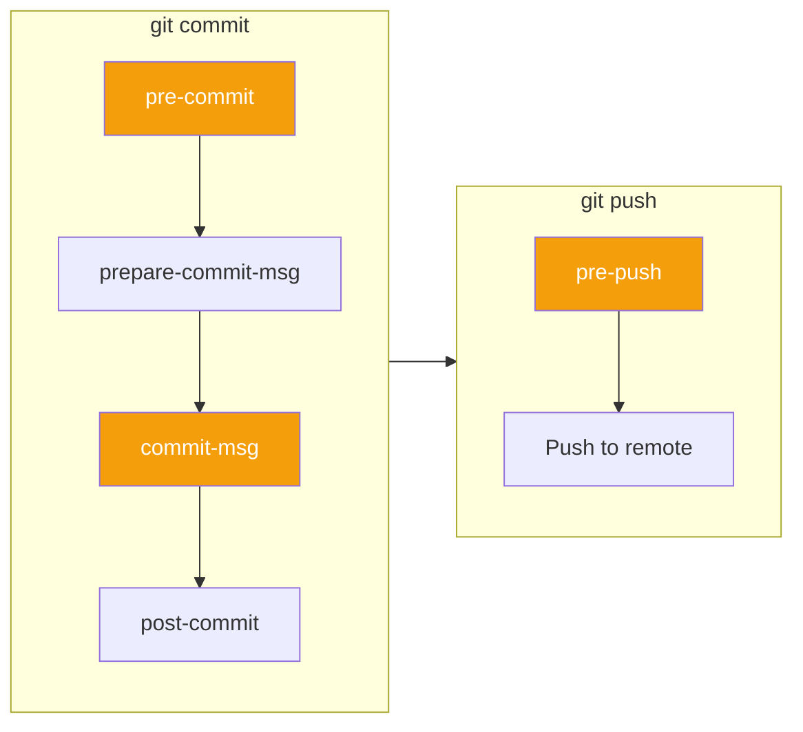

## Introduction

Git hooks are scripts that run automatically at certain points in the Git workflow. They let you enforce code quality, validate commits, and automate repetitive tasks before code ever reaches your repository.

This article shows you how to use Git hooks effectively in your projects.

## How Git Hooks Work



## Available Hooks

### Client-Side Hooks

| Hook | Trigger | Common Use |
|------|---------|------------|
| `pre-commit` | Before commit is created | Lint, format, tests |
| `prepare-commit-msg` | Before editor opens | Template messages |
| `commit-msg` | After message is entered | Validate format |
| `post-commit` | After commit is created | Notifications |
| `pre-push` | Before push to remote | Full test suite |
| `pre-rebase` | Before rebase starts | Prevent on certain branches |

### Server-Side Hooks

| Hook | Trigger | Common Use |
|------|---------|------------|
| `pre-receive` | Before accepting push | Validate all commits |
| `update` | Before updating each ref | Per-branch policies |
| `post-receive` | After push is accepted | Deploy, notify |

## Creating Basic Hooks

### Hook Location

Hooks live in `.git/hooks/`:

```bash
ls .git/hooks/
# applypatch-msg.sample  pre-push.sample
# commit-msg.sample      pre-rebase.sample
# post-update.sample     prepare-commit-msg.sample
# pre-applypatch.sample  update.sample
# pre-commit.sample
```

### Simple Pre-Commit Hook

```bash
#!/bin/sh
# .git/hooks/pre-commit

# Run linting
npm run lint
if [ $? -ne 0 ]; then
    echo "Linting failed. Please fix errors before committing."
    exit 1
fi

# Run tests
npm test
if [ $? -ne 0 ]; then
    echo "Tests failed. Please fix before committing."
    exit 1
fi

exit 0
```

Make it executable:

```bash
chmod +x .git/hooks/pre-commit
```

### Commit Message Validation

```bash
#!/bin/sh
# .git/hooks/commit-msg

commit_msg_file=$1
commit_msg=$(cat "$commit_msg_file")

# Check for conventional commit format
pattern="^(feat|fix|docs|style|refactor|test|chore)(\(.+\))?: .{1,50}"

if ! echo "$commit_msg" | grep -qE "$pattern"; then
    echo "Error: Commit message doesn't follow conventional format."
    echo "Expected: <type>(<scope>): <subject>"
    echo "Example: feat(auth): add login functionality"
    exit 1
fi

exit 0
```

## Using Husky (Recommended)

Husky makes Git hooks easy to manage and share across teams.

### Installation

```bash
npm install husky --save-dev
npx husky init
```

This creates a `.husky/` directory:

```
.husky/
├── _/
│   └── husky.sh
└── pre-commit
```

### Configure Pre-Commit Hook

```bash
# .husky/pre-commit
npm run lint
npm test
```

### Configure Commit-Msg Hook

```bash
npx husky add .husky/commit-msg 'npx commitlint --edit $1'
```

```bash
# .husky/commit-msg
npx commitlint --edit $1
```

### Configure Pre-Push Hook

```bash
npx husky add .husky/pre-push 'npm run test:e2e'
```

## Lint-Staged: Run Linters on Staged Files Only

Running linters on all files is slow. lint-staged runs only on staged files.

### Installation

```bash
npm install lint-staged --save-dev
```

### Configuration

```json
// package.json
{
  "lint-staged": {
    "*.{js,jsx,ts,tsx}": [
      "eslint --fix",
      "prettier --write"
    ],
    "*.{css,scss}": [
      "stylelint --fix"
    ],
    "*.{json,md}": [
      "prettier --write"
    ]
  }
}
```

### With Husky

```bash
# .husky/pre-commit
npx lint-staged
```

## Commitlint: Enforce Commit Message Convention

### Installation

```bash
npm install @commitlint/cli @commitlint/config-conventional --save-dev
```

### Configuration

```javascript
// commitlint.config.js
module.exports = {
  extends: ['@commitlint/config-conventional'],
  rules: {
    'type-enum': [
      2,
      'always',
      [
        'feat',     // New feature
        'fix',      // Bug fix
        'docs',     // Documentation
        'style',    // Formatting
        'refactor', // Refactoring
        'test',     // Tests
        'chore',    // Maintenance
        'perf',     // Performance
        'ci',       // CI changes
        'build',    // Build changes
        'revert'    // Revert commit
      ]
    ],
    'subject-max-length': [2, 'always', 72],
    'body-max-line-length': [2, 'always', 100]
  }
};
```

### Commit Format

```
<type>(<scope>): <subject>

<body>

<footer>
```

Examples:

```
feat(auth): add Google OAuth login

Implement Google OAuth 2.0 authentication flow.
Users can now sign in with their Google accounts.

Closes #123
```

```
fix(api): handle null response from payment gateway

The payment gateway sometimes returns null for declined cards.
Added null check to prevent crashes.

Fixes #456
```

## Complete Setup Example

### Package.json

```json
{
  "name": "my-project",
  "scripts": {
    "lint": "eslint src/",
    "format": "prettier --write src/",
    "test": "jest",
    "test:e2e": "cypress run",
    "prepare": "husky"
  },
  "devDependencies": {
    "husky": "^9.0.0",
    "lint-staged": "^15.0.0",
    "@commitlint/cli": "^18.0.0",
    "@commitlint/config-conventional": "^18.0.0",
    "eslint": "^8.0.0",
    "prettier": "^3.0.0"
  },
  "lint-staged": {
    "*.{js,ts,tsx}": ["eslint --fix", "prettier --write"],
    "*.{json,md,yml}": ["prettier --write"]
  }
}
```

### Husky Hooks

```bash
# .husky/pre-commit
npx lint-staged

# .husky/commit-msg
npx commitlint --edit $1

# .husky/pre-push
npm run test
```

## Advanced Hook Examples

### Prevent Commits to Protected Branches

```bash
#!/bin/sh
# .husky/pre-commit

branch=$(git symbolic-ref --short HEAD)
protected_branches="main master develop"

for protected in $protected_branches; do
    if [ "$branch" = "$protected" ]; then
        echo "Error: Direct commits to $branch are not allowed."
        echo "Please create a feature branch."
        exit 1
    fi
done

npx lint-staged
```

### Check for Secrets

```bash
#!/bin/sh
# .husky/pre-commit

# Check for potential secrets
if git diff --cached --name-only | xargs grep -l -E "(api[_-]?key|password|secret|token|private[_-]?key)" 2>/dev/null; then
    echo "Warning: Possible secrets detected in staged files."
    echo "Please review before committing."
    read -p "Continue anyway? (y/n) " answer
    if [ "$answer" != "y" ]; then
        exit 1
    fi
fi

npx lint-staged
```

### Run Different Checks Based on Files

```bash
#!/bin/sh
# .husky/pre-commit

# Get list of staged files
staged_files=$(git diff --cached --name-only)

# Check if any TypeScript files changed
if echo "$staged_files" | grep -q '\.tsx\?$'; then
    echo "TypeScript files changed, running type check..."
    npx tsc --noEmit
fi

# Check if any test files changed
if echo "$staged_files" | grep -q '\.test\.[jt]sx\?$'; then
    echo "Test files changed, running tests..."
    npm test
fi

npx lint-staged
```

### Add Issue Number to Commit

```bash
#!/bin/sh
# .husky/prepare-commit-msg

commit_msg_file=$1
branch=$(git symbolic-ref --short HEAD)

# Extract issue number from branch name (e.g., feature/PROJ-123-description)
issue=$(echo "$branch" | grep -oE '[A-Z]+-[0-9]+')

if [ -n "$issue" ]; then
    # Prepend issue number to commit message
    sed -i.bak "1s/^/[$issue] /" "$commit_msg_file"
fi
```

## Sharing Hooks Across Team

### Problem: .git/hooks Not Tracked

Hooks in `.git/hooks/` aren't version controlled.

### Solution 1: Husky (Recommended)

Husky stores hooks in `.husky/` which is tracked:

```
.husky/
├── pre-commit
├── commit-msg
└── pre-push
```

### Solution 2: Custom Hooks Directory

```bash
# Set custom hooks path
git config core.hooksPath .githooks

# Or in .gitconfig for all repos
[core]
    hooksPath = ~/.git-hooks
```

### Solution 3: npm postinstall

```json
{
  "scripts": {
    "postinstall": "cp -r hooks/* .git/hooks/ && chmod +x .git/hooks/*"
  }
}
```

## Bypassing Hooks

Sometimes you need to skip hooks:

```bash
# Skip pre-commit and commit-msg hooks
git commit --no-verify -m "WIP: temporary commit"

# Skip pre-push hook
git push --no-verify
```

Use sparingly and only when necessary.

## Troubleshooting

### Hook Not Running

```bash
# Check if hook is executable
ls -la .git/hooks/pre-commit

# Make executable
chmod +x .git/hooks/pre-commit
```

### Hook Fails Silently

```bash
# Add debugging
#!/bin/sh
set -x  # Print commands as they execute
set -e  # Exit on error
```

### Windows Line Endings

```bash
# If hook fails on Windows, check line endings
# Should be LF, not CRLF
```

## Summary

| Tool | Purpose |
|------|---------|
| **Git hooks** | Run scripts at Git events |
| **Husky** | Manage hooks, share with team |
| **lint-staged** | Run linters on staged files only |
| **commitlint** | Enforce commit message format |

Git hooks catch issues before they reach your repository, saving time and maintaining code quality.

## References

- O'Reilly - Version Control with Git, Chapter 14
- Git Documentation - Git Hooks
- Husky Documentation
- Conventional Commits Specification
