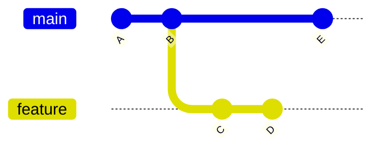
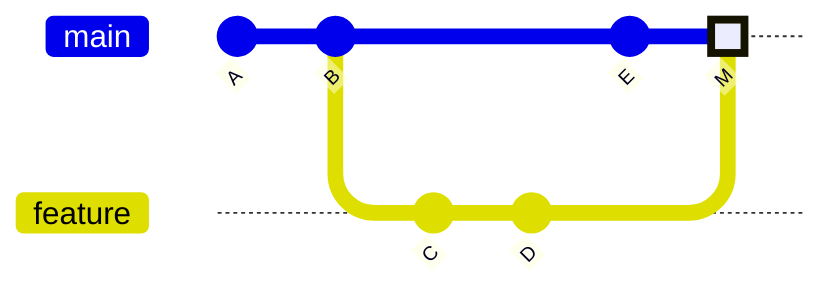
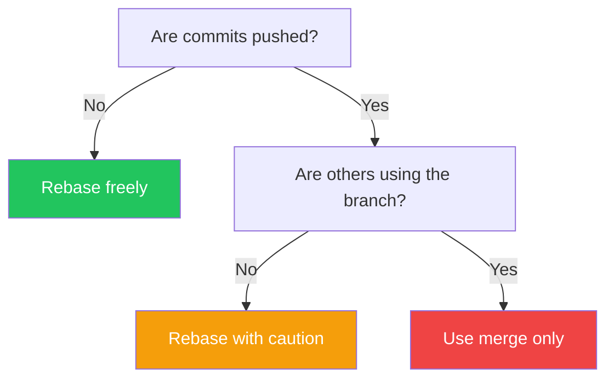

## Introduction

Both `git merge` and `git rebase` integrate changes from one branch into another, but they do so in fundamentally different ways. Understanding when to use each is essential for maintaining a clean and useful Git history.

This article explains the differences, use cases, and best practices for both.

## The Fundamental Difference



### After Merge



### After Rebase + Fast-Forward


## Git Merge

### How It Works

Merge creates a new commit that combines two branches:

```bash
# On feature branch, merge main
git checkout feature
git merge main

# Or merge feature into main
git checkout main
git merge feature
```

### Merge Types

| Type | When | Result |
|------|------|--------|
| **Fast-forward** | No divergence | Linear history |
| **Three-way** | Branches diverged | Merge commit |
| **Squash** | Combine commits | Single new commit |

### Fast-Forward Merge

```bash
# When feature is ahead of main with no divergence
git checkout main
git merge feature
# No merge commit created
```

### Three-Way Merge

```bash
# When both branches have new commits
git checkout main
git merge feature
# Creates a merge commit
```

### Squash Merge

```bash
# Combine all feature commits into one
git checkout main
git merge --squash feature
git commit -m "Add feature X"
```

## Git Rebase

### How It Works

Rebase replays your commits on top of another branch:

```bash
# On feature branch, rebase onto main
git checkout feature
git rebase main
```

### What Happens

1. Git finds the common ancestor
2. Saves your commits as patches
3. Resets to the target branch
4. Applies your commits one by one

```bash
# Before rebase
main:    A - B - E
feature: A - B - C - D

# After rebase
main:    A - B - E
feature: A - B - E - C' - D'
```

### Interactive Rebase

Modify, combine, or reorder commits:

```bash
git rebase -i HEAD~3
# or
git rebase -i main
```

In the editor:

```
pick abc123 Add login form
squash def456 Fix typo in login
pick ghi789 Add validation

# Commands:
# p, pick = use commit
# r, reword = use commit, but edit message
# e, edit = use commit, but stop for amending
# s, squash = use commit, but meld into previous
# f, fixup = like squash, but discard message
# d, drop = remove commit
```

## Comparison

| Aspect | Merge | Rebase |
|--------|-------|--------|
| **History** | Preserves full history | Creates linear history |
| **Merge commits** | Yes (for three-way) | No |
| **Original commits** | Preserved | Rewritten (new SHAs) |
| **Safe for shared branches** | Yes | No |
| **Conflict resolution** | Once | Per commit |

## When to Use Merge

### 1. Integrating Shared Branches

```bash
# Merging a shared branch into your feature
git checkout feature
git merge main

# Safe: doesn't rewrite history
```

### 2. Preserving History

```bash
# When you need to track when features were integrated
git merge --no-ff feature
# Always creates merge commit
```

### 3. Completing Pull Requests

```bash
# GitHub/GitLab default behavior
# Creates a merge commit for traceability
```

### Merge Commit Message

```
Merge branch 'feature/user-auth' into main

* feature/user-auth:
  Add password validation
  Implement login form
  Create user model
```

## When to Use Rebase

### 1. Updating Your Feature Branch

```bash
# Get latest changes from main before PR
git checkout feature
git rebase main
git push --force-with-lease
```

### 2. Cleaning Up Local Commits

```bash
# Before pushing, squash WIP commits
git rebase -i HEAD~5
```

### 3. Maintaining Linear History

```bash
# For projects that prefer linear history
git checkout main
git rebase feature
# Then fast-forward merge
```

## The Golden Rule

**Never rebase commits that have been pushed to a shared branch.**



## Handling Conflicts

### Merge Conflicts

```bash
git merge feature
# CONFLICT in file.txt

# Edit file.txt to resolve
git add file.txt
git commit  # Completes the merge
```

### Rebase Conflicts

```bash
git rebase main
# CONFLICT in file.txt

# Edit file.txt to resolve
git add file.txt
git rebase --continue  # Move to next commit

# Or abort entirely
git rebase --abort
```

### Conflict Markers

```
<<<<<<< HEAD
Current branch content
=======
Incoming branch content
>>>>>>> feature
```

## Practical Workflows

### Workflow 1: Rebase Before Merge

```bash
# 1. Update feature with latest main
git checkout feature
git fetch origin
git rebase origin/main

# 2. Push updated branch
git push --force-with-lease

# 3. Create PR or merge
git checkout main
git merge feature
```

### Workflow 2: Squash and Merge

```bash
# Common on GitHub PRs
# Combines all PR commits into one
git checkout main
git merge --squash feature
git commit -m "Add user authentication (#123)"
```

### Workflow 3: Interactive Rebase for Clean History

```bash
# Before creating PR, clean up commits
git rebase -i main

# In editor:
pick abc123 Add user model
squash def456 WIP: user model
squash ghi789 Fix user model typo
pick jkl012 Add authentication service
fixup mno345 Fix auth bug

# Result: Clean, logical commits
```

## Force Push Safely

When you rebase, you need to force push:

```bash
# Dangerous: overwrites remote without checking
git push --force

# Safe: fails if remote has new commits
git push --force-with-lease

# Even safer: specify expected remote state
git push --force-with-lease=origin/feature
```

## Rebase Strategies

### Preserve Merge Commits

```bash
# Keep merge commits during rebase
git rebase --rebase-merges main
```

### Autosquash

```bash
# Mark commits for squashing
git commit --fixup=abc123
git commit --squash=def456

# Auto-arrange in interactive rebase
git rebase -i --autosquash main
```

## Best Practices

### 1. Establish Team Conventions

Document your team's approach:

```markdown
## Git Workflow

### Feature Branches
- Rebase onto main before creating PR
- Squash WIP commits with interactive rebase

### Pull Requests
- Use squash merge for single logical changes
- Use merge commit for large features

### Never
- Force push to main or develop
- Rebase shared branches
```

### 2. Keep Commits Small and Focused

```bash
# Good: Each commit is atomic
git commit -m "Add User model"
git commit -m "Add UserRepository"
git commit -m "Add UserController"

# Bad: Large, unfocused commits
git commit -m "Add user functionality"
```

### 3. Write Good Commit Messages

```
Add user authentication with JWT

- Implement login/logout endpoints
- Add JWT token generation
- Include refresh token rotation
- Add rate limiting for login attempts

Closes #123
```

### 4. Use Aliases for Common Operations

```bash
# .gitconfig
[alias]
  rb = rebase
  rbi = rebase -i
  rbc = rebase --continue
  rba = rebase --abort
  fpush = push --force-with-lease
```

## Decision Matrix

| Scenario | Recommendation |
|----------|---------------|
| Updating local branch from main | Rebase |
| Merging feature to main | Merge (or squash merge) |
| Shared branch | Merge only |
| Cleaning local commits | Interactive rebase |
| Preserving full history | Merge with --no-ff |
| Linear history required | Rebase + fast-forward |

## Summary

| Command | Use When | Result |
|---------|----------|--------|
| `git merge` | Integrating shared branches | Preserves history, merge commit |
| `git merge --squash` | Clean single-commit integration | One new commit |
| `git rebase` | Updating local branch | Linear history, new commits |
| `git rebase -i` | Cleaning up commits | Modified commit history |

Both merge and rebase are essential tools. The key is knowing when each is appropriate and maintaining consistency within your team.

## References

- O'Reilly - Version Control with Git, Chapters 6, 9
- Packt - DevOps Unleashed with Git and GitHub, Chapter 3
- Atlassian - Merging vs Rebasing
