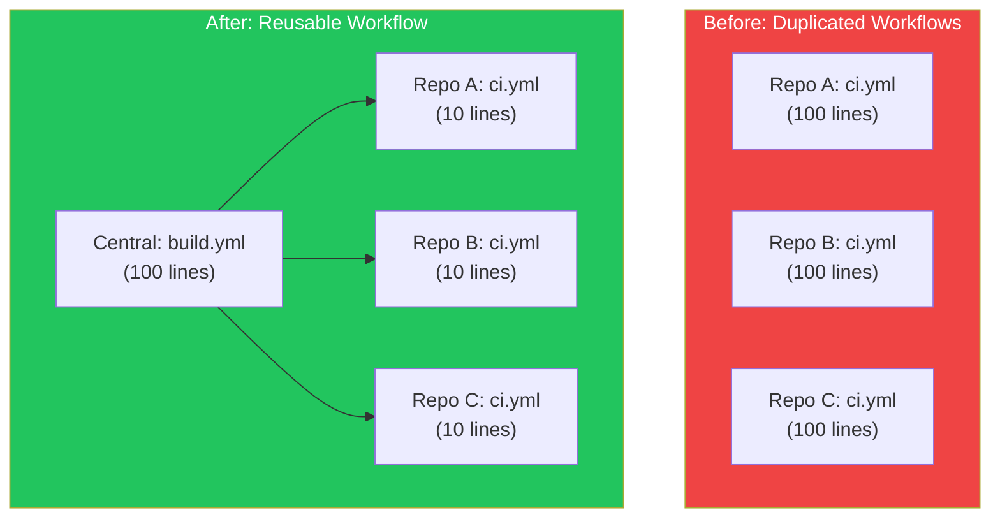
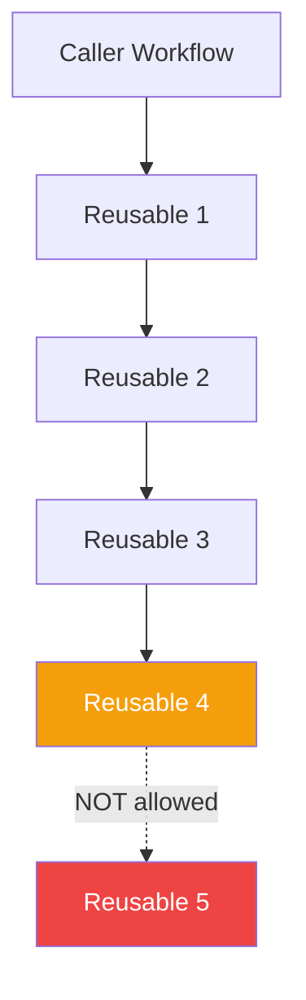

## Introduction

As your organization grows, you'll find similar workflow patterns repeated across many repositories. Reusable workflows let you define a workflow once and call it from multiple other workflows, applying the DRY (Don't Repeat Yourself) principle to your CI/CD.

This article explains how to create and use reusable workflows effectively.

## Why Reusable Workflows?



| Benefit | Description |
|---------|-------------|
| **Consistency** | Same workflow logic across all repositories |
| **Maintainability** | Update once, apply everywhere |
| **Reduced complexity** | Caller workflows are simpler |
| **Encapsulation** | Hide implementation details |

## Creating a Reusable Workflow

### Basic Structure

A reusable workflow uses `workflow_call` trigger:

```yaml
# .github/workflows/reusable-build.yml
name: Reusable Build Workflow

on:
  workflow_call:

jobs:
  build:
    runs-on: ubuntu-latest
    steps:
      - uses: actions/checkout@v4
      - uses: actions/setup-node@v4
        with:
          node-version: '20'
      - run: npm ci
      - run: npm run build
```

### Adding Inputs

Define inputs for customization:

```yaml
name: Reusable Build

on:
  workflow_call:
    inputs:
      node-version:
        description: 'Node.js version'
        required: false
        type: string
        default: '20'

      working-directory:
        description: 'Working directory'
        required: false
        type: string
        default: '.'

      build-command:
        description: 'Build command to run'
        required: false
        type: string
        default: 'npm run build'

      environment:
        description: 'Deployment environment'
        required: false
        type: string

jobs:
  build:
    runs-on: ubuntu-latest
    environment: ${{ inputs.environment }}
    defaults:
      run:
        working-directory: ${{ inputs.working-directory }}

    steps:
      - uses: actions/checkout@v4

      - uses: actions/setup-node@v4
        with:
          node-version: ${{ inputs.node-version }}
          cache: 'npm'
          cache-dependency-path: ${{ inputs.working-directory }}/package-lock.json

      - run: npm ci
      - run: ${{ inputs.build-command }}
```

### Input Types

| Type | Description | Example |
|------|-------------|---------|
| `string` | Text value | `'production'` |
| `boolean` | True/false | `true` |
| `number` | Numeric value | `42` |

### Adding Secrets

Pass secrets securely:

```yaml
on:
  workflow_call:
    inputs:
      environment:
        type: string
        required: true

    secrets:
      npm-token:
        description: 'NPM authentication token'
        required: true

      deploy-key:
        description: 'Deployment SSH key'
        required: false

jobs:
  deploy:
    runs-on: ubuntu-latest
    steps:
      - uses: actions/checkout@v4

      - name: Setup NPM auth
        run: echo "//registry.npmjs.org/:_authToken=${{ secrets.npm-token }}" >> ~/.npmrc

      - name: Deploy
        if: secrets.deploy-key != ''
        run: ./deploy.sh
        env:
          SSH_KEY: ${{ secrets.deploy-key }}
```

### Inherit Secrets

Use `secrets: inherit` to pass all caller secrets:

```yaml
on:
  workflow_call:
    secrets:
      npm-token:
        required: true
      # Or use 'inherit' when calling to pass all secrets
```

### Adding Outputs

Return values from reusable workflows:

```yaml
name: Build and Get Version

on:
  workflow_call:
    outputs:
      version:
        description: 'The built version'
        value: ${{ jobs.build.outputs.version }}

      artifact-name:
        description: 'Name of the uploaded artifact'
        value: ${{ jobs.build.outputs.artifact-name }}

jobs:
  build:
    runs-on: ubuntu-latest
    outputs:
      version: ${{ steps.version.outputs.version }}
      artifact-name: build-${{ steps.version.outputs.version }}

    steps:
      - uses: actions/checkout@v4

      - name: Get version
        id: version
        run: echo "version=$(cat package.json | jq -r .version)" >> $GITHUB_OUTPUT

      - run: npm ci
      - run: npm run build

      - name: Upload artifact
        uses: actions/upload-artifact@v4
        with:
          name: build-${{ steps.version.outputs.version }}
          path: dist/
```

## Calling Reusable Workflows

### Basic Call

```yaml
name: CI

on:
  push:
    branches: [main]

jobs:
  build:
    uses: ./.github/workflows/reusable-build.yml
```

### With Inputs and Secrets

```yaml
name: CI

on:
  push:
    branches: [main]

jobs:
  build:
    uses: owner/repo/.github/workflows/reusable-build.yml@main
    with:
      node-version: '20'
      working-directory: './frontend'
      environment: 'production'
    secrets:
      npm-token: ${{ secrets.NPM_TOKEN }}
      deploy-key: ${{ secrets.DEPLOY_KEY }}

  # Or inherit all secrets
  build-inherit:
    uses: ./.github/workflows/reusable-build.yml
    with:
      node-version: '20'
    secrets: inherit
```

### Using Outputs

```yaml
name: Build and Deploy

on:
  push:
    branches: [main]

jobs:
  build:
    uses: ./.github/workflows/reusable-build.yml
    with:
      node-version: '20'

  deploy:
    needs: build
    runs-on: ubuntu-latest
    steps:
      - name: Download artifact
        uses: actions/download-artifact@v4
        with:
          name: ${{ needs.build.outputs.artifact-name }}

      - name: Deploy version
        run: echo "Deploying version ${{ needs.build.outputs.version }}"
```

## Practical Examples

### Reusable Node.js CI Workflow

```yaml
# .github/workflows/reusable-node-ci.yml
name: Reusable Node.js CI

on:
  workflow_call:
    inputs:
      node-version:
        type: string
        default: '20'
      run-lint:
        type: boolean
        default: true
      run-tests:
        type: boolean
        default: true
      upload-coverage:
        type: boolean
        default: false

    outputs:
      test-result:
        value: ${{ jobs.test.outputs.result }}

jobs:
  lint:
    if: inputs.run-lint
    runs-on: ubuntu-latest
    steps:
      - uses: actions/checkout@v4
      - uses: actions/setup-node@v4
        with:
          node-version: ${{ inputs.node-version }}
          cache: 'npm'
      - run: npm ci
      - run: npm run lint

  test:
    if: inputs.run-tests
    runs-on: ubuntu-latest
    outputs:
      result: ${{ steps.test.outputs.result }}
    steps:
      - uses: actions/checkout@v4
      - uses: actions/setup-node@v4
        with:
          node-version: ${{ inputs.node-version }}
          cache: 'npm'
      - run: npm ci

      - name: Run tests
        id: test
        run: |
          npm test -- --coverage
          echo "result=success" >> $GITHUB_OUTPUT

      - name: Upload coverage
        if: inputs.upload-coverage
        uses: actions/upload-artifact@v4
        with:
          name: coverage
          path: coverage/
```

### Reusable Docker Build and Push

```yaml
# .github/workflows/reusable-docker.yml
name: Build and Push Docker Image

on:
  workflow_call:
    inputs:
      image-name:
        type: string
        required: true
      dockerfile:
        type: string
        default: 'Dockerfile'
      context:
        type: string
        default: '.'
      push:
        type: boolean
        default: false
      platforms:
        type: string
        default: 'linux/amd64'

    secrets:
      registry-username:
        required: true
      registry-password:
        required: true

    outputs:
      image-tag:
        value: ${{ jobs.build.outputs.tag }}
      image-digest:
        value: ${{ jobs.build.outputs.digest }}

jobs:
  build:
    runs-on: ubuntu-latest
    outputs:
      tag: ${{ steps.meta.outputs.tags }}
      digest: ${{ steps.build.outputs.digest }}

    steps:
      - uses: actions/checkout@v4

      - name: Set up QEMU
        uses: docker/setup-qemu-action@v3

      - name: Set up Docker Buildx
        uses: docker/setup-buildx-action@v3

      - name: Login to Registry
        uses: docker/login-action@v3
        with:
          username: ${{ secrets.registry-username }}
          password: ${{ secrets.registry-password }}

      - name: Extract metadata
        id: meta
        uses: docker/metadata-action@v5
        with:
          images: ${{ inputs.image-name }}
          tags: |
            type=ref,event=branch
            type=ref,event=pr
            type=sha,prefix=
            type=semver,pattern={{version}}

      - name: Build and push
        id: build
        uses: docker/build-push-action@v5
        with:
          context: ${{ inputs.context }}
          file: ${{ inputs.dockerfile }}
          platforms: ${{ inputs.platforms }}
          push: ${{ inputs.push }}
          tags: ${{ steps.meta.outputs.tags }}
          labels: ${{ steps.meta.outputs.labels }}
          cache-from: type=gha
          cache-to: type=gha,mode=max
```

### Reusable Deployment Workflow

```yaml
# .github/workflows/reusable-deploy.yml
name: Deploy to Environment

on:
  workflow_call:
    inputs:
      environment:
        type: string
        required: true
      artifact-name:
        type: string
        required: true
      url:
        type: string
        required: true

    secrets:
      deploy-token:
        required: true

jobs:
  deploy:
    runs-on: ubuntu-latest
    environment:
      name: ${{ inputs.environment }}
      url: ${{ inputs.url }}

    steps:
      - name: Download artifact
        uses: actions/download-artifact@v4
        with:
          name: ${{ inputs.artifact-name }}
          path: ./dist

      - name: Deploy
        run: |
          echo "Deploying to ${{ inputs.environment }}"
          # Your deployment logic here
        env:
          DEPLOY_TOKEN: ${{ secrets.deploy-token }}

      - name: Verify deployment
        run: curl -f ${{ inputs.url }}/health
```

## Starter Workflows

Create template workflows for your organization:

```
.github/
├── workflow-templates/
│   ├── node-ci.yml
│   ├── node-ci.properties.json
│   ├── docker-build.yml
│   └── docker-build.properties.json
```

**node-ci.properties.json:**

```json
{
  "name": "Node.js CI",
  "description": "Standard Node.js CI workflow for the organization",
  "iconName": "nodejs",
  "categories": ["JavaScript", "Node"]
}
```

**node-ci.yml:**

```yaml
name: Node.js CI

on:
  push:
    branches: [$default-branch]
  pull_request:
    branches: [$default-branch]

jobs:
  build:
    uses: org/.github/.github/workflows/reusable-node-ci.yml@main
    with:
      node-version: '20'
      run-lint: true
      run-tests: true
```

## Limitations and Considerations

### Nesting Depth

Reusable workflows can be nested up to 4 levels:



### Other Limitations

| Limitation | Description |
|------------|-------------|
| **Max nesting** | 4 levels deep |
| **Env variables** | Cannot be set at caller job level |
| **Strategy/matrix** | Cannot use caller's matrix in reusable |
| **Concurrency** | Each workflow level has its own |

### Workarounds

Pass matrix values as inputs:

```yaml
# Caller
jobs:
  test:
    strategy:
      matrix:
        node: [18, 20, 22]
    uses: ./.github/workflows/reusable-test.yml
    with:
      node-version: ${{ matrix.node }}
```

## Best Practices

### 1. Version Your Workflows

```yaml
# Use semantic versioning tags
uses: owner/repo/.github/workflows/build.yml@v1.2.0

# Or SHA for immutability
uses: owner/repo/.github/workflows/build.yml@abc123
```

### 2. Document Thoroughly

```yaml
name: Reusable Build

# Add detailed description
# This workflow builds Node.js applications with customizable
# configuration for different environments.

on:
  workflow_call:
    inputs:
      node-version:
        description: |
          Node.js version to use. Supports:
          - LTS versions (18, 20)
          - Current version (22)
        type: string
        default: '20'
```

### 3. Provide Sensible Defaults

```yaml
inputs:
  node-version:
    default: '20'  # Most common LTS
  run-tests:
    default: true  # Safe default
  deploy:
    default: false  # Dangerous operations off by default
```

### 4. Validate Inputs

```yaml
jobs:
  validate:
    runs-on: ubuntu-latest
    steps:
      - name: Validate environment
        if: inputs.environment != 'staging' && inputs.environment != 'production'
        run: |
          echo "Invalid environment: ${{ inputs.environment }}"
          exit 1
```

## Summary

| Feature | Description |
|---------|-------------|
| **workflow_call** | Trigger for reusable workflows |
| **inputs** | Customizable parameters |
| **secrets** | Secure credential passing |
| **outputs** | Return values to caller |
| **secrets: inherit** | Pass all caller secrets |

Reusable workflows help maintain consistency and reduce duplication across your organization's CI/CD pipelines.

## References

- O'Reilly - Learning GitHub Actions, Chapter 12
- Packt - GitHub Actions Cookbook, Chapter 5
- GitHub Docs - Reusing Workflows
