## Introduction

GitHub Actions executes code automatically, making security critical. A compromised workflow can leak secrets, inject malicious code, or compromise your entire supply chain.

This article covers security best practices to protect your workflows and repositories.

## Security Layers


## Secrets Management

### Using Secrets Safely

```yaml
# Good: Pass as environment variable
- name: Deploy
  env:
    API_KEY: ${{ secrets.API_KEY }}
  run: ./deploy.sh

# Bad: Inline in command (may leak in logs)
- run: ./deploy.sh --key=${{ secrets.API_KEY }}  # Don't do this!
```

### Secret Masking

GitHub automatically masks secrets in logs, but be careful:

```yaml
# This might expose the secret
- run: |
    KEY=${{ secrets.API_KEY }}
    echo "Key length: ${#KEY}"  # Safe
    echo "Key: $KEY"            # Will be masked, but avoid

# Better: Don't echo secrets at all
- run: |
    if [ -z "$API_KEY" ]; then
      echo "API key not set"
      exit 1
    fi
  env:
    API_KEY: ${{ secrets.API_KEY }}
```

### Secret Rotation Strategy

| Secret Type | Rotation Frequency | Method |
|-------------|-------------------|--------|
| API tokens | 90 days | Automated via script |
| SSH keys | 6 months | Manual with overlap period |
| Cloud credentials | Use OIDC instead | No rotation needed |
| Signing keys | 1 year | Careful transition |

## GITHUB_TOKEN Permissions

### Default Permissions Problem

The default `GITHUB_TOKEN` often has more permissions than needed:

```yaml
# Restrict permissions at workflow level
permissions:
  contents: read  # Only read code

jobs:
  build:
    runs-on: ubuntu-latest
    steps:
      - uses: actions/checkout@v4
      - run: npm build
```

### Principle of Least Privilege

```yaml
name: CI/CD

permissions:
  contents: read  # Default for all jobs

jobs:
  test:
    runs-on: ubuntu-latest
    # Inherits: contents: read
    steps:
      - uses: actions/checkout@v4
      - run: npm test

  deploy:
    runs-on: ubuntu-latest
    permissions:
      contents: read
      id-token: write    # For OIDC
      deployments: write # For deployment status
    steps:
      - uses: actions/checkout@v4
      - name: Deploy
        run: ./deploy.sh
```

### Permission Reference

| Permission | Use Case |
|------------|----------|
| `contents: read` | Checkout code |
| `contents: write` | Push commits, create releases |
| `pull-requests: write` | Comment on PRs |
| `issues: write` | Create/update issues |
| `id-token: write` | OIDC authentication |
| `packages: write` | Publish to GitHub Packages |
| `security-events: write` | Upload code scanning results |

## Protecting Against Injection

### Script Injection Vulnerability

```yaml
# VULNERABLE: User input directly in script
- name: Greet
  run: echo "Hello ${{ github.event.issue.title }}"

# If title contains: "; rm -rf / #
# The command becomes: echo "Hello "; rm -rf / #"
```

### Safe Input Handling

```yaml
# Safe: Use environment variable
- name: Greet
  env:
    TITLE: ${{ github.event.issue.title }}
  run: echo "Hello $TITLE"

# Safe: Use intermediate variable
- name: Process PR
  run: |
    BODY="${PR_BODY}"
    echo "Processing: ${BODY:0:100}"  # First 100 chars only
  env:
    PR_BODY: ${{ github.event.pull_request.body }}
```

### Contexts That Need Caution

| Context | Risk Level | Reason |
|---------|------------|--------|
| `github.event.issue.title` | High | User-controlled |
| `github.event.issue.body` | High | User-controlled |
| `github.event.pull_request.title` | High | User-controlled |
| `github.event.comment.body` | High | User-controlled |
| `github.head_ref` | Medium | Branch name, user-controlled |
| `github.ref` | Low | Limited characters allowed |

## Securing Actions

### Pin Action Versions

```yaml
# Risky: Using mutable references
- uses: actions/checkout@main     # Can change anytime
- uses: actions/checkout@v4       # Can change with patches

# Safe: Pin to commit SHA
- uses: actions/checkout@8ade135a41bc03ea155e62e844d188df1ea18608  # v4.1.0
```

### Verify Third-Party Actions

Before using an action:

1. **Check the source**: Review the action's repository
2. **Verify the publisher**: Is it from a trusted organization?
3. **Read the code**: Especially for actions with broad permissions
4. **Check for vulnerabilities**: Look at issues and security advisories

```yaml
# Prefer official actions
- uses: actions/checkout@v4          # GitHub official
- uses: aws-actions/configure-aws-credentials@v4  # AWS official

# Be cautious with unknown publishers
- uses: random-user/some-action@v1   # Review carefully first
```

### Use Dependabot for Actions

```yaml
# .github/dependabot.yml
version: 2
updates:
  - package-ecosystem: "github-actions"
    directory: "/"
    schedule:
      interval: "weekly"
    commit-message:
      prefix: "chore(deps)"
```

## Fork and Pull Request Security

### The Pwn Request Problem

When a workflow runs on `pull_request` from a fork:

```mermaid
flowchart LR
    Fork["Malicious Fork"] --> PR["Pull Request"]
    PR --> Workflow["Workflow Runs"]
    Workflow --> Secrets["❌ No Secrets Access"]
    Workflow --> Token["Limited Token"]

    style Fork fill:#ef4444,color:#fff
    style Secrets fill:#22c55e,color:#fff
```



### Safe Workflow Configuration

```yaml
# For untrusted PRs (from forks)
on:
  pull_request:
    types: [opened, synchronize]

permissions:
  contents: read
  # No write permissions for fork PRs

jobs:
  test:
    runs-on: ubuntu-latest
    steps:
      - uses: actions/checkout@v4
      - run: npm test  # Safe: no secrets needed

# For trusted PRs (after review)
on:
  pull_request_target:
    types: [opened, synchronize]

jobs:
  deploy-preview:
    if: github.event.pull_request.head.repo.full_name == github.repository
    runs-on: ubuntu-latest
    steps:
      - uses: actions/checkout@v4
        with:
          ref: ${{ github.event.pull_request.head.sha }}
      - name: Deploy preview
        env:
          DEPLOY_TOKEN: ${{ secrets.DEPLOY_TOKEN }}
        run: ./deploy-preview.sh
```

### pull_request vs pull_request_target

| Event | Runs Code From | Has Secrets | Use For |
|-------|---------------|-------------|---------|
| `pull_request` | PR branch | No (forks) | Safe testing |
| `pull_request_target` | Base branch | Yes | Labeling, commenting |

## Supply Chain Security

### Software Bill of Materials (SBOM)

```yaml
- name: Generate SBOM
  uses: anchore/sbom-action@v0
  with:
    path: .
    format: spdx-json
    output-file: sbom.spdx.json

- name: Upload SBOM
  uses: actions/upload-artifact@v4
  with:
    name: sbom
    path: sbom.spdx.json
```

### Dependency Scanning

```yaml
# .github/workflows/security.yml
name: Security Scan

on:
  push:
    branches: [main]
  schedule:
    - cron: '0 0 * * *'

jobs:
  dependency-review:
    runs-on: ubuntu-latest
    steps:
      - uses: actions/checkout@v4
      - uses: actions/dependency-review-action@v3
        with:
          fail-on-severity: moderate

  codeql:
    runs-on: ubuntu-latest
    permissions:
      security-events: write
    steps:
      - uses: actions/checkout@v4
      - uses: github/codeql-action/init@v2
        with:
          languages: javascript
      - uses: github/codeql-action/analyze@v2
```

### Container Scanning

```yaml
- name: Build image
  run: docker build -t myapp:${{ github.sha }} .

- name: Scan image
  uses: aquasecurity/trivy-action@master
  with:
    image-ref: myapp:${{ github.sha }}
    format: 'sarif'
    output: 'trivy-results.sarif'
    severity: 'CRITICAL,HIGH'

- name: Upload results
  uses: github/codeql-action/upload-sarif@v2
  with:
    sarif_file: 'trivy-results.sarif'
```

## Branch Protection and Rulesets

### Required Status Checks

Configure in repository settings:

```yaml
# These checks must pass before merging
name: Required Checks

on:
  pull_request:
    branches: [main]

jobs:
  test:
    runs-on: ubuntu-latest
    steps:
      - uses: actions/checkout@v4
      - run: npm test

  security:
    runs-on: ubuntu-latest
    steps:
      - uses: actions/checkout@v4
      - run: npm audit
```

### CODEOWNERS

Require review from specific teams:

```
# .github/CODEOWNERS

# Security team must review workflow changes
.github/workflows/ @org/security-team

# Infrastructure team for deployment configs
deploy/ @org/infrastructure
terraform/ @org/infrastructure

# All changes need at least one review
* @org/developers
```

## Security Checklist

```markdown
## Workflow Security Checklist

### Permissions
- [ ] Set explicit permissions at workflow level
- [ ] Use least privilege for each job
- [ ] Review GITHUB_TOKEN usage

### Secrets
- [ ] No secrets in logs or command lines
- [ ] Secrets passed via environment variables
- [ ] OIDC used where possible

### Actions
- [ ] Pin actions to SHA or specific version
- [ ] Review third-party action code
- [ ] Dependabot enabled for actions

### Inputs
- [ ] User inputs not used directly in scripts
- [ ] Environment variables used for untrusted data
- [ ] Input validation where needed

### Fork PRs
- [ ] Sensitive operations not in pull_request
- [ ] pull_request_target used carefully
- [ ] No secrets exposed to forks

### Monitoring
- [ ] Code scanning enabled
- [ ] Dependency review configured
- [ ] Audit logs reviewed regularly
```

## Summary

| Area | Key Practice |
|------|--------------|
| **Secrets** | Environment variables, never inline |
| **Permissions** | Least privilege, explicit declaration |
| **Actions** | Pin to SHA, verify third-party |
| **Inputs** | Never trust, always sanitize |
| **Fork PRs** | Use `pull_request`, not `pull_request_target` for untrusted |
| **Supply chain** | SBOM, scanning, Dependabot |
| **Branch protection** | Required checks, CODEOWNERS |

Security is an ongoing process. Regularly review your workflows, update dependencies, and stay informed about new vulnerabilities.

## References

- Manning - GitHub Actions in Action, Chapter 10
- O'Reilly - Learning GitHub Actions, Chapter 9
- GitHub Docs - Security Hardening for GitHub Actions
- OWASP - CI/CD Security Guidance
