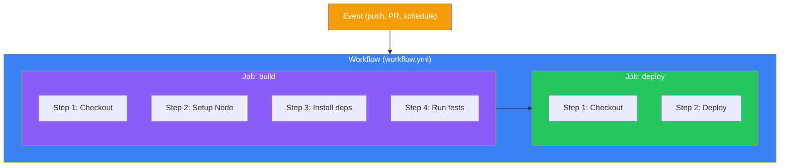
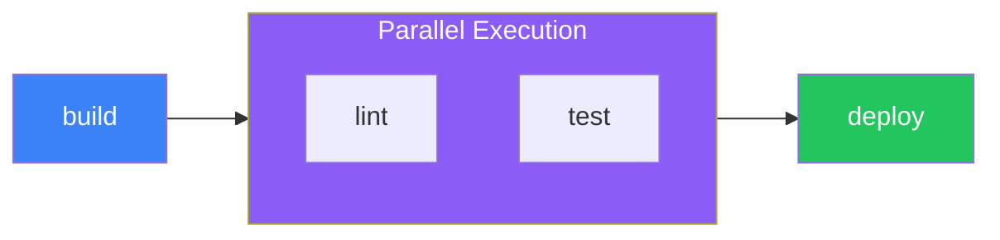

## Introduction

GitHub Actions is a powerful automation platform built directly into GitHub. It allows you to automate your software development workflows right in your repository—from building and testing code to deploying applications.

This article covers the fundamental concepts you need to understand to start creating effective workflows.

## Core Concepts



### Hierarchy Overview

| Component | Description |
|-----------|-------------|
| **Workflow** | Automated process defined in a YAML file |
| **Event** | Trigger that starts a workflow |
| **Job** | Set of steps that execute on the same runner |
| **Step** | Individual task within a job |
| **Action** | Reusable unit of code |
| **Runner** | Server that executes the workflow |

## YAML Syntax Essentials

Workflows are written in YAML. Here are the key syntax rules:

```yaml
# Key-value pairs
name: My Workflow

# Nested structures use indentation (2 spaces)
jobs:
  build:
    runs-on: ubuntu-latest

# Lists use hyphens
steps:
  - name: First step
  - name: Second step

# Multi-line strings
run: |
  echo "Line 1"
  echo "Line 2"

# Inline strings
run: echo "Single line"
```

## Workflow File Structure

Workflow files are stored in `.github/workflows/` directory:

```yaml
# .github/workflows/ci.yml
name: CI Pipeline

on:
  push:
    branches: [main]
  pull_request:
    branches: [main]

jobs:
  build:
    runs-on: ubuntu-latest

    steps:
      - name: Checkout code
        uses: actions/checkout@v4

      - name: Setup Node.js
        uses: actions/setup-node@v4
        with:
          node-version: '20'

      - name: Install dependencies
        run: npm ci

      - name: Run tests
        run: npm test
```

## Event Triggers

### Push and Pull Request Events

```yaml
on:
  push:
    branches:
      - main
      - 'release/**'
    paths:
      - 'src/**'
      - '!src/**/*.md'
    tags:
      - 'v*'

  pull_request:
    branches: [main]
    types: [opened, synchronize, reopened]
```

### Scheduled Triggers

```yaml
on:
  schedule:
    # Run at 00:00 UTC every day
    - cron: '0 0 * * *'
    # Run every Monday at 9:00 AM UTC
    - cron: '0 9 * * 1'
```

### Manual Triggers

```yaml
on:
  workflow_dispatch:
    inputs:
      environment:
        description: 'Deployment environment'
        required: true
        default: 'staging'
        type: choice
        options:
          - staging
          - production

      debug:
        description: 'Enable debug mode'
        required: false
        type: boolean
        default: false
```

### Trigger Comparison

| Trigger | Use Case |
|---------|----------|
| `push` | Run on every commit to specified branches |
| `pull_request` | Run when PRs are opened or updated |
| `schedule` | Periodic tasks (nightly builds, cleanup) |
| `workflow_dispatch` | Manual execution with optional inputs |
| `workflow_call` | Called by another workflow |
| `repository_dispatch` | Triggered by external events via API |

## Jobs and Steps

### Job Configuration

```yaml
jobs:
  build:
    name: Build Application
    runs-on: ubuntu-latest
    timeout-minutes: 30

    steps:
      - uses: actions/checkout@v4
      - run: npm ci
      - run: npm run build

  test:
    name: Run Tests
    runs-on: ubuntu-latest
    needs: build  # Wait for build job

    steps:
      - uses: actions/checkout@v4
      - run: npm ci
      - run: npm test
```

### Steps: Actions vs Run Commands

```yaml
steps:
  # Using a pre-built action
  - name: Checkout repository
    uses: actions/checkout@v4
    with:
      fetch-depth: 0

  # Running shell commands
  - name: Build project
    run: |
      npm ci
      npm run build
    working-directory: ./frontend

  # Using a specific shell
  - name: PowerShell script
    shell: pwsh
    run: Get-Process
```

### Job Dependencies



```yaml
jobs:
  build:
    runs-on: ubuntu-latest
    steps:
      - run: echo "Building..."

  lint:
    needs: build
    runs-on: ubuntu-latest
    steps:
      - run: echo "Linting..."

  test:
    needs: build
    runs-on: ubuntu-latest
    steps:
      - run: echo "Testing..."

  deploy:
    needs: [lint, test]  # Wait for both
    runs-on: ubuntu-latest
    steps:
      - run: echo "Deploying..."
```

## Expressions and Contexts

### Using Contexts

```yaml
steps:
  - name: Show context information
    run: |
      echo "Repository: ${{ github.repository }}"
      echo "Branch: ${{ github.ref_name }}"
      echo "Actor: ${{ github.actor }}"
      echo "Event: ${{ github.event_name }}"
      echo "SHA: ${{ github.sha }}"
```

### Common Contexts

| Context | Description |
|---------|-------------|
| `github` | Workflow run information |
| `env` | Environment variables |
| `vars` | Repository/org variables |
| `secrets` | Encrypted secrets |
| `job` | Current job information |
| `steps` | Step outputs and status |
| `runner` | Runner information |
| `matrix` | Matrix values for current job |

### Conditional Execution

```yaml
steps:
  - name: Only on main branch
    if: github.ref == 'refs/heads/main'
    run: echo "On main branch"

  - name: Only on pull requests
    if: github.event_name == 'pull_request'
    run: echo "This is a PR"

  - name: Run even if previous step failed
    if: always()
    run: echo "This always runs"

  - name: Run only on failure
    if: failure()
    run: echo "Previous step failed"

  - name: Skip on forks
    if: github.repository == 'owner/repo'
    run: echo "Not a fork"
```

## Environment Variables

### Defining Variables

```yaml
env:
  # Workflow-level
  NODE_ENV: production

jobs:
  build:
    runs-on: ubuntu-latest
    env:
      # Job-level
      CI: true

    steps:
      - name: Build
        env:
          # Step-level
          API_URL: https://api.example.com
        run: |
          echo "NODE_ENV: $NODE_ENV"
          echo "CI: $CI"
          echo "API_URL: $API_URL"
```

### Using Secrets

```yaml
steps:
  - name: Deploy
    env:
      API_KEY: ${{ secrets.API_KEY }}
    run: ./deploy.sh

  - name: Login to Docker Hub
    uses: docker/login-action@v3
    with:
      username: ${{ secrets.DOCKER_USERNAME }}
      password: ${{ secrets.DOCKER_PASSWORD }}
```

## Practical Example: Complete CI Workflow

```yaml
name: CI

on:
  push:
    branches: [main, develop]
  pull_request:
    branches: [main]

env:
  NODE_VERSION: '20'

jobs:
  lint:
    name: Lint Code
    runs-on: ubuntu-latest
    steps:
      - uses: actions/checkout@v4

      - name: Setup Node.js
        uses: actions/setup-node@v4
        with:
          node-version: ${{ env.NODE_VERSION }}
          cache: 'npm'

      - run: npm ci
      - run: npm run lint

  test:
    name: Run Tests
    runs-on: ubuntu-latest
    steps:
      - uses: actions/checkout@v4

      - name: Setup Node.js
        uses: actions/setup-node@v4
        with:
          node-version: ${{ env.NODE_VERSION }}
          cache: 'npm'

      - run: npm ci
      - run: npm test -- --coverage

      - name: Upload coverage
        uses: actions/upload-artifact@v4
        with:
          name: coverage
          path: coverage/

  build:
    name: Build
    runs-on: ubuntu-latest
    needs: [lint, test]
    steps:
      - uses: actions/checkout@v4

      - name: Setup Node.js
        uses: actions/setup-node@v4
        with:
          node-version: ${{ env.NODE_VERSION }}
          cache: 'npm'

      - run: npm ci
      - run: npm run build

      - name: Upload build artifacts
        uses: actions/upload-artifact@v4
        with:
          name: build
          path: dist/
```

## Best Practices

### 1. Pin Action Versions

```yaml
# Good: Use specific version or SHA
- uses: actions/checkout@v4
- uses: actions/setup-node@v4.0.2
- uses: actions/checkout@8ade135a41bc03ea155e62e844d188df1ea18608

# Avoid: Using latest or branches
- uses: actions/checkout@main  # Don't do this
```

### 2. Use Caching

```yaml
- name: Cache node modules
  uses: actions/cache@v4
  with:
    path: ~/.npm
    key: ${{ runner.os }}-node-${{ hashFiles('**/package-lock.json') }}
    restore-keys: |
      ${{ runner.os }}-node-
```

### 3. Minimize Secrets Exposure

```yaml
# Good: Pass as environment variable
- name: Deploy
  env:
    TOKEN: ${{ secrets.DEPLOY_TOKEN }}
  run: ./deploy.sh

# Avoid: Inline in command (can leak in logs)
- run: ./deploy.sh ${{ secrets.DEPLOY_TOKEN }}  # Don't do this
```

### 4. Use Timeout

```yaml
jobs:
  build:
    runs-on: ubuntu-latest
    timeout-minutes: 15  # Prevent runaway jobs
```

## Summary

| Concept | Key Points |
|---------|------------|
| **Workflows** | YAML files in `.github/workflows/` |
| **Triggers** | `push`, `pull_request`, `schedule`, `workflow_dispatch` |
| **Jobs** | Run in parallel by default; use `needs` for dependencies |
| **Steps** | `uses` for actions, `run` for commands |
| **Contexts** | `${{ github.* }}`, `${{ secrets.* }}`, etc. |
| **Conditions** | `if` expressions control execution |

With these fundamentals, you can create workflows that automatically build, test, and deploy your applications whenever you push code or open pull requests.

## References

- Manning - GitHub Actions in Action, Chapter 3
- O'Reilly - Learning GitHub Actions, Chapters 1-4
- GitHub Docs - Workflow Syntax
