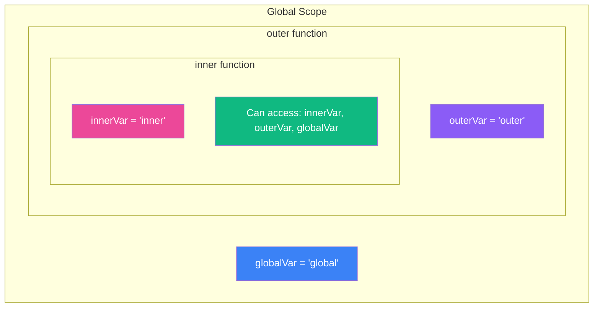
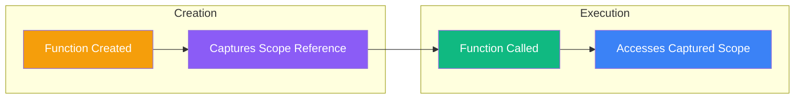

Closures are one of the most powerful and often misunderstood concepts in JavaScript. They enable patterns like data privacy, function factories, and callbacks that are fundamental to JavaScript programming. Let's demystify closures and see how they work under the hood.

## What Is a Closure?

A closure is created when a function "remembers" the variables from its outer scope, even after the outer function has finished executing. In other words, a closure gives you access to an outer function's scope from an inner function.

```javascript
function createGreeting(greeting) {
  // This inner function is a closure
  return function(name) {
    return `${greeting}, ${name}!`;
  };
}

const sayHello = createGreeting("Hello");
const sayHi = createGreeting("Hi");

console.log(sayHello("Alice")); // "Hello, Alice!"
console.log(sayHi("Bob"));      // "Hi, Bob!"
```

Even though `createGreeting` has finished executing, the returned function still has access to the `greeting` variable. This is the essence of a closure.

## Understanding Lexical Scope

To understand closures, you first need to understand lexical scope. JavaScript uses lexical scoping, meaning a function's scope is determined by where it is written in the source code, not where it is called.



```javascript
const globalVar = "global";

function outer() {
  const outerVar = "outer";

  function inner() {
    const innerVar = "inner";
    // Can access all three variables
    console.log(globalVar, outerVar, innerVar);
  }

  inner();
}

outer(); // "global outer inner"
```

The inner function can access variables from its own scope, the outer function's scope, and the global scope. This chain of scopes is called the **scope chain**.

## How Closures Work

When a function is created, it captures a reference to its surrounding scope. This captured environment is stored with the function and travels with it wherever it goes.



```javascript
function counter() {
  let count = 0; // This variable is "enclosed" by the returned function

  return function() {
    count += 1;
    return count;
  };
}

const increment = counter();
console.log(increment()); // 1
console.log(increment()); // 2
console.log(increment()); // 3

// Each call to counter() creates a new closure with its own count
const anotherCounter = counter();
console.log(anotherCounter()); // 1 (independent from increment)
```

## Practical Use Cases

### 1. Data Privacy and Encapsulation

Closures allow you to create private variables that can't be accessed from outside:

```javascript
function createBankAccount(initialBalance) {
  let balance = initialBalance; // Private variable

  return {
    deposit(amount) {
      if (amount > 0) {
        balance += amount;
        return balance;
      }
    },
    withdraw(amount) {
      if (amount > 0 && amount <= balance) {
        balance -= amount;
        return balance;
      }
      return "Insufficient funds";
    },
    getBalance() {
      return balance;
    }
  };
}

const account = createBankAccount(100);
console.log(account.getBalance()); // 100
account.deposit(50);
console.log(account.getBalance()); // 150
console.log(account.balance);      // undefined (private!)
```

### 2. Function Factories

Create specialized functions from a general template:

```javascript
function multiply(factor) {
  return function(number) {
    return number * factor;
  };
}

const double = multiply(2);
const triple = multiply(3);
const tenTimes = multiply(10);

console.log(double(5));   // 10
console.log(triple(5));   // 15
console.log(tenTimes(5)); // 50
```

### 3. Memoization (Caching)

Cache expensive computation results:

```javascript
function memoize(fn) {
  const cache = {};

  return function(...args) {
    const key = JSON.stringify(args);

    if (key in cache) {
      console.log("Returning cached result");
      return cache[key];
    }

    const result = fn.apply(this, args);
    cache[key] = result;
    return result;
  };
}

const expensiveOperation = memoize(function(n) {
  console.log("Computing...");
  return n * n;
});

console.log(expensiveOperation(5)); // Computing... 25
console.log(expensiveOperation(5)); // Returning cached result 25
console.log(expensiveOperation(6)); // Computing... 36
```

### 4. Event Handlers with State

Maintain state across event handler invocations:

```javascript
function createClickCounter(buttonId) {
  let clicks = 0;

  document.getElementById(buttonId).addEventListener("click", function() {
    clicks += 1;
    console.log(`Button clicked ${clicks} times`);
  });
}

createClickCounter("myButton");
```

## Common Pitfall: Closures in Loops

One of the most common mistakes with closures involves loops:

```javascript
// Problem: All functions share the same variable
for (var i = 0; i < 3; i++) {
  setTimeout(function() {
    console.log(i);
  }, 100);
}
// Output: 3, 3, 3 (not 0, 1, 2!)
```

This happens because `var` is function-scoped, so all callbacks share the same `i` variable, which is 3 after the loop ends.

### Solutions

**Solution 1: Use `let` (recommended)**

```javascript
for (let i = 0; i < 3; i++) {
  setTimeout(function() {
    console.log(i);
  }, 100);
}
// Output: 0, 1, 2
```

`let` creates a new binding for each iteration, so each closure captures its own `i`.

**Solution 2: Create a new scope with IIFE**

```javascript
for (var i = 0; i < 3; i++) {
  (function(j) {
    setTimeout(function() {
      console.log(j);
    }, 100);
  })(i);
}
// Output: 0, 1, 2
```

**Solution 3: Use a factory function**

```javascript
function createLogger(value) {
  return function() {
    console.log(value);
  };
}

for (var i = 0; i < 3; i++) {
  setTimeout(createLogger(i), 100);
}
// Output: 0, 1, 2
```

## Closure Memory Considerations

Closures keep references to their outer scope variables, which means those variables can't be garbage collected as long as the closure exists:

```javascript
function createHugeArray() {
  const hugeData = new Array(1000000).fill("data");

  return function() {
    // Even if we don't use hugeData, it's still in memory
    return "Hello";
  };
}

const fn = createHugeArray();
// hugeData is still in memory because fn's closure references it
```

To avoid memory leaks, be mindful of what your closures capture:

```javascript
function createOptimized() {
  const hugeData = new Array(1000000).fill("data");
  const result = hugeData.length; // Extract what you need

  return function() {
    return result; // Only captures the result, not the array
  };
}
```

## Summary

- **Closures** are functions that remember their lexical scope even when executed outside that scope
- They are created automatically when a function accesses variables from an outer scope
- **Lexical scope** means scope is determined by where code is written, not where it's executed
- Use closures for **data privacy**, **function factories**, **memoization**, and **maintaining state**
- Be aware of the **loop closure pitfall** and use `let` instead of `var`
- Consider **memory implications** when closures capture large data structures

Closures are not a special syntax you need to learn—they are a natural consequence of how JavaScript handles scope. Once you understand lexical scoping, closures become intuitive and incredibly useful for writing clean, maintainable code.

## References

- Flanagan, David. *JavaScript: The Definitive Guide*, 7th Edition. O'Reilly Media, 2020.
- Haverbeke, Marijn. *Eloquent JavaScript*, 4th Edition. No Starch Press, 2024.
