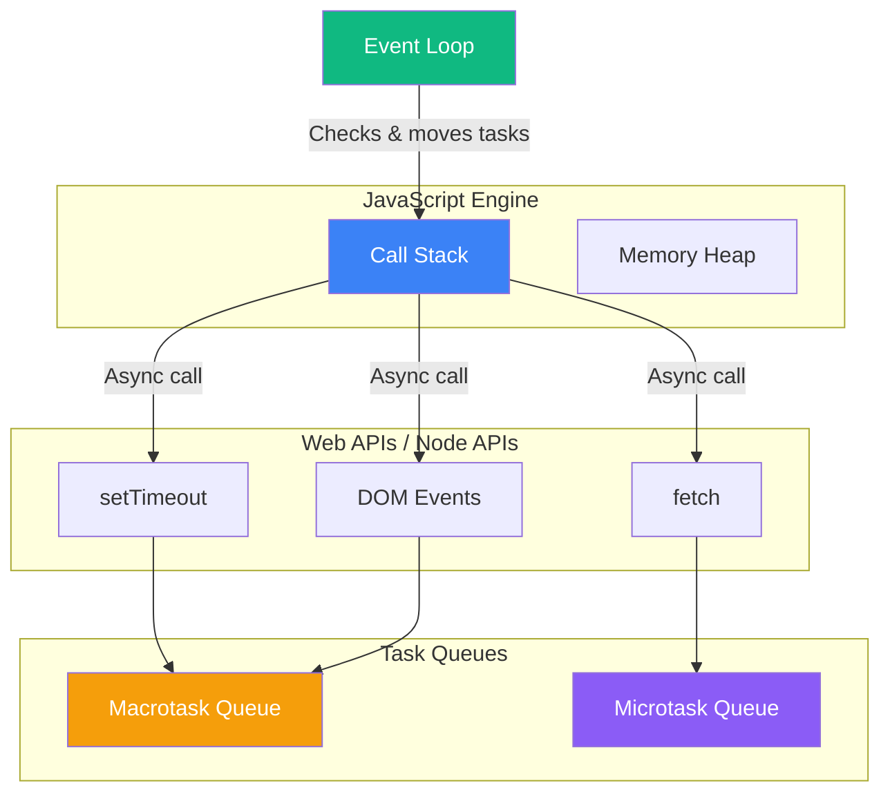
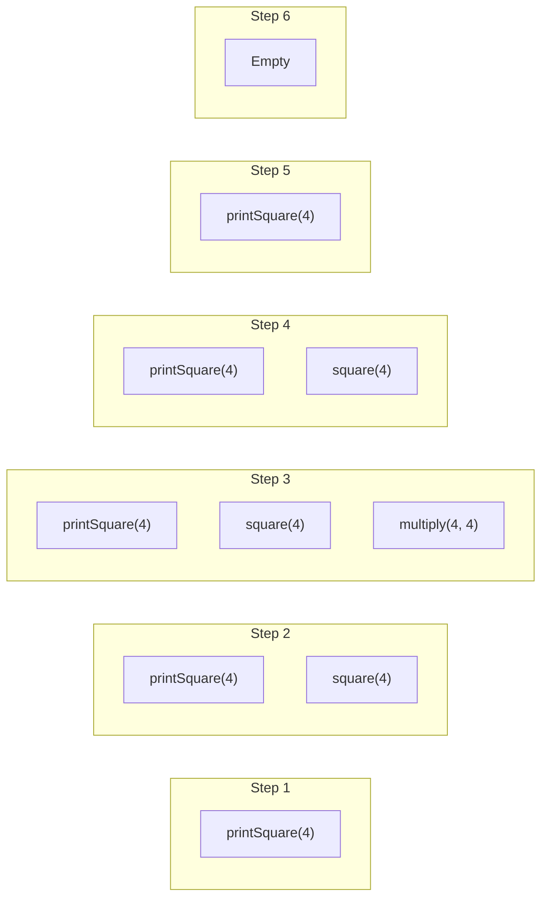
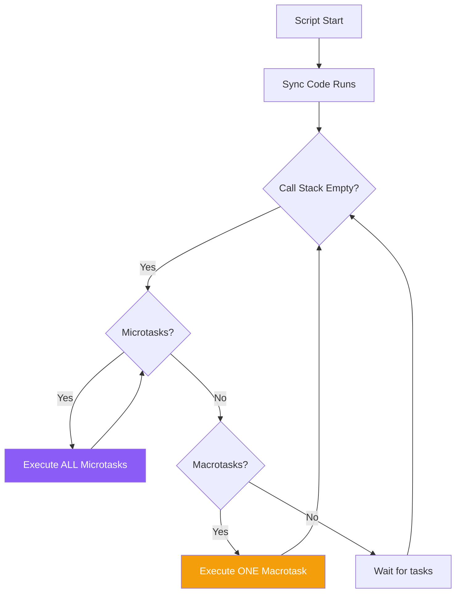

JavaScript is single-threaded, meaning it can only execute one piece of code at a time. Yet, it handles asynchronous operations like network requests, timers, and user events seamlessly. How is this possible? The answer lies in the event loop—a fundamental mechanism that enables non-blocking I/O in JavaScript.

## The JavaScript Runtime

Before diving into the event loop, let's understand the components of the JavaScript runtime:



- **Call Stack**: Where function calls are tracked
- **Memory Heap**: Where objects are stored
- **Web/Node APIs**: Browser or Node.js provided APIs for async operations
- **Task Queues**: Where callbacks wait to be executed
- **Event Loop**: The coordinator that moves callbacks to the call stack

## The Call Stack

The call stack is a data structure that tracks function execution. When a function is called, it's pushed onto the stack. When it returns, it's popped off.

```javascript
function multiply(a, b) {
  return a * b;
}

function square(n) {
  return multiply(n, n);
}

function printSquare(n) {
  const result = square(n);
  console.log(result);
}

printSquare(4);
```



If the stack grows too large (e.g., infinite recursion), you get a "stack overflow" error.

## Asynchronous Operations

When you call an asynchronous function like `setTimeout`, the operation is handed off to the browser/Node.js APIs:

```javascript
console.log("Start");

setTimeout(() => {
  console.log("Timeout callback");
}, 0);

console.log("End");

// Output:
// Start
// End
// Timeout callback
```

Even with a delay of 0ms, the callback doesn't run immediately. Here's why:

```mermaid
sequenceDiagram
    participant Stack as Call Stack
    participant APIs as Web APIs
    participant Queue as Task Queue
    participant Loop as Event Loop

    Stack->>Stack: console.log("Start")
    Stack->>APIs: setTimeout(callback, 0)
    Stack->>Stack: console.log("End")
    APIs->>Queue: callback (after 0ms)
    Note over Stack: Stack is empty
    Loop->>Stack: Move callback from queue
    Stack->>Stack: console.log("Timeout callback")
```

## The Event Loop

The event loop continuously checks:

1. Is the call stack empty?
2. Are there callbacks waiting in the queues?
3. If yes to both, move the next callback to the call stack

```javascript
// Simplified event loop pseudocode
while (true) {
  if (callStack.isEmpty()) {
    if (microtaskQueue.hasTask()) {
      callStack.push(microtaskQueue.dequeue());
    } else if (macrotaskQueue.hasTask()) {
      callStack.push(macrotaskQueue.dequeue());
    }
  }
}
```

## Macrotasks vs Microtasks

There are two types of task queues:

### Macrotasks (Task Queue)
- `setTimeout`, `setInterval`
- `setImmediate` (Node.js)
- I/O operations
- UI rendering
- Event callbacks

### Microtasks (Job Queue)
- `Promise.then()`, `catch()`, `finally()`
- `queueMicrotask()`
- `MutationObserver`
- `async/await` (uses promises)

**Key difference**: All microtasks are processed before the next macrotask.

```javascript
console.log("1: Script start");

setTimeout(() => {
  console.log("2: setTimeout");
}, 0);

Promise.resolve()
  .then(() => console.log("3: Promise 1"))
  .then(() => console.log("4: Promise 2"));

console.log("5: Script end");

// Output:
// 1: Script start
// 5: Script end
// 3: Promise 1
// 4: Promise 2
// 2: setTimeout
```



## A Complex Example

Let's trace through a more complex example:

```javascript
console.log("1");

setTimeout(() => console.log("2"), 0);

Promise.resolve()
  .then(() => {
    console.log("3");
    setTimeout(() => console.log("4"), 0);
  })
  .then(() => console.log("5"));

setTimeout(() => {
  console.log("6");
  Promise.resolve().then(() => console.log("7"));
}, 0);

console.log("8");
```

**Output**: `1, 8, 3, 5, 2, 6, 7, 4`

**Explanation**:
1. `1` - Synchronous
2. `8` - Synchronous
3. `3` - First microtask (Promise)
4. `5` - Chained microtask
5. `2` - First macrotask (setTimeout)
6. `6` - Second macrotask
7. `7` - Microtask from within macrotask (runs before next macrotask)
8. `4` - Third macrotask (queued from inside promise)

## Why This Matters

Understanding the event loop helps you:

### 1. Avoid Blocking the Main Thread

```javascript
// Bad: Blocks the UI
function heavyComputation() {
  for (let i = 0; i < 1000000000; i++) {
    // CPU-intensive work
  }
}

// Better: Break into chunks
function heavyComputationAsync(data, callback) {
  const chunkSize = 10000;
  let index = 0;

  function processChunk() {
    const end = Math.min(index + chunkSize, data.length);
    for (; index < end; index++) {
      // Process item
    }

    if (index < data.length) {
      setTimeout(processChunk, 0); // Yield to event loop
    } else {
      callback();
    }
  }

  processChunk();
}
```

### 2. Understand Timing Issues

```javascript
// This won't work as expected
for (var i = 0; i < 3; i++) {
  setTimeout(() => console.log(i), 0);
}
// Output: 3, 3, 3

// Because all callbacks run after the loop finishes
// Use let instead:
for (let i = 0; i < 3; i++) {
  setTimeout(() => console.log(i), 0);
}
// Output: 0, 1, 2
```

### 3. Control Execution Order

```javascript
// Ensure code runs after DOM updates
function updateAndProcess() {
  element.textContent = "Updated";

  // DOM update is synchronous, but rendering is not
  // Use microtask to run after current task but before render
  queueMicrotask(() => {
    // Runs before the browser renders
    console.log("After update, before render");
  });

  // Use macrotask to run after render
  setTimeout(() => {
    // Runs after the browser renders
    console.log("After render");
  }, 0);
}
```

## requestAnimationFrame

For animations, use `requestAnimationFrame`, which runs before the browser repaints:

```javascript
function animate() {
  // Update animation state
  element.style.transform = `translateX(${position}px)`;
  position += 1;

  // Schedule next frame
  requestAnimationFrame(animate);
}

requestAnimationFrame(animate);
```

`requestAnimationFrame` callbacks run:
- After microtasks
- Before the next repaint
- At ~60fps (or display refresh rate)

## Summary

- JavaScript is **single-threaded** but handles async operations through the event loop
- The **call stack** tracks function execution
- **Async operations** are handled by browser/Node.js APIs
- **Microtasks** (Promises) have priority over **macrotasks** (setTimeout)
- All microtasks run before the next macrotask
- Understanding this helps avoid **blocking the main thread** and **timing bugs**
- Use `requestAnimationFrame` for smooth animations

The event loop is what makes JavaScript's asynchronous programming model work. By understanding it, you can write more efficient code and debug timing-related issues with confidence.

## References

- Flanagan, David. *JavaScript: The Definitive Guide*, 7th Edition. O'Reilly Media, 2020.
- [MDN Web Docs: Event Loop](https://developer.mozilla.org/en-US/docs/Web/JavaScript/Event_loop)
- [Jake Archibald: In The Loop](https://www.youtube.com/watch?v=cCOL7MC4Pl0)
