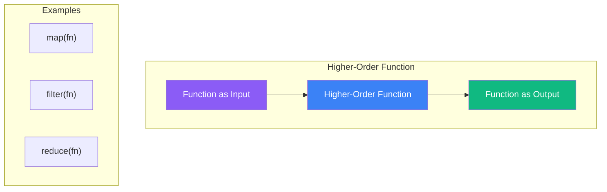
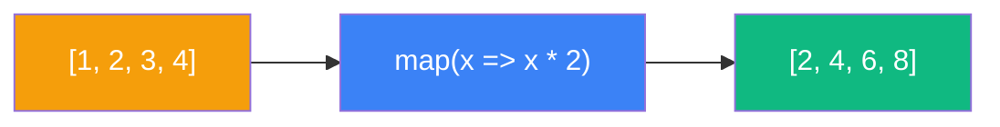
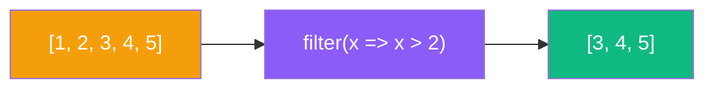
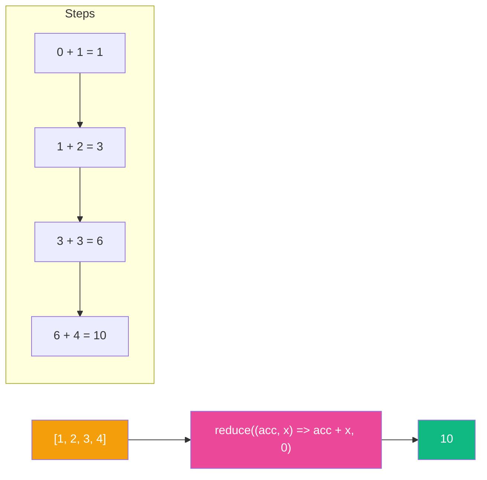
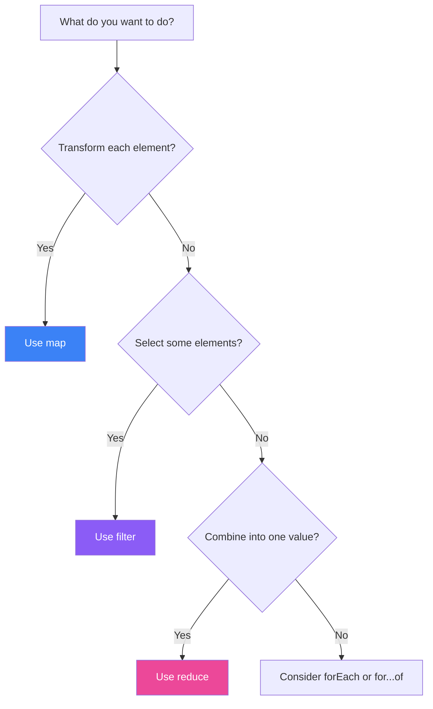

Higher-order functions are one of JavaScript's most powerful features for writing clean, declarative code. They allow you to abstract away common patterns and work with data in an expressive way. In this article, we'll explore what higher-order functions are and master the three most important array methods: `map`, `filter`, and `reduce`.

## What Are Higher-Order Functions?

A higher-order function is a function that either:

1. **Takes one or more functions as arguments**, or
2. **Returns a function as its result**



```javascript
// Takes a function as argument
function executeOperation(operation, a, b) {
  return operation(a, b);
}

const add = (x, y) => x + y;
const multiply = (x, y) => x * y;

console.log(executeOperation(add, 5, 3));      // 8
console.log(executeOperation(multiply, 5, 3)); // 15

// Returns a function
function createMultiplier(factor) {
  return (number) => number * factor;
}

const double = createMultiplier(2);
console.log(double(5)); // 10
```

## The Big Three: map, filter, reduce

### map: Transform Every Element

`map` creates a new array by applying a function to every element of the original array. It's perfect for transformations.



```javascript
const numbers = [1, 2, 3, 4, 5];

// Double each number
const doubled = numbers.map(n => n * 2);
console.log(doubled); // [2, 4, 6, 8, 10]

// Transform objects
const users = [
  { name: "Alice", age: 25 },
  { name: "Bob", age: 30 },
  { name: "Charlie", age: 35 }
];

const names = users.map(user => user.name);
console.log(names); // ["Alice", "Bob", "Charlie"]

// Add computed properties
const usersWithId = users.map((user, index) => ({
  ...user,
  id: index + 1
}));
```

**When to use `map`:**
- You want to transform each element in an array
- The output array has the same length as the input
- You're not filtering or accumulating values

### filter: Select Elements That Match

`filter` creates a new array containing only elements that pass a test (return `true` from the callback).



```javascript
const numbers = [1, 2, 3, 4, 5, 6, 7, 8, 9, 10];

// Get even numbers
const evens = numbers.filter(n => n % 2 === 0);
console.log(evens); // [2, 4, 6, 8, 10]

// Filter objects
const products = [
  { name: "Laptop", price: 1000, inStock: true },
  { name: "Phone", price: 500, inStock: false },
  { name: "Tablet", price: 300, inStock: true },
  { name: "Watch", price: 200, inStock: true }
];

// Products in stock under $400
const affordable = products.filter(
  p => p.inStock && p.price < 400
);
console.log(affordable);
// [{ name: "Tablet", ... }, { name: "Watch", ... }]

// Remove falsy values
const mixed = [0, "hello", "", null, 42, undefined, "world"];
const truthy = mixed.filter(Boolean);
console.log(truthy); // ["hello", 42, "world"]
```

**When to use `filter`:**
- You want to select a subset of elements
- The output may have fewer elements than the input
- You're testing each element against a condition

### reduce: Accumulate Into a Single Value

`reduce` is the most powerful and flexible of the three. It reduces an array to a single value by applying a function that accumulates results.



```javascript
const numbers = [1, 2, 3, 4, 5];

// Sum all numbers
const sum = numbers.reduce((acc, n) => acc + n, 0);
console.log(sum); // 15

// Find maximum
const max = numbers.reduce((acc, n) => n > acc ? n : acc, numbers[0]);
console.log(max); // 5

// Count occurrences
const fruits = ["apple", "banana", "apple", "orange", "banana", "apple"];
const count = fruits.reduce((acc, fruit) => {
  acc[fruit] = (acc[fruit] || 0) + 1;
  return acc;
}, {});
console.log(count); // { apple: 3, banana: 2, orange: 1 }

// Group by property
const people = [
  { name: "Alice", department: "Engineering" },
  { name: "Bob", department: "Marketing" },
  { name: "Charlie", department: "Engineering" },
  { name: "Diana", department: "Marketing" }
];

const byDepartment = people.reduce((acc, person) => {
  const dept = person.department;
  acc[dept] = acc[dept] || [];
  acc[dept].push(person);
  return acc;
}, {});
```

**When to use `reduce`:**
- You want to combine all elements into a single value
- You're building an object or different data structure from an array
- The computation requires an accumulator

## Choosing the Right Method



| Operation | Method | Returns |
|-----------|--------|---------|
| Transform all elements | `map` | New array (same length) |
| Select matching elements | `filter` | New array (≤ original length) |
| Combine into single value | `reduce` | Any value |

## Chaining Methods

One of the beautiful things about these methods is that they can be chained together:

```javascript
const orders = [
  { product: "Laptop", price: 1000, quantity: 2 },
  { product: "Phone", price: 500, quantity: 3 },
  { product: "Tablet", price: 300, quantity: 1 },
  { product: "Watch", price: 200, quantity: 5 }
];

// Total value of orders over $500
const expensiveOrdersTotal = orders
  .filter(order => order.price > 300)        // Select expensive items
  .map(order => order.price * order.quantity) // Calculate totals
  .reduce((sum, total) => sum + total, 0);    // Sum everything

console.log(expensiveOrdersTotal); // 3500

// Get names of adults, sorted
const people = [
  { name: "Charlie", age: 17 },
  { name: "Alice", age: 25 },
  { name: "Bob", age: 30 },
  { name: "Diana", age: 16 }
];

const adultNames = people
  .filter(p => p.age >= 18)
  .map(p => p.name)
  .sort();

console.log(adultNames); // ["Alice", "Bob"]
```

## Common Patterns and Examples

### Flatten an Array

```javascript
const nested = [[1, 2], [3, 4], [5, 6]];

// Using reduce
const flattened = nested.reduce((acc, arr) => acc.concat(arr), []);
console.log(flattened); // [1, 2, 3, 4, 5, 6]

// Modern alternative: flat()
console.log(nested.flat()); // [1, 2, 3, 4, 5, 6]
```

### Remove Duplicates

```javascript
const numbers = [1, 2, 2, 3, 3, 3, 4, 4, 5];

// Using reduce
const unique = numbers.reduce((acc, n) => {
  if (!acc.includes(n)) acc.push(n);
  return acc;
}, []);

// Better: Using Set
const uniqueSet = [...new Set(numbers)];
console.log(uniqueSet); // [1, 2, 3, 4, 5]
```

### Compute Statistics

```javascript
const scores = [85, 90, 78, 92, 88, 76, 95, 89];

const stats = scores.reduce((acc, score, index, array) => {
  acc.sum += score;
  acc.min = Math.min(acc.min, score);
  acc.max = Math.max(acc.max, score);
  if (index === array.length - 1) {
    acc.average = acc.sum / array.length;
  }
  return acc;
}, { sum: 0, min: Infinity, max: -Infinity, average: 0 });

console.log(stats);
// { sum: 693, min: 76, max: 95, average: 86.625 }
```

## Performance Considerations

While chaining is elegant, be aware that each method creates a new array and iterates through all elements:

```javascript
// Less efficient: 3 iterations
const result = largeArray
  .filter(x => x > 0)
  .map(x => x * 2)
  .reduce((sum, x) => sum + x, 0);

// More efficient: 1 iteration
const result = largeArray.reduce((sum, x) => {
  if (x > 0) {
    sum += x * 2;
  }
  return sum;
}, 0);
```

For small to medium arrays, prefer readability. For performance-critical code with large arrays, consider combining operations.

## Summary

- **Higher-order functions** take functions as arguments or return functions
- **`map`** transforms every element (same array length)
- **`filter`** selects elements that pass a test (may reduce length)
- **`reduce`** accumulates elements into a single value (most flexible)
- **Chain methods** for readable, declarative data transformations
- **Consider performance** when working with large datasets

Mastering these three methods will transform how you write JavaScript. They encourage a functional, declarative style that's easier to read, test, and maintain.

## References

- Flanagan, David. *JavaScript: The Definitive Guide*, 7th Edition. O'Reilly Media, 2020.
- Haverbeke, Marijn. *Eloquent JavaScript*, 4th Edition. No Starch Press, 2024.
