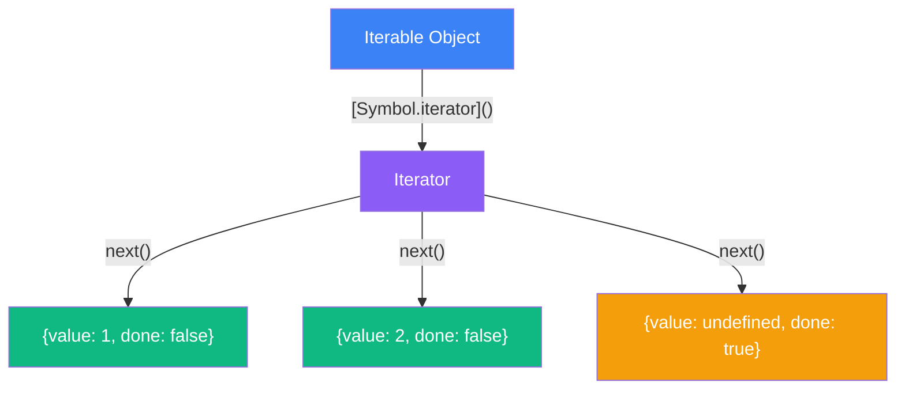
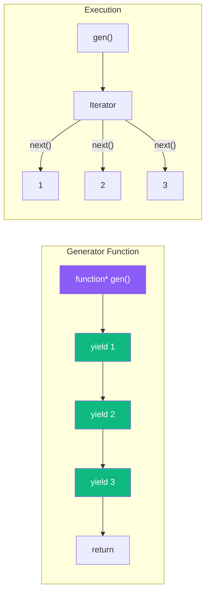
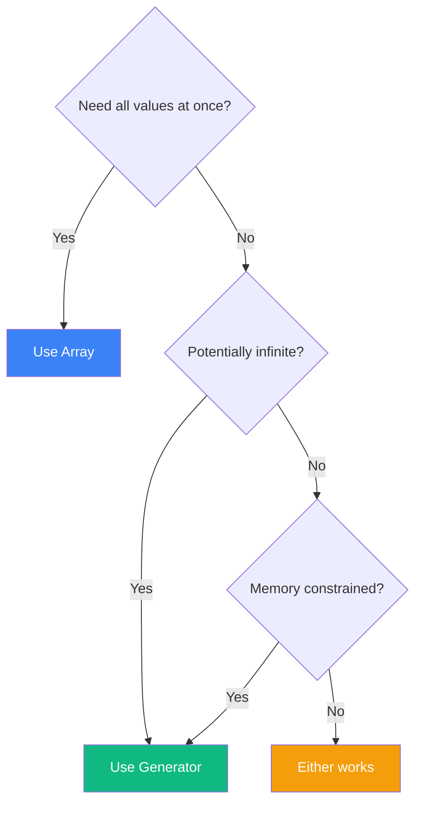

Have you ever wondered how `for...of` loops work? Or why you can spread arrays but not plain objects? The answer lies in JavaScript's iteration protocol—a powerful mechanism that enables consistent iteration across different data structures. Let's explore iterators and generators to understand this fundamental concept.

## The Iteration Protocol

JavaScript defines two protocols that make objects iterable:

1. **Iterable Protocol**: An object is iterable if it has a `[Symbol.iterator]` method that returns an iterator
2. **Iterator Protocol**: An iterator is an object with a `next()` method that returns `{ value, done }`



```javascript
// Arrays are iterable
const arr = [1, 2, 3];
const iterator = arr[Symbol.iterator]();

console.log(iterator.next()); // { value: 1, done: false }
console.log(iterator.next()); // { value: 2, done: false }
console.log(iterator.next()); // { value: 3, done: false }
console.log(iterator.next()); // { value: undefined, done: true }
```

## Built-in Iterables

JavaScript has several built-in iterable objects:

```javascript
// Arrays
for (const item of [1, 2, 3]) {
  console.log(item);
}

// Strings
for (const char of "Hello") {
  console.log(char);
}

// Maps
const map = new Map([["a", 1], ["b", 2]]);
for (const [key, value] of map) {
  console.log(key, value);
}

// Sets
const set = new Set([1, 2, 3]);
for (const item of set) {
  console.log(item);
}

// Arguments object
function example() {
  for (const arg of arguments) {
    console.log(arg);
  }
}
```

## Creating Custom Iterables

You can make any object iterable by implementing the iteration protocol:

```javascript
const range = {
  start: 1,
  end: 5,

  [Symbol.iterator]() {
    let current = this.start;
    const end = this.end;

    return {
      next() {
        if (current <= end) {
          return { value: current++, done: false };
        }
        return { value: undefined, done: true };
      }
    };
  }
};

for (const num of range) {
  console.log(num); // 1, 2, 3, 4, 5
}

// Also works with spread
console.log([...range]); // [1, 2, 3, 4, 5]
```

### Making a Class Iterable

```javascript
class Playlist {
  constructor() {
    this.songs = [];
  }

  add(song) {
    this.songs.push(song);
    return this;
  }

  [Symbol.iterator]() {
    let index = 0;
    const songs = this.songs;

    return {
      next() {
        if (index < songs.length) {
          return { value: songs[index++], done: false };
        }
        return { done: true };
      }
    };
  }
}

const playlist = new Playlist()
  .add("Song A")
  .add("Song B")
  .add("Song C");

for (const song of playlist) {
  console.log(`Now playing: ${song}`);
}
```

## Generator Functions

Generator functions provide an easier way to create iterators. They use the `function*` syntax and `yield` keyword:



```javascript
function* numberGenerator() {
  yield 1;
  yield 2;
  yield 3;
}

const gen = numberGenerator();
console.log(gen.next()); // { value: 1, done: false }
console.log(gen.next()); // { value: 2, done: false }
console.log(gen.next()); // { value: 3, done: false }
console.log(gen.next()); // { value: undefined, done: true }

// Generators are iterable
for (const num of numberGenerator()) {
  console.log(num); // 1, 2, 3
}
```

### Simplified Range with Generator

The range example becomes much simpler with a generator:

```javascript
function* range(start, end) {
  for (let i = start; i <= end; i++) {
    yield i;
  }
}

console.log([...range(1, 5)]); // [1, 2, 3, 4, 5]

for (const num of range(10, 15)) {
  console.log(num); // 10, 11, 12, 13, 14, 15
}
```

## Lazy Evaluation

One of the most powerful features of generators is lazy evaluation—values are computed only when needed:

```javascript
function* infiniteSequence() {
  let n = 0;
  while (true) {
    yield n++;
  }
}

// This doesn't hang! Values are generated on demand
const infinite = infiniteSequence();
console.log(infinite.next().value); // 0
console.log(infinite.next().value); // 1
console.log(infinite.next().value); // 2

// Take first 5 values
function* take(iterable, count) {
  let i = 0;
  for (const item of iterable) {
    if (i >= count) return;
    yield item;
    i++;
  }
}

console.log([...take(infiniteSequence(), 5)]); // [0, 1, 2, 3, 4]
```

### Fibonacci Sequence

```javascript
function* fibonacci() {
  let [prev, curr] = [0, 1];
  while (true) {
    yield curr;
    [prev, curr] = [curr, prev + curr];
  }
}

// Get first 10 Fibonacci numbers
const fib = fibonacci();
const first10 = [];
for (let i = 0; i < 10; i++) {
  first10.push(fib.next().value);
}
console.log(first10); // [1, 1, 2, 3, 5, 8, 13, 21, 34, 55]
```

## yield* for Delegation

The `yield*` expression delegates to another iterable or generator:

```javascript
function* inner() {
  yield 2;
  yield 3;
}

function* outer() {
  yield 1;
  yield* inner(); // Delegate to inner generator
  yield 4;
}

console.log([...outer()]); // [1, 2, 3, 4]

// Flatten nested arrays
function* flatten(arr) {
  for (const item of arr) {
    if (Array.isArray(item)) {
      yield* flatten(item); // Recursive delegation
    } else {
      yield item;
    }
  }
}

const nested = [1, [2, [3, 4]], 5];
console.log([...flatten(nested)]); // [1, 2, 3, 4, 5]
```

## Two-Way Communication

Generators can receive values through `next()`:

```javascript
function* conversation() {
  const name = yield "What is your name?";
  const hobby = yield `Hello, ${name}! What's your hobby?`;
  yield `${hobby} sounds fun, ${name}!`;
}

const talk = conversation();
console.log(talk.next().value);        // "What is your name?"
console.log(talk.next("Alice").value); // "Hello, Alice! What's your hobby?"
console.log(talk.next("coding").value);// "coding sounds fun, Alice!"
```

## Practical Use Cases

### Paginated API Data

```javascript
async function* fetchPages(baseUrl) {
  let page = 1;
  let hasMore = true;

  while (hasMore) {
    const response = await fetch(`${baseUrl}?page=${page}`);
    const data = await response.json();

    yield data.items;

    hasMore = data.hasNextPage;
    page++;
  }
}

// Usage
async function processAllPages() {
  for await (const items of fetchPages("/api/products")) {
    for (const item of items) {
      console.log(item);
    }
  }
}
```

### Tree Traversal

```javascript
function* traverseTree(node) {
  yield node.value;

  if (node.children) {
    for (const child of node.children) {
      yield* traverseTree(child);
    }
  }
}

const tree = {
  value: 1,
  children: [
    { value: 2, children: [{ value: 4 }, { value: 5 }] },
    { value: 3, children: [{ value: 6 }] }
  ]
};

console.log([...traverseTree(tree)]); // [1, 2, 4, 5, 3, 6]
```

### ID Generator

```javascript
function* idGenerator(prefix = "id") {
  let id = 1;
  while (true) {
    yield `${prefix}-${id++}`;
  }
}

const userIdGen = idGenerator("user");
const orderIdGen = idGenerator("order");

console.log(userIdGen.next().value);  // "user-1"
console.log(userIdGen.next().value);  // "user-2"
console.log(orderIdGen.next().value); // "order-1"
```

## Iterables vs Arrays



| Feature | Array | Iterator/Generator |
|---------|-------|-------------------|
| Memory | Stores all values | Values on demand |
| Infinite sequences | Not possible | Possible |
| Multiple iterations | Yes | Single pass only |
| Random access | Yes (`arr[i]`) | No |

## Summary

- The **iteration protocol** consists of iterables (with `[Symbol.iterator]`) and iterators (with `next()`)
- Built-in iterables include arrays, strings, Maps, Sets, and more
- Create **custom iterables** by implementing `[Symbol.iterator]()`
- **Generator functions** (`function*`) provide an easier way to create iterators
- `yield` pauses execution and produces a value
- `yield*` delegates to another iterable
- Generators enable **lazy evaluation** and can handle infinite sequences
- Use **`for await...of`** for async iteration

Understanding iterators and generators unlocks powerful patterns for working with sequences of data, from simple transformations to complex async data streams.

## References

- Flanagan, David. *JavaScript: The Definitive Guide*, 7th Edition. O'Reilly Media, 2020.
- Haverbeke, Marijn. *Eloquent JavaScript*, 4th Edition. No Starch Press, 2024.
