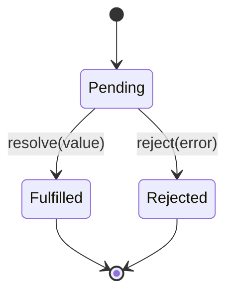
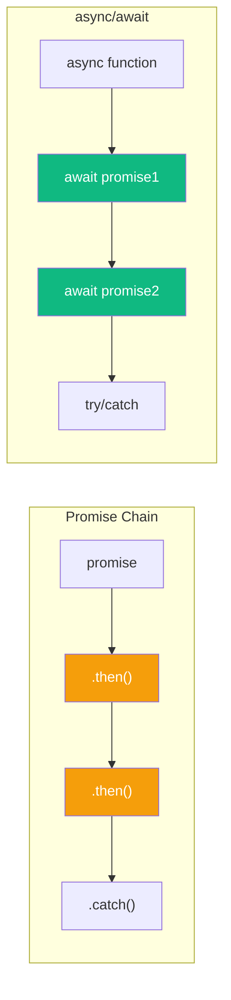

JavaScript offers two ways to handle asynchronous operations: Promises with `.then()` chains and the more modern `async/await` syntax. While `async/await` is built on top of Promises, they have different ergonomics and use cases. Let's explore both approaches and learn when to use each.

## A Quick Recap: What Are Promises?

A Promise represents a value that may not be available yet. It can be in one of three states:



```javascript
const promise = new Promise((resolve, reject) => {
  // Async operation
  setTimeout(() => {
    const success = true;
    if (success) {
      resolve("Data loaded");
    } else {
      reject(new Error("Failed to load"));
    }
  }, 1000);
});
```

## Promise Chains vs async/await

Let's compare both approaches with the same task: fetching user data and their posts.

### Promise Chain Approach

```javascript
function getUserWithPosts(userId) {
  return fetch(`/api/users/${userId}`)
    .then(response => response.json())
    .then(user => {
      return fetch(`/api/users/${userId}/posts`)
        .then(response => response.json())
        .then(posts => ({ user, posts }));
    });
}

getUserWithPosts(1)
  .then(({ user, posts }) => {
    console.log(user, posts);
  })
  .catch(error => {
    console.error(error);
  });
```

### async/await Approach

```javascript
async function getUserWithPosts(userId) {
  const userResponse = await fetch(`/api/users/${userId}`);
  const user = await userResponse.json();

  const postsResponse = await fetch(`/api/users/${userId}/posts`);
  const posts = await postsResponse.json();

  return { user, posts };
}

try {
  const { user, posts } = await getUserWithPosts(1);
  console.log(user, posts);
} catch (error) {
  console.error(error);
}
```

The `async/await` version reads like synchronous code, making it easier to understand the flow.

## Syntax Comparison



| Feature | Promise Chain | async/await |
|---------|--------------|-------------|
| Syntax | `.then()`, `.catch()` | `await`, `try/catch` |
| Readability | Nested for sequential ops | Linear, synchronous-looking |
| Error handling | `.catch()` or second `.then()` arg | `try/catch` blocks |
| Debugging | Harder to step through | Easier, like sync code |

## Error Handling

### Promise: .catch() Method

```javascript
fetchUser(1)
  .then(user => fetchPosts(user.id))
  .then(posts => console.log(posts))
  .catch(error => {
    // Catches any error in the chain
    console.error("Error:", error.message);
  });
```

### async/await: try/catch

```javascript
async function loadUserPosts() {
  try {
    const user = await fetchUser(1);
    const posts = await fetchPosts(user.id);
    console.log(posts);
  } catch (error) {
    // Same error handling pattern as sync code
    console.error("Error:", error.message);
  }
}
```

### Handling Specific Errors

```javascript
async function loadData() {
  try {
    const user = await fetchUser(1);

    try {
      const posts = await fetchPosts(user.id);
      return { user, posts };
    } catch (postsError) {
      // Handle posts error specifically
      return { user, posts: [] };
    }
  } catch (userError) {
    // Handle user error
    throw new Error("Could not load user");
  }
}
```

## Parallel Execution

One common mistake with `async/await` is running operations sequentially when they could run in parallel.

### Sequential (Slower)

```javascript
async function loadAll() {
  const users = await fetchUsers();    // Wait...
  const posts = await fetchPosts();    // Wait...
  const comments = await fetchComments(); // Wait...
  return { users, posts, comments };
}
// Total time: users + posts + comments
```

### Parallel with Promise.all (Faster)

```javascript
async function loadAll() {
  const [users, posts, comments] = await Promise.all([
    fetchUsers(),
    fetchPosts(),
    fetchComments()
  ]);
  return { users, posts, comments };
}
// Total time: max(users, posts, comments)
```



```mermaid
gantt
    title Execution Time Comparison
    dateFormat X
    axisFormat %s

    section Sequential
    fetchUsers    :0, 3
    fetchPosts    :3, 5
    fetchComments :5, 7

    section Parallel
    fetchUsers    :0, 3
    fetchPosts    :0, 2
    fetchComments :0, 2
```

## Promise Combinators

JavaScript provides several methods to handle multiple promises:

### Promise.all - All must succeed

```javascript
const results = await Promise.all([
  fetchUser(1),
  fetchUser(2),
  fetchUser(3)
]);
// Returns array of results
// Rejects if ANY promise rejects
```

### Promise.allSettled - Get all results

```javascript
const results = await Promise.allSettled([
  fetchUser(1),
  fetchUser(2), // This one fails
  fetchUser(3)
]);
// Returns array of { status, value/reason }
// Never rejects
// [
//   { status: "fulfilled", value: user1 },
//   { status: "rejected", reason: Error },
//   { status: "fulfilled", value: user3 }
// ]
```

### Promise.race - First to complete

```javascript
const result = await Promise.race([
  fetchFromServer1(),
  fetchFromServer2()
]);
// Returns first resolved/rejected result
```

### Promise.any - First success

```javascript
const result = await Promise.any([
  fetchFromServer1(), // Fails
  fetchFromServer2(), // Succeeds first
  fetchFromServer3()
]);
// Returns first fulfilled result
// Only rejects if ALL promises reject
```

## When to Use Which

### Use async/await When:

- Sequential operations that depend on each other
- Complex control flow (conditions, loops)
- Cleaner error handling with try/catch
- Easier debugging is needed

```javascript
async function processItems(items) {
  const results = [];

  for (const item of items) {
    if (item.needsProcessing) {
      const result = await processItem(item);
      results.push(result);
    }
  }

  return results;
}
```

### Use Promise Chains When:

- Simple transformations
- Functional programming style
- Building reusable promise pipelines

```javascript
function processUser(userId) {
  return fetchUser(userId)
    .then(user => enrichUserData(user))
    .then(user => validateUser(user))
    .then(user => saveUser(user));
}
```

### Mix Both When Appropriate

```javascript
async function complexOperation() {
  // Use await for clarity
  const user = await fetchUser(1);

  // Use Promise.all for parallel operations
  const [posts, followers] = await Promise.all([
    fetchPosts(user.id),
    fetchFollowers(user.id)
  ]);

  // Chain for simple transformations
  const enrichedPosts = await Promise.all(
    posts.map(post =>
      fetchComments(post.id)
        .then(comments => ({ ...post, comments }))
    )
  );

  return { user, posts: enrichedPosts, followers };
}
```

## Common Patterns

### Retry with Exponential Backoff

```javascript
async function fetchWithRetry(url, maxRetries = 3) {
  for (let i = 0; i < maxRetries; i++) {
    try {
      return await fetch(url);
    } catch (error) {
      if (i === maxRetries - 1) throw error;
      await new Promise(r => setTimeout(r, 2 ** i * 1000));
    }
  }
}
```

### Timeout Wrapper

```javascript
function withTimeout(promise, ms) {
  const timeout = new Promise((_, reject) =>
    setTimeout(() => reject(new Error("Timeout")), ms)
  );
  return Promise.race([promise, timeout]);
}

// Usage
const data = await withTimeout(fetchData(), 5000);
```

### Sequential Processing with Results

```javascript
async function processSequentially(items, processor) {
  const results = [];
  for (const item of items) {
    results.push(await processor(item));
  }
  return results;
}

// Or with reduce for a more functional style
function processSequentially(items, processor) {
  return items.reduce(
    (promise, item) =>
      promise.then(results =>
        processor(item).then(result => [...results, result])
      ),
    Promise.resolve([])
  );
}
```

## Summary

| Aspect | Promise Chains | async/await |
|--------|---------------|-------------|
| Readability | Moderate | High |
| Error handling | `.catch()` | `try/catch` |
| Debugging | Harder | Easier |
| Parallel ops | `Promise.all()` | `Promise.all()` + await |
| Sequential ops | Nested `.then()` | Linear code |
| Best for | Simple chains, FP style | Complex flows |

Both approaches are valid and often work best together. Use `async/await` for most cases due to its readability, but don't hesitate to use Promise methods like `Promise.all()` when you need parallel execution or specific combinator behavior.

## References

- Flanagan, David. *JavaScript: The Definitive Guide*, 7th Edition. O'Reilly Media, 2020.
- Osmani, Addy. *Learning JavaScript Design Patterns*, 2nd Edition. O'Reilly Media, 2023.
