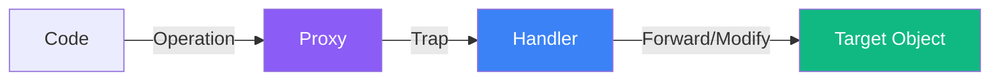
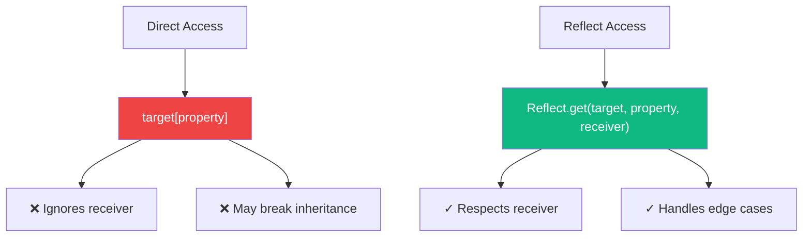

JavaScript's Proxy is a powerful metaprogramming feature that allows you to intercept and customize operations on objects. With Proxy, you can create objects that behave in unexpected ways, implement validation, logging, and even build reactive systems. Let's explore how Proxy works and its practical applications.

## What Is a Proxy?

A Proxy wraps an object (called the "target") and intercepts operations like property access, assignment, and function calls through "traps" defined in a handler object.



```javascript
const target = {
  message: "Hello, World!"
};

const handler = {
  get(target, property) {
    console.log(`Accessing property: ${property}`);
    return target[property];
  }
};

const proxy = new Proxy(target, handler);

console.log(proxy.message);
// Logs: "Accessing property: message"
// Returns: "Hello, World!"
```

## Common Traps

The handler object can define various traps to intercept different operations:

| Trap | Intercepts |
|------|------------|
| `get` | Property read (`obj.prop`) |
| `set` | Property write (`obj.prop = value`) |
| `has` | `in` operator |
| `deleteProperty` | `delete` operator |
| `apply` | Function call |
| `construct` | `new` operator |
| `ownKeys` | `Object.keys()`, `for...in` |
| `getOwnPropertyDescriptor` | `Object.getOwnPropertyDescriptor()` |

## The get and set Traps

The most commonly used traps are `get` and `set`:

```javascript
const user = {
  firstName: "John",
  lastName: "Doe",
  age: 30
};

const handler = {
  get(target, property) {
    if (property === "fullName") {
      return `${target.firstName} ${target.lastName}`;
    }
    return property in target ? target[property] : `Property "${property}" not found`;
  },

  set(target, property, value) {
    if (property === "age" && typeof value !== "number") {
      throw new TypeError("Age must be a number");
    }
    if (property === "age" && value < 0) {
      throw new RangeError("Age cannot be negative");
    }
    target[property] = value;
    return true; // Indicates success
  }
};

const proxyUser = new Proxy(user, handler);

console.log(proxyUser.fullName);     // "John Doe" (computed property)
console.log(proxyUser.unknown);       // "Property "unknown" not found"

proxyUser.age = 31;                   // OK
proxyUser.age = -5;                   // RangeError: Age cannot be negative
proxyUser.age = "thirty";             // TypeError: Age must be a number
```

## Practical Use Cases

### 1. Validation

Create objects that automatically validate data:

```javascript
function createValidator(schema) {
  return {
    set(target, property, value) {
      if (property in schema) {
        const validator = schema[property];
        if (!validator(value)) {
          throw new Error(`Invalid value for ${property}`);
        }
      }
      target[property] = value;
      return true;
    }
  };
}

const userSchema = {
  email: (v) => /^[^\s@]+@[^\s@]+\.[^\s@]+$/.test(v),
  age: (v) => typeof v === "number" && v >= 0 && v <= 150,
  name: (v) => typeof v === "string" && v.length > 0
};

const user = new Proxy({}, createValidator(userSchema));

user.name = "Alice";                  // OK
user.email = "alice@example.com";     // OK
user.age = 25;                        // OK

user.email = "invalid-email";         // Error: Invalid value for email
user.age = -5;                        // Error: Invalid value for age
```

### 2. Logging and Debugging

Track all operations on an object:

```javascript
function createLoggingProxy(target, name = "Object") {
  return new Proxy(target, {
    get(target, property) {
      console.log(`[GET] ${name}.${String(property)}`);
      return target[property];
    },
    set(target, property, value) {
      console.log(`[SET] ${name}.${String(property)} = ${JSON.stringify(value)}`);
      target[property] = value;
      return true;
    },
    deleteProperty(target, property) {
      console.log(`[DELETE] ${name}.${String(property)}`);
      delete target[property];
      return true;
    }
  });
}

const config = createLoggingProxy({ debug: false }, "config");

config.debug = true;      // [SET] config.debug = true
console.log(config.debug); // [GET] config.debug
delete config.debug;       // [DELETE] config.debug
```

### 3. Default Values

Provide default values for missing properties:

```javascript
function withDefaults(target, defaults) {
  return new Proxy(target, {
    get(target, property) {
      if (property in target) {
        return target[property];
      }
      return defaults[property];
    }
  });
}

const settings = withDefaults(
  { theme: "dark" },
  { theme: "light", language: "en", fontSize: 14 }
);

console.log(settings.theme);    // "dark" (from target)
console.log(settings.language); // "en" (from defaults)
console.log(settings.fontSize); // 14 (from defaults)
```

### 4. Negative Array Indices

Enable Python-style negative indexing:

```javascript
function createNegativeArray(array) {
  return new Proxy(array, {
    get(target, property) {
      const index = Number(property);
      if (!isNaN(index) && index < 0) {
        return target[target.length + index];
      }
      return target[property];
    },
    set(target, property, value) {
      const index = Number(property);
      if (!isNaN(index) && index < 0) {
        target[target.length + index] = value;
      } else {
        target[property] = value;
      }
      return true;
    }
  });
}

const arr = createNegativeArray([1, 2, 3, 4, 5]);

console.log(arr[-1]); // 5 (last element)
console.log(arr[-2]); // 4 (second to last)

arr[-1] = 10;
console.log(arr); // [1, 2, 3, 4, 10]
```

### 5. Observable Objects (Reactive Programming)

Create objects that notify when changes occur:

```javascript
function createObservable(target, callback) {
  return new Proxy(target, {
    set(target, property, value) {
      const oldValue = target[property];
      target[property] = value;
      callback(property, value, oldValue);
      return true;
    }
  });
}

const state = createObservable(
  { count: 0, name: "App" },
  (property, newValue, oldValue) => {
    console.log(`${property} changed from ${oldValue} to ${newValue}`);
  }
);

state.count = 1;    // "count changed from 0 to 1"
state.name = "New"; // "name changed from App to New"
```

## The Reflect API

The Reflect API provides methods that correspond to Proxy traps. Using Reflect ensures proper default behavior:

```javascript
const handler = {
  get(target, property, receiver) {
    console.log(`Getting ${String(property)}`);
    // Use Reflect for proper default behavior
    return Reflect.get(target, property, receiver);
  },

  set(target, property, value, receiver) {
    console.log(`Setting ${String(property)} to ${value}`);
    // Returns true/false indicating success
    return Reflect.set(target, property, value, receiver);
  }
};

const obj = new Proxy({ x: 1 }, handler);
obj.x = 2; // Properly handles getters/setters and inheritance
```

### Why Use Reflect?



```javascript
const parent = {
  get value() {
    return this._value * 2;
  }
};

const child = Object.create(parent);
child._value = 5;

const proxy = new Proxy(child, {
  get(target, property, receiver) {
    // Without Reflect, 'this' in getter would be wrong
    return Reflect.get(target, property, receiver);
  }
});

console.log(proxy.value); // 10 (correctly uses proxy as 'this')
```

## Revocable Proxies

Create proxies that can be disabled:

```javascript
const { proxy, revoke } = Proxy.revocable(
  { secret: "password123" },
  {
    get(target, property) {
      return target[property];
    }
  }
);

console.log(proxy.secret); // "password123"

revoke(); // Disable the proxy

console.log(proxy.secret); // TypeError: Cannot perform 'get' on a proxy that has been revoked
```

This is useful for temporary access patterns or security-sensitive scenarios.

## Performance Considerations

Proxies add overhead to object operations. For performance-critical code:

```javascript
// Slower: Proxy on frequently accessed object
const proxyData = new Proxy(data, handler);
for (let i = 0; i < 1000000; i++) {
  proxyData.value; // Trap called each time
}

// Faster: Access target directly when possible
const value = proxyData.value; // Get once
for (let i = 0; i < 1000000; i++) {
  // Use cached value
}
```

## Summary

- **Proxy** wraps objects to intercept and customize operations
- **Traps** are handler methods that intercept specific operations
- Common traps: `get`, `set`, `has`, `deleteProperty`, `apply`
- Use cases include **validation**, **logging**, **default values**, and **reactive programming**
- **Reflect** API provides default trap behavior
- **Revocable proxies** can be disabled when needed
- Consider **performance** when using Proxy in hot paths

Proxy is a powerful metaprogramming tool that enables patterns impossible with regular JavaScript objects. While it comes with some performance overhead, its flexibility makes it invaluable for building frameworks, validation systems, and reactive architectures.

## References

- Flanagan, David. *JavaScript: The Definitive Guide*, 7th Edition. O'Reilly Media, 2020.
- [MDN Web Docs: Proxy](https://developer.mozilla.org/en-US/docs/Web/JavaScript/Reference/Global_Objects/Proxy)
