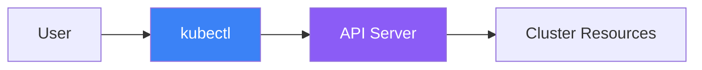

kubectl is the command-line interface for interacting with Kubernetes clusters. This article covers essential commands and techniques for effective cluster management.

## What is kubectl?

kubectl (pronounced "cube-control" or "cube-c-t-l") is the official CLI tool for Kubernetes. It communicates with the Kubernetes API server to manage cluster resources.



## Configuration and Context

### kubeconfig File

kubectl uses a configuration file (usually `~/.kube/config`) to store cluster connection information.

```yaml
# ~/.kube/config structure
apiVersion: v1
kind: Config
clusters:
  - name: production
    cluster:
      server: https://prod-cluster.example.com
      certificate-authority: /path/to/ca.crt
  - name: development
    cluster:
      server: https://dev-cluster.example.com
contexts:
  - name: prod-context
    context:
      cluster: production
      user: admin
      namespace: default
  - name: dev-context
    context:
      cluster: development
      user: developer
current-context: dev-context
users:
  - name: admin
    user:
      client-certificate: /path/to/cert.crt
      client-key: /path/to/key.key
```

### Context Commands

```bash
# View current context
kubectl config current-context

# List all contexts
kubectl config get-contexts

# Switch context
kubectl config use-context prod-context

# Set default namespace for context
kubectl config set-context --current --namespace=my-namespace

# View entire config
kubectl config view
```

## Basic Resource Commands

### Viewing Resources

```bash
# Get resources (pods, services, deployments, etc.)
kubectl get pods
kubectl get services
kubectl get deployments
kubectl get all

# Get resources in all namespaces
kubectl get pods --all-namespaces
kubectl get pods -A  # Short form

# Get resources with more details
kubectl get pods -o wide

# Get resources in different output formats
kubectl get pods -o yaml
kubectl get pods -o json
kubectl get pods -o name

# Custom columns output
kubectl get pods -o custom-columns=NAME:.metadata.name,STATUS:.status.phase

# Watch resources in real-time
kubectl get pods -w
kubectl get pods --watch
```

### Describing Resources

```bash
# Get detailed information about a resource
kubectl describe pod my-pod
kubectl describe deployment my-deployment
kubectl describe node my-node

# Describe multiple resources
kubectl describe pods
```

### Creating Resources

```bash
# Create from YAML file
kubectl apply -f deployment.yaml
kubectl create -f deployment.yaml

# Create from URL
kubectl apply -f https://example.com/deployment.yaml

# Create from multiple files
kubectl apply -f ./manifests/

# Create from stdin
cat <<EOF | kubectl apply -f -
apiVersion: v1
kind: Pod
metadata:
  name: nginx
spec:
  containers:
  - name: nginx
    image: nginx
EOF

# Imperative creation
kubectl create deployment nginx --image=nginx
kubectl create service clusterip nginx --tcp=80:80
kubectl create configmap my-config --from-literal=key=value
kubectl create secret generic my-secret --from-literal=password=secret
```

### Updating Resources

```bash
# Apply changes from file
kubectl apply -f deployment.yaml

# Edit resource directly
kubectl edit deployment my-deployment

# Update image
kubectl set image deployment/my-deployment container=nginx:1.25

# Scale deployment
kubectl scale deployment my-deployment --replicas=5

# Patch resource
kubectl patch deployment my-deployment -p '{"spec":{"replicas":3}}'

# Replace resource (delete and recreate)
kubectl replace -f deployment.yaml
```

### Deleting Resources

```bash
# Delete by name
kubectl delete pod my-pod
kubectl delete deployment my-deployment

# Delete from file
kubectl delete -f deployment.yaml

# Delete all pods in namespace
kubectl delete pods --all

# Delete with label selector
kubectl delete pods -l app=nginx

# Force delete (skip graceful termination)
kubectl delete pod my-pod --force --grace-period=0
```

## Labels and Selectors

### Working with Labels

```bash
# Show labels
kubectl get pods --show-labels

# Add label
kubectl label pod my-pod environment=production

# Update label (overwrite)
kubectl label pod my-pod environment=staging --overwrite

# Remove label
kubectl label pod my-pod environment-

# Filter by label
kubectl get pods -l app=nginx
kubectl get pods -l 'app in (nginx, apache)'
kubectl get pods -l app!=nginx
kubectl get pods -l 'environment,tier=frontend'
```

### Annotations

```bash
# Add annotation
kubectl annotate pod my-pod description="My application"

# Remove annotation
kubectl annotate pod my-pod description-

# View annotations
kubectl get pod my-pod -o jsonpath='{.metadata.annotations}'
```

## Debugging Commands

### Logs

```bash
# View pod logs
kubectl logs my-pod

# Follow logs in real-time
kubectl logs -f my-pod

# View logs from specific container
kubectl logs my-pod -c my-container

# View previous container logs (after restart)
kubectl logs my-pod --previous

# View last N lines
kubectl logs my-pod --tail=100

# View logs since time
kubectl logs my-pod --since=1h
kubectl logs my-pod --since-time=2025-01-18T10:00:00Z

# View logs from all pods with label
kubectl logs -l app=nginx --all-containers
```

### Executing Commands

```bash
# Execute command in container
kubectl exec my-pod -- ls /app

# Interactive shell
kubectl exec -it my-pod -- /bin/bash
kubectl exec -it my-pod -- /bin/sh

# Execute in specific container
kubectl exec -it my-pod -c my-container -- /bin/bash

# Run one-off command
kubectl run debug --image=busybox --rm -it -- /bin/sh
```

### Port Forwarding

```bash
# Forward local port to pod
kubectl port-forward my-pod 8080:80

# Forward to service
kubectl port-forward svc/my-service 8080:80

# Forward to deployment
kubectl port-forward deployment/my-deployment 8080:80

# Listen on all interfaces
kubectl port-forward --address 0.0.0.0 my-pod 8080:80
```

### Copying Files

```bash
# Copy from pod to local
kubectl cp my-pod:/app/logs/app.log ./app.log

# Copy from local to pod
kubectl cp ./config.yaml my-pod:/app/config.yaml

# Copy with specific container
kubectl cp my-pod:/app/data ./data -c my-container
```

## Resource Management

### Resource Usage

```bash
# View node resource usage
kubectl top nodes

# View pod resource usage
kubectl top pods
kubectl top pods --all-namespaces
kubectl top pods --containers

# Sort by CPU or memory
kubectl top pods --sort-by=cpu
kubectl top pods --sort-by=memory
```

### Dry Run and Diff

```bash
# Preview changes without applying
kubectl apply -f deployment.yaml --dry-run=client
kubectl apply -f deployment.yaml --dry-run=server

# Generate YAML without creating
kubectl create deployment nginx --image=nginx --dry-run=client -o yaml

# Show diff before applying
kubectl diff -f deployment.yaml
```

## Useful Shortcuts and Tips

### Command Aliases

```bash
# Add to ~/.bashrc or ~/.zshrc
alias k='kubectl'
alias kgp='kubectl get pods'
alias kgs='kubectl get services'
alias kgd='kubectl get deployments'
alias kga='kubectl get all'
alias kd='kubectl describe'
alias kl='kubectl logs'
alias ke='kubectl exec -it'
alias ka='kubectl apply -f'
alias kdel='kubectl delete'
```

### Shell Autocompletion

```bash
# Bash
source <(kubectl completion bash)
echo 'source <(kubectl completion bash)' >> ~/.bashrc

# Zsh
source <(kubectl completion zsh)
echo 'source <(kubectl completion zsh)' >> ~/.zshrc

# With alias
complete -o default -F __start_kubectl k
```

### JSONPath Queries

```bash
# Get specific field
kubectl get pod my-pod -o jsonpath='{.status.phase}'

# Get multiple fields
kubectl get pods -o jsonpath='{range .items[*]}{.metadata.name}{"\t"}{.status.phase}{"\n"}{end}'

# Get container images
kubectl get pods -o jsonpath='{.items[*].spec.containers[*].image}'

# Get node IPs
kubectl get nodes -o jsonpath='{.items[*].status.addresses[?(@.type=="InternalIP")].address}'
```

## Common Command Reference

| Command | Description |
|---------|-------------|
| `kubectl get` | List resources |
| `kubectl describe` | Show detailed resource info |
| `kubectl create` | Create resource imperatively |
| `kubectl apply` | Apply configuration declaratively |
| `kubectl delete` | Delete resources |
| `kubectl edit` | Edit resource in editor |
| `kubectl exec` | Execute command in container |
| `kubectl logs` | View container logs |
| `kubectl port-forward` | Forward port to pod |
| `kubectl cp` | Copy files to/from pod |
| `kubectl top` | Show resource usage |
| `kubectl scale` | Scale deployment |
| `kubectl rollout` | Manage rollouts |

## Key Takeaways

1. **Master the basics** - get, describe, apply, delete are your core commands
2. **Use contexts** - Easily switch between clusters and namespaces
3. **Label everything** - Labels make filtering and selection powerful
4. **Learn JSONPath** - Extract specific data from resources
5. **Set up aliases** - Save time with command shortcuts
6. **Use dry-run** - Preview changes before applying

## Next Steps

In the next article, we'll dive deep into Pods - the fundamental building block of Kubernetes.

## References

- The Kubernetes Book, 3rd Edition - Nigel Poulton
- Kubernetes: Up and Running, 3rd Edition - Burns, Beda, Hightower
- [kubectl Cheat Sheet](https://kubernetes.io/docs/reference/kubectl/cheatsheet/)
