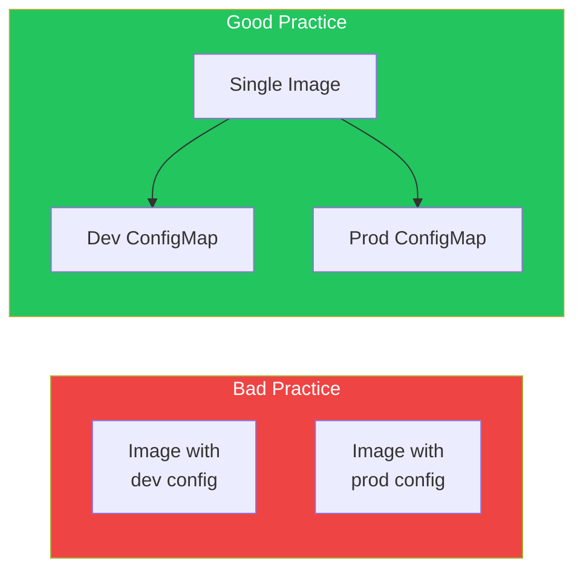

ConfigMaps and Secrets allow you to decouple configuration from container images, making applications more portable and easier to manage. This article covers creating, using, and managing configuration in Kubernetes.

## Why Externalize Configuration?

Hardcoding configuration in images creates problems:
- Rebuilding images for config changes
- Same image can't work in different environments
- Secrets exposed in image layers



## ConfigMaps

ConfigMaps store non-confidential configuration data as key-value pairs.

### Creating ConfigMaps

#### From Literal Values

```bash
kubectl create configmap app-config \
  --from-literal=DATABASE_HOST=postgres \
  --from-literal=DATABASE_PORT=5432 \
  --from-literal=LOG_LEVEL=info
```

#### From File

```bash
# Create config file
cat > app.properties << EOF
database.host=postgres
database.port=5432
log.level=info
EOF

# Create ConfigMap from file
kubectl create configmap app-config --from-file=app.properties

# Create with custom key name
kubectl create configmap app-config --from-file=config.properties=app.properties
```

#### From Directory

```bash
kubectl create configmap app-config --from-file=./config/
```

#### From YAML

```yaml
apiVersion: v1
kind: ConfigMap
metadata:
  name: app-config
data:
  # Simple key-value pairs
  DATABASE_HOST: postgres
  DATABASE_PORT: "5432"
  LOG_LEVEL: info

  # Multi-line configuration file
  app.properties: |
    database.host=postgres
    database.port=5432
    log.level=info

  # JSON configuration
  config.json: |
    {
      "database": {
        "host": "postgres",
        "port": 5432
      },
      "logging": {
        "level": "info"
      }
    }
```

### Using ConfigMaps

#### As Environment Variables

```yaml
apiVersion: v1
kind: Pod
metadata:
  name: app
spec:
  containers:
    - name: app
      image: myapp:1.0
      env:
        # Single key
        - name: DB_HOST
          valueFrom:
            configMapKeyRef:
              name: app-config
              key: DATABASE_HOST

        # All keys as env vars
      envFrom:
        - configMapRef:
            name: app-config
          prefix: CONFIG_  # Optional prefix
```

#### As Volume Mount

```yaml
apiVersion: v1
kind: Pod
metadata:
  name: app
spec:
  containers:
    - name: app
      image: myapp:1.0
      volumeMounts:
        - name: config-volume
          mountPath: /etc/config
          readOnly: true
  volumes:
    - name: config-volume
      configMap:
        name: app-config
        # Optional: select specific keys
        items:
          - key: app.properties
            path: application.properties
          - key: config.json
            path: config.json
```

#### Mount Specific Files

```yaml
volumes:
  - name: config-volume
    configMap:
      name: app-config
      items:
        - key: app.properties
          path: app.properties
          mode: 0644  # File permissions
```

## Secrets

Secrets store sensitive data like passwords, tokens, and certificates.

### Secret Types

| Type | Description |
|------|-------------|
| `Opaque` | Default, arbitrary data |
| `kubernetes.io/tls` | TLS certificates |
| `kubernetes.io/dockerconfigjson` | Docker registry credentials |
| `kubernetes.io/basic-auth` | Basic authentication |
| `kubernetes.io/ssh-auth` | SSH credentials |
| `kubernetes.io/service-account-token` | Service account token |

### Creating Secrets

#### From Literal Values

```bash
kubectl create secret generic db-credentials \
  --from-literal=username=admin \
  --from-literal=password=secretpassword
```

#### From File

```bash
# Create files with sensitive data
echo -n 'admin' > username.txt
echo -n 'secretpassword' > password.txt

kubectl create secret generic db-credentials \
  --from-file=username=username.txt \
  --from-file=password=password.txt

# Clean up
rm username.txt password.txt
```

#### From YAML (Base64 Encoded)

```yaml
apiVersion: v1
kind: Secret
metadata:
  name: db-credentials
type: Opaque
data:
  # Base64 encoded values
  username: YWRtaW4=        # echo -n 'admin' | base64
  password: c2VjcmV0cGFzcw==  # echo -n 'secretpass' | base64
```

#### Using stringData (Auto-Encoded)

```yaml
apiVersion: v1
kind: Secret
metadata:
  name: db-credentials
type: Opaque
stringData:
  # Plain text values (auto-encoded)
  username: admin
  password: secretpassword
```

### TLS Secrets

```bash
# Create TLS secret
kubectl create secret tls my-tls-secret \
  --cert=tls.crt \
  --key=tls.key
```

```yaml
apiVersion: v1
kind: Secret
metadata:
  name: my-tls-secret
type: kubernetes.io/tls
data:
  tls.crt: <base64-encoded-cert>
  tls.key: <base64-encoded-key>
```

### Docker Registry Secrets

```bash
kubectl create secret docker-registry regcred \
  --docker-server=registry.example.com \
  --docker-username=user \
  --docker-password=password \
  --docker-email=user@example.com
```

```yaml
apiVersion: v1
kind: Pod
metadata:
  name: app
spec:
  imagePullSecrets:
    - name: regcred
  containers:
    - name: app
      image: registry.example.com/myapp:1.0
```

### Using Secrets

#### As Environment Variables

```yaml
apiVersion: v1
kind: Pod
metadata:
  name: app
spec:
  containers:
    - name: app
      image: myapp:1.0
      env:
        - name: DB_USERNAME
          valueFrom:
            secretKeyRef:
              name: db-credentials
              key: username
        - name: DB_PASSWORD
          valueFrom:
            secretKeyRef:
              name: db-credentials
              key: password
```

#### As Volume Mount

```yaml
apiVersion: v1
kind: Pod
metadata:
  name: app
spec:
  containers:
    - name: app
      image: myapp:1.0
      volumeMounts:
        - name: secrets-volume
          mountPath: /etc/secrets
          readOnly: true
  volumes:
    - name: secrets-volume
      secret:
        secretName: db-credentials
        defaultMode: 0400  # Read-only for owner
```

## Immutable ConfigMaps and Secrets

Prevent accidental changes and improve performance:

```yaml
apiVersion: v1
kind: ConfigMap
metadata:
  name: immutable-config
immutable: true  # Cannot be modified after creation
data:
  key: value
```

## Automatic Updates

### Volume Mounts Update Automatically

When ConfigMap/Secret is updated, mounted files are eventually updated (may take up to a minute).

```yaml
# Pod with mounted ConfigMap
spec:
  containers:
    - name: app
      volumeMounts:
        - name: config
          mountPath: /etc/config
  volumes:
    - name: config
      configMap:
        name: app-config  # Updates propagate
```

### Environment Variables Don't Update

Environment variables are set at pod startup and won't change.

```yaml
# Pod must be restarted for env var changes
spec:
  containers:
    - name: app
      envFrom:
        - configMapRef:
            name: app-config  # No automatic updates
```

## Complete Example

```yaml
# ConfigMap
apiVersion: v1
kind: ConfigMap
metadata:
  name: webapp-config
data:
  APP_ENV: production
  APP_PORT: "8080"
  nginx.conf: |
    server {
      listen 80;
      location / {
        proxy_pass http://localhost:8080;
      }
    }
---
# Secret
apiVersion: v1
kind: Secret
metadata:
  name: webapp-secrets
type: Opaque
stringData:
  DB_PASSWORD: supersecret
  API_KEY: abc123xyz
---
# Deployment using both
apiVersion: apps/v1
kind: Deployment
metadata:
  name: webapp
spec:
  replicas: 3
  selector:
    matchLabels:
      app: webapp
  template:
    metadata:
      labels:
        app: webapp
    spec:
      containers:
        - name: app
          image: mywebapp:1.0
          ports:
            - containerPort: 8080

          # Environment from ConfigMap
          envFrom:
            - configMapRef:
                name: webapp-config

          # Environment from Secret
          env:
            - name: DB_PASSWORD
              valueFrom:
                secretKeyRef:
                  name: webapp-secrets
                  key: DB_PASSWORD
            - name: API_KEY
              valueFrom:
                secretKeyRef:
                  name: webapp-secrets
                  key: API_KEY

          # Volume mounts
          volumeMounts:
            - name: nginx-config
              mountPath: /etc/nginx/conf.d
              readOnly: true

      volumes:
        - name: nginx-config
          configMap:
            name: webapp-config
            items:
              - key: nginx.conf
                path: default.conf
```

## Working with ConfigMaps and Secrets

### Common Commands

```bash
# List
kubectl get configmaps
kubectl get secrets

# Describe
kubectl describe configmap app-config
kubectl describe secret db-credentials

# View data
kubectl get configmap app-config -o yaml
kubectl get secret db-credentials -o yaml

# Decode secret value
kubectl get secret db-credentials -o jsonpath='{.data.password}' | base64 -d

# Edit
kubectl edit configmap app-config

# Delete
kubectl delete configmap app-config
kubectl delete secret db-credentials
```

### Updating ConfigMaps

```bash
# Replace entire ConfigMap
kubectl create configmap app-config \
  --from-file=app.properties \
  --dry-run=client -o yaml | kubectl apply -f -

# Patch specific key
kubectl patch configmap app-config \
  --patch '{"data":{"LOG_LEVEL":"debug"}}'
```

## Best Practices

| Practice | Recommendation |
|----------|----------------|
| **Never commit secrets** | Don't store secrets in Git |
| **Use RBAC** | Limit who can read secrets |
| **Enable encryption at rest** | Encrypt etcd data |
| **Rotate secrets** | Regularly update credentials |
| **Use external secret managers** | Vault, AWS Secrets Manager |
| **Make immutable when possible** | Prevent accidental changes |
| **Use stringData** | Avoid base64 encoding errors |

## External Secret Management

### External Secrets Operator

```yaml
apiVersion: external-secrets.io/v1beta1
kind: ExternalSecret
metadata:
  name: db-credentials
spec:
  refreshInterval: 1h
  secretStoreRef:
    name: vault-backend
    kind: ClusterSecretStore
  target:
    name: db-credentials
  data:
    - secretKey: password
      remoteRef:
        key: secret/database
        property: password
```

## ConfigMap vs Secret

| Aspect | ConfigMap | Secret |
|--------|-----------|--------|
| Data type | Non-sensitive | Sensitive |
| Encoding | Plain text | Base64 |
| Size limit | 1MB | 1MB |
| RBAC | Standard | Can be restricted |
| Etcd encryption | No | Optional |

## Key Takeaways

1. **Externalize configuration** - Never hardcode in images
2. **ConfigMaps for non-sensitive data** - URLs, ports, flags
3. **Secrets for sensitive data** - Passwords, tokens, keys
4. **Volume mounts update automatically** - Environment variables don't
5. **Use external secret managers** - For production security
6. **Enable encryption at rest** - Protect secrets in etcd

## Next Steps

In the next article, we'll explore persistent storage with PersistentVolumes and StatefulSets.

## References

- The Kubernetes Book, 3rd Edition - Nigel Poulton
- Kubernetes: Up and Running, 3rd Edition - Burns, Beda, Hightower
- [Kubernetes ConfigMap Documentation](https://kubernetes.io/docs/concepts/configuration/configmap/)
