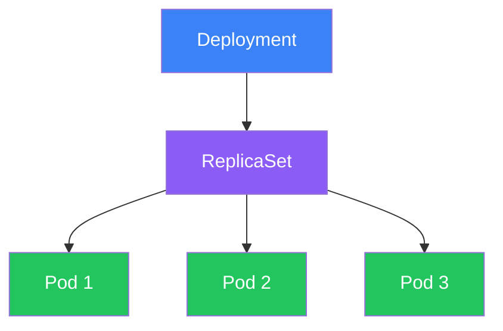
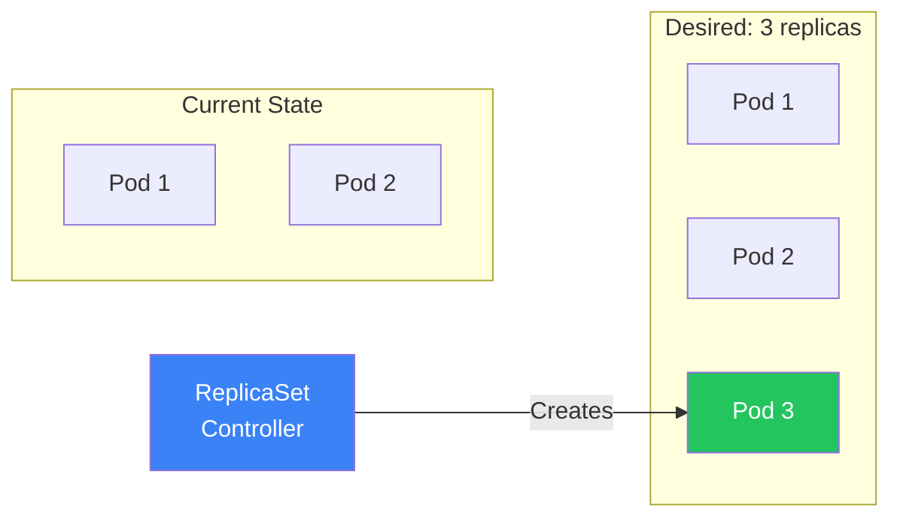
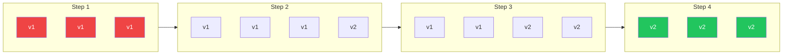
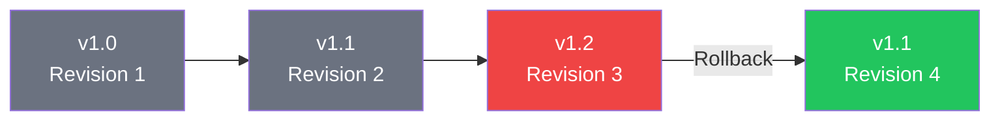

Deployments are the recommended way to manage pods in Kubernetes. They provide declarative updates, rolling deployments, and rollback capabilities. This article covers Deployments, ReplicaSets, and deployment strategies.

## Understanding the Hierarchy



| Resource | Purpose |
|----------|---------|
| **Deployment** | Manages ReplicaSets, handles updates and rollbacks |
| **ReplicaSet** | Ensures specified number of pod replicas are running |
| **Pod** | Runs the actual containers |

## ReplicaSets

### What is a ReplicaSet?

A ReplicaSet ensures a specified number of pod replicas are running at all times.

```yaml
apiVersion: apps/v1
kind: ReplicaSet
metadata:
  name: nginx-replicaset
spec:
  replicas: 3
  selector:
    matchLabels:
      app: nginx
  template:
    metadata:
      labels:
        app: nginx
    spec:
      containers:
        - name: nginx
          image: nginx:1.25
          ports:
            - containerPort: 80
```

### ReplicaSet Behavior



### Why Use Deployments Instead?

| Feature | ReplicaSet | Deployment |
|---------|------------|------------|
| Replica management | Yes | Yes |
| Rolling updates | No | Yes |
| Rollback | No | Yes |
| Update history | No | Yes |
| Pause/Resume | No | Yes |

## Deployments

### Basic Deployment

```yaml
apiVersion: apps/v1
kind: Deployment
metadata:
  name: nginx-deployment
  labels:
    app: nginx
spec:
  replicas: 3
  selector:
    matchLabels:
      app: nginx
  template:
    metadata:
      labels:
        app: nginx
    spec:
      containers:
        - name: nginx
          image: nginx:1.25
          ports:
            - containerPort: 80
          resources:
            requests:
              memory: "64Mi"
              cpu: "250m"
            limits:
              memory: "128Mi"
              cpu: "500m"
```

### Complete Deployment Example

```yaml
apiVersion: apps/v1
kind: Deployment
metadata:
  name: web-app
  labels:
    app: web-app
  annotations:
    kubernetes.io/change-cause: "Initial deployment"
spec:
  replicas: 3
  revisionHistoryLimit: 10
  progressDeadlineSeconds: 600

  selector:
    matchLabels:
      app: web-app

  strategy:
    type: RollingUpdate
    rollingUpdate:
      maxSurge: 1
      maxUnavailable: 0

  template:
    metadata:
      labels:
        app: web-app
        version: v1.0.0
    spec:
      containers:
        - name: web
          image: myapp:1.0.0
          ports:
            - containerPort: 8080
          env:
            - name: NODE_ENV
              value: "production"
          resources:
            requests:
              memory: "256Mi"
              cpu: "500m"
            limits:
              memory: "512Mi"
              cpu: "1000m"
          readinessProbe:
            httpGet:
              path: /health
              port: 8080
            initialDelaySeconds: 5
            periodSeconds: 10
          livenessProbe:
            httpGet:
              path: /health
              port: 8080
            initialDelaySeconds: 15
            periodSeconds: 20
```

## Deployment Strategies

### RollingUpdate (Default)

Gradually replaces old pods with new ones.

```yaml
spec:
  strategy:
    type: RollingUpdate
    rollingUpdate:
      maxSurge: 1        # Max pods above desired count
      maxUnavailable: 0  # Max pods that can be unavailable
```



### Recreate Strategy

Terminates all old pods before creating new ones (causes downtime).

```yaml
spec:
  strategy:
    type: Recreate
```

### Strategy Comparison

| Strategy | Downtime | Resource Usage | Use Case |
|----------|----------|----------------|----------|
| RollingUpdate | No | Higher during update | Production |
| Recreate | Yes | Normal | Dev, incompatible versions |

### Advanced Rolling Update Settings

```yaml
spec:
  strategy:
    type: RollingUpdate
    rollingUpdate:
      maxSurge: 25%        # Percentage or absolute number
      maxUnavailable: 25%
  minReadySeconds: 10      # Wait before marking as available
  progressDeadlineSeconds: 600  # Timeout for progress
```

## Scaling

### Manual Scaling

```bash
# Scale deployment
kubectl scale deployment nginx-deployment --replicas=5

# Scale to zero (stop all pods)
kubectl scale deployment nginx-deployment --replicas=0

# Scale multiple deployments
kubectl scale deployment nginx-deployment web-app --replicas=3
```

### Declarative Scaling

```yaml
spec:
  replicas: 5  # Update this value
```

```bash
kubectl apply -f deployment.yaml
```

### Horizontal Pod Autoscaler (HPA)

```yaml
apiVersion: autoscaling/v2
kind: HorizontalPodAutoscaler
metadata:
  name: web-app-hpa
spec:
  scaleTargetRef:
    apiVersion: apps/v1
    kind: Deployment
    name: web-app
  minReplicas: 2
  maxReplicas: 10
  metrics:
    - type: Resource
      resource:
        name: cpu
        target:
          type: Utilization
          averageUtilization: 70
    - type: Resource
      resource:
        name: memory
        target:
          type: Utilization
          averageUtilization: 80
```

```bash
# Create HPA imperatively
kubectl autoscale deployment web-app --min=2 --max=10 --cpu-percent=70

# View HPA status
kubectl get hpa
kubectl describe hpa web-app-hpa
```

## Rolling Updates

### Update Container Image

```bash
# Update image
kubectl set image deployment/nginx-deployment nginx=nginx:1.26

# Update with record (deprecated but still works)
kubectl set image deployment/nginx-deployment nginx=nginx:1.26 --record

# Update using annotation for change cause
kubectl annotate deployment/nginx-deployment kubernetes.io/change-cause="Update to nginx 1.26"
```

### Monitor Rollout Status

```bash
# Watch rollout status
kubectl rollout status deployment/nginx-deployment

# View rollout history
kubectl rollout history deployment/nginx-deployment

# View specific revision
kubectl rollout history deployment/nginx-deployment --revision=2
```

### Pause and Resume

```bash
# Pause rollout (make multiple changes)
kubectl rollout pause deployment/nginx-deployment

# Make changes
kubectl set image deployment/nginx-deployment nginx=nginx:1.26
kubectl set resources deployment/nginx-deployment -c=nginx --limits=memory=256Mi

# Resume rollout
kubectl rollout resume deployment/nginx-deployment
```

## Rollbacks

### Rollback to Previous Version

```bash
# Rollback to previous revision
kubectl rollout undo deployment/nginx-deployment

# Rollback to specific revision
kubectl rollout undo deployment/nginx-deployment --to-revision=2
```

### Rollback Workflow



### Managing Revision History

```yaml
spec:
  revisionHistoryLimit: 10  # Keep last 10 ReplicaSets
```

## Working with Deployments

### Common Commands

```bash
# Create deployment
kubectl apply -f deployment.yaml
kubectl create deployment nginx --image=nginx:1.25

# List deployments
kubectl get deployments
kubectl get deploy -o wide

# Describe deployment
kubectl describe deployment nginx-deployment

# Edit deployment
kubectl edit deployment nginx-deployment

# Delete deployment
kubectl delete deployment nginx-deployment
```

### Viewing Related Resources

```bash
# View ReplicaSets managed by deployment
kubectl get replicasets -l app=nginx

# View pods managed by deployment
kubectl get pods -l app=nginx

# View all related resources
kubectl get all -l app=nginx
```

## Labels and Selectors

### Selector Types

```yaml
# Equality-based selector
selector:
  matchLabels:
    app: nginx
    environment: production

# Set-based selector
selector:
  matchLabels:
    app: nginx
  matchExpressions:
    - key: environment
      operator: In
      values: [production, staging]
    - key: version
      operator: NotIn
      values: [deprecated]
```

### Important Label Rules

| Rule | Description |
|------|-------------|
| Selector must match template labels | Pod template must have matching labels |
| Selector is immutable | Cannot change after creation |
| Labels can be updated | Pod template labels can be updated |

## DaemonSets and StatefulSets

### DaemonSet

Ensures one pod runs on each node.

```yaml
apiVersion: apps/v1
kind: DaemonSet
metadata:
  name: log-collector
spec:
  selector:
    matchLabels:
      app: log-collector
  template:
    metadata:
      labels:
        app: log-collector
    spec:
      containers:
        - name: fluentd
          image: fluentd:latest
```

### StatefulSet

For stateful applications requiring stable network identity and storage.

```yaml
apiVersion: apps/v1
kind: StatefulSet
metadata:
  name: database
spec:
  serviceName: database
  replicas: 3
  selector:
    matchLabels:
      app: database
  template:
    metadata:
      labels:
        app: database
    spec:
      containers:
        - name: postgres
          image: postgres:15
```

### Comparison

| Feature | Deployment | DaemonSet | StatefulSet |
|---------|------------|-----------|-------------|
| Replicas | Configurable | One per node | Configurable |
| Pod names | Random | Random | Ordered (web-0, web-1) |
| Storage | Shared | Per node | Per pod (persistent) |
| Updates | Rolling | Rolling | Ordered |
| Use case | Stateless apps | Node agents | Databases |

## Best Practices

| Practice | Recommendation |
|----------|----------------|
| **Use Deployments** | Not bare pods or ReplicaSets |
| **Set resource limits** | Prevent resource exhaustion |
| **Configure health probes** | Enable proper rolling updates |
| **Use meaningful labels** | app, version, environment |
| **Set revision history** | Keep enough for rollbacks |
| **Use maxUnavailable: 0** | For zero-downtime updates |

## Key Takeaways

1. **Use Deployments** - They manage ReplicaSets and provide updates/rollbacks
2. **RollingUpdate is default** - Gradual updates with no downtime
3. **Configure probes** - Essential for safe rolling updates
4. **Monitor rollouts** - Use `kubectl rollout status`
5. **Keep revision history** - Enable quick rollbacks
6. **Use HPA** - Automatic scaling based on metrics

## Next Steps

In the next article, we'll explore Kubernetes Services for exposing your applications.

## References

- The Kubernetes Book, 3rd Edition - Nigel Poulton
- Kubernetes: Up and Running, 3rd Edition - Burns, Beda, Hightower
- [Kubernetes Deployment Documentation](https://kubernetes.io/docs/concepts/workloads/controllers/deployment/)
