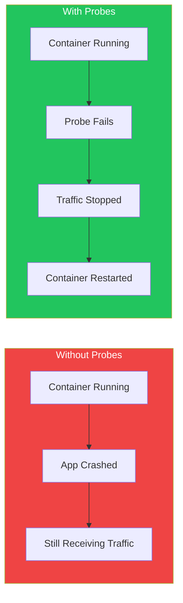
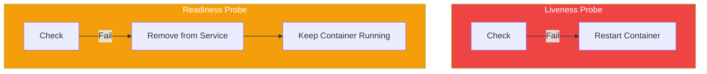

Health probes and lifecycle hooks ensure your applications run reliably in Kubernetes. Probes detect unhealthy containers, while lifecycle hooks enable graceful startup and shutdown.

## Why Health Probes Matter



## Three Types of Probes

| Probe | Purpose | Failure Action |
|-------|---------|----------------|
| Liveness | Is container alive? | Restart container |
| Readiness | Can container serve traffic? | Remove from Service |
| Startup | Has container started? | Block other probes |

## Liveness Probe

Detects if a container is running but unhealthy (deadlocked, hung).

### HTTP Liveness Probe

```yaml
apiVersion: v1
kind: Pod
metadata:
  name: web-app
spec:
  containers:
    - name: app
      image: myapp:1.0
      livenessProbe:
        httpGet:
          path: /healthz
          port: 8080
        initialDelaySeconds: 10
        periodSeconds: 5
        timeoutSeconds: 3
        failureThreshold: 3
        successThreshold: 1
```

### TCP Liveness Probe

```yaml
livenessProbe:
  tcpSocket:
    port: 3306
  initialDelaySeconds: 15
  periodSeconds: 10
```

### Exec Liveness Probe

```yaml
livenessProbe:
  exec:
    command:
      - cat
      - /tmp/healthy
  initialDelaySeconds: 5
  periodSeconds: 5
```

## Readiness Probe

Determines if a container can accept traffic. Failed readiness removes pod from Service endpoints.

```yaml
apiVersion: v1
kind: Pod
metadata:
  name: web-app
spec:
  containers:
    - name: app
      image: myapp:1.0
      readinessProbe:
        httpGet:
          path: /ready
          port: 8080
        initialDelaySeconds: 5
        periodSeconds: 5
        failureThreshold: 3
```

### Readiness vs Liveness



## Startup Probe

For slow-starting containers. Disables liveness/readiness probes until startup succeeds.

```yaml
apiVersion: v1
kind: Pod
metadata:
  name: legacy-app
spec:
  containers:
    - name: app
      image: legacy:1.0
      startupProbe:
        httpGet:
          path: /healthz
          port: 8080
        failureThreshold: 30
        periodSeconds: 10
      livenessProbe:
        httpGet:
          path: /healthz
          port: 8080
        periodSeconds: 10
```

This allows up to 5 minutes (30 × 10s) for startup before liveness probes begin.

## Probe Configuration Parameters

| Parameter | Default | Description |
|-----------|---------|-------------|
| initialDelaySeconds | 0 | Wait before first probe |
| periodSeconds | 10 | Time between probes |
| timeoutSeconds | 1 | Probe timeout |
| successThreshold | 1 | Successes to be healthy |
| failureThreshold | 3 | Failures before action |

## Lifecycle Hooks

Execute commands at container startup and shutdown.


### postStart Hook

Runs immediately after container creation (not guaranteed before ENTRYPOINT).

```yaml
apiVersion: v1
kind: Pod
metadata:
  name: app
spec:
  containers:
    - name: app
      image: myapp:1.0
      lifecycle:
        postStart:
          exec:
            command:
              - /bin/sh
              - -c
              - echo "Container started" >> /var/log/startup.log
```

### preStop Hook

Runs before container receives SIGTERM. Useful for graceful shutdown.

```yaml
apiVersion: v1
kind: Pod
metadata:
  name: web-server
spec:
  containers:
    - name: nginx
      image: nginx:1.25
      lifecycle:
        preStop:
          exec:
            command:
              - /bin/sh
              - -c
              - nginx -s quit && sleep 10
```

### HTTP Lifecycle Hook

```yaml
lifecycle:
  preStop:
    httpGet:
      path: /shutdown
      port: 8080
```

## Graceful Shutdown Pattern

```yaml
apiVersion: apps/v1
kind: Deployment
metadata:
  name: web-app
spec:
  replicas: 3
  template:
    spec:
      terminationGracePeriodSeconds: 60
      containers:
        - name: app
          image: myapp:1.0
          ports:
            - containerPort: 8080
          readinessProbe:
            httpGet:
              path: /ready
              port: 8080
            periodSeconds: 5
          lifecycle:
            preStop:
              exec:
                command:
                  - /bin/sh
                  - -c
                  - sleep 5
```

### Shutdown Sequence

1. Pod marked for termination
2. Pod removed from Service endpoints
3. preStop hook executes
4. SIGTERM sent to container
5. Wait for terminationGracePeriodSeconds
6. SIGKILL if still running

## Complete Example

```yaml
apiVersion: apps/v1
kind: Deployment
metadata:
  name: production-app
spec:
  replicas: 3
  selector:
    matchLabels:
      app: production-app
  template:
    metadata:
      labels:
        app: production-app
    spec:
      terminationGracePeriodSeconds: 30
      containers:
        - name: app
          image: myapp:1.0
          ports:
            - containerPort: 8080
          startupProbe:
            httpGet:
              path: /healthz
              port: 8080
            failureThreshold: 30
            periodSeconds: 2
          livenessProbe:
            httpGet:
              path: /healthz
              port: 8080
            initialDelaySeconds: 0
            periodSeconds: 10
            timeoutSeconds: 5
            failureThreshold: 3
          readinessProbe:
            httpGet:
              path: /ready
              port: 8080
            initialDelaySeconds: 0
            periodSeconds: 5
            timeoutSeconds: 3
            failureThreshold: 3
          lifecycle:
            preStop:
              exec:
                command: ["/bin/sh", "-c", "sleep 5"]
```

## Best Practices

| Practice | Recommendation |
|----------|----------------|
| Always use readiness probes | Prevent traffic to unready pods |
| Use startup probes for slow apps | Avoid false positive restarts |
| Keep probes lightweight | Don't check downstream dependencies |
| Set appropriate timeouts | Match your application's behavior |
| Use preStop for graceful shutdown | Allow in-flight requests to complete |

## Common Issues

### Too Aggressive Liveness Probe

```yaml
# Bad: Restarts healthy but slow containers
livenessProbe:
  httpGet:
    path: /healthz
    port: 8080
  initialDelaySeconds: 1
  periodSeconds: 1
  failureThreshold: 1

# Good: Reasonable thresholds
livenessProbe:
  httpGet:
    path: /healthz
    port: 8080
  initialDelaySeconds: 10
  periodSeconds: 10
  failureThreshold: 3
```

### Checking Dependencies in Probes

```yaml
# Bad: Fails if database is down
livenessProbe:
  httpGet:
    path: /healthz  # Checks database connection

# Good: Only check container health
livenessProbe:
  httpGet:
    path: /healthz  # Returns 200 if app is running
```

## Key Takeaways

1. **Liveness restarts unhealthy containers** - Use for deadlock detection
2. **Readiness controls traffic** - Use for startup and temporary unavailability
3. **Startup probes for slow containers** - Prevents premature restarts
4. **preStop enables graceful shutdown** - Complete in-flight requests
5. **Don't check dependencies** - Probes should only check container health

## References

- The Kubernetes Book, 3rd Edition - Nigel Poulton
- Kubernetes: Up and Running, 3rd Edition - Burns, Beda, Hightower
- [Kubernetes Probe Documentation](https://kubernetes.io/docs/tasks/configure-pod-container/configure-liveness-readiness-startup-probes/)
