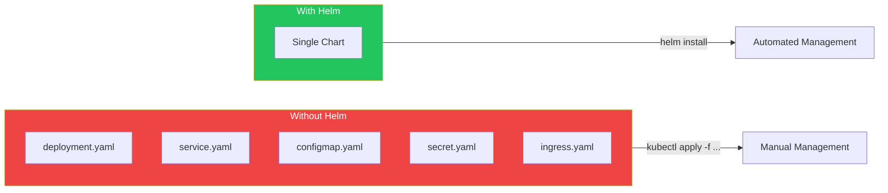
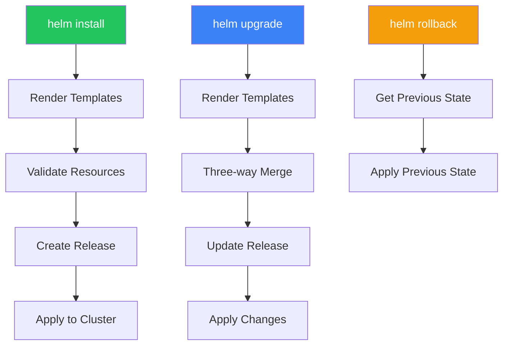

Helm is the package manager for Kubernetes, simplifying application deployment through reusable charts. It handles templating, versioning, and release management.

## Why Helm?



## Helm Concepts

| Concept | Description |
|---------|-------------|
| Chart | Package of Kubernetes resources |
| Release | Installed instance of a chart |
| Repository | Collection of charts |
| Values | Configuration for chart customization |
| Template | Kubernetes manifests with placeholders |

## Installing Helm

```bash
# macOS
brew install helm

# Linux
curl https://raw.githubusercontent.com/helm/helm/main/scripts/get-helm-3 | bash

# Verify installation
helm version
```

## Working with Repositories

```bash
# Add official repository
helm repo add bitnami https://charts.bitnami.com/bitnami

# Add other repositories
helm repo add prometheus-community https://prometheus-community.github.io/helm-charts
helm repo add ingress-nginx https://kubernetes.github.io/ingress-nginx

# Update repositories
helm repo update

# List repositories
helm repo list

# Search for charts
helm search repo nginx
helm search hub prometheus  # Search Artifact Hub
```

## Installing Charts

### Basic Installation

```bash
# Install with release name
helm install my-nginx bitnami/nginx

# Install in specific namespace
helm install my-nginx bitnami/nginx -n web --create-namespace

# Install with custom values
helm install my-nginx bitnami/nginx --set service.type=ClusterIP

# Install from values file
helm install my-nginx bitnami/nginx -f values.yaml
```

### Values File

```yaml
# values.yaml
replicaCount: 3

image:
  repository: nginx
  tag: "1.25"

service:
  type: LoadBalancer
  port: 80

resources:
  limits:
    cpu: 200m
    memory: 256Mi
  requests:
    cpu: 100m
    memory: 128Mi

ingress:
  enabled: true
  hostname: myapp.example.com
```

## Managing Releases

```bash
# List releases
helm list
helm list -n my-namespace
helm list --all-namespaces

# Get release status
helm status my-nginx

# Get release values
helm get values my-nginx
helm get values my-nginx --all  # Including defaults

# Get release manifest
helm get manifest my-nginx

# Upgrade release
helm upgrade my-nginx bitnami/nginx --set replicaCount=5
helm upgrade my-nginx bitnami/nginx -f new-values.yaml

# Rollback release
helm rollback my-nginx 1  # Rollback to revision 1
helm history my-nginx     # View revision history

# Uninstall release
helm uninstall my-nginx
```

## Creating Charts

### Chart Structure

```
mychart/
├── Chart.yaml          # Chart metadata
├── values.yaml         # Default values
├── charts/             # Dependencies
├── templates/          # Kubernetes manifests
│   ├── deployment.yaml
│   ├── service.yaml
│   ├── ingress.yaml
│   ├── _helpers.tpl    # Template helpers
│   └── NOTES.txt       # Post-install notes
└── .helmignore         # Files to ignore
```

### Chart.yaml

```yaml
apiVersion: v2
name: myapp
description: A Helm chart for my application
type: application
version: 0.1.0        # Chart version
appVersion: "1.0.0"   # Application version

dependencies:
  - name: postgresql
    version: "12.x.x"
    repository: https://charts.bitnami.com/bitnami
    condition: postgresql.enabled
```

### values.yaml

```yaml
replicaCount: 1

image:
  repository: myapp
  pullPolicy: IfNotPresent
  tag: ""

nameOverride: ""
fullnameOverride: ""

service:
  type: ClusterIP
  port: 80

ingress:
  enabled: false
  className: ""
  hosts:
    - host: chart-example.local
      paths:
        - path: /
          pathType: ImplementationSpecific

resources: {}

postgresql:
  enabled: true
  auth:
    database: myapp
```

### Template Example

```yaml
# templates/deployment.yaml
apiVersion: apps/v1
kind: Deployment
metadata:
  name: {{ include "myapp.fullname" . }}
  labels:
    {{- include "myapp.labels" . | nindent 4 }}
spec:
  replicas: {{ .Values.replicaCount }}
  selector:
    matchLabels:
      {{- include "myapp.selectorLabels" . | nindent 6 }}
  template:
    metadata:
      labels:
        {{- include "myapp.selectorLabels" . | nindent 8 }}
    spec:
      containers:
        - name: {{ .Chart.Name }}
          image: "{{ .Values.image.repository }}:{{ .Values.image.tag | default .Chart.AppVersion }}"
          imagePullPolicy: {{ .Values.image.pullPolicy }}
          ports:
            - name: http
              containerPort: 80
          {{- if .Values.resources }}
          resources:
            {{- toYaml .Values.resources | nindent 12 }}
          {{- end }}
```

### Helper Templates

```yaml
# templates/_helpers.tpl
{{/*
Create chart name and version
*/}}
{{- define "myapp.chart" -}}
{{- printf "%s-%s" .Chart.Name .Chart.Version | replace "+" "_" | trunc 63 | trimSuffix "-" }}
{{- end }}

{{/*
Common labels
*/}}
{{- define "myapp.labels" -}}
helm.sh/chart: {{ include "myapp.chart" . }}
{{ include "myapp.selectorLabels" . }}
app.kubernetes.io/version: {{ .Chart.AppVersion | quote }}
app.kubernetes.io/managed-by: {{ .Release.Service }}
{{- end }}

{{/*
Selector labels
*/}}
{{- define "myapp.selectorLabels" -}}
app.kubernetes.io/name: {{ include "myapp.name" . }}
app.kubernetes.io/instance: {{ .Release.Name }}
{{- end }}
```

## Template Functions

### Common Functions

```yaml
# String functions
{{ .Values.name | upper }}
{{ .Values.name | lower }}
{{ .Values.name | title }}
{{ .Values.name | quote }}
{{ .Values.name | default "defaultValue" }}
{{ .Values.name | trim }}

# Control structures
{{- if .Values.ingress.enabled }}
# Ingress config here
{{- end }}

{{- range .Values.hosts }}
- host: {{ . }}
{{- end }}

# With statement
{{- with .Values.nodeSelector }}
nodeSelector:
  {{- toYaml . | nindent 8 }}
{{- end }}
```

### Indentation

```yaml
# nindent adds newline + indent
resources:
  {{- toYaml .Values.resources | nindent 2 }}

# indent without newline
resources: {{ toYaml .Values.resources | indent 2 }}
```

## Testing Charts

```bash
# Create new chart
helm create myapp

# Lint chart
helm lint ./myapp

# Render templates locally
helm template my-release ./myapp
helm template my-release ./myapp -f custom-values.yaml

# Dry run installation
helm install my-release ./myapp --dry-run --debug

# Package chart
helm package ./myapp

# Install from local chart
helm install my-release ./myapp
```

## Chart Dependencies

```bash
# Update dependencies
helm dependency update ./myapp

# List dependencies
helm dependency list ./myapp

# Build dependencies
helm dependency build ./myapp
```

## Release Workflow



## Best Practices

| Practice | Recommendation |
|----------|----------------|
| Version charts | Use semantic versioning |
| Use values files | Separate configuration from templates |
| Document values | Add comments explaining each value |
| Test before deploy | Use --dry-run and helm lint |
| Pin chart versions | Specify version in dependencies |
| Use namespaces | Isolate releases by namespace |

## Helm Commands Reference

```bash
# Repository management
helm repo add <name> <url>
helm repo update
helm repo list
helm repo remove <name>

# Chart management
helm search repo <keyword>
helm show values <chart>
helm show chart <chart>
helm pull <chart>

# Release management
helm install <release> <chart>
helm upgrade <release> <chart>
helm rollback <release> <revision>
helm uninstall <release>
helm list
helm status <release>
helm history <release>

# Development
helm create <name>
helm lint <path>
helm template <release> <path>
helm package <path>
```

## Key Takeaways

1. **Helm simplifies deployment** - Package multiple manifests into one chart
2. **Values enable customization** - Override defaults without changing templates
3. **Releases track state** - Version and rollback deployments easily
4. **Templates use Go syntax** - Learn sprig functions for complex logic
5. **Charts are reusable** - Share and version your infrastructure

## References

- [Helm Documentation](https://helm.sh/docs/)
- [Artifact Hub](https://artifacthub.io/)
- The Kubernetes Book, 3rd Edition - Nigel Poulton
