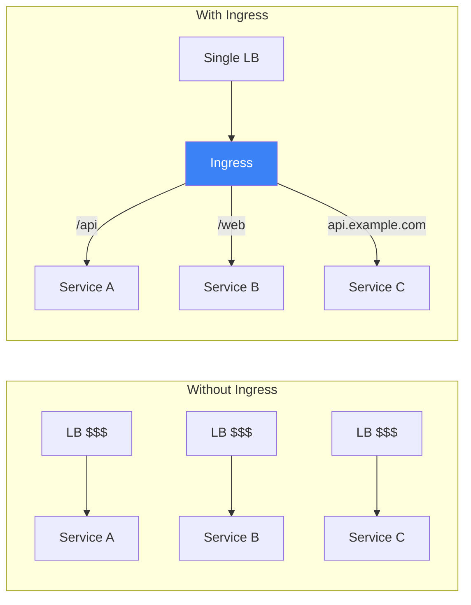
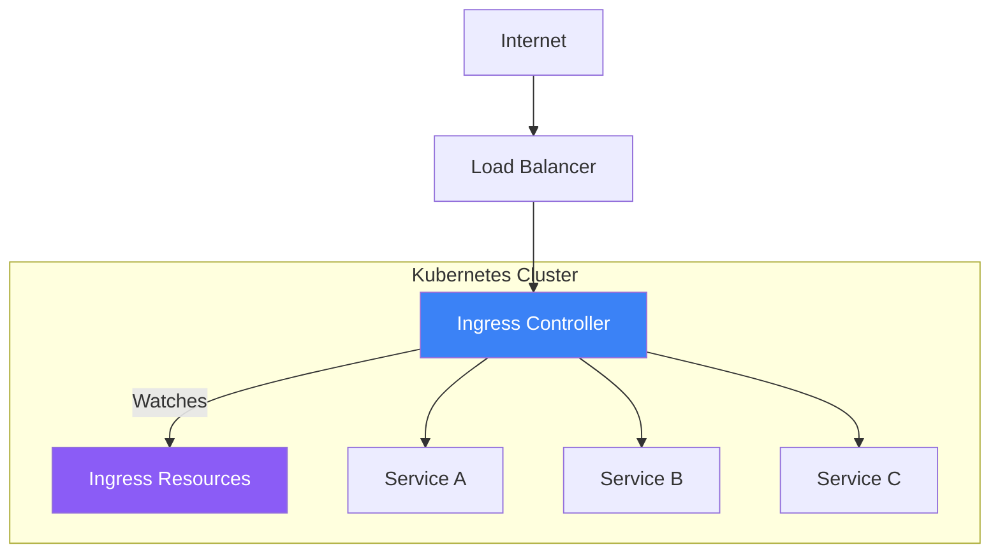

Ingress provides HTTP and HTTPS routing to services within a cluster. It offers features like path-based routing, host-based routing, and TLS termination. This article covers Ingress concepts, controllers, and configuration.

## Why Ingress?

While LoadBalancer services work, they have limitations:
- Each service needs its own load balancer (costly)
- No HTTP-level routing (paths, hosts)
- TLS termination at application level



## Ingress Architecture



### Components

| Component | Description |
|-----------|-------------|
| **Ingress Resource** | Kubernetes object defining routing rules |
| **Ingress Controller** | Pod that implements the routing (nginx, traefik, etc.) |
| **Load Balancer** | Entry point from internet |

## Ingress Controllers

Kubernetes doesn't include an Ingress controller by default. You must install one.

### Popular Controllers

| Controller | Description |
|------------|-------------|
| **NGINX Ingress** | Most popular, feature-rich |
| **Traefik** | Cloud-native, automatic HTTPS |
| **HAProxy** | High performance |
| **Contour** | Envoy-based, project by VMware |
| **AWS ALB** | AWS Application Load Balancer |
| **GKE Ingress** | Google Cloud native |

### Installing NGINX Ingress Controller

```bash
# Using Helm
helm repo add ingress-nginx https://kubernetes.github.io/ingress-nginx
helm repo update
helm install ingress-nginx ingress-nginx/ingress-nginx

# Using kubectl
kubectl apply -f https://raw.githubusercontent.com/kubernetes/ingress-nginx/controller-v1.9.0/deploy/static/provider/cloud/deploy.yaml

# Verify installation
kubectl get pods -n ingress-nginx
kubectl get svc -n ingress-nginx
```

## Basic Ingress

### Simple Path-Based Routing

```yaml
apiVersion: networking.k8s.io/v1
kind: Ingress
metadata:
  name: simple-ingress
spec:
  ingressClassName: nginx
  rules:
    - http:
        paths:
          - path: /api
            pathType: Prefix
            backend:
              service:
                name: api-service
                port:
                  number: 80
          - path: /web
            pathType: Prefix
            backend:
              service:
                name: web-service
                port:
                  number: 80
```

### Path Types

| PathType | Behavior |
|----------|----------|
| **Prefix** | Matches URL path prefix |
| **Exact** | Matches exact URL path |
| **ImplementationSpecific** | Controller-dependent |

```yaml
# Prefix: /api matches /api, /api/, /api/users
- path: /api
  pathType: Prefix

# Exact: /api matches only /api
- path: /api
  pathType: Exact
```

## Host-Based Routing

Route based on hostname:

```yaml
apiVersion: networking.k8s.io/v1
kind: Ingress
metadata:
  name: host-ingress
spec:
  ingressClassName: nginx
  rules:
    - host: api.example.com
      http:
        paths:
          - path: /
            pathType: Prefix
            backend:
              service:
                name: api-service
                port:
                  number: 80

    - host: web.example.com
      http:
        paths:
          - path: /
            pathType: Prefix
            backend:
              service:
                name: web-service
                port:
                  number: 80

    - host: "*.example.com"  # Wildcard
      http:
        paths:
          - path: /
            pathType: Prefix
            backend:
              service:
                name: default-service
                port:
                  number: 80
```

## TLS/HTTPS Configuration

### Create TLS Secret

```bash
# Generate self-signed certificate (for testing)
openssl req -x509 -nodes -days 365 -newkey rsa:2048 \
  -keyout tls.key -out tls.crt \
  -subj "/CN=example.com"

# Create Kubernetes secret
kubectl create secret tls example-tls \
  --cert=tls.crt \
  --key=tls.key
```

### Ingress with TLS

```yaml
apiVersion: networking.k8s.io/v1
kind: Ingress
metadata:
  name: tls-ingress
spec:
  ingressClassName: nginx
  tls:
    - hosts:
        - example.com
        - www.example.com
      secretName: example-tls
  rules:
    - host: example.com
      http:
        paths:
          - path: /
            pathType: Prefix
            backend:
              service:
                name: web-service
                port:
                  number: 80
```

### Automatic TLS with cert-manager

```bash
# Install cert-manager
kubectl apply -f https://github.com/cert-manager/cert-manager/releases/download/v1.13.0/cert-manager.yaml
```

```yaml
# ClusterIssuer for Let's Encrypt
apiVersion: cert-manager.io/v1
kind: ClusterIssuer
metadata:
  name: letsencrypt-prod
spec:
  acme:
    server: https://acme-v02.api.letsencrypt.org/directory
    email: your-email@example.com
    privateKeySecretRef:
      name: letsencrypt-prod
    solvers:
      - http01:
          ingress:
            class: nginx
---
# Ingress with automatic TLS
apiVersion: networking.k8s.io/v1
kind: Ingress
metadata:
  name: auto-tls-ingress
  annotations:
    cert-manager.io/cluster-issuer: letsencrypt-prod
spec:
  ingressClassName: nginx
  tls:
    - hosts:
        - example.com
      secretName: example-com-tls  # cert-manager creates this
  rules:
    - host: example.com
      http:
        paths:
          - path: /
            pathType: Prefix
            backend:
              service:
                name: web-service
                port:
                  number: 80
```

## Ingress Annotations

### NGINX-Specific Annotations

```yaml
apiVersion: networking.k8s.io/v1
kind: Ingress
metadata:
  name: annotated-ingress
  annotations:
    # Rewrite URL path
    nginx.ingress.kubernetes.io/rewrite-target: /$2

    # SSL redirect
    nginx.ingress.kubernetes.io/ssl-redirect: "true"

    # Backend protocol
    nginx.ingress.kubernetes.io/backend-protocol: "HTTPS"

    # Rate limiting
    nginx.ingress.kubernetes.io/limit-rps: "10"

    # Timeouts
    nginx.ingress.kubernetes.io/proxy-connect-timeout: "60"
    nginx.ingress.kubernetes.io/proxy-read-timeout: "60"

    # CORS
    nginx.ingress.kubernetes.io/enable-cors: "true"
    nginx.ingress.kubernetes.io/cors-allow-origin: "https://example.com"

    # Basic auth
    nginx.ingress.kubernetes.io/auth-type: basic
    nginx.ingress.kubernetes.io/auth-secret: basic-auth
    nginx.ingress.kubernetes.io/auth-realm: "Authentication Required"

    # Whitelist IPs
    nginx.ingress.kubernetes.io/whitelist-source-range: "10.0.0.0/8,172.16.0.0/12"

    # Custom headers
    nginx.ingress.kubernetes.io/configuration-snippet: |
      add_header X-Custom-Header "value";
spec:
  ingressClassName: nginx
  rules:
    - host: example.com
      http:
        paths:
          - path: /api(/|$)(.*)
            pathType: Prefix
            backend:
              service:
                name: api-service
                port:
                  number: 80
```

### URL Rewriting

```yaml
metadata:
  annotations:
    nginx.ingress.kubernetes.io/rewrite-target: /$2
spec:
  rules:
    - host: example.com
      http:
        paths:
          # /api/users -> /users
          - path: /api(/|$)(.*)
            pathType: Prefix
            backend:
              service:
                name: api-service
                port:
                  number: 80
```

## Default Backend

Handle requests that don't match any rules:

```yaml
apiVersion: networking.k8s.io/v1
kind: Ingress
metadata:
  name: ingress-with-default
spec:
  ingressClassName: nginx
  defaultBackend:
    service:
      name: default-service
      port:
        number: 80
  rules:
    - host: example.com
      http:
        paths:
          - path: /api
            pathType: Prefix
            backend:
              service:
                name: api-service
                port:
                  number: 80
```

## IngressClass

Specify which controller handles the Ingress:

```yaml
apiVersion: networking.k8s.io/v1
kind: IngressClass
metadata:
  name: nginx
  annotations:
    ingressclass.kubernetes.io/is-default-class: "true"
spec:
  controller: k8s.io/ingress-nginx
---
apiVersion: networking.k8s.io/v1
kind: Ingress
metadata:
  name: my-ingress
spec:
  ingressClassName: nginx  # Reference the IngressClass
  rules:
    - http:
        paths:
          - path: /
            pathType: Prefix
            backend:
              service:
                name: web-service
                port:
                  number: 80
```

## Gateway API (Future)

Gateway API is the successor to Ingress with more features:

```yaml
# Gateway (similar to Ingress Controller)
apiVersion: gateway.networking.k8s.io/v1
kind: Gateway
metadata:
  name: my-gateway
spec:
  gatewayClassName: nginx
  listeners:
    - name: http
      port: 80
      protocol: HTTP
---
# HTTPRoute (similar to Ingress rules)
apiVersion: gateway.networking.k8s.io/v1
kind: HTTPRoute
metadata:
  name: my-route
spec:
  parentRefs:
    - name: my-gateway
  hostnames:
    - example.com
  rules:
    - matches:
        - path:
            type: PathPrefix
            value: /api
      backendRefs:
        - name: api-service
          port: 80
```

## Working with Ingress

### Common Commands

```bash
# Create ingress
kubectl apply -f ingress.yaml

# List ingresses
kubectl get ingress
kubectl get ing -A

# Describe ingress
kubectl describe ingress my-ingress

# Get ingress with IP
kubectl get ingress my-ingress -o wide

# Delete ingress
kubectl delete ingress my-ingress
```

### Debugging

```bash
# Check ingress controller logs
kubectl logs -n ingress-nginx -l app.kubernetes.io/name=ingress-nginx

# Check ingress controller config
kubectl exec -n ingress-nginx deploy/ingress-nginx-controller -- cat /etc/nginx/nginx.conf

# Test DNS resolution
nslookup example.com

# Test connectivity
curl -H "Host: example.com" http://<ingress-ip>/
```

## Complete Example

```yaml
# Backend services
apiVersion: apps/v1
kind: Deployment
metadata:
  name: api
spec:
  replicas: 2
  selector:
    matchLabels:
      app: api
  template:
    metadata:
      labels:
        app: api
    spec:
      containers:
        - name: api
          image: hashicorp/http-echo
          args: ["-text=API"]
---
apiVersion: v1
kind: Service
metadata:
  name: api-service
spec:
  selector:
    app: api
  ports:
    - port: 80
      targetPort: 5678
---
apiVersion: apps/v1
kind: Deployment
metadata:
  name: web
spec:
  replicas: 2
  selector:
    matchLabels:
      app: web
  template:
    metadata:
      labels:
        app: web
    spec:
      containers:
        - name: web
          image: hashicorp/http-echo
          args: ["-text=WEB"]
---
apiVersion: v1
kind: Service
metadata:
  name: web-service
spec:
  selector:
    app: web
  ports:
    - port: 80
      targetPort: 5678
---
# Ingress with TLS
apiVersion: networking.k8s.io/v1
kind: Ingress
metadata:
  name: main-ingress
  annotations:
    nginx.ingress.kubernetes.io/ssl-redirect: "true"
spec:
  ingressClassName: nginx
  tls:
    - hosts:
        - example.com
      secretName: example-tls
  rules:
    - host: example.com
      http:
        paths:
          - path: /api
            pathType: Prefix
            backend:
              service:
                name: api-service
                port:
                  number: 80
          - path: /
            pathType: Prefix
            backend:
              service:
                name: web-service
                port:
                  number: 80
```

## Best Practices

| Practice | Recommendation |
|----------|----------------|
| **Use TLS** | Always encrypt with HTTPS |
| **Use cert-manager** | Automate certificate management |
| **Set IngressClass** | Explicitly specify controller |
| **Configure timeouts** | Match application needs |
| **Rate limiting** | Protect against abuse |
| **Health checks** | Ensure backend availability |

## Key Takeaways

1. **Ingress consolidates routing** - Single entry point for multiple services
2. **Controller required** - Install nginx, traefik, or other controller
3. **TLS is essential** - Use cert-manager for automatic certificates
4. **Annotations customize behavior** - Controller-specific settings
5. **Gateway API is the future** - More powerful than Ingress

## Next Steps

In the next article, we'll explore ConfigMaps and Secrets for managing application configuration.

## References

- The Kubernetes Book, 3rd Edition - Nigel Poulton
- Kubernetes: Up and Running, 3rd Edition - Burns, Beda, Hightower
- [Kubernetes Ingress Documentation](https://kubernetes.io/docs/concepts/services-networking/ingress/)
