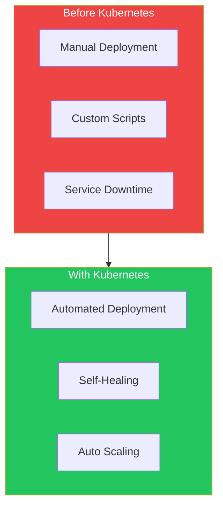
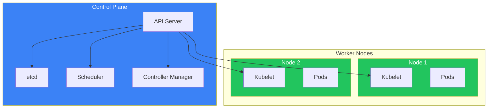
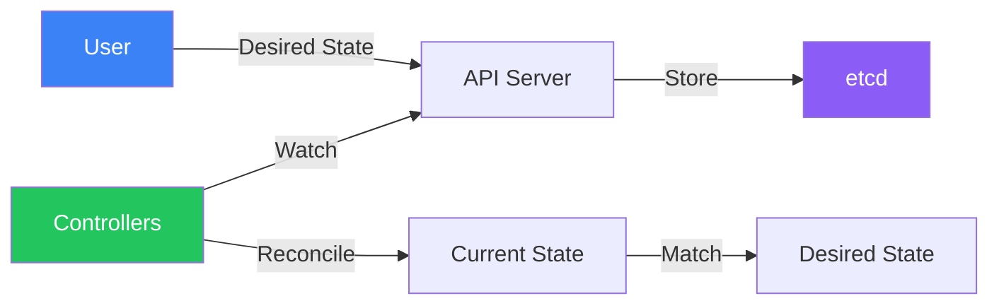

Kubernetes (K8s) has become the de facto standard for container orchestration. This article introduces Kubernetes fundamentals, its architecture, and core concepts.

## What is Kubernetes?

Kubernetes is an open-source container orchestration platform originally developed by Google based on their internal system called Borg. The name comes from Greek, meaning "helmsman" or "pilot."



## Why Kubernetes?

| Challenge | Traditional Approach | Kubernetes Solution |
|-----------|---------------------|---------------------|
| Deployment | Manual, error-prone | Declarative, automated |
| Scaling | Buy bigger servers | Horizontal pod scaling |
| Failures | Manual intervention | Self-healing |
| Updates | Downtime required | Rolling updates |
| Resource usage | Often underutilized | Bin packing optimization |

## Kubernetes Architecture

### High-Level Overview



### Control Plane Components

| Component | Purpose |
|-----------|---------|
| **API Server** | Front-end for Kubernetes, handles all API requests |
| **etcd** | Distributed key-value store for cluster state |
| **Scheduler** | Assigns pods to nodes based on resource requirements |
| **Controller Manager** | Runs controller loops (Deployment, ReplicaSet, etc.) |

### Worker Node Components

| Component | Purpose |
|-----------|---------|
| **Kubelet** | Agent that ensures containers are running in pods |
| **kube-proxy** | Maintains network rules for pod communication |
| **Container Runtime** | Runs containers (containerd, CRI-O) |

## Core Kubernetes Objects

### Pods

The smallest deployable unit in Kubernetes. A pod contains one or more containers that share:
- Network namespace (same IP address)
- Storage volumes
- Lifecycle

```yaml
apiVersion: v1
kind: Pod
metadata:
  name: nginx-pod
spec:
  containers:
    - name: nginx
      image: nginx:1.25
      ports:
        - containerPort: 80
```

### Deployments

Manage the desired state of pod replicas with rolling updates and rollbacks.

```yaml
apiVersion: apps/v1
kind: Deployment
metadata:
  name: nginx-deployment
spec:
  replicas: 3
  selector:
    matchLabels:
      app: nginx
  template:
    metadata:
      labels:
        app: nginx
    spec:
      containers:
        - name: nginx
          image: nginx:1.25
          ports:
            - containerPort: 80
```

### Services

Provide stable networking for accessing pods.

```yaml
apiVersion: v1
kind: Service
metadata:
  name: nginx-service
spec:
  selector:
    app: nginx
  ports:
    - port: 80
      targetPort: 80
  type: ClusterIP
```

## The Declarative Model

Kubernetes uses a declarative approach: you define the desired state, and Kubernetes works to achieve and maintain it.



### Declarative vs Imperative

| Approach | Example | When to Use |
|----------|---------|-------------|
| Declarative | `kubectl apply -f deployment.yaml` | Production, GitOps |
| Imperative | `kubectl create deployment nginx --image=nginx` | Quick testing |

## Kubernetes Distributions

| Distribution | Description | Best For |
|--------------|-------------|----------|
| **Managed (Cloud)** | | |
| EKS (AWS) | Amazon's managed K8s | AWS users |
| GKE (Google) | Google's managed K8s | GCP users |
| AKS (Azure) | Azure's managed K8s | Azure users |
| **Self-Managed** | | |
| kubeadm | Official bootstrap tool | On-premises |
| k3s | Lightweight K8s | Edge, IoT, dev |
| **Local Development** | | |
| minikube | Single-node cluster | Learning, dev |
| kind | K8s in Docker | CI/CD, testing |
| Docker Desktop | Built-in K8s | Desktop dev |

## Getting Started

### Install kubectl

```bash
# macOS
brew install kubectl

# Linux
curl -LO "https://dl.k8s.io/release/$(curl -L -s https://dl.k8s.io/release/stable.txt)/bin/linux/amd64/kubectl"
chmod +x kubectl
sudo mv kubectl /usr/local/bin/

# Windows (with chocolatey)
choco install kubernetes-cli
```

### Verify Installation

```bash
# Check kubectl version
kubectl version --client

# Check cluster connection
kubectl cluster-info

# List nodes
kubectl get nodes
```

### Your First Deployment

```bash
# Create a deployment
kubectl create deployment hello-world --image=nginx

# Expose it as a service
kubectl expose deployment hello-world --port=80 --type=NodePort

# Check the resources
kubectl get pods
kubectl get services

# Clean up
kubectl delete deployment hello-world
kubectl delete service hello-world
```

## Kubernetes vs Docker Swarm

| Feature | Kubernetes | Docker Swarm |
|---------|------------|--------------|
| Complexity | Higher learning curve | Simpler |
| Scaling | Auto-scaling built-in | Manual or external |
| Networking | Advanced (CNI plugins) | Basic overlay |
| Load balancing | Multiple options | Built-in |
| Ecosystem | Very large | Smaller |
| Production use | Industry standard | Less common |

## Key Concepts Summary

| Concept | Description |
|---------|-------------|
| **Cluster** | Set of nodes running containerized applications |
| **Node** | A worker machine (VM or physical) |
| **Pod** | Smallest deployable unit, contains containers |
| **Deployment** | Manages pod replicas and updates |
| **Service** | Stable network endpoint for pods |
| **Namespace** | Virtual cluster for resource isolation |
| **Label** | Key-value pairs for organizing objects |

## Key Takeaways

1. **Kubernetes orchestrates containers** - Automates deployment, scaling, and management
2. **Declarative configuration** - Define desired state, K8s makes it happen
3. **Self-healing** - Automatically replaces failed containers
4. **Portable** - Runs on any cloud or on-premises
5. **Extensible** - Rich ecosystem of tools and integrations

## Next Steps

In the next article, we'll explore kubectl commands for interacting with your Kubernetes cluster.

## References

- The Kubernetes Book, 3rd Edition - Nigel Poulton
- Kubernetes: Up and Running, 3rd Edition - Burns, Beda, Hightower
- [Kubernetes Official Documentation](https://kubernetes.io/docs/)
