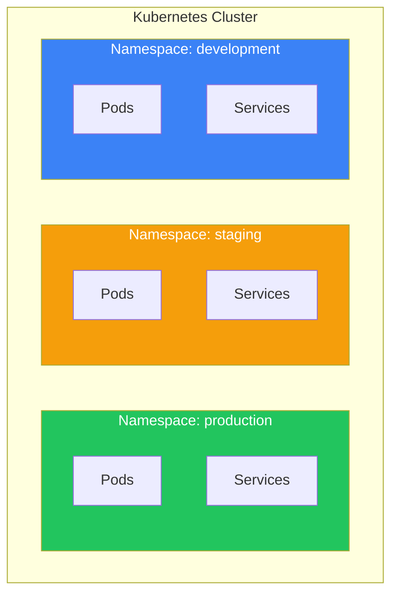

Namespaces provide a way to divide cluster resources between multiple users or teams. Combined with ResourceQuota and LimitRange, they enable effective multi-tenant resource management.

## What are Namespaces?

Namespaces are virtual clusters within a physical cluster, providing:
- Resource isolation between teams/projects
- Scope for names (resources must be unique within namespace)
- Access control boundaries (RBAC)
- Resource quota boundaries



## Default Namespaces

| Namespace | Purpose |
|-----------|---------|
| `default` | Default namespace for resources |
| `kube-system` | Kubernetes system components |
| `kube-public` | Publicly readable resources |
| `kube-node-lease` | Node heartbeat leases |

## Working with Namespaces

### Create Namespace

```yaml
apiVersion: v1
kind: Namespace
metadata:
  name: production
  labels:
    environment: production
    team: platform
```

```bash
# Imperatively
kubectl create namespace production

# From YAML
kubectl apply -f namespace.yaml
```

### View Namespaces

```bash
kubectl get namespaces
kubectl get ns

kubectl describe namespace production
```

### Deploy to Namespace

```bash
# Specify in command
kubectl apply -f deployment.yaml -n production

# Set default namespace for context
kubectl config set-context --current --namespace=production

# View current namespace
kubectl config view --minify | grep namespace:
```

### In YAML Manifests

```yaml
apiVersion: apps/v1
kind: Deployment
metadata:
  name: web-app
  namespace: production  # Specify namespace
spec:
  replicas: 3
  # ...
```

## ResourceQuota

Limits aggregate resource consumption per namespace.

### Compute ResourceQuota

```yaml
apiVersion: v1
kind: ResourceQuota
metadata:
  name: compute-quota
  namespace: production
spec:
  hard:
    requests.cpu: "10"
    requests.memory: 20Gi
    limits.cpu: "20"
    limits.memory: 40Gi
    pods: "50"
    count/deployments.apps: "10"
```

### Object Count Quota

```yaml
apiVersion: v1
kind: ResourceQuota
metadata:
  name: object-quota
  namespace: development
spec:
  hard:
    pods: "20"
    services: "10"
    secrets: "20"
    configmaps: "20"
    persistentvolumeclaims: "10"
    services.loadbalancers: "2"
    services.nodeports: "5"
```

### Storage Quota

```yaml
apiVersion: v1
kind: ResourceQuota
metadata:
  name: storage-quota
  namespace: production
spec:
  hard:
    requests.storage: 100Gi
    persistentvolumeclaims: "10"
    # Per StorageClass
    fast.storageclass.storage.k8s.io/requests.storage: 50Gi
    fast.storageclass.storage.k8s.io/persistentvolumeclaims: "5"
```

### View Quota Usage

```bash
kubectl get resourcequota -n production
kubectl describe resourcequota compute-quota -n production
```

## LimitRange

Sets default and limits for individual containers/pods.

### Container Limits

```yaml
apiVersion: v1
kind: LimitRange
metadata:
  name: container-limits
  namespace: production
spec:
  limits:
    - type: Container
      default:          # Default limits
        cpu: "500m"
        memory: "256Mi"
      defaultRequest:   # Default requests
        cpu: "100m"
        memory: "128Mi"
      max:              # Maximum allowed
        cpu: "2"
        memory: "2Gi"
      min:              # Minimum required
        cpu: "50m"
        memory: "64Mi"
```

### Pod Limits

```yaml
apiVersion: v1
kind: LimitRange
metadata:
  name: pod-limits
  namespace: production
spec:
  limits:
    - type: Pod
      max:
        cpu: "4"
        memory: "8Gi"
      min:
        cpu: "100m"
        memory: "128Mi"
```

### PVC Limits

```yaml
apiVersion: v1
kind: LimitRange
metadata:
  name: storage-limits
  namespace: production
spec:
  limits:
    - type: PersistentVolumeClaim
      max:
        storage: 50Gi
      min:
        storage: 1Gi
```

## Namespace Isolation

### Network Isolation

```yaml
apiVersion: networking.k8s.io/v1
kind: NetworkPolicy
metadata:
  name: deny-all
  namespace: production
spec:
  podSelector: {}
  policyTypes:
    - Ingress
    - Egress
```

### Cross-Namespace Communication

```yaml
# Allow traffic from staging namespace
apiVersion: networking.k8s.io/v1
kind: NetworkPolicy
metadata:
  name: allow-from-staging
  namespace: production
spec:
  podSelector: {}
  ingress:
    - from:
        - namespaceSelector:
            matchLabels:
              environment: staging
```

## Namespace Best Practices

### Organization Strategies

| Strategy | Description | Use Case |
|----------|-------------|----------|
| Per environment | dev, staging, prod | Environment isolation |
| Per team | team-a, team-b | Team isolation |
| Per application | app1, app2 | Application isolation |
| Combined | team-a-prod, team-a-dev | Multi-tenant |

### Recommended Setup

```yaml
# Production namespace with full controls
apiVersion: v1
kind: Namespace
metadata:
  name: production
  labels:
    environment: production
---
apiVersion: v1
kind: ResourceQuota
metadata:
  name: production-quota
  namespace: production
spec:
  hard:
    requests.cpu: "50"
    requests.memory: 100Gi
    limits.cpu: "100"
    limits.memory: 200Gi
    pods: "100"
---
apiVersion: v1
kind: LimitRange
metadata:
  name: production-limits
  namespace: production
spec:
  limits:
    - type: Container
      default:
        cpu: "500m"
        memory: "512Mi"
      defaultRequest:
        cpu: "100m"
        memory: "256Mi"
      max:
        cpu: "4"
        memory: "8Gi"
```

## Common Commands

```bash
# Create namespace
kubectl create namespace myns

# List all resources in namespace
kubectl get all -n myns

# Delete namespace (and all resources)
kubectl delete namespace myns

# View quota
kubectl get resourcequota -n myns

# View limits
kubectl get limitrange -n myns
```

## Key Takeaways

1. **Namespaces isolate resources** - Virtual clusters within a cluster
2. **ResourceQuota limits aggregate usage** - Control total namespace consumption
3. **LimitRange sets defaults and limits** - Individual container/pod controls
4. **Combine for multi-tenancy** - Namespace + Quota + LimitRange + RBAC
5. **Use meaningful names** - Reflect purpose or ownership

## Next Steps

In the next article, we'll explore RBAC and security for controlling access to Kubernetes resources.

## References

- The Kubernetes Book, 3rd Edition - Nigel Poulton
- Kubernetes: Up and Running, 3rd Edition - Burns, Beda, Hightower
- [Kubernetes Namespace Documentation](https://kubernetes.io/docs/concepts/overview/working-with-objects/namespaces/)
