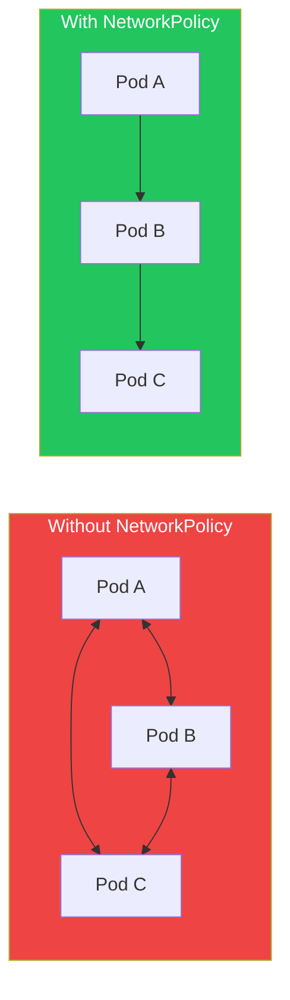

NetworkPolicy controls traffic flow between pods at the network level. By default, all pods can communicate with each other. NetworkPolicies enable network segmentation and security.

## NetworkPolicy Basics



## Default Deny All

```yaml
# Deny all ingress
apiVersion: networking.k8s.io/v1
kind: NetworkPolicy
metadata:
  name: deny-all-ingress
  namespace: production
spec:
  podSelector: {}  # Select all pods
  policyTypes:
    - Ingress

---
# Deny all egress
apiVersion: networking.k8s.io/v1
kind: NetworkPolicy
metadata:
  name: deny-all-egress
  namespace: production
spec:
  podSelector: {}
  policyTypes:
    - Egress

---
# Deny all traffic
apiVersion: networking.k8s.io/v1
kind: NetworkPolicy
metadata:
  name: deny-all
  namespace: production
spec:
  podSelector: {}
  policyTypes:
    - Ingress
    - Egress
```

## Allow Specific Traffic

### Allow Ingress from Specific Pods

```yaml
apiVersion: networking.k8s.io/v1
kind: NetworkPolicy
metadata:
  name: allow-frontend
  namespace: production
spec:
  podSelector:
    matchLabels:
      app: backend
  policyTypes:
    - Ingress
  ingress:
    - from:
        - podSelector:
            matchLabels:
              app: frontend
      ports:
        - protocol: TCP
          port: 8080
```

### Allow from Namespace

```yaml
apiVersion: networking.k8s.io/v1
kind: NetworkPolicy
metadata:
  name: allow-from-monitoring
  namespace: production
spec:
  podSelector: {}
  policyTypes:
    - Ingress
  ingress:
    - from:
        - namespaceSelector:
            matchLabels:
              purpose: monitoring
```

### Allow Egress to External

```yaml
apiVersion: networking.k8s.io/v1
kind: NetworkPolicy
metadata:
  name: allow-external-db
  namespace: production
spec:
  podSelector:
    matchLabels:
      app: backend
  policyTypes:
    - Egress
  egress:
    - to:
        - ipBlock:
            cidr: 10.0.0.0/24
      ports:
        - protocol: TCP
          port: 5432
```

### Allow DNS

```yaml
apiVersion: networking.k8s.io/v1
kind: NetworkPolicy
metadata:
  name: allow-dns
  namespace: production
spec:
  podSelector: {}
  policyTypes:
    - Egress
  egress:
    - to:
        - namespaceSelector: {}
          podSelector:
            matchLabels:
              k8s-app: kube-dns
      ports:
        - protocol: UDP
          port: 53
```

## Complete Example

```yaml
# Three-tier application network policies
---
# Frontend: Allow ingress from internet, egress to backend
apiVersion: networking.k8s.io/v1
kind: NetworkPolicy
metadata:
  name: frontend-policy
  namespace: production
spec:
  podSelector:
    matchLabels:
      tier: frontend
  policyTypes:
    - Ingress
    - Egress
  ingress:
    - from: []  # Allow all ingress
      ports:
        - port: 80
  egress:
    - to:
        - podSelector:
            matchLabels:
              tier: backend
      ports:
        - port: 8080
    - to:  # DNS
        - namespaceSelector: {}
      ports:
        - port: 53
          protocol: UDP
---
# Backend: Allow from frontend, egress to database
apiVersion: networking.k8s.io/v1
kind: NetworkPolicy
metadata:
  name: backend-policy
  namespace: production
spec:
  podSelector:
    matchLabels:
      tier: backend
  policyTypes:
    - Ingress
    - Egress
  ingress:
    - from:
        - podSelector:
            matchLabels:
              tier: frontend
      ports:
        - port: 8080
  egress:
    - to:
        - podSelector:
            matchLabels:
              tier: database
      ports:
        - port: 5432
---
# Database: Allow only from backend
apiVersion: networking.k8s.io/v1
kind: NetworkPolicy
metadata:
  name: database-policy
  namespace: production
spec:
  podSelector:
    matchLabels:
      tier: database
  policyTypes:
    - Ingress
  ingress:
    - from:
        - podSelector:
            matchLabels:
              tier: backend
      ports:
        - port: 5432
```

## Best Practices

| Practice | Recommendation |
|----------|----------------|
| Start with deny-all | Then allow specific traffic |
| Allow DNS | Required for service discovery |
| Test policies | Verify connectivity after applying |
| Document policies | Explain why each rule exists |

## Key Takeaways

1. **Default is allow-all** - Must explicitly deny
2. **Policies are additive** - Multiple policies combine
3. **Requires CNI support** - Calico, Cilium, etc.
4. **Use labels for selection** - Target pods and namespaces

## References

- [Kubernetes NetworkPolicy Documentation](https://kubernetes.io/docs/concepts/services-networking/network-policies/)
