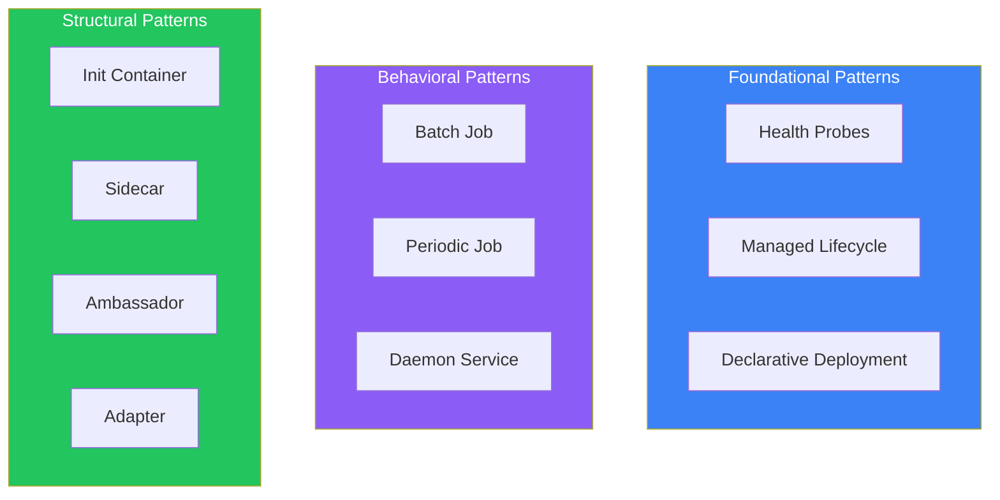
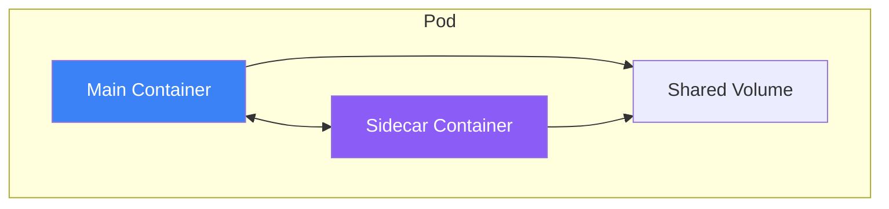
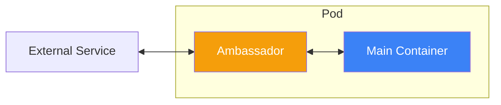
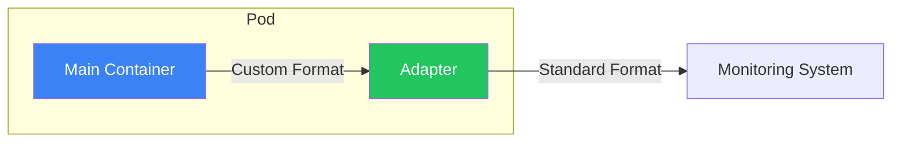
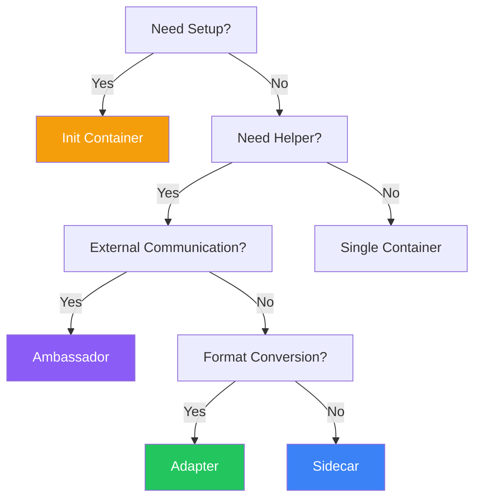

Kubernetes design patterns are reusable solutions for common challenges in containerized applications. Understanding these patterns helps you build more maintainable, scalable, and robust systems.

## Pattern Categories



## Init Container Pattern

Init containers run before main containers, handling setup tasks.


### Use Cases

- Wait for dependent services
- Clone repositories
- Download configuration
- Database migrations

### Example: Wait for Database

```yaml
apiVersion: v1
kind: Pod
metadata:
  name: web-app
spec:
  initContainers:
    - name: wait-for-db
      image: busybox:1.36
      command:
        - sh
        - -c
        - |
          until nc -z postgres-service 5432; do
            echo "Waiting for database..."
            sleep 2
          done
    - name: run-migrations
      image: myapp:1.0
      command: ["./migrate.sh"]
  containers:
    - name: app
      image: myapp:1.0
```

### Example: Clone Configuration

```yaml
apiVersion: v1
kind: Pod
metadata:
  name: web-server
spec:
  initContainers:
    - name: git-clone
      image: alpine/git
      command:
        - git
        - clone
        - https://github.com/example/config.git
        - /config
      volumeMounts:
        - name: config-volume
          mountPath: /config
  containers:
    - name: nginx
      image: nginx:1.25
      volumeMounts:
        - name: config-volume
          mountPath: /usr/share/nginx/html
  volumes:
    - name: config-volume
      emptyDir: {}
```

## Sidecar Pattern

A helper container that extends the main container's functionality.



### Use Cases

- Log collection and forwarding
- Monitoring and metrics
- Configuration sync
- TLS termination

### Example: Log Shipping Sidecar

```yaml
apiVersion: v1
kind: Pod
metadata:
  name: app-with-logging
spec:
  containers:
    - name: app
      image: myapp:1.0
      volumeMounts:
        - name: logs
          mountPath: /var/log/app
    - name: log-shipper
      image: fluent/fluent-bit:2.1
      volumeMounts:
        - name: logs
          mountPath: /var/log/app
        - name: fluent-config
          mountPath: /fluent-bit/etc
  volumes:
    - name: logs
      emptyDir: {}
    - name: fluent-config
      configMap:
        name: fluent-bit-config
```

### Example: Monitoring Sidecar

```yaml
apiVersion: v1
kind: Pod
metadata:
  name: app-with-metrics
spec:
  containers:
    - name: app
      image: myapp:1.0
      ports:
        - containerPort: 8080
    - name: prometheus-exporter
      image: prom/statsd-exporter:v0.24.0
      ports:
        - containerPort: 9102
      args:
        - --statsd.listen-udp=:9125
        - --web.listen-address=:9102
```

## Ambassador Pattern

A proxy container that handles external communication.



### Use Cases

- Database connection pooling
- Service discovery abstraction
- Rate limiting
- Circuit breaking

### Example: Database Proxy

```yaml
apiVersion: v1
kind: Pod
metadata:
  name: app-with-db-proxy
spec:
  containers:
    - name: app
      image: myapp:1.0
      env:
        - name: DATABASE_HOST
          value: "localhost"
        - name: DATABASE_PORT
          value: "5432"
    - name: cloud-sql-proxy
      image: gcr.io/cloud-sql-connectors/cloud-sql-proxy:2.1
      args:
        - --structured-logs
        - --port=5432
        - my-project:us-central1:my-instance
      securityContext:
        runAsNonRoot: true
```

### Example: Redis Proxy

```yaml
apiVersion: v1
kind: Pod
metadata:
  name: app-with-redis-proxy
spec:
  containers:
    - name: app
      image: myapp:1.0
      env:
        - name: REDIS_HOST
          value: "localhost"
    - name: twemproxy
      image: twemproxy:latest
      ports:
        - containerPort: 6379
      volumeMounts:
        - name: config
          mountPath: /etc/twemproxy
  volumes:
    - name: config
      configMap:
        name: twemproxy-config
```

## Adapter Pattern

Transforms output from the main container to a standard format.



### Use Cases

- Metrics format conversion
- Log format standardization
- Protocol translation

### Example: Prometheus Adapter

```yaml
apiVersion: v1
kind: Pod
metadata:
  name: legacy-app
spec:
  containers:
    - name: legacy-app
      image: legacy:1.0
      ports:
        - containerPort: 8080
    - name: prometheus-adapter
      image: nginx/nginx-prometheus-exporter:0.11
      args:
        - -nginx.scrape-uri=http://localhost:8080/nginx_status
      ports:
        - containerPort: 9113
```

### Example: Log Adapter

```yaml
apiVersion: v1
kind: Pod
metadata:
  name: app-with-log-adapter
spec:
  containers:
    - name: app
      image: legacy:1.0
      volumeMounts:
        - name: logs
          mountPath: /var/log/app
    - name: log-adapter
      image: alpine:3.18
      command:
        - sh
        - -c
        - |
          tail -f /var/log/app/custom.log | \
          while read line; do
            echo "{\"timestamp\":\"$(date -Iseconds)\",\"message\":\"$line\"}"
          done
      volumeMounts:
        - name: logs
          mountPath: /var/log/app
  volumes:
    - name: logs
      emptyDir: {}
```

## Pattern Comparison

| Pattern | Purpose | Container Relationship |
|---------|---------|----------------------|
| Init Container | Setup before main | Sequential, exits |
| Sidecar | Extend functionality | Parallel, same lifecycle |
| Ambassador | Proxy external | Proxy between main and external |
| Adapter | Transform output | Receives from main |

## Combining Patterns

```yaml
apiVersion: v1
kind: Pod
metadata:
  name: full-pattern-example
spec:
  # Init Container Pattern
  initContainers:
    - name: wait-for-deps
      image: busybox:1.36
      command: ["sh", "-c", "until nc -z redis 6379; do sleep 1; done"]

  containers:
    # Main Application
    - name: app
      image: myapp:1.0
      ports:
        - containerPort: 8080
      volumeMounts:
        - name: logs
          mountPath: /var/log/app

    # Sidecar Pattern: Log collection
    - name: log-collector
      image: fluent/fluent-bit:2.1
      volumeMounts:
        - name: logs
          mountPath: /var/log/app

    # Ambassador Pattern: Database proxy
    - name: db-proxy
      image: cloud-sql-proxy:2.1
      args: ["--port=5432", "project:region:instance"]

    # Adapter Pattern: Metrics conversion
    - name: metrics-adapter
      image: prom/statsd-exporter:v0.24.0
      ports:
        - containerPort: 9102

  volumes:
    - name: logs
      emptyDir: {}
```

## Best Practices

| Practice | Recommendation |
|----------|----------------|
| Single responsibility | Each container does one thing well |
| Shared volumes for data | Use emptyDir for inter-container communication |
| Resource limits | Set limits on all containers including sidecars |
| Lifecycle alignment | Ensure sidecars don't outlive main containers |
| Keep sidecars lightweight | Minimize resource overhead |

## When to Use Each Pattern



## Key Takeaways

1. **Init Containers for setup** - Run once before main containers
2. **Sidecars extend functionality** - Logging, monitoring, sync
3. **Ambassadors handle external communication** - Proxies and connection pooling
4. **Adapters standardize output** - Format conversion for monitoring
5. **Combine patterns as needed** - Real applications often use multiple patterns

## References

- Kubernetes Patterns, 2nd Edition - Ibryam, Huß
- The Kubernetes Book, 3rd Edition - Nigel Poulton
- [Kubernetes Multi-Container Pods](https://kubernetes.io/docs/concepts/workloads/pods/#how-pods-manage-multiple-containers)
