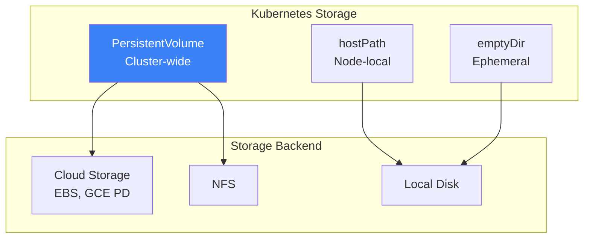
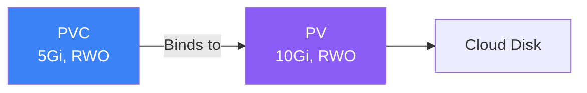

Containers are ephemeral by default - when they restart, all data is lost. Kubernetes provides various storage options for persistent data. This article covers volumes, PersistentVolumes, StorageClasses, and StatefulSets.

## Storage Overview



## Volume Types

### emptyDir

Temporary storage that exists for the pod's lifetime.

```yaml
apiVersion: v1
kind: Pod
metadata:
  name: cache-pod
spec:
  containers:
    - name: app
      image: myapp:1.0
      volumeMounts:
        - name: cache
          mountPath: /cache
    - name: sidecar
      image: sidecar:1.0
      volumeMounts:
        - name: cache
          mountPath: /shared-cache
  volumes:
    - name: cache
      emptyDir: {}
      # Or with size limit
      # emptyDir:
      #   sizeLimit: 500Mi
      #   medium: Memory  # tmpfs
```

### hostPath

Mounts file or directory from the host node.

```yaml
apiVersion: v1
kind: Pod
metadata:
  name: hostpath-pod
spec:
  containers:
    - name: app
      image: myapp:1.0
      volumeMounts:
        - name: data
          mountPath: /data
  volumes:
    - name: data
      hostPath:
        path: /mnt/data
        type: DirectoryOrCreate  # Directory, File, etc.
```

## PersistentVolume (PV)

A cluster resource representing physical storage.

```yaml
apiVersion: v1
kind: PersistentVolume
metadata:
  name: my-pv
spec:
  capacity:
    storage: 10Gi
  accessModes:
    - ReadWriteOnce
  persistentVolumeReclaimPolicy: Retain
  storageClassName: standard
  # Backend specific
  hostPath:
    path: /mnt/data
```

### Access Modes

| Mode | Abbreviation | Description |
|------|--------------|-------------|
| ReadWriteOnce | RWO | Single node read-write |
| ReadOnlyMany | ROX | Multiple nodes read-only |
| ReadWriteMany | RWX | Multiple nodes read-write |
| ReadWriteOncePod | RWOP | Single pod read-write |

### Reclaim Policies

| Policy | Description |
|--------|-------------|
| Retain | Keep PV after PVC deleted |
| Delete | Delete PV and underlying storage |
| Recycle | Deprecated, wipe and reuse |

## PersistentVolumeClaim (PVC)

A request for storage by a user.

```yaml
apiVersion: v1
kind: PersistentVolumeClaim
metadata:
  name: my-pvc
spec:
  accessModes:
    - ReadWriteOnce
  resources:
    requests:
      storage: 5Gi
  storageClassName: standard
  # Optional: specific PV
  # volumeName: my-pv
```

### Using PVC in Pods

```yaml
apiVersion: v1
kind: Pod
metadata:
  name: app
spec:
  containers:
    - name: app
      image: myapp:1.0
      volumeMounts:
        - name: data
          mountPath: /data
  volumes:
    - name: data
      persistentVolumeClaim:
        claimName: my-pvc
```

## PV and PVC Binding



### Binding Process

1. User creates PVC with requirements
2. Kubernetes finds matching PV (size, access mode, storage class)
3. PVC binds to PV (1:1 relationship)
4. Pod uses PVC to access storage

## StorageClass

Defines "classes" of storage with dynamic provisioning.

```yaml
apiVersion: storage.k8s.io/v1
kind: StorageClass
metadata:
  name: fast
provisioner: kubernetes.io/aws-ebs
parameters:
  type: gp3
  iopsPerGB: "10"
reclaimPolicy: Delete
allowVolumeExpansion: true
volumeBindingMode: WaitForFirstConsumer
```

### Dynamic Provisioning

```yaml
# PVC with StorageClass
apiVersion: v1
kind: PersistentVolumeClaim
metadata:
  name: dynamic-pvc
spec:
  accessModes:
    - ReadWriteOnce
  storageClassName: fast  # Reference StorageClass
  resources:
    requests:
      storage: 10Gi
# PV is automatically created!
```

### Common Provisioners

| Provider | Provisioner |
|----------|-------------|
| AWS EBS | `kubernetes.io/aws-ebs` |
| GCE PD | `kubernetes.io/gce-pd` |
| Azure Disk | `kubernetes.io/azure-disk` |
| NFS | `nfs-subdir-external-provisioner` |
| Local | `kubernetes.io/no-provisioner` |

### Volume Binding Modes

| Mode | Description |
|------|-------------|
| Immediate | Provision immediately when PVC created |
| WaitForFirstConsumer | Wait until pod uses PVC |

## StatefulSets

For stateful applications requiring stable storage and network identity.

```yaml
apiVersion: apps/v1
kind: StatefulSet
metadata:
  name: postgres
spec:
  serviceName: postgres
  replicas: 3
  selector:
    matchLabels:
      app: postgres
  template:
    metadata:
      labels:
        app: postgres
    spec:
      containers:
        - name: postgres
          image: postgres:15
          ports:
            - containerPort: 5432
          volumeMounts:
            - name: data
              mountPath: /var/lib/postgresql/data
          env:
            - name: POSTGRES_PASSWORD
              valueFrom:
                secretKeyRef:
                  name: postgres-secret
                  key: password

  volumeClaimTemplates:
    - metadata:
        name: data
      spec:
        accessModes: ["ReadWriteOnce"]
        storageClassName: fast
        resources:
          requests:
            storage: 10Gi
```

### StatefulSet Features

| Feature | Description |
|---------|-------------|
| Stable pod names | postgres-0, postgres-1, postgres-2 |
| Ordered deployment | 0 → 1 → 2 |
| Ordered termination | 2 → 1 → 0 |
| Stable network ID | postgres-0.postgres.namespace.svc |
| Persistent storage | Each pod gets its own PVC |

### Headless Service for StatefulSet

```yaml
apiVersion: v1
kind: Service
metadata:
  name: postgres
spec:
  clusterIP: None  # Headless
  selector:
    app: postgres
  ports:
    - port: 5432
```

## Volume Expansion

Expand PVC size (if StorageClass allows):

```yaml
# StorageClass must have allowVolumeExpansion: true
apiVersion: v1
kind: PersistentVolumeClaim
metadata:
  name: my-pvc
spec:
  resources:
    requests:
      storage: 20Gi  # Increased from 10Gi
```

```bash
# Expand PVC
kubectl patch pvc my-pvc -p '{"spec":{"resources":{"requests":{"storage":"20Gi"}}}}'
```

## Volume Snapshots

Create point-in-time copies of volumes.

```yaml
# VolumeSnapshotClass
apiVersion: snapshot.storage.k8s.io/v1
kind: VolumeSnapshotClass
metadata:
  name: csi-snapclass
driver: ebs.csi.aws.com
deletionPolicy: Delete
---
# Create snapshot
apiVersion: snapshot.storage.k8s.io/v1
kind: VolumeSnapshot
metadata:
  name: my-snapshot
spec:
  volumeSnapshotClassName: csi-snapclass
  source:
    persistentVolumeClaimName: my-pvc
---
# Restore from snapshot
apiVersion: v1
kind: PersistentVolumeClaim
metadata:
  name: restored-pvc
spec:
  dataSource:
    name: my-snapshot
    kind: VolumeSnapshot
    apiGroup: snapshot.storage.k8s.io
  accessModes:
    - ReadWriteOnce
  resources:
    requests:
      storage: 10Gi
```

## Working with Storage

### Common Commands

```bash
# List PVs
kubectl get pv
kubectl get pv -o wide

# List PVCs
kubectl get pvc
kubectl get pvc -A

# List StorageClasses
kubectl get storageclass
kubectl get sc

# Describe resources
kubectl describe pv my-pv
kubectl describe pvc my-pvc

# Delete PVC (and potentially PV)
kubectl delete pvc my-pvc
```

### Debugging Storage Issues

```bash
# Check PVC status
kubectl get pvc my-pvc -o yaml

# Check events
kubectl describe pvc my-pvc

# Check if PV is available
kubectl get pv -o wide

# Check pod volume mounts
kubectl describe pod my-pod
```

## Complete Example

```yaml
# StorageClass
apiVersion: storage.k8s.io/v1
kind: StorageClass
metadata:
  name: database-storage
provisioner: kubernetes.io/aws-ebs
parameters:
  type: gp3
reclaimPolicy: Retain
allowVolumeExpansion: true
volumeBindingMode: WaitForFirstConsumer
---
# StatefulSet with volumeClaimTemplate
apiVersion: apps/v1
kind: StatefulSet
metadata:
  name: mysql
spec:
  serviceName: mysql
  replicas: 3
  selector:
    matchLabels:
      app: mysql
  template:
    metadata:
      labels:
        app: mysql
    spec:
      containers:
        - name: mysql
          image: mysql:8.0
          ports:
            - containerPort: 3306
          env:
            - name: MYSQL_ROOT_PASSWORD
              valueFrom:
                secretKeyRef:
                  name: mysql-secret
                  key: password
          volumeMounts:
            - name: data
              mountPath: /var/lib/mysql
          readinessProbe:
            exec:
              command: ["mysqladmin", "ping", "-h", "localhost"]
            initialDelaySeconds: 30
            periodSeconds: 10

  volumeClaimTemplates:
    - metadata:
        name: data
      spec:
        accessModes: ["ReadWriteOnce"]
        storageClassName: database-storage
        resources:
          requests:
            storage: 50Gi
---
# Headless Service
apiVersion: v1
kind: Service
metadata:
  name: mysql
spec:
  clusterIP: None
  selector:
    app: mysql
  ports:
    - port: 3306
```

## Best Practices

| Practice | Recommendation |
|----------|----------------|
| **Use StorageClasses** | For dynamic provisioning |
| **Use Retain for production** | Prevent accidental data loss |
| **Set resource requests** | Right-size your volumes |
| **Enable volume expansion** | Allow growth without recreation |
| **Use WaitForFirstConsumer** | For zone-aware provisioning |
| **Backup regularly** | Use snapshots or external backup |

## Storage Comparison

| Type | Persistence | Scope | Use Case |
|------|-------------|-------|----------|
| emptyDir | Pod lifetime | Pod | Cache, temp files |
| hostPath | Node lifetime | Node | Node-local data |
| PV/PVC | Cluster lifetime | Cluster | Databases, persistent apps |

## Key Takeaways

1. **Containers are ephemeral** - Use persistent storage for data
2. **PV abstracts storage** - Cluster-wide storage resources
3. **PVC requests storage** - User-facing storage claims
4. **StorageClasses enable dynamic provisioning** - Automatic PV creation
5. **StatefulSets for stateful apps** - Stable identity and storage
6. **Use appropriate reclaim policy** - Retain for production data

## Next Steps

In the next article, we'll explore Namespaces and ResourceQuota for cluster organization and resource management.

## References

- The Kubernetes Book, 3rd Edition - Nigel Poulton
- Kubernetes: Up and Running, 3rd Edition - Burns, Beda, Hightower
- [Kubernetes Storage Documentation](https://kubernetes.io/docs/concepts/storage/)
