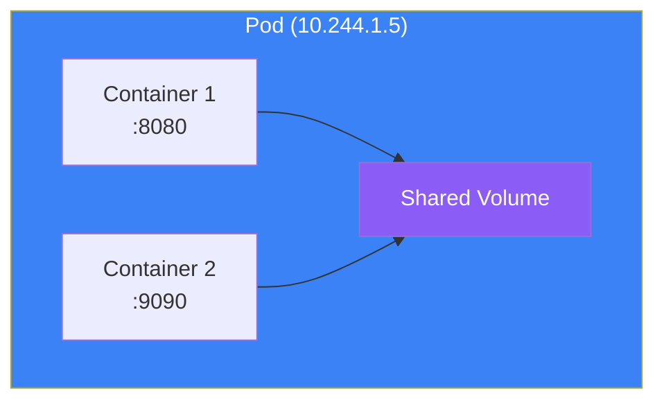
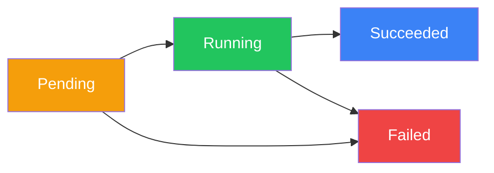

Pods are the fundamental building blocks of Kubernetes. Understanding pods is essential for working effectively with Kubernetes. This article covers pod concepts, manifests, multi-container patterns, and best practices.

## What is a Pod?

A Pod is the smallest deployable unit in Kubernetes. It represents a single instance of a running process and can contain one or more containers that share:

- Network namespace (same IP address and port space)
- Storage volumes
- Lifecycle (created and destroyed together)



## Pod Manifest Structure

### Basic Pod Definition

```yaml
apiVersion: v1
kind: Pod
metadata:
  name: my-app
  namespace: default
  labels:
    app: my-app
    environment: production
  annotations:
    description: "My application pod"
spec:
  containers:
    - name: app
      image: nginx:1.25
      ports:
        - containerPort: 80
          name: http
      resources:
        requests:
          memory: "64Mi"
          cpu: "250m"
        limits:
          memory: "128Mi"
          cpu: "500m"
  restartPolicy: Always
```

### Key Pod Spec Fields

| Field | Description |
|-------|-------------|
| `containers` | List of containers in the pod |
| `initContainers` | Containers that run before main containers |
| `volumes` | Volumes available to containers |
| `restartPolicy` | Always, OnFailure, or Never |
| `nodeSelector` | Node selection constraints |
| `serviceAccountName` | Service account for the pod |
| `securityContext` | Pod-level security settings |

## Container Specification

### Full Container Example

```yaml
apiVersion: v1
kind: Pod
metadata:
  name: full-example
spec:
  containers:
    - name: app
      image: myapp:1.0
      imagePullPolicy: IfNotPresent

      # Port configuration
      ports:
        - containerPort: 8080
          name: http
          protocol: TCP

      # Environment variables
      env:
        - name: DATABASE_URL
          value: "postgres://db:5432/myapp"
        - name: SECRET_KEY
          valueFrom:
            secretKeyRef:
              name: app-secrets
              key: secret-key
        - name: POD_NAME
          valueFrom:
            fieldRef:
              fieldPath: metadata.name

      # Resource management
      resources:
        requests:
          memory: "256Mi"
          cpu: "500m"
        limits:
          memory: "512Mi"
          cpu: "1000m"

      # Volume mounts
      volumeMounts:
        - name: config
          mountPath: /etc/config
          readOnly: true
        - name: data
          mountPath: /data

      # Health checks
      livenessProbe:
        httpGet:
          path: /health
          port: 8080
        initialDelaySeconds: 10
        periodSeconds: 5

      readinessProbe:
        httpGet:
          path: /ready
          port: 8080
        initialDelaySeconds: 5
        periodSeconds: 3

      # Lifecycle hooks
      lifecycle:
        postStart:
          exec:
            command: ["/bin/sh", "-c", "echo Started"]
        preStop:
          exec:
            command: ["/bin/sh", "-c", "sleep 10"]

  volumes:
    - name: config
      configMap:
        name: app-config
    - name: data
      emptyDir: {}
```

## Pod Lifecycle

### Pod Phases



| Phase | Description |
|-------|-------------|
| **Pending** | Pod accepted but containers not created yet |
| **Running** | At least one container is running |
| **Succeeded** | All containers terminated successfully |
| **Failed** | All containers terminated, at least one failed |
| **Unknown** | Pod state cannot be determined |

### Container States

| State | Description |
|-------|-------------|
| **Waiting** | Container waiting to start |
| **Running** | Container executing |
| **Terminated** | Container finished execution |

### Restart Policies

```yaml
spec:
  restartPolicy: Always    # Default, always restart
  restartPolicy: OnFailure # Restart only on failure
  restartPolicy: Never     # Never restart
```

## Multi-Container Pods

### Sidecar Pattern

A helper container that extends the main container's functionality.

```yaml
apiVersion: v1
kind: Pod
metadata:
  name: app-with-sidecar
spec:
  containers:
    # Main application
    - name: app
      image: myapp:1.0
      ports:
        - containerPort: 8080
      volumeMounts:
        - name: logs
          mountPath: /var/log/app

    # Sidecar: log collector
    - name: log-collector
      image: fluentd:latest
      volumeMounts:
        - name: logs
          mountPath: /var/log/app
          readOnly: true

  volumes:
    - name: logs
      emptyDir: {}
```

### Ambassador Pattern

A proxy container that handles external communication.

```yaml
apiVersion: v1
kind: Pod
metadata:
  name: app-with-ambassador
spec:
  containers:
    - name: app
      image: myapp:1.0
      env:
        - name: DATABASE_URL
          value: "localhost:5432"  # Connect to ambassador

    # Ambassador: database proxy
    - name: db-proxy
      image: cloud-sql-proxy:latest
      args:
        - "--instances=project:region:instance=tcp:5432"
```

### Adapter Pattern

A container that transforms output from the main container.

```yaml
apiVersion: v1
kind: Pod
metadata:
  name: app-with-adapter
spec:
  containers:
    - name: app
      image: legacy-app:1.0
      volumeMounts:
        - name: metrics
          mountPath: /metrics

    # Adapter: converts metrics format
    - name: metrics-adapter
      image: prometheus-adapter:latest
      ports:
        - containerPort: 9090
      volumeMounts:
        - name: metrics
          mountPath: /metrics
          readOnly: true

  volumes:
    - name: metrics
      emptyDir: {}
```

## Init Containers

Init containers run before main containers start, useful for setup tasks.

```yaml
apiVersion: v1
kind: Pod
metadata:
  name: app-with-init
spec:
  initContainers:
    # Wait for database
    - name: wait-for-db
      image: busybox:1.36
      command: ['sh', '-c', 'until nc -z db-service 5432; do sleep 2; done']

    # Download configuration
    - name: download-config
      image: busybox:1.36
      command: ['wget', '-O', '/config/app.conf', 'http://config-server/app.conf']
      volumeMounts:
        - name: config
          mountPath: /config

    # Set permissions
    - name: set-permissions
      image: busybox:1.36
      command: ['chmod', '-R', '755', '/data']
      volumeMounts:
        - name: data
          mountPath: /data

  containers:
    - name: app
      image: myapp:1.0
      volumeMounts:
        - name: config
          mountPath: /etc/app
        - name: data
          mountPath: /data

  volumes:
    - name: config
      emptyDir: {}
    - name: data
      emptyDir: {}
```

## Resource Management

### Requests and Limits

```yaml
resources:
  requests:    # Minimum guaranteed resources
    memory: "256Mi"
    cpu: "500m"      # 0.5 CPU cores
  limits:      # Maximum allowed resources
    memory: "512Mi"
    cpu: "1000m"     # 1 CPU core
```

### CPU Units

| Value | Meaning |
|-------|---------|
| `1` | 1 CPU core |
| `1000m` | 1 CPU core (millicores) |
| `500m` | 0.5 CPU cores |
| `100m` | 0.1 CPU cores |

### Memory Units

| Value | Meaning |
|-------|---------|
| `128Mi` | 128 Mebibytes |
| `1Gi` | 1 Gibibyte |
| `128M` | 128 Megabytes |
| `1G` | 1 Gigabyte |

### Quality of Service (QoS)

| QoS Class | Condition |
|-----------|-----------|
| **Guaranteed** | requests == limits for all containers |
| **Burstable** | At least one container has requests or limits |
| **BestEffort** | No requests or limits set |

```yaml
# Guaranteed QoS
resources:
  requests:
    memory: "256Mi"
    cpu: "500m"
  limits:
    memory: "256Mi"
    cpu: "500m"
```

## Pod Security

### Security Context

```yaml
apiVersion: v1
kind: Pod
metadata:
  name: secure-pod
spec:
  securityContext:
    runAsUser: 1000
    runAsGroup: 3000
    fsGroup: 2000
    runAsNonRoot: true

  containers:
    - name: app
      image: myapp:1.0
      securityContext:
        allowPrivilegeEscalation: false
        readOnlyRootFilesystem: true
        capabilities:
          drop:
            - ALL
```

### Pod Security Standards

| Level | Description |
|-------|-------------|
| **Privileged** | No restrictions |
| **Baseline** | Minimally restrictive, prevents known escalations |
| **Restricted** | Highly restrictive, follows hardening best practices |

## Working with Pods

### Create and Manage

```bash
# Create pod from YAML
kubectl apply -f pod.yaml

# Create pod imperatively
kubectl run nginx --image=nginx:1.25

# List pods
kubectl get pods
kubectl get pods -o wide

# Describe pod
kubectl describe pod my-pod

# Delete pod
kubectl delete pod my-pod

# Delete pod immediately
kubectl delete pod my-pod --force --grace-period=0
```

### Debug and Troubleshoot

```bash
# View logs
kubectl logs my-pod
kubectl logs my-pod -c container-name
kubectl logs my-pod --previous

# Execute command
kubectl exec my-pod -- ls /app
kubectl exec -it my-pod -- /bin/sh

# Port forward
kubectl port-forward my-pod 8080:80

# Copy files
kubectl cp my-pod:/app/log.txt ./log.txt
```

### Pod Status Conditions

```bash
# Check pod conditions
kubectl get pod my-pod -o jsonpath='{.status.conditions}'
```

| Condition | Description |
|-----------|-------------|
| PodScheduled | Pod has been scheduled to a node |
| ContainersReady | All containers are ready |
| Initialized | All init containers completed |
| Ready | Pod can serve requests |

## Common Patterns

### Graceful Shutdown

```yaml
spec:
  terminationGracePeriodSeconds: 30
  containers:
    - name: app
      lifecycle:
        preStop:
          exec:
            command: ["/bin/sh", "-c", "sleep 5 && kill -SIGTERM 1"]
```

### Pod Disruption Budget

```yaml
apiVersion: policy/v1
kind: PodDisruptionBudget
metadata:
  name: app-pdb
spec:
  minAvailable: 2
  selector:
    matchLabels:
      app: my-app
```

## Best Practices

| Practice | Recommendation |
|----------|----------------|
| **One process per container** | Keep containers focused |
| **Set resource limits** | Prevent resource exhaustion |
| **Use health checks** | Enable self-healing |
| **Run as non-root** | Improve security |
| **Use labels** | Organize and select pods |
| **Avoid privileged mode** | Minimize attack surface |

## Key Takeaways

1. **Pods are the smallest unit** - Containers run inside pods
2. **Containers share resources** - Network, storage, and lifecycle
3. **Use init containers** - For setup and initialization
4. **Set resource requests/limits** - For proper scheduling and QoS
5. **Multi-container patterns** - Sidecar, ambassador, adapter
6. **Security contexts** - Run pods securely

## Next Steps

In the next article, we'll explore Deployments and ReplicaSets for managing pod replicas and rolling updates.

## References

- The Kubernetes Book, 3rd Edition - Nigel Poulton
- Kubernetes: Up and Running, 3rd Edition - Burns, Beda, Hightower
- [Kubernetes Pod Documentation](https://kubernetes.io/docs/concepts/workloads/pods/)
