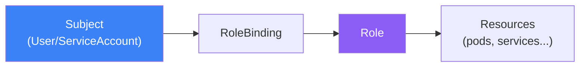

Role-Based Access Control (RBAC) is the standard method for controlling access to Kubernetes resources. This article covers RBAC components, ServiceAccounts, and security best practices.

## RBAC Overview



## RBAC Components

| Component | Scope | Description |
|-----------|-------|-------------|
| Role | Namespace | Permissions within a namespace |
| ClusterRole | Cluster | Cluster-wide permissions |
| RoleBinding | Namespace | Binds Role to subjects |
| ClusterRoleBinding | Cluster | Binds ClusterRole to subjects |

## Roles and ClusterRoles

### Role (Namespace-scoped)

```yaml
apiVersion: rbac.authorization.k8s.io/v1
kind: Role
metadata:
  name: pod-reader
  namespace: production
rules:
  - apiGroups: [""]
    resources: ["pods"]
    verbs: ["get", "list", "watch"]
  - apiGroups: [""]
    resources: ["pods/log"]
    verbs: ["get"]
```

### ClusterRole (Cluster-scoped)

```yaml
apiVersion: rbac.authorization.k8s.io/v1
kind: ClusterRole
metadata:
  name: secret-reader
rules:
  - apiGroups: [""]
    resources: ["secrets"]
    verbs: ["get", "list"]
  - apiGroups: [""]
    resources: ["nodes"]
    verbs: ["get", "list", "watch"]
```

### Common Verbs

| Verb | Description |
|------|-------------|
| get | Read single resource |
| list | List resources |
| watch | Watch for changes |
| create | Create resource |
| update | Update resource |
| patch | Partial update |
| delete | Delete resource |
| deletecollection | Delete multiple |

## RoleBindings

### RoleBinding

```yaml
apiVersion: rbac.authorization.k8s.io/v1
kind: RoleBinding
metadata:
  name: read-pods
  namespace: production
subjects:
  - kind: User
    name: developer@example.com
    apiGroup: rbac.authorization.k8s.io
  - kind: ServiceAccount
    name: monitoring
    namespace: production
roleRef:
  kind: Role
  name: pod-reader
  apiGroup: rbac.authorization.k8s.io
```

### ClusterRoleBinding

```yaml
apiVersion: rbac.authorization.k8s.io/v1
kind: ClusterRoleBinding
metadata:
  name: cluster-admin-binding
subjects:
  - kind: User
    name: admin@example.com
    apiGroup: rbac.authorization.k8s.io
roleRef:
  kind: ClusterRole
  name: cluster-admin
  apiGroup: rbac.authorization.k8s.io
```

## ServiceAccounts

Identities for pods to access the API.

```yaml
apiVersion: v1
kind: ServiceAccount
metadata:
  name: app-service-account
  namespace: production
---
apiVersion: apps/v1
kind: Deployment
metadata:
  name: app
spec:
  template:
    spec:
      serviceAccountName: app-service-account
      containers:
        - name: app
          image: myapp:1.0
```

### ServiceAccount with Role

```yaml
apiVersion: v1
kind: ServiceAccount
metadata:
  name: monitoring-sa
  namespace: production
---
apiVersion: rbac.authorization.k8s.io/v1
kind: Role
metadata:
  name: monitoring-role
  namespace: production
rules:
  - apiGroups: [""]
    resources: ["pods", "services"]
    verbs: ["get", "list", "watch"]
---
apiVersion: rbac.authorization.k8s.io/v1
kind: RoleBinding
metadata:
  name: monitoring-binding
  namespace: production
subjects:
  - kind: ServiceAccount
    name: monitoring-sa
    namespace: production
roleRef:
  kind: Role
  name: monitoring-role
  apiGroup: rbac.authorization.k8s.io
```

## Testing Permissions

```bash
# Check if current user can perform action
kubectl auth can-i create pods
kubectl auth can-i delete deployments -n production

# Check as another user
kubectl auth can-i create pods --as=developer@example.com

# Check as ServiceAccount
kubectl auth can-i list secrets --as=system:serviceaccount:production:app-sa

# List all permissions
kubectl auth can-i --list
```

## Common Patterns

### Developer Role

```yaml
apiVersion: rbac.authorization.k8s.io/v1
kind: Role
metadata:
  name: developer
  namespace: development
rules:
  - apiGroups: ["", "apps", "batch"]
    resources: ["*"]
    verbs: ["*"]
  - apiGroups: [""]
    resources: ["secrets"]
    verbs: ["get", "list"]  # Read-only secrets
```

### Read-Only Role

```yaml
apiVersion: rbac.authorization.k8s.io/v1
kind: ClusterRole
metadata:
  name: readonly
rules:
  - apiGroups: ["*"]
    resources: ["*"]
    verbs: ["get", "list", "watch"]
```

## Security Context

Pod and container security settings.

```yaml
apiVersion: v1
kind: Pod
metadata:
  name: secure-pod
spec:
  securityContext:
    runAsNonRoot: true
    runAsUser: 1000
    fsGroup: 2000
  containers:
    - name: app
      image: myapp:1.0
      securityContext:
        allowPrivilegeEscalation: false
        readOnlyRootFilesystem: true
        capabilities:
          drop: ["ALL"]
```

## Best Practices

| Practice | Recommendation |
|----------|----------------|
| Least privilege | Grant minimum required permissions |
| Use namespaced Roles | Prefer Role over ClusterRole |
| Avoid wildcards | Be specific with resources/verbs |
| Audit regularly | Review RBAC configurations |
| Use ServiceAccounts | Don't use default SA |

## Key Takeaways

1. **RBAC controls access** - Who can do what to which resources
2. **Role for namespace, ClusterRole for cluster** - Scope matters
3. **Bindings connect subjects to roles** - Users/SAs to permissions
4. **Test with can-i** - Verify permissions before deployment
5. **Least privilege principle** - Only grant what's needed

## References

- The Kubernetes Book, 3rd Edition - Nigel Poulton
- [Kubernetes RBAC Documentation](https://kubernetes.io/docs/reference/access-authn-authz/rbac/)
