Services provide stable networking for accessing pods in Kubernetes. Since pods are ephemeral with changing IP addresses, Services provide a consistent endpoint for communication. This article covers Service types, discovery, and best practices.

## Why Services?

Pods are ephemeral - they can be created, destroyed, and rescheduled at any time. Each pod gets a unique IP address, but these addresses change when pods restart.

```mermaid
flowchart TB
    subgraph Problem["Without Service"]
        Client1["Client"] --> Pod1["Pod 10.1.1.1"]
        Pod1 -->|"Pod dies"| X["❌"]
        Client1 -->|"Connection lost"| X
    end

    subgraph Solution["With Service"]
        Client2["Client"] --> Svc["Service<br/>10.0.0.1"]
        Svc --> PodA["Pod 10.1.1.2"]
        Svc --> PodB["Pod 10.1.1.3"]
    end

    style X fill:#ef4444,color:#fff
    style Svc fill:#3b82f6,color:#fff
```



## Service Types

| Type | Description | Access From |
|------|-------------|-------------|
| **ClusterIP** | Internal cluster IP (default) | Inside cluster only |
| **NodePort** | Port on each node | Outside cluster via node IP |
| **LoadBalancer** | Cloud load balancer | External internet |
| **ExternalName** | DNS CNAME record | Maps to external service |

## ClusterIP Service

The default service type, accessible only within the cluster.

```yaml
apiVersion: v1
kind: Service
metadata:
  name: backend-service
spec:
  type: ClusterIP  # Default, can be omitted
  selector:
    app: backend
  ports:
    - name: http
      port: 80        # Service port
      targetPort: 8080  # Container port
      protocol: TCP
```


### Accessing ClusterIP Services

```bash
# From within the cluster
curl http://backend-service:80
curl http://backend-service.default.svc.cluster.local:80

# Port forward for local access
kubectl port-forward svc/backend-service 8080:80
```

## NodePort Service

Exposes the service on each node's IP at a static port.

```yaml
apiVersion: v1
kind: Service
metadata:
  name: web-service
spec:
  type: NodePort
  selector:
    app: web
  ports:
    - port: 80
      targetPort: 8080
      nodePort: 30080  # Optional: 30000-32767
```


### NodePort Range

```bash
# Default range: 30000-32767
# Can be configured in kube-apiserver:
# --service-node-port-range=20000-32767
```

## LoadBalancer Service

Provisions an external load balancer (cloud provider required).

```yaml
apiVersion: v1
kind: Service
metadata:
  name: public-web
  annotations:
    # AWS-specific annotations
    service.beta.kubernetes.io/aws-load-balancer-type: "nlb"
    service.beta.kubernetes.io/aws-load-balancer-internal: "false"
spec:
  type: LoadBalancer
  selector:
    app: web
  ports:
    - port: 80
      targetPort: 8080
```


### Cloud Provider Annotations

| Provider | Common Annotations |
|----------|-------------------|
| AWS | `service.beta.kubernetes.io/aws-load-balancer-*` |
| GCP | `cloud.google.com/load-balancer-type` |
| Azure | `service.beta.kubernetes.io/azure-load-balancer-*` |

## ExternalName Service

Maps a service to an external DNS name.

```yaml
apiVersion: v1
kind: Service
metadata:
  name: external-db
spec:
  type: ExternalName
  externalName: database.example.com
```

```bash
# From within cluster, resolves to external DNS
nslookup external-db
# Returns: database.example.com
```

## Headless Services

Services without cluster IP, used for stateful applications.

```yaml
apiVersion: v1
kind: Service
metadata:
  name: database-headless
spec:
  clusterIP: None  # Makes it headless
  selector:
    app: database
  ports:
    - port: 5432
```

### Headless Service DNS

```bash
# Returns individual pod IPs instead of service IP
nslookup database-headless
# pod-0.database-headless.default.svc.cluster.local
# pod-1.database-headless.default.svc.cluster.local
```

## Service Discovery

### DNS-Based Discovery

Kubernetes creates DNS records for services automatically.

```bash
# Service DNS patterns
<service-name>                              # Same namespace
<service-name>.<namespace>                  # Cross-namespace
<service-name>.<namespace>.svc              # Fully qualified
<service-name>.<namespace>.svc.cluster.local # Complete FQDN
```

### Example DNS Resolution

```yaml
# Service in 'production' namespace
apiVersion: v1
kind: Service
metadata:
  name: api-service
  namespace: production
spec:
  selector:
    app: api
  ports:
    - port: 80
```

```bash
# Access from same namespace
curl http://api-service

# Access from different namespace
curl http://api-service.production
curl http://api-service.production.svc.cluster.local
```

### Environment Variables

Kubernetes also injects service information as environment variables.

```bash
# For service 'redis-master'
REDIS_MASTER_SERVICE_HOST=10.96.0.10
REDIS_MASTER_SERVICE_PORT=6379
REDIS_MASTER_PORT=tcp://10.96.0.10:6379
```

## Endpoints and EndpointSlices

### Endpoints

Endpoints track the IP addresses of pods backing a service.

```bash
# View endpoints
kubectl get endpoints backend-service
kubectl describe endpoints backend-service
```

```yaml
# Endpoints object (auto-created)
apiVersion: v1
kind: Endpoints
metadata:
  name: backend-service
subsets:
  - addresses:
      - ip: 10.244.1.5
      - ip: 10.244.2.7
    ports:
      - port: 8080
```

### EndpointSlices

Newer, more scalable alternative to Endpoints.

```bash
kubectl get endpointslices -l kubernetes.io/service-name=backend-service
```

### External Endpoints

Create a service pointing to external resources.

```yaml
apiVersion: v1
kind: Service
metadata:
  name: external-database
spec:
  ports:
    - port: 5432
---
apiVersion: v1
kind: Endpoints
metadata:
  name: external-database
subsets:
  - addresses:
      - ip: 192.168.1.100  # External IP
    ports:
      - port: 5432
```

## Session Affinity

Ensure requests from the same client go to the same pod.

```yaml
apiVersion: v1
kind: Service
metadata:
  name: sticky-service
spec:
  selector:
    app: web
  ports:
    - port: 80
  sessionAffinity: ClientIP
  sessionAffinityConfig:
    clientIP:
      timeoutSeconds: 10800  # 3 hours
```

| Affinity | Description |
|----------|-------------|
| None | Default, random distribution |
| ClientIP | Route based on client IP |

## Multi-Port Services

```yaml
apiVersion: v1
kind: Service
metadata:
  name: multi-port-service
spec:
  selector:
    app: my-app
  ports:
    - name: http
      port: 80
      targetPort: 8080
    - name: https
      port: 443
      targetPort: 8443
    - name: metrics
      port: 9090
      targetPort: 9090
```

## Service Topology

### Traffic Policy

Control how traffic is routed.

```yaml
apiVersion: v1
kind: Service
metadata:
  name: local-service
spec:
  selector:
    app: web
  ports:
    - port: 80
  # Route to local node pods only
  internalTrafficPolicy: Local
  externalTrafficPolicy: Local
```

| Policy | Description |
|--------|-------------|
| Cluster | Default, route to any pod |
| Local | Route only to pods on same node |

## Working with Services

### Common Commands

```bash
# Create service
kubectl apply -f service.yaml
kubectl create service clusterip my-svc --tcp=80:8080

# Expose deployment as service
kubectl expose deployment nginx --port=80 --target-port=8080

# List services
kubectl get services
kubectl get svc -o wide

# Describe service
kubectl describe service my-service

# Delete service
kubectl delete service my-service
```

### Debugging Services

```bash
# Check endpoints
kubectl get endpoints my-service

# Test connectivity
kubectl run debug --image=busybox --rm -it -- wget -qO- http://my-service

# Check DNS resolution
kubectl run debug --image=busybox --rm -it -- nslookup my-service

# Port forward for local testing
kubectl port-forward svc/my-service 8080:80
```

## Service Comparison

| Type | Cluster Access | External Access | Use Case |
|------|---------------|-----------------|----------|
| ClusterIP | Yes | No (port-forward) | Internal services |
| NodePort | Yes | Node IP + Port | Development, on-prem |
| LoadBalancer | Yes | Public IP | Production, cloud |
| ExternalName | DNS only | N/A | External services |
| Headless | Pod IPs | No | StatefulSets |

## Best Practices

| Practice | Recommendation |
|----------|----------------|
| **Name ports** | Always name ports in multi-port services |
| **Use ClusterIP** | Default for internal services |
| **Readiness probes** | Required for proper load balancing |
| **Use labels consistently** | Match selectors with pod labels |
| **Prefer DNS** | Over environment variables |
| **Consider traffic policy** | Local for latency-sensitive apps |

## Complete Example

```yaml
# Deployment
apiVersion: apps/v1
kind: Deployment
metadata:
  name: web-app
spec:
  replicas: 3
  selector:
    matchLabels:
      app: web-app
  template:
    metadata:
      labels:
        app: web-app
    spec:
      containers:
        - name: web
          image: nginx:1.25
          ports:
            - containerPort: 80
          readinessProbe:
            httpGet:
              path: /
              port: 80
---
# ClusterIP Service (internal)
apiVersion: v1
kind: Service
metadata:
  name: web-app-internal
spec:
  selector:
    app: web-app
  ports:
    - port: 80
---
# LoadBalancer Service (external)
apiVersion: v1
kind: Service
metadata:
  name: web-app-external
spec:
  type: LoadBalancer
  selector:
    app: web-app
  ports:
    - port: 80
```

## Key Takeaways

1. **Services provide stable endpoints** - Pods change, services don't
2. **ClusterIP is the default** - Internal cluster communication
3. **LoadBalancer for external** - Cloud provider provisions LB
4. **DNS is preferred** - service.namespace.svc.cluster.local
5. **Readiness probes matter** - Ensure healthy endpoints
6. **Use headless for StatefulSets** - Direct pod access

## Next Steps

In the next article, we'll explore Ingress for HTTP routing and TLS termination.

## References

- The Kubernetes Book, 3rd Edition - Nigel Poulton
- Kubernetes: Up and Running, 3rd Edition - Burns, Beda, Hightower
- [Kubernetes Service Documentation](https://kubernetes.io/docs/concepts/services-networking/service/)
