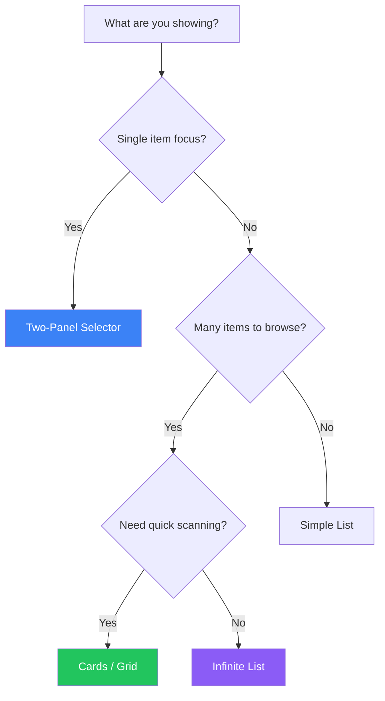

## Introduction

Lists are everywhere in software interfaces—email inboxes, product catalogs, search results, social feeds, file browsers, and more. How you display these collections dramatically affects usability and user satisfaction.

This article covers the essential patterns for displaying lists of items, helping you choose the right approach for your specific use case.

## Choosing a List Pattern

The right pattern depends on several factors:



## Core List Patterns

### 1. Cards

Cards are self-contained units of content that can be easily scanned and compared.

```tsx
function CardGrid({ items }) {
  return (
    <div className="grid grid-cols-1 sm:grid-cols-2 lg:grid-cols-3 gap-6">
      {items.map(item => (
        <article
          key={item.id}
          className="bg-white rounded-lg shadow-sm border overflow-hidden
                     hover:shadow-md transition-shadow"
        >
          {/* Visual element */}
          <div className="aspect-video bg-gray-100">
            {item.image && (
              
            )}
          </div>

          {/* Content */}
          <div className="p-4">
            <h3 className="font-semibold text-gray-900">{item.title}</h3>
            <p className="mt-1 text-sm text-gray-600 line-clamp-2">
              {item.description}
            </p>

            {/* Metadata */}
            <div className="mt-3 flex items-center justify-between text-sm">
              <span className="text-gray-500">{item.date}</span>
              <span className="font-medium text-blue-600">{item.price}</span>
            </div>
          </div>

          {/* Actions */}
          <div className="px-4 pb-4">
            <button className="w-full py-2 bg-blue-600 text-white rounded
                               hover:bg-blue-700">
              View Details
            </button>
          </div>
        </article>
      ))}
    </div>
  );
}
```

**When to use cards:**
- Items have visual content (images, thumbnails)
- Items need to be compared side-by-side
- Items are self-contained and can be understood in isolation
- Touch interfaces where cards provide clear tap targets

### 2. Two-Panel Selector (Master-Detail)

Shows a list on one side and details of the selected item on the other.

```tsx
function TwoPanelSelector({ items }) {
  const [selectedId, setSelectedId] = useState(items[0]?.id);
  const selectedItem = items.find(item => item.id === selectedId);

  return (
    <div className="flex h-screen">
      {/* List panel (master) */}
      <aside className="w-80 border-r overflow-auto">
        {items.map(item => (
          <button
            key={item.id}
            onClick={() => setSelectedId(item.id)}
            className={`
              w-full p-4 text-left border-b
              ${selectedId === item.id
                ? 'bg-blue-50 border-l-4 border-l-blue-600'
                : 'hover:bg-gray-50'
              }
            `}
          >
            <h3 className="font-medium truncate">{item.title}</h3>
            <p className="text-sm text-gray-500 truncate">{item.preview}</p>
            <span className="text-xs text-gray-400">{item.date}</span>
          </button>
        ))}
      </aside>

      {/* Detail panel */}
      <main className="flex-1 overflow-auto p-6">
        {selectedItem ? (
          <article>
            <h1 className="text-2xl font-bold">{selectedItem.title}</h1>
            <p className="mt-2 text-gray-600">{selectedItem.date}</p>
            <div className="mt-6 prose">{selectedItem.content}</div>
          </article>
        ) : (
          <div className="text-center text-gray-500 mt-20">
            Select an item to view details
          </div>
        )}
      </main>
    </div>
  );
}
```

**When to use two-panel:**
- Email clients, messaging apps
- Document management systems
- Settings pages with multiple sections
- Desktop applications with sufficient width

### 3. One-Window Drilldown

Navigate from list to detail by replacing the current view.

```tsx
function DrilldownList({ items }) {
  const [selectedItem, setSelectedItem] = useState(null);

  if (selectedItem) {
    return (
      <div>
        {/* Back navigation */}
        <button
          onClick={() => setSelectedItem(null)}
          className="flex items-center gap-2 p-4 text-blue-600"
        >
          ← Back to list
        </button>

        {/* Detail view */}
        <article className="p-4">
          <h1 className="text-2xl font-bold">{selectedItem.title}</h1>
          <div className="mt-4">{selectedItem.content}</div>
        </article>
      </div>
    );
  }

  return (
    <ul>
      {items.map(item => (
        <li key={item.id}>
          <button
            onClick={() => setSelectedItem(item)}
            className="w-full p-4 flex items-center justify-between
                       border-b hover:bg-gray-50"
          >
            <div>
              <h3 className="font-medium">{item.title}</h3>
              <p className="text-sm text-gray-500">{item.preview}</p>
            </div>
            <ChevronRight className="w-5 h-5 text-gray-400" />
          </button>
        </li>
      ))}
    </ul>
  );
}
```

**When to use drilldown:**
- Mobile interfaces with limited width
- Deep hierarchical navigation
- When detail view needs full attention

### 4. Infinite List

Load more items as the user scrolls.

```tsx
function InfiniteList() {
  const [items, setItems] = useState([]);
  const [page, setPage] = useState(1);
  const [hasMore, setHasMore] = useState(true);
  const [isLoading, setIsLoading] = useState(false);
  const loaderRef = useRef(null);

  // Intersection Observer for infinite scroll
  useEffect(() => {
    const observer = new IntersectionObserver(
      (entries) => {
        if (entries[0].isIntersecting && hasMore && !isLoading) {
          loadMore();
        }
      },
      { threshold: 0.1 }
    );

    if (loaderRef.current) {
      observer.observe(loaderRef.current);
    }

    return () => observer.disconnect();
  }, [hasMore, isLoading]);

  const loadMore = async () => {
    setIsLoading(true);
    const newItems = await fetchItems(page);

    if (newItems.length === 0) {
      setHasMore(false);
    } else {
      setItems(prev => [...prev, ...newItems]);
      setPage(prev => prev + 1);
    }
    setIsLoading(false);
  };

  return (
    <div>
      {items.map(item => (
        <ListItem key={item.id} item={item} />
      ))}

      {/* Loading trigger */}
      <div ref={loaderRef} className="py-8 text-center">
        {isLoading && <Spinner />}
        {!hasMore && <p className="text-gray-500">No more items</p>}
      </div>
    </div>
  );
}
```

**When to use infinite scroll:**
- Social feeds and timelines
- Search results exploration
- Content discovery interfaces

**When NOT to use:**
- When users need to reach the footer
- When total count matters
- For task-oriented interfaces

### 5. Pagination

Traditional page-based navigation through results.

```tsx
function PaginatedList({ totalItems, itemsPerPage = 20 }) {
  const [currentPage, setCurrentPage] = useState(1);
  const totalPages = Math.ceil(totalItems / itemsPerPage);

  return (
    <div>
      {/* List content */}
      <ItemList page={currentPage} perPage={itemsPerPage} />

      {/* Pagination controls */}
      <nav className="flex items-center justify-center gap-2 py-6">
        <button
          onClick={() => setCurrentPage(p => Math.max(1, p - 1))}
          disabled={currentPage === 1}
          className="px-3 py-2 border rounded disabled:opacity-50"
        >
          Previous
        </button>

        {/* Page numbers */}
        {generatePageNumbers(currentPage, totalPages).map(page => (
          <button
            key={page}
            onClick={() => setCurrentPage(page)}
            className={`
              w-10 h-10 rounded
              ${currentPage === page
                ? 'bg-blue-600 text-white'
                : 'border hover:bg-gray-50'
              }
            `}
          >
            {page}
          </button>
        ))}

        <button
          onClick={() => setCurrentPage(p => Math.min(totalPages, p + 1))}
          disabled={currentPage === totalPages}
          className="px-3 py-2 border rounded disabled:opacity-50"
        >
          Next
        </button>
      </nav>

      {/* Results info */}
      <p className="text-center text-sm text-gray-500">
        Showing {(currentPage - 1) * itemsPerPage + 1} -{' '}
        {Math.min(currentPage * itemsPerPage, totalItems)} of {totalItems}
      </p>
    </div>
  );
}
```

**When to use pagination:**
- E-commerce product listings
- When users need to bookmark specific pages
- When total count is important
- When users need to jump to specific positions

### 6. Carousel

Horizontal scrolling showcase for featured items.

```tsx
function Carousel({ items }) {
  const [currentIndex, setCurrentIndex] = useState(0);
  const containerRef = useRef(null);

  const scrollTo = (index: number) => {
    const container = containerRef.current;
    if (container) {
      const item = container.children[index];
      item?.scrollIntoView({ behavior: 'smooth', inline: 'center' });
      setCurrentIndex(index);
    }
  };

  return (
    <div className="relative">
      {/* Carousel container */}
      <div
        ref={containerRef}
        className="flex gap-4 overflow-x-auto snap-x snap-mandatory
                   scrollbar-hide px-4"
      >
        {items.map((item, index) => (
          <div
            key={item.id}
            className="flex-shrink-0 w-72 snap-center"
          >
            
            <h3 className="mt-2 font-medium">{item.title}</h3>
          </div>
        ))}
      </div>

      {/* Navigation arrows */}
      <button
        onClick={() => scrollTo(Math.max(0, currentIndex - 1))}
        className="absolute left-2 top-1/2 -translate-y-1/2
                   w-10 h-10 bg-white rounded-full shadow flex
                   items-center justify-center"
        disabled={currentIndex === 0}
      >
        ←
      </button>
      <button
        onClick={() => scrollTo(Math.min(items.length - 1, currentIndex + 1))}
        className="absolute right-2 top-1/2 -translate-y-1/2
                   w-10 h-10 bg-white rounded-full shadow flex
                   items-center justify-center"
        disabled={currentIndex === items.length - 1}
      >
        →
      </button>

      {/* Dots indicator */}
      <div className="flex justify-center gap-2 mt-4">
        {items.map((_, index) => (
          <button
            key={index}
            onClick={() => scrollTo(index)}
            className={`
              w-2 h-2 rounded-full
              ${index === currentIndex ? 'bg-blue-600' : 'bg-gray-300'}
            `}
          />
        ))}
      </div>
    </div>
  );
}
```

**When to use carousel:**
- Featured content showcase
- Image galleries
- Onboarding flows
- Limited horizontal space

### 7. Thumbnail Grid

Visual-first grid layout for image-heavy content.

```tsx
function ThumbnailGrid({ items, onSelect }) {
  return (
    <div className="grid grid-cols-2 sm:grid-cols-3 md:grid-cols-4
                    lg:grid-cols-5 gap-1">
      {items.map(item => (
        <button
          key={item.id}
          onClick={() => onSelect(item)}
          className="relative aspect-square group"
        >
          

          {/* Hover overlay */}
          <div className="absolute inset-0 bg-black/50 opacity-0
                          group-hover:opacity-100 transition-opacity
                          flex items-center justify-center">
            <span className="text-white text-sm">{item.title}</span>
          </div>

          {/* Selection indicator */}
          {item.selected && (
            <div className="absolute top-2 right-2 w-6 h-6 bg-blue-600
                            rounded-full flex items-center justify-center">
              <CheckIcon className="w-4 h-4 text-white" />
            </div>
          )}
        </button>
      ))}
    </div>
  );
}
```

## List Enhancements

### Jump to Item

Quick navigation to specific items in long lists.

```tsx
function AlphabeticJump({ items, groupBy }) {
  const groups = groupItemsByLetter(items, groupBy);
  const letters = Object.keys(groups);

  const scrollToLetter = (letter: string) => {
    document.getElementById(`group-${letter}`)?.scrollIntoView({
      behavior: 'smooth'
    });
  };

  return (
    <div className="flex">
      {/* Main list */}
      <div className="flex-1 overflow-auto">
        {letters.map(letter => (
          <div key={letter} id={`group-${letter}`}>
            <h3 className="sticky top-0 bg-gray-100 px-4 py-2 font-semibold">
              {letter}
            </h3>
            {groups[letter].map(item => (
              <ListItem key={item.id} item={item} />
            ))}
          </div>
        ))}
      </div>

      {/* Alphabet sidebar */}
      <nav className="w-6 flex flex-col justify-center text-xs">
        {letters.map(letter => (
          <button
            key={letter}
            onClick={() => scrollToLetter(letter)}
            className="py-0.5 hover:text-blue-600"
          >
            {letter}
          </button>
        ))}
      </nav>
    </div>
  );
}
```

### List Inlay

Expand item details inline without navigating away.

```tsx
function ExpandableList({ items }) {
  const [expandedId, setExpandedId] = useState(null);

  return (
    <ul>
      {items.map(item => (
        <li key={item.id} className="border-b">
          <button
            onClick={() => setExpandedId(
              expandedId === item.id ? null : item.id
            )}
            className="w-full p-4 flex items-center justify-between"
          >
            <span>{item.title}</span>
            <ChevronDown
              className={`w-5 h-5 transition-transform
                ${expandedId === item.id ? 'rotate-180' : ''}`}
            />
          </button>

          {/* Expanded content */}
          {expandedId === item.id && (
            <div className="px-4 pb-4 bg-gray-50">
              <p>{item.details}</p>
              <div className="mt-4 flex gap-2">
                <button className="btn-primary">Action 1</button>
                <button className="btn-secondary">Action 2</button>
              </div>
            </div>
          )}
        </li>
      ))}
    </ul>
  );
}
```

## Pattern Comparison

| Pattern | Best For | Avoid When |
|---------|----------|------------|
| Cards | Visual content, comparison | Dense data, limited space |
| Two-Panel | Detail-heavy items, desktop | Mobile, simple items |
| Drilldown | Mobile, deep hierarchy | Frequent switching needed |
| Infinite List | Feeds, discovery | Footer needed, task-focused |
| Pagination | E-commerce, bookmarking | Continuous browsing |
| Carousel | Featured items, limited space | Many items to browse |
| Thumbnail Grid | Photo galleries, visual selection | Text-heavy content |

## Summary

The right list pattern depends on your content type, user tasks, and platform constraints. Key considerations:

1. **Visual vs. Text content**: Cards and grids for visual, lists for text
2. **Detail complexity**: Two-panel for complex, drilldown for simple
3. **Browsing behavior**: Infinite for discovery, pagination for directed search
4. **Screen size**: Two-panel for desktop, drilldown for mobile

Choose patterns that match how users actually consume your content, not just how it looks in mockups.

## References

- Tidwell, Jenifer, et al. "Designing Interfaces" (3rd Edition), Chapter 7
- Nielsen Norman Group - List vs. Grid Views
- Material Design - Lists
- Apple Human Interface Guidelines - Collections
