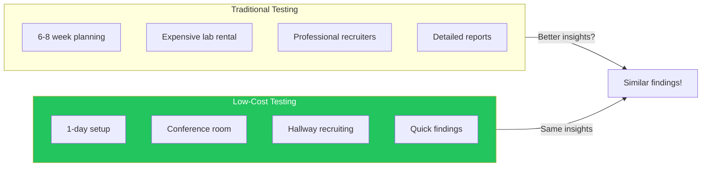

## Introduction

Many teams skip usability testing because they think it requires expensive labs, specialized equipment, or weeks of planning. The truth is: even a simple test with a few participants can reveal critical problems that would otherwise go unnoticed.

Steve Krug, in "Don't Make Me Think," famously advocated for "usability testing on 10 cents a day"—the idea that frequent, informal testing beats occasional formal studies. This article shows you how to implement that approach.

## The Case for Low-Cost Testing



**Key insight:** Testing with 5 users reveals ~85% of usability problems. You don't need dozens of participants to find the big issues.

## Planning a Quick Test

### What to Test

Focus on critical user tasks, not everything:

```markdown
## Good Test Candidates
- Sign-up / onboarding flow
- Core feature first-time use
- Checkout / payment process
- Search and navigation
- Error recovery

## Less Ideal for Quick Tests
- Minor visual preferences
- Edge cases with rare scenarios
- Performance optimization
- Accessibility (needs specific methods)
```

### Creating Tasks

Write realistic tasks that don't lead the user:

```markdown
## Bad Tasks (Leading)
❌ "Use the search box in the top right to find running shoes"
❌ "Click the blue button to add to cart"

## Good Tasks (Realistic)
✓ "You want to buy running shoes for trail running. Find a pair you like."
✓ "You changed your mind about your purchase. Remove it from your cart."

## Task Template
"Imagine you are [context]. You want to [goal].
Starting from this page, [specific action to complete]."
```

### Sample Test Script

```markdown
## Usability Test Script

### Introduction (2-3 minutes)
"Thanks for helping us today. We're testing the website, not you—
there are no wrong answers. Please think out loud as you go.
I'll ask you to do a few tasks. If you get stuck, that's valuable
information for us. Any questions before we start?"

### Warm-up (1-2 minutes)
"Before we begin, tell me: have you ever used [similar product]?"

### Tasks (15-20 minutes)

**Task 1: Finding Information**
"You're interested in [product/feature]. Find out [specific info]."
- Observe: Where do they look first?
- Note: What do they click?
- Ask: "What are you thinking right now?"

**Task 2: Completing an Action**
"Now I'd like you to [complete action]. Please start whenever you're ready."
- Time how long it takes
- Note any hesitation or backtracking
- Don't help unless they're completely stuck

**Task 3: Recovery**
"Something went wrong. [Describe error state]. What would you do?"
- Observe how they interpret the error
- Note if they can recover

### Wrap-up (5 minutes)
"What was the hardest part?"
"What would you change?"
"Any other thoughts?"
```

## Running the Test

### The Moderator's Role

```tsx
interface ModeratorGuidelines {
  do: [
    "Stay neutral—no reactions to user actions",
    "Ask 'What are you thinking?' frequently",
    "Let them struggle (within reason)",
    "Take notes on behavior, not just words",
    "Ask follow-up questions: 'Why did you do that?'"
  ];

  dont: [
    "Help or guide them to the answer",
    "React when they do something wrong",
    "Ask leading questions",
    "Defend the design",
    "Explain how it's supposed to work"
  ];
}
```

### Key Phrases to Use

| Situation | What to Say |
|-----------|-------------|
| User is silent | "What are you thinking right now?" |
| User asks for help | "What would you do if I wasn't here?" |
| User seems stuck | "Is there anything you'd like to try?" |
| User completes task | "How did that feel? Was it what you expected?" |
| User makes an error | [Stay silent, observe] |
| User gets frustrated | "That's really helpful feedback. Take your time." |

### Taking Notes

Focus on observations, not interpretations:

```markdown
## Observation Note Template

**Timestamp:** 3:42
**Task:** Finding product price
**Observation:** User scrolled past the price twice before seeing it
**Quote:** "Where's the price? I keep missing it."
**Severity:** High—affects purchase decision

## Quick Notation System
✓ Task completed successfully
✗ Task failed
? User expressed confusion
! Critical finding
→ User expectation vs. reality mismatch
```

## After the Test

### Debriefing

Immediately after each session, spend 5 minutes capturing:

```markdown
## Post-Session Debrief

### Top 3 Issues Observed
1. [Most severe problem]
2. [Second most severe]
3. [Third most severe]

### Surprising Moments
- [Unexpected user behavior]

### Quotes Worth Remembering
- "[Exact user quote]"

### Questions for Next Session
- [Things to watch for]
```

### Analyzing Findings

After all sessions, look for patterns:

```tsx
interface FindingAnalysis {
  issue: string;
  frequency: number;      // How many users encountered it
  severity: 'critical' | 'major' | 'minor';
  quotes: string[];       // User quotes about the issue
  recommendation: string; // Suggested fix
}

// Prioritization matrix
function prioritizeFindings(findings: FindingAnalysis[]) {
  return findings.sort((a, b) => {
    const severityScore = { critical: 3, major: 2, minor: 1 };
    const aScore = severityScore[a.severity] * a.frequency;
    const bScore = severityScore[b.severity] * b.frequency;
    return bScore - aScore;
  });
}
```

### Severity Ratings

| Severity | Definition | Example |
|----------|------------|---------|
| Critical | User cannot complete task | Can't find checkout button |
| Major | User completes with significant difficulty | Confusing error message |
| Minor | User notices but works around it | Unclear label |

## Presenting Results

### One-Page Summary Format

```markdown
# Usability Test Results: [Feature/Page Name]

**Date:** January 15, 2025
**Participants:** 5 users
**Test Focus:** New checkout flow

## Key Findings

### 🔴 Critical Issues
1. **3/5 users couldn't find the promo code field**
   - Hidden below the fold on mobile
   - Recommendation: Move above order summary

### 🟡 Major Issues
1. **4/5 users confused by shipping options**
   - "Express" vs "Priority" unclear
   - Recommendation: Add delivery date estimates

### 🟢 What Worked
- All users successfully added items to cart
- Payment form was clear and easy to complete

## Recommended Next Steps
1. Fix promo code visibility (1 day)
2. Clarify shipping options (2 days)
3. Re-test with 3 users after changes
```

### Video Highlights

Create a 3-5 minute highlight reel:

```markdown
## Highlight Reel Structure

1. **Introduction** (30 sec)
   - What we tested, how many users

2. **The Good** (1 min)
   - Clips of successful moments
   - Positive quotes

3. **The Problems** (2-3 min)
   - Clip 1: User struggling with [issue]
   - Clip 2: User quote about confusion
   - Clip 3: Multiple users hitting same problem

4. **Recommendations** (30 sec)
   - Quick summary of proposed fixes
```

## Testing Variations

### Remote Unmoderated Testing

For quick, scalable feedback:

```tsx
function RemoteTestSetup() {
  return {
    tools: [
      'UserTesting.com',
      'Maze',
      'UsabilityHub',
      'Lookback'
    ],
    pros: [
      'No scheduling needed',
      'Larger sample size',
      'Geographic diversity',
      'Lower cost per test'
    ],
    cons: [
      'No follow-up questions',
      'Less context',
      'May miss subtle issues'
    ],
    bestFor: [
      'Prototype validation',
      'A/B preference testing',
      'First-click testing',
      'Simple task flows'
    ]
  };
}
```

### Guerrilla Testing

Testing in public spaces:

```markdown
## Guerrilla Testing Checklist

### Location
- [ ] Coffee shop near target demographic
- [ ] Permission from establishment if needed
- [ ] Quiet enough to hear user

### Equipment
- [ ] Laptop or tablet with prototype
- [ ] Consent form (simple, one paragraph)
- [ ] Small thank-you gift ($5 coffee card)

### Approach Script
"Hi, I'm working on a website and would love 5 minutes of
your feedback. I'll buy you a coffee for your time.
Would you be willing to try something and share your thoughts?"

### Quick Test Format
- 1 task only
- 3-5 minutes max
- Focus on first impressions
```

### Five-Second Test

For first impressions and visual hierarchy:

```tsx
function FiveSecondTest({ design, questions }) {
  const [phase, setPhase] = useState<'show' | 'ask' | 'done'>('show');

  useEffect(() => {
    if (phase === 'show') {
      const timer = setTimeout(() => setPhase('ask'), 5000);
      return () => clearTimeout(timer);
    }
  }, [phase]);

  return (
    <div>
      {phase === 'show' && (
        
      )}

      {phase === 'ask' && (
        <div>
          <h2>The design has been hidden. Please answer:</h2>
          {questions.map(q => (
            <div key={q.id}>
              <p>{q.text}</p>
              <textarea placeholder="Your answer..." />
            </div>
          ))}
        </div>
      )}
    </div>
  );
}

// Common five-second test questions:
const questions = [
  "What is this page about?",
  "What company or brand is this for?",
  "What would you click first?",
  "What stood out most?",
  "What is the main action you can take?"
];
```

## Building a Testing Culture

### Making Testing Routine

```markdown
## Monthly Testing Rhythm

**Week 1:** Identify what to test
- Review analytics for problem areas
- Check support tickets for common issues
- Pick 2-3 tasks to test

**Week 2:** Recruit and prepare
- Find 3-5 participants
- Write task scripts
- Set up recording

**Week 3:** Run tests
- 30-45 minutes per participant
- Debrief after each session

**Week 4:** Share and act
- Create one-page summary
- Present highlight reel to team
- Prioritize fixes for next sprint
```

### Getting Buy-In

Convince stakeholders with these approaches:

| Objection | Response |
|-----------|----------|
| "We don't have time" | "3 tests take half a day and prevent weeks of rework" |
| "We don't have budget" | "Conference room + 5 coworkers = free testing" |
| "We know our users" | "Let's validate that—30 minutes of observation" |
| "We'll test after launch" | "Finding issues now costs 10x less to fix" |

## Summary

| Aspect | Traditional Testing | Low-Cost Testing |
|--------|--------------------|--------------------|
| Planning | 6-8 weeks | 1-3 days |
| Participants | 8-12 | 3-5 |
| Location | Usability lab | Any quiet room |
| Cost | $5,000-$15,000 | $0-$500 |
| Deliverable | 50-page report | 1-page summary |
| Frequency | Quarterly | Monthly or more |
| Findings | Same critical issues | Same critical issues |

The goal isn't perfect testing—it's finding the biggest problems before your users do. Start small, test often, and iterate based on what you learn.

## References

- Krug, Steve. "Don't Make Me Think", Chapter 9
- Krug, Steve. "Rocket Surgery Made Easy"
- Nielsen Norman Group - Usability Testing 101
- Rubin & Chisnell. "Handbook of Usability Testing"
