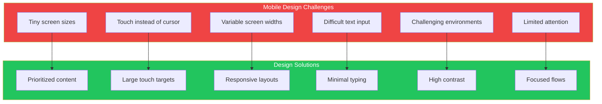
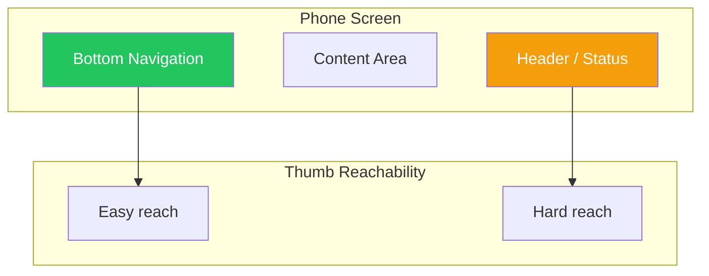

## Introduction

Mobile devices have become the primary way people access the web. Designing for mobile first isn't just about making things smaller—it's about embracing the unique constraints and opportunities of touch interfaces, variable screen sizes, and mobile contexts.

This article covers essential patterns for creating mobile interfaces that feel natural and effortless.

## Challenges of Mobile Design

Mobile design presents unique challenges that desktop designers often overlook:



## Core Mobile Patterns

### 1. Touch Targets

Fingers are imprecise. Design for the finger, not the cursor.

**Minimum sizes:**

| Platform | Minimum Target Size |
|----------|-------------------|
| iOS | 44×44 points |
| Android | 48×48 dp |
| Web (mobile) | 44×44 CSS pixels |

```tsx
// Bad: Tiny touch targets
function BadNavigation() {
  return (
    <nav className="flex gap-1">
      <a href="/" className="p-1 text-sm">Home</a>
      <a href="/about" className="p-1 text-sm">About</a>
    </nav>
  );
}

// Good: Generous touch targets
function GoodNavigation() {
  return (
    <nav className="flex gap-2">
      <a
        href="/"
        className="px-4 py-3 min-h-[44px] min-w-[44px]
                   flex items-center justify-center"
      >
        Home
      </a>
      <a
        href="/about"
        className="px-4 py-3 min-h-[44px] min-w-[44px]
                   flex items-center justify-center"
      >
        About
      </a>
    </nav>
  );
}
```

```css
/* Ensure minimum touch target size */
.touch-target {
  min-height: 44px;
  min-width: 44px;
  padding: 12px 16px;
}

/* Increase clickable area without visual change */
.icon-button {
  position: relative;
}

.icon-button::before {
  content: '';
  position: absolute;
  top: -8px;
  right: -8px;
  bottom: -8px;
  left: -8px;
}
```

### 2. Bottom Navigation

Place primary navigation within thumb reach at the bottom of the screen.



```tsx
function MobileLayout({ children }) {
  return (
    <div className="min-h-screen flex flex-col">
      {/* Content takes available space */}
      <main className="flex-1 pb-16 overflow-auto">
        {children}
      </main>

      {/* Fixed bottom navigation */}
      <nav className="fixed bottom-0 left-0 right-0 h-16
                      bg-white border-t safe-area-bottom">
        <div className="flex justify-around items-center h-full">
          <NavItem icon="home" label="Home" href="/" />
          <NavItem icon="search" label="Search" href="/search" />
          <NavItem icon="add" label="Create" href="/create" primary />
          <NavItem icon="bell" label="Alerts" href="/alerts" />
          <NavItem icon="user" label="Profile" href="/profile" />
        </div>
      </nav>
    </div>
  );
}

function NavItem({ icon, label, href, primary }) {
  return (
    <a
      href={href}
      className={`
        flex flex-col items-center justify-center
        min-w-[64px] min-h-[48px] p-2
        ${primary ? 'text-blue-600' : 'text-gray-600'}
      `}
    >
      <Icon name={icon} className="w-6 h-6" />
      <span className="text-xs mt-1">{label}</span>
    </a>
  );
}
```

### 3. Vertical Stack

Stack content vertically for easy scrolling and scanning.

```tsx
function MobileFeed({ items }) {
  return (
    <div className="flex flex-col">
      {items.map(item => (
        <article
          key={item.id}
          className="p-4 border-b"
        >
          {/* Vertical stack within each item */}
          <header className="flex items-center gap-3">
            <Avatar src={item.author.avatar} />
            <div>
              <p className="font-medium">{item.author.name}</p>
              <p className="text-sm text-gray-500">{item.time}</p>
            </div>
          </header>

          <p className="mt-3">{item.content}</p>

          {item.image && (
            
          )}

          <footer className="mt-3 flex gap-4">
            <ActionButton icon="heart" count={item.likes} />
            <ActionButton icon="comment" count={item.comments} />
            <ActionButton icon="share" />
          </footer>
        </article>
      ))}
    </div>
  );
}
```

### 4. Generous Borders (Spacing)

Use ample spacing to prevent mis-taps and improve readability.

```tsx
function ListItem({ item, onSelect }) {
  return (
    <button
      onClick={() => onSelect(item)}
      className="w-full flex items-center gap-4 p-4
                 text-left border-b active:bg-gray-50"
    >
      {/* Thumbnail with spacing */}
      <div className="w-12 h-12 rounded-lg bg-gray-200 flex-shrink-0">
        {item.thumbnail && (
          
        )}
      </div>

      {/* Content with proper spacing */}
      <div className="flex-1 min-w-0">
        <h3 className="font-medium truncate">{item.title}</h3>
        <p className="text-sm text-gray-500 mt-1 truncate">
          {item.description}
        </p>
      </div>

      {/* Action indicator */}
      <ChevronRight className="w-5 h-5 text-gray-400 flex-shrink-0" />
    </button>
  );
}
```

```css
/* Mobile-friendly spacing scale */
:root {
  --space-1: 4px;
  --space-2: 8px;
  --space-3: 12px;
  --space-4: 16px;
  --space-5: 24px;
  --space-6: 32px;
}

/* Content padding for mobile */
.mobile-container {
  padding-left: 16px;
  padding-right: 16px;
}

/* Comfortable list item spacing */
.list-item {
  padding: 16px;
  gap: 12px;
}
```

### 5. Filmstrip (Horizontal Scroll)

Use horizontal scrolling for related content that doesn't fit vertically.

```tsx
function HorizontalScroller({ title, items }) {
  return (
    <section className="py-4">
      <h2 className="px-4 text-lg font-semibold mb-3">{title}</h2>

      <div className="flex gap-3 overflow-x-auto px-4
                      scrollbar-hide snap-x snap-mandatory">
        {items.map(item => (
          <div
            key={item.id}
            className="flex-shrink-0 w-40 snap-start"
          >
            
            <h3 className="mt-2 text-sm font-medium truncate">
              {item.title}
            </h3>
            <p className="text-sm text-gray-500">{item.subtitle}</p>
          </div>
        ))}
      </div>
    </section>
  );
}
```

```css
/* Hide scrollbar but keep functionality */
.scrollbar-hide {
  -ms-overflow-style: none;
  scrollbar-width: none;
}

.scrollbar-hide::-webkit-scrollbar {
  display: none;
}

/* Scroll snap for carousel feel */
.snap-x {
  scroll-snap-type: x mandatory;
}

.snap-start {
  scroll-snap-align: start;
}
```

### 6. Loading and Progress Indicators

Always show feedback for loading states.

```tsx
function LoadingStates() {
  return (
    <div>
      {/* Skeleton for content loading */}
      <div className="animate-pulse">
        <div className="h-4 bg-gray-200 rounded w-3/4 mb-2" />
        <div className="h-4 bg-gray-200 rounded w-1/2" />
      </div>

      {/* Spinner for actions */}
      <button disabled className="flex items-center gap-2">
        <Spinner className="w-4 h-4 animate-spin" />
        Loading...
      </button>

      {/* Pull-to-refresh indicator */}
      <PullToRefresh onRefresh={handleRefresh}>
        <FeedContent />
      </PullToRefresh>

      {/* Progress for uploads */}
      <ProgressBar progress={uploadProgress} />
    </div>
  );
}

function PullToRefresh({ onRefresh, children }) {
  const [isRefreshing, setIsRefreshing] = useState(false);
  const [pullDistance, setPullDistance] = useState(0);

  // Touch handlers for pull detection
  return (
    <div className="relative">
      {/* Pull indicator */}
      <div
        className="absolute top-0 left-0 right-0 flex justify-center
                   transition-transform"
        style={{ transform: `translateY(${pullDistance - 40}px)` }}
      >
        {isRefreshing ? (
          <Spinner className="w-6 h-6 animate-spin" />
        ) : (
          <ArrowDown className="w-6 h-6" />
        )}
      </div>

      {children}
    </div>
  );
}
```

### 7. Touch Tools

Use gestures and touch interactions appropriately.

```tsx
function SwipeableCard({ item, onDelete, onArchive }) {
  const [offset, setOffset] = useState(0);
  const [action, setAction] = useState(null);

  const handleTouchMove = (e) => {
    const delta = e.touches[0].clientX - startX;
    setOffset(delta);

    if (delta > 80) setAction('archive');
    else if (delta < -80) setAction('delete');
    else setAction(null);
  };

  return (
    <div className="relative overflow-hidden">
      {/* Background actions revealed on swipe */}
      <div className="absolute inset-y-0 left-0 w-20 bg-green-500
                      flex items-center justify-center">
        <ArchiveIcon className="w-6 h-6 text-white" />
      </div>
      <div className="absolute inset-y-0 right-0 w-20 bg-red-500
                      flex items-center justify-center">
        <TrashIcon className="w-6 h-6 text-white" />
      </div>

      {/* Swipeable content */}
      <div
        className="relative bg-white transition-transform"
        style={{ transform: `translateX(${offset}px)` }}
        onTouchStart={handleTouchStart}
        onTouchMove={handleTouchMove}
        onTouchEnd={handleTouchEnd}
      >
        <CardContent item={item} />
      </div>
    </div>
  );
}
```

## Responsive Design Strategies

### Mobile-First CSS

Start with mobile styles, then add complexity for larger screens.

```css
/* Base: Mobile styles */
.container {
  padding: 16px;
}

.grid {
  display: flex;
  flex-direction: column;
  gap: 16px;
}

.sidebar {
  display: none;
}

/* Tablet and up */
@media (min-width: 768px) {
  .container {
    padding: 24px;
  }

  .grid {
    display: grid;
    grid-template-columns: repeat(2, 1fr);
    gap: 24px;
  }
}

/* Desktop */
@media (min-width: 1024px) {
  .container {
    padding: 32px;
    max-width: 1200px;
    margin: 0 auto;
  }

  .grid {
    grid-template-columns: repeat(3, 1fr);
  }

  .sidebar {
    display: block;
  }
}
```

### Responsive Components

```tsx
function ResponsiveLayout({ children, sidebar }) {
  const isMobile = useMediaQuery('(max-width: 767px)');
  const [showSidebar, setShowSidebar] = useState(false);

  return (
    <div className="flex min-h-screen">
      {/* Mobile: Sidebar as overlay */}
      {isMobile ? (
        <>
          <Sheet open={showSidebar} onClose={() => setShowSidebar(false)}>
            {sidebar}
          </Sheet>

          <button
            onClick={() => setShowSidebar(true)}
            className="fixed bottom-20 right-4 z-10
                       w-14 h-14 rounded-full bg-blue-600 text-white
                       shadow-lg flex items-center justify-center"
          >
            <MenuIcon className="w-6 h-6" />
          </button>
        </>
      ) : (
        /* Desktop: Sidebar always visible */
        <aside className="w-64 border-r bg-gray-50 p-4">
          {sidebar}
        </aside>
      )}

      <main className="flex-1">{children}</main>
    </div>
  );
}
```

## Safe Areas

Account for device notches and home indicators.

```css
/* Safe area insets for notched devices */
.bottom-nav {
  padding-bottom: env(safe-area-inset-bottom, 0);
}

.top-header {
  padding-top: env(safe-area-inset-top, 0);
}

.full-width-content {
  padding-left: env(safe-area-inset-left, 16px);
  padding-right: env(safe-area-inset-right, 16px);
}
```

```tsx
function SafeAreaLayout({ children }) {
  return (
    <div className="min-h-screen flex flex-col">
      {/* Top safe area */}
      <div className="bg-blue-600 pt-[env(safe-area-inset-top)]">
        <header className="h-14 flex items-center px-4">
          <h1 className="text-white font-semibold">App Title</h1>
        </header>
      </div>

      {/* Content */}
      <main className="flex-1">{children}</main>

      {/* Bottom safe area */}
      <nav className="bg-white border-t pb-[env(safe-area-inset-bottom)]">
        <div className="h-14 flex items-center justify-around">
          {/* Nav items */}
        </div>
      </nav>
    </div>
  );
}
```

## Performance Considerations

```tsx
function OptimizedMobileList({ items }) {
  return (
    <VirtualList
      items={items}
      itemHeight={80}
      renderItem={(item) => (
        <ListItem item={item} />
      )}
      // Only render visible items
      overscan={5}
    />
  );
}

// Lazy load images
function LazyImage({ src, alt, ...props }) {
  return (
    
  );
}

// Defer non-critical resources
function MobileApp() {
  useEffect(() => {
    // Load analytics after initial render
    import('./analytics').then(m => m.init());
  }, []);

  return <App />;
}
```

## Summary

| Pattern | Purpose | Key Consideration |
|---------|---------|-------------------|
| Touch Targets | Prevent mis-taps | Minimum 44×44 pixels |
| Bottom Navigation | Thumb accessibility | 3-5 primary destinations |
| Vertical Stack | Natural scrolling | One column, full width |
| Generous Borders | Visual breathing room | 16px minimum spacing |
| Filmstrip | Horizontal browsing | Snap scroll, peek next item |
| Loading Indicators | Feedback during waits | Skeleton, spinner, progress |
| Touch Tools | Native-feeling gestures | Swipe, pull-to-refresh |

The key to mobile design is embracing constraints. Small screens force you to prioritize what truly matters. Touch interaction requires generous targets. Limited attention demands focused experiences.

## References

- Tidwell, Jenifer, et al. "Designing Interfaces" (3rd Edition), Chapter 6
- Apple Human Interface Guidelines - iOS
- Material Design - Mobile Guidelines
- Nielsen Norman Group - Mobile UX
