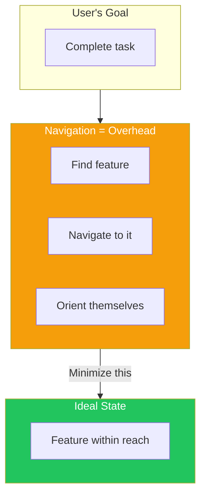
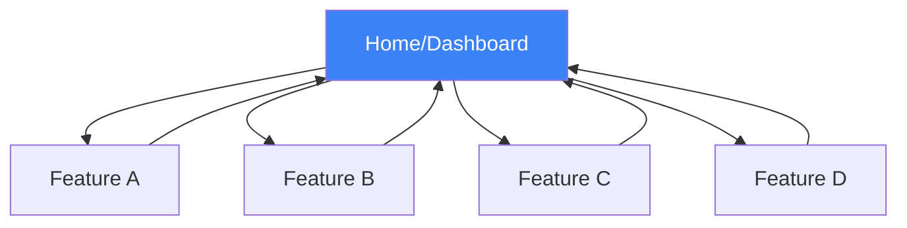
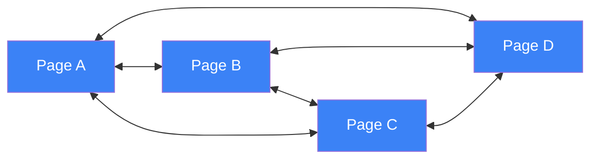
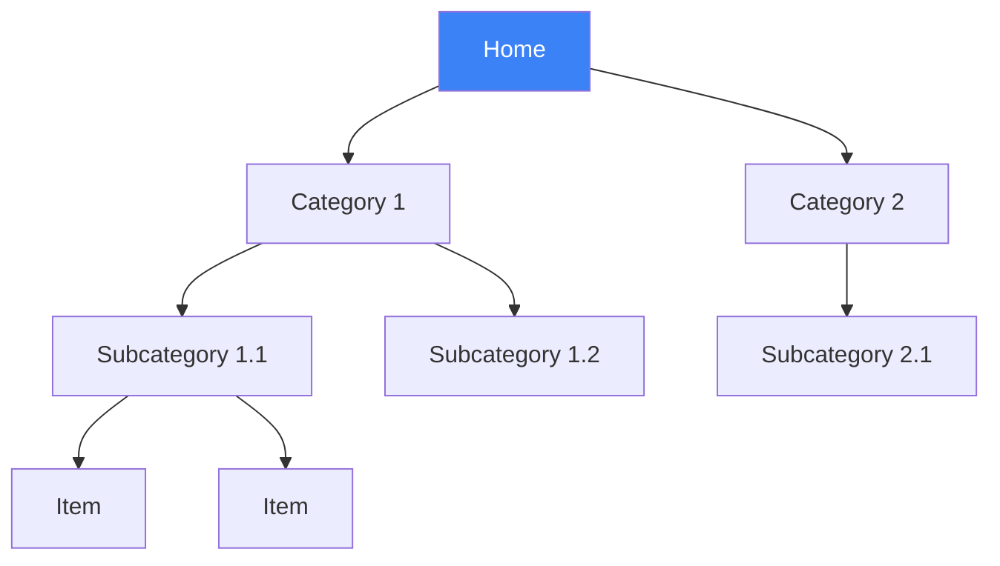
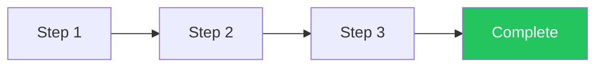

## Introduction

Navigation is the backbone of user experience. No matter how good your content is, if users can't find their way around, they'll leave. Good navigation answers three fundamental questions:

1. **Where am I?**
2. **Where can I go?**
3. **How do I get there?**

This article explores navigation patterns that help users move confidently through your application.

## The Purpose of Navigation

Navigation can be challenging because moving around in a website or application is like commuting: you need to do it to get where you want to go, but it's dull, and the time spent feels wasted. The best kind of navigation is none at all—having everything within reach.



## Navigational Models

### Hub and Spoke

Users start from a central hub and navigate to spokes, returning to the hub to go elsewhere.



**Best for:** Mobile apps, dashboards, settings screens

```tsx
function MobileApp() {
  const [currentScreen, setCurrentScreen] = useState('home');

  return (
    <div>
      {/* Content area - the "spoke" */}
      <main>
        {currentScreen === 'home' && <HomeScreen />}
        {currentScreen === 'search' && <SearchScreen />}
        {currentScreen === 'profile' && <ProfileScreen />}
        {currentScreen === 'settings' && <SettingsScreen />}
      </main>

      {/* Tab bar - the "hub" always accessible */}
      <nav className="fixed bottom-0 w-full bg-white border-t">
        <div className="flex justify-around py-2">
          {['home', 'search', 'profile', 'settings'].map(screen => (
            <button
              key={screen}
              onClick={() => setCurrentScreen(screen)}
              className={currentScreen === screen ? 'text-blue-600' : 'text-gray-400'}
            >
              <Icon name={screen} />
            </button>
          ))}
        </div>
      </nav>
    </div>
  );
}
```

### Fully Connected

Users can navigate directly between any pages.



**Best for:** Small sites, related content sections

```tsx
function GlobalNavigation({ pages, currentPage }) {
  return (
    <nav className="flex gap-6">
      {pages.map(page => (
        <a
          key={page.href}
          href={page.href}
          className={`
            ${currentPage === page.href
              ? 'text-blue-600 border-b-2 border-blue-600'
              : 'text-gray-600 hover:text-gray-900'
            }
          `}
        >
          {page.label}
        </a>
      ))}
    </nav>
  );
}
```

### Multilevel (Tree)

Content organized in nested hierarchies.



**Best for:** E-commerce, documentation, file systems

### Step by Step (Wizard)

Linear progression through a process.



**Best for:** Checkouts, onboarding, forms

## Essential Navigation Patterns

### 1. Breadcrumbs

Show users their location in the hierarchy and provide easy backtracking.

```tsx
function Breadcrumbs({ items }) {
  return (
    <nav aria-label="Breadcrumb" className="text-sm">
      <ol className="flex items-center gap-2">
        {items.map((item, index) => (
          <li key={item.href} className="flex items-center gap-2">
            {index > 0 && <span className="text-gray-400">/</span>}

            {index === items.length - 1 ? (
              // Current page - not a link
              <span className="text-gray-900 font-medium">
                {item.label}
              </span>
            ) : (
              // Parent pages - clickable links
              <a
                href={item.href}
                className="text-gray-500 hover:text-gray-700"
              >
                {item.label}
              </a>
            )}
          </li>
        ))}
      </ol>
    </nav>
  );
}

// Usage
<Breadcrumbs items={[
  { href: '/', label: 'Home' },
  { href: '/products', label: 'Products' },
  { href: '/products/electronics', label: 'Electronics' },
  { href: '/products/electronics/laptops', label: 'Laptops' },
]} />
```

### 2. Progress Indicator

Show users where they are in a multi-step process.

```tsx
function ProgressIndicator({ steps, currentStep }) {
  return (
    <div className="flex items-center justify-between">
      {steps.map((step, index) => {
        const status = index < currentStep
          ? 'completed'
          : index === currentStep
            ? 'current'
            : 'upcoming';

        return (
          <React.Fragment key={step.id}>
            {/* Step indicator */}
            <div className="flex flex-col items-center">
              <div className={`
                w-10 h-10 rounded-full flex items-center justify-center
                ${status === 'completed' ? 'bg-green-500 text-white' : ''}
                ${status === 'current' ? 'bg-blue-600 text-white' : ''}
                ${status === 'upcoming' ? 'bg-gray-200 text-gray-500' : ''}
              `}>
                {status === 'completed' ? '✓' : index + 1}
              </div>
              <span className={`
                mt-2 text-sm
                ${status === 'current' ? 'font-medium text-gray-900' : 'text-gray-500'}
              `}>
                {step.label}
              </span>
            </div>

            {/* Connector line */}
            {index < steps.length - 1 && (
              <div className={`
                flex-1 h-1 mx-4
                ${index < currentStep ? 'bg-green-500' : 'bg-gray-200'}
              `} />
            )}
          </React.Fragment>
        );
      })}
    </div>
  );
}
```

### 3. Escape Hatch

Always provide a way to exit the current context and return to safety.

```tsx
function Modal({ isOpen, onClose, children }) {
  // Escape key closes modal
  useEffect(() => {
    const handleEscape = (e) => {
      if (e.key === 'Escape') onClose();
    };
    window.addEventListener('keydown', handleEscape);
    return () => window.removeEventListener('keydown', handleEscape);
  }, [onClose]);

  if (!isOpen) return null;

  return (
    <div className="fixed inset-0 z-50">
      {/* Click backdrop to close */}
      <div
        className="absolute inset-0 bg-black/50"
        onClick={onClose}
      />

      <div className="relative bg-white rounded-lg max-w-lg mx-auto mt-20 p-6">
        {/* Visible close button */}
        <button
          onClick={onClose}
          className="absolute top-4 right-4 text-gray-400 hover:text-gray-600"
          aria-label="Close"
        >
          ✕
        </button>

        {children}
      </div>
    </div>
  );
}

function WizardFlow({ onCancel }) {
  return (
    <div>
      {/* Always show escape route */}
      <header className="flex justify-between items-center mb-6">
        <h1>Setup Wizard</h1>
        <button
          onClick={onCancel}
          className="text-gray-500 hover:text-gray-700"
        >
          Cancel and exit
        </button>
      </header>

      {/* Wizard content */}
    </div>
  );
}
```

### 4. Clear Entry Points

Make it obvious where users should start.

```tsx
function Homepage() {
  return (
    <div>
      {/* Hero with clear primary action */}
      <section className="text-center py-20">
        <h1 className="text-4xl font-bold">
          Welcome to Our Platform
        </h1>
        <p className="mt-4 text-xl text-gray-600">
          The easiest way to manage your projects
        </p>

        {/* Clear entry points */}
        <div className="mt-8 flex justify-center gap-4">
          <a
            href="/signup"
            className="px-8 py-3 bg-blue-600 text-white font-medium
                       rounded-lg hover:bg-blue-700"
          >
            Get Started Free
          </a>
          <a
            href="/demo"
            className="px-8 py-3 border border-gray-300 font-medium
                       rounded-lg hover:bg-gray-50"
          >
            Watch Demo
          </a>
        </div>
      </section>

      {/* Secondary entry points for different user types */}
      <section className="py-16 bg-gray-50">
        <h2 className="text-2xl font-bold text-center mb-8">
          Choose Your Path
        </h2>
        <div className="grid grid-cols-3 gap-6 max-w-4xl mx-auto">
          <EntryPointCard
            title="For Individuals"
            description="Personal project management"
            href="/individuals"
          />
          <EntryPointCard
            title="For Teams"
            description="Collaborate with your team"
            href="/teams"
          />
          <EntryPointCard
            title="For Enterprise"
            description="Scale across your organization"
            href="/enterprise"
          />
        </div>
      </section>
    </div>
  );
}
```

### 5. Fat Menus (Mega Menus)

Show all options at once for complex navigation.

```tsx
function MegaMenu({ categories }) {
  const [activeCategory, setActiveCategory] = useState(null);

  return (
    <nav className="relative">
      {/* Top-level categories */}
      <div className="flex gap-6">
        {categories.map(category => (
          <button
            key={category.id}
            onMouseEnter={() => setActiveCategory(category.id)}
            className="py-4 text-gray-700 hover:text-gray-900"
          >
            {category.label}
          </button>
        ))}
      </div>

      {/* Expanded mega menu */}
      {activeCategory && (
        <div
          className="absolute left-0 right-0 bg-white shadow-lg border-t
                     p-6 grid grid-cols-4 gap-8"
          onMouseLeave={() => setActiveCategory(null)}
        >
          {categories
            .find(c => c.id === activeCategory)
            ?.subcategories.map(sub => (
              <div key={sub.id}>
                <h3 className="font-semibold text-gray-900 mb-3">
                  {sub.label}
                </h3>
                <ul className="space-y-2">
                  {sub.items.map(item => (
                    <li key={item.href}>
                      <a
                        href={item.href}
                        className="text-gray-600 hover:text-blue-600"
                      >
                        {item.label}
                      </a>
                    </li>
                  ))}
                </ul>
              </div>
            ))}
        </div>
      )}
    </nav>
  );
}
```

### 6. Deep Links

Allow direct access to specific content.

```tsx
// Support deep linking in single-page apps
function TabPanel({ tabs, defaultTab }) {
  const [searchParams, setSearchParams] = useSearchParams();
  const activeTab = searchParams.get('tab') || defaultTab;

  const setActiveTab = (tabId) => {
    setSearchParams({ tab: tabId });
  };

  return (
    <div>
      {/* Tabs update URL for deep linking */}
      <div className="flex border-b">
        {tabs.map(tab => (
          <button
            key={tab.id}
            onClick={() => setActiveTab(tab.id)}
            className={`
              px-4 py-2 -mb-px
              ${activeTab === tab.id
                ? 'border-b-2 border-blue-600 text-blue-600'
                : 'text-gray-500'
              }
            `}
          >
            {tab.label}
          </button>
        ))}
      </div>

      {/* Tab content */}
      <div className="py-4">
        {tabs.find(t => t.id === activeTab)?.content}
      </div>
    </div>
  );
}

// Users can now share links like /settings?tab=notifications
```

### 7. Sitemap Footer

Provide an overview of site structure.

```tsx
function SitemapFooter({ sections }) {
  return (
    <footer className="bg-gray-900 text-gray-300 py-12">
      <div className="max-w-6xl mx-auto grid grid-cols-4 gap-8">
        {sections.map(section => (
          <div key={section.title}>
            <h3 className="text-white font-semibold mb-4">
              {section.title}
            </h3>
            <ul className="space-y-2">
              {section.links.map(link => (
                <li key={link.href}>
                  <a
                    href={link.href}
                    className="hover:text-white transition"
                  >
                    {link.label}
                  </a>
                </li>
              ))}
            </ul>
          </div>
        ))}
      </div>
    </footer>
  );
}
```

## Wayfinding: Helping Users Know Where They Are

### Visual Indicators

```tsx
function NavigationWithIndicators({ items, currentPath }) {
  return (
    <nav>
      <ul className="flex gap-6">
        {items.map(item => {
          const isActive = currentPath.startsWith(item.href);
          const isCurrent = currentPath === item.href;

          return (
            <li key={item.href}>
              <a
                href={item.href}
                className={`
                  relative py-2
                  ${isActive ? 'text-blue-600' : 'text-gray-600'}
                  ${isCurrent ? 'font-semibold' : ''}
                `}
                aria-current={isCurrent ? 'page' : undefined}
              >
                {item.label}

                {/* Active indicator line */}
                {isActive && (
                  <span className="absolute bottom-0 left-0 right-0
                                   h-0.5 bg-blue-600" />
                )}
              </a>
            </li>
          );
        })}
      </ul>
    </nav>
  );
}
```

### Page Titles

```tsx
function PageHeader({ title, description, breadcrumbs }) {
  // Update document title for browser tab
  useEffect(() => {
    document.title = `${title} | My App`;
  }, [title]);

  return (
    <header className="mb-8">
      {/* Breadcrumbs show hierarchy */}
      {breadcrumbs && <Breadcrumbs items={breadcrumbs} />}

      {/* Clear page title */}
      <h1 className="text-3xl font-bold mt-4">{title}</h1>

      {/* Optional description */}
      {description && (
        <p className="mt-2 text-gray-600">{description}</p>
      )}
    </header>
  );
}
```

## Navigation Checklist

```markdown
## Navigation Design Checklist

### Orientation
- [ ] Users can identify current page/section
- [ ] Breadcrumbs show path for hierarchical content
- [ ] Active navigation items are visually distinct
- [ ] Page titles are clear and descriptive

### Movement
- [ ] Primary navigation is always accessible
- [ ] "Back" functionality works as expected
- [ ] Deep links allow direct access
- [ ] Escape routes are always available

### Progress (for multi-step flows)
- [ ] Current step is clearly indicated
- [ ] Completed steps are marked
- [ ] Users can return to previous steps
- [ ] Total number of steps is visible

### Mobile Considerations
- [ ] Navigation is touch-friendly
- [ ] Important actions are thumb-reachable
- [ ] Menus collapse appropriately
- [ ] Search is easily accessible
```

## Summary

| Pattern | Use Case | Key Benefit |
|---------|----------|-------------|
| Breadcrumbs | Hierarchical sites | Shows path, enables backtracking |
| Progress Indicator | Multi-step processes | Shows position in flow |
| Escape Hatch | Modals, wizards | Provides safety exit |
| Clear Entry Points | Landing pages | Reduces decision paralysis |
| Fat Menus | Complex sites | Shows all options at once |
| Deep Links | Any content | Enables sharing, bookmarking |
| Sitemap Footer | Large sites | Provides overview, alternative path |

The goal of navigation design is to make it invisible—users should be able to get where they want without consciously thinking about how to get there.

## References

- Tidwell, Jenifer, et al. "Designing Interfaces" (3rd Edition), Chapter 3
- Krug, Steve. "Don't Make Me Think", Chapter 6
- Nielsen Norman Group - Navigation Design
- Apple Human Interface Guidelines - Navigation
