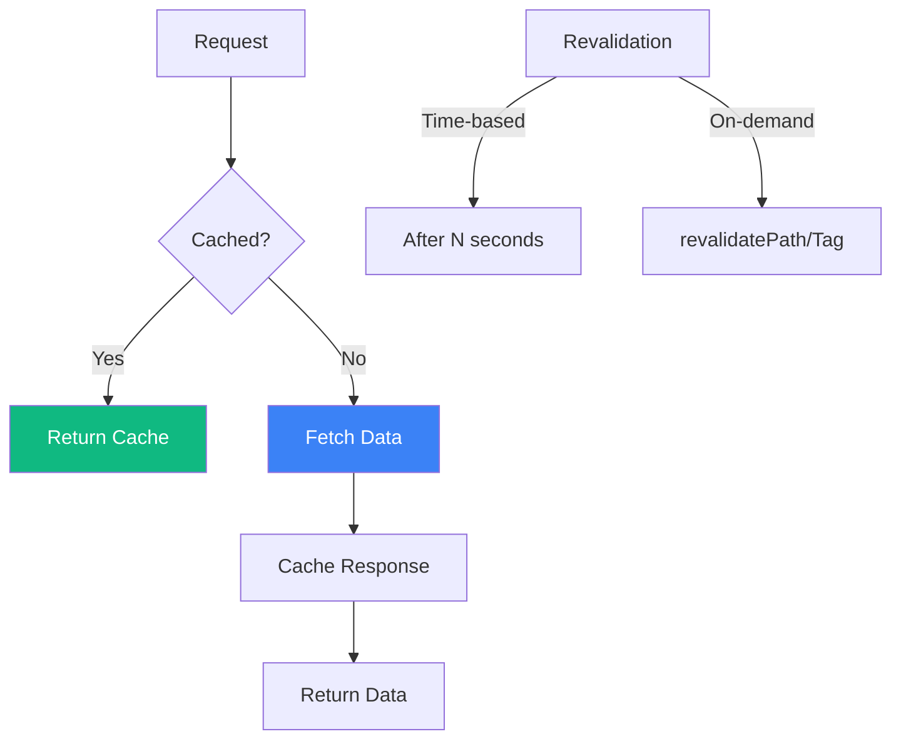

Next.js App Router provides powerful data fetching capabilities through async Server Components. Understanding caching and revalidation is key to building performant applications.

## Data Fetching Overview



## Fetching Data in Server Components

### Basic Fetch

```tsx
// app/users/page.tsx
async function getUsers() {
  const res = await fetch('https://api.example.com/users');

  if (!res.ok) {
    throw new Error('Failed to fetch users');
  }

  return res.json();
}

export default async function UsersPage() {
  const users = await getUsers();

  return (
    <ul>
      {users.map((user) => (
        <li key={user.id}>{user.name}</li>
      ))}
    </ul>
  );
}
```

### Direct Database Access

```tsx
// app/products/page.tsx
import { db } from '@/lib/database';

export default async function ProductsPage() {
  // Direct database query - no API needed
  const products = await db.query('SELECT * FROM products');

  return (
    <div>
      {products.map((product) => (
        <div key={product.id}>
          <h2>{product.name}</h2>
          <p>${product.price}</p>
        </div>
      ))}
    </div>
  );
}
```

### Multiple Parallel Fetches

```tsx
// app/dashboard/page.tsx
async function getUser() {
  const res = await fetch('https://api.example.com/user');
  return res.json();
}

async function getPosts() {
  const res = await fetch('https://api.example.com/posts');
  return res.json();
}

async function getNotifications() {
  const res = await fetch('https://api.example.com/notifications');
  return res.json();
}

export default async function DashboardPage() {
  // Parallel fetching - faster than sequential
  const [user, posts, notifications] = await Promise.all([
    getUser(),
    getPosts(),
    getNotifications(),
  ]);

  return (
    <div>
      <h1>Welcome, {user.name}</h1>
      <p>You have {posts.length} posts</p>
      <p>{notifications.length} notifications</p>
    </div>
  );
}
```

## Caching Strategies

### Default Caching Behavior

```tsx
// Cached by default (equivalent to force-cache)
const res = await fetch('https://api.example.com/data');

// Explicitly set cache behavior
const res = await fetch('https://api.example.com/data', {
  cache: 'force-cache', // Default - cache indefinitely
});
```

### No Caching

```tsx
// Never cache - always fetch fresh data
const res = await fetch('https://api.example.com/data', {
  cache: 'no-store',
});
```

### Time-Based Revalidation

```tsx
// Revalidate every 60 seconds
const res = await fetch('https://api.example.com/data', {
  next: { revalidate: 60 },
});
```

### Comparison

| Strategy | Usage | Use Case |
|----------|-------|----------|
| `force-cache` | Cache forever | Static content |
| `no-store` | Never cache | Real-time data |
| `revalidate: N` | Cache for N seconds | Semi-dynamic data |

## Segment-Level Caching

### Dynamic Route Segment

```tsx
// app/posts/[id]/page.tsx

// Make this route dynamic
export const dynamic = 'force-dynamic';

// Or make it static
export const dynamic = 'force-static';

// Revalidate every hour
export const revalidate = 3600;

export default async function PostPage({
  params,
}: {
  params: Promise<{ id: string }>;
}) {
  const { id } = await params;
  const post = await getPost(id);

  return <article>{post.content}</article>;
}
```

### Route Segment Config Options

```tsx
// Force dynamic rendering
export const dynamic = 'force-dynamic';

// Force static rendering
export const dynamic = 'force-static';

// Auto (default) - Next.js decides
export const dynamic = 'auto';

// Error if dynamic
export const dynamic = 'error';

// Revalidation interval in seconds
export const revalidate = 60;

// No revalidation (static forever)
export const revalidate = false;

// Revalidate on every request
export const revalidate = 0;
```

## Tag-Based Revalidation

### Setting Tags

```tsx
// app/posts/page.tsx
async function getPosts() {
  const res = await fetch('https://api.example.com/posts', {
    next: { tags: ['posts'] },
  });
  return res.json();
}

async function getPost(id: string) {
  const res = await fetch(`https://api.example.com/posts/${id}`, {
    next: { tags: ['posts', `post-${id}`] },
  });
  return res.json();
}
```

### Revalidating Tags

```tsx
// app/actions.ts
'use server';

import { revalidateTag } from 'next/cache';

export async function createPost(formData: FormData) {
  await db.posts.create({ /* ... */ });

  // Revalidate all requests with 'posts' tag
  revalidateTag('posts');
}

export async function updatePost(id: string, formData: FormData) {
  await db.posts.update(id, { /* ... */ });

  // Revalidate specific post and list
  revalidateTag(`post-${id}`);
  revalidateTag('posts');
}
```

## Static vs Dynamic Rendering


### Static Generation with generateStaticParams

```tsx
// app/blog/[slug]/page.tsx
export async function generateStaticParams() {
  const posts = await getPosts();

  return posts.map((post) => ({
    slug: post.slug,
  }));
}

export default async function BlogPost({
  params,
}: {
  params: Promise<{ slug: string }>;
}) {
  const { slug } = await params;
  const post = await getPost(slug);

  return <article>{post.content}</article>;
}
```

### Dynamic Functions

Using these functions makes the route dynamic:

```tsx
import { cookies, headers } from 'next/headers';
import { searchParams } from 'next/navigation';

export default async function Page({
  searchParams,
}: {
  searchParams: Promise<{ q?: string }>;
}) {
  // Using cookies makes route dynamic
  const cookieStore = await cookies();
  const theme = cookieStore.get('theme');

  // Using headers makes route dynamic
  const headersList = await headers();
  const userAgent = headersList.get('user-agent');

  // Using searchParams makes route dynamic
  const params = await searchParams;
  const query = params.q;

  return <div>...</div>;
}
```

## Request Memoization

Next.js automatically deduplicates identical fetch requests:

```tsx
// This fetch is called in multiple places
async function getUser() {
  // Same URL = same request (deduplicated)
  const res = await fetch('https://api.example.com/user');
  return res.json();
}

// Layout fetches user
export default async function Layout({ children }) {
  const user = await getUser(); // Request #1
  return <div>{children}</div>;
}

// Page also fetches user
export default async function Page() {
  const user = await getUser(); // Deduplicated - reuses #1
  return <div>{user.name}</div>;
}

// Component also fetches user
async function UserProfile() {
  const user = await getUser(); // Deduplicated - reuses #1
  return <div>{user.email}</div>;
}
```

## Error Handling

### Error Boundaries

```tsx
// app/posts/error.tsx
'use client';

export default function Error({
  error,
  reset,
}: {
  error: Error;
  reset: () => void;
}) {
  return (
    <div>
      <h2>Failed to load posts</h2>
      <p>{error.message}</p>
      <button onClick={reset}>Try again</button>
    </div>
  );
}
```

### Graceful Error Handling

```tsx
// app/posts/page.tsx
async function getPosts() {
  try {
    const res = await fetch('https://api.example.com/posts');

    if (!res.ok) {
      throw new Error(`HTTP error: ${res.status}`);
    }

    return res.json();
  } catch (error) {
    console.error('Failed to fetch posts:', error);
    return []; // Return empty array as fallback
  }
}

export default async function PostsPage() {
  const posts = await getPosts();

  if (posts.length === 0) {
    return <p>No posts available</p>;
  }

  return (
    <ul>
      {posts.map((post) => (
        <li key={post.id}>{post.title}</li>
      ))}
    </ul>
  );
}
```

## Data Fetching Patterns

### Waterfall Pattern (Avoid)

```tsx
// ❌ Slow - sequential fetching
export default async function Page() {
  const user = await getUser();           // Wait
  const posts = await getPosts(user.id);  // Then wait
  const comments = await getComments();    // Then wait

  return <div>...</div>;
}
```

### Parallel Pattern (Preferred)

```tsx
// ✅ Fast - parallel fetching
export default async function Page() {
  const [user, posts, comments] = await Promise.all([
    getUser(),
    getPosts(),
    getComments(),
  ]);

  return <div>...</div>;
}
```

### Preload Pattern

```tsx
// lib/data.ts
import { cache } from 'react';

export const getUser = cache(async (id: string) => {
  const res = await fetch(`/api/users/${id}`);
  return res.json();
});

export const preloadUser = (id: string) => {
  void getUser(id);
};
```

```tsx
// app/user/[id]/page.tsx
import { getUser, preloadUser } from '@/lib/data';

export default async function UserPage({
  params,
}: {
  params: Promise<{ id: string }>;
}) {
  const { id } = await params;

  // Start fetching early
  preloadUser(id);

  // ... other code

  const user = await getUser(id); // Uses preloaded data

  return <div>{user.name}</div>;
}
```

## Streaming with Suspense

```tsx
import { Suspense } from 'react';

async function SlowComponent() {
  const data = await fetch('https://api.example.com/slow');
  return <div>{data}</div>;
}

export default function Page() {
  return (
    <div>
      <h1>Dashboard</h1>

      {/* Fast content shows immediately */}
      <p>Welcome to your dashboard</p>

      {/* Slow content streams in later */}
      <Suspense fallback={<p>Loading...</p>}>
        <SlowComponent />
      </Suspense>
    </div>
  );
}
```

## Summary

| Concept | Usage |
|---------|-------|
| `cache: 'force-cache'` | Cache indefinitely (default) |
| `cache: 'no-store'` | Never cache |
| `next: { revalidate: N }` | Cache for N seconds |
| `next: { tags: [...] }` | Tag for on-demand revalidation |
| `revalidateTag()` | Purge tagged cache |
| `revalidatePath()` | Purge path cache |
| `generateStaticParams` | Static generation for dynamic routes |
| `export const dynamic` | Route segment config |

Key takeaways:

- Server Components can fetch data directly using `async/await`
- Fetch requests are cached by default; use `no-store` for real-time data
- Use `revalidate` for time-based cache invalidation
- Use tags for fine-grained on-demand revalidation
- Parallel fetching with `Promise.all` is faster than sequential
- Request memoization deduplicates identical fetches
- Use Suspense for streaming slow data
- `generateStaticParams` enables static generation for dynamic routes

Understanding these patterns helps you build fast, efficient Next.js applications.

## References

- [Next.js Data Fetching](https://nextjs.org/docs/app/building-your-application/data-fetching)
- [Next.js Caching](https://nextjs.org/docs/app/building-your-application/caching)
- Schwarzmüller, Maximilian. *React Key Concepts - Second Edition*. Packt, 2025.
