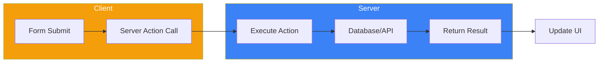

Server Actions are asynchronous functions that run on the server, designed for handling form submissions and data mutations. They simplify the traditional API route approach by allowing you to call server-side code directly from components.

## What Are Server Actions?



| Traditional API | Server Actions |
|-----------------|----------------|
| Create API route | Define function with `'use server'` |
| Fetch from client | Call function directly |
| Handle CORS/headers | Automatic handling |
| Manual error handling | Integrated with React |

## Basic Server Action

### Inline Action

```tsx
// app/page.tsx
export default function Page() {
  async function createUser(formData: FormData) {
    'use server';

    const name = formData.get('name') as string;
    const email = formData.get('email') as string;

    // Insert into database
    await db.insert({ name, email });
  }

  return (
    <form action={createUser}>
      <input name="name" placeholder="Name" required />
      <input name="email" type="email" placeholder="Email" required />
      <button type="submit">Create User</button>
    </form>
  );
}
```

### Separate Action File

```tsx
// app/actions.ts
'use server';

import { db } from '@/lib/database';
import { revalidatePath } from 'next/cache';

export async function createUser(formData: FormData) {
  const name = formData.get('name') as string;
  const email = formData.get('email') as string;

  await db.users.create({ name, email });

  // Revalidate the users page
  revalidatePath('/users');
}

export async function deleteUser(userId: string) {
  await db.users.delete(userId);
  revalidatePath('/users');
}
```

```tsx
// app/users/page.tsx
import { createUser } from '@/app/actions';

export default function UsersPage() {
  return (
    <form action={createUser}>
      <input name="name" placeholder="Name" required />
      <input name="email" type="email" placeholder="Email" required />
      <button type="submit">Create User</button>
    </form>
  );
}
```

## Passing Arguments

### Using bind()

```tsx
// app/actions.ts
'use server';

export async function updateUser(userId: string, formData: FormData) {
  const name = formData.get('name') as string;
  await db.users.update(userId, { name });
}
```

```tsx
// app/users/[id]/page.tsx
import { updateUser } from '@/app/actions';

export default async function UserPage({
  params,
}: {
  params: Promise<{ id: string }>;
}) {
  const { id } = await params;
  const user = await getUser(id);

  // Bind the userId to the action
  const updateUserWithId = updateUser.bind(null, id);

  return (
    <form action={updateUserWithId}>
      <input name="name" defaultValue={user.name} />
      <button type="submit">Update</button>
    </form>
  );
}
```

### Using Hidden Fields

```tsx
export default async function UserPage({
  params,
}: {
  params: Promise<{ id: string }>;
}) {
  const { id } = await params;

  async function updateUser(formData: FormData) {
    'use server';
    const userId = formData.get('userId') as string;
    const name = formData.get('name') as string;
    await db.users.update(userId, { name });
  }

  return (
    <form action={updateUser}>
      <input type="hidden" name="userId" value={id} />
      <input name="name" />
      <button type="submit">Update</button>
    </form>
  );
}
```

## Form Status with useFormStatus

Show loading states during form submission:

```tsx
// components/SubmitButton.tsx
'use client';

import { useFormStatus } from 'react-dom';

export function SubmitButton() {
  const { pending } = useFormStatus();

  return (
    <button type="submit" disabled={pending}>
      {pending ? 'Submitting...' : 'Submit'}
    </button>
  );
}
```

```tsx
// app/page.tsx
import { createUser } from '@/app/actions';
import { SubmitButton } from '@/components/SubmitButton';

export default function Page() {
  return (
    <form action={createUser}>
      <input name="name" placeholder="Name" required />
      <input name="email" type="email" placeholder="Email" required />
      <SubmitButton />
    </form>
  );
}
```

## Action State with useActionState

Handle action results and errors:

```tsx
// app/actions.ts
'use server';

type ActionState = {
  message: string;
  errors?: {
    name?: string[];
    email?: string[];
  };
};

export async function createUser(
  prevState: ActionState,
  formData: FormData
): Promise<ActionState> {
  const name = formData.get('name') as string;
  const email = formData.get('email') as string;

  // Validation
  const errors: ActionState['errors'] = {};

  if (!name || name.length < 2) {
    errors.name = ['Name must be at least 2 characters'];
  }

  if (!email || !email.includes('@')) {
    errors.email = ['Please enter a valid email'];
  }

  if (Object.keys(errors).length > 0) {
    return { message: 'Validation failed', errors };
  }

  try {
    await db.users.create({ name, email });
    return { message: 'User created successfully' };
  } catch (error) {
    return { message: 'Failed to create user' };
  }
}
```

```tsx
// app/page.tsx
'use client';

import { useActionState } from 'react';
import { createUser } from '@/app/actions';
import { SubmitButton } from '@/components/SubmitButton';

const initialState = { message: '', errors: {} };

export default function Page() {
  const [state, formAction] = useActionState(createUser, initialState);

  return (
    <form action={formAction}>
      <div>
        <input name="name" placeholder="Name" />
        {state.errors?.name && (
          <p className="error">{state.errors.name[0]}</p>
        )}
      </div>

      <div>
        <input name="email" type="email" placeholder="Email" />
        {state.errors?.email && (
          <p className="error">{state.errors.email[0]}</p>
        )}
      </div>

      <SubmitButton />

      {state.message && <p>{state.message}</p>}
    </form>
  );
}
```

## Optimistic Updates with useOptimistic

Update UI immediately before server response:

```tsx
// app/actions.ts
'use server';

import { revalidatePath } from 'next/cache';

export async function addTodo(formData: FormData) {
  const text = formData.get('text') as string;

  // Simulate slow database
  await new Promise((resolve) => setTimeout(resolve, 1000));

  await db.todos.create({ text, completed: false });
  revalidatePath('/todos');
}
```

```tsx
// app/todos/page.tsx
'use client';

import { useOptimistic } from 'react';
import { addTodo } from '@/app/actions';

type Todo = {
  id: string;
  text: string;
  completed: boolean;
};

export function TodoList({ todos }: { todos: Todo[] }) {
  const [optimisticTodos, addOptimisticTodo] = useOptimistic(
    todos,
    (state, newTodo: Todo) => [...state, newTodo]
  );

  async function handleSubmit(formData: FormData) {
    const text = formData.get('text') as string;

    // Add optimistic todo immediately
    addOptimisticTodo({
      id: 'temp-' + Date.now(),
      text,
      completed: false,
    });

    // Then submit to server
    await addTodo(formData);
  }

  return (
    <div>
      <form action={handleSubmit}>
        <input name="text" placeholder="New todo" required />
        <button type="submit">Add</button>
      </form>

      <ul>
        {optimisticTodos.map((todo) => (
          <li key={todo.id} style={{ opacity: todo.id.startsWith('temp') ? 0.5 : 1 }}>
            {todo.text}
          </li>
        ))}
      </ul>
    </div>
  );
}
```

## Non-Form Actions

Call Server Actions from event handlers:

```tsx
// app/actions.ts
'use server';

export async function incrementLikes(postId: string) {
  await db.posts.increment(postId, 'likes');
  revalidatePath('/posts');
}
```

```tsx
// components/LikeButton.tsx
'use client';

import { incrementLikes } from '@/app/actions';
import { useTransition } from 'react';

export function LikeButton({ postId }: { postId: string }) {
  const [isPending, startTransition] = useTransition();

  const handleClick = () => {
    startTransition(async () => {
      await incrementLikes(postId);
    });
  };

  return (
    <button onClick={handleClick} disabled={isPending}>
      {isPending ? 'Liking...' : 'Like'}
    </button>
  );
}
```

## Error Handling

### Try-Catch Pattern

```tsx
// app/actions.ts
'use server';

export async function createPost(formData: FormData) {
  try {
    const title = formData.get('title') as string;
    const content = formData.get('content') as string;

    await db.posts.create({ title, content });

    return { success: true, message: 'Post created' };
  } catch (error) {
    return { success: false, message: 'Failed to create post' };
  }
}
```

### With Zod Validation

```tsx
// app/actions.ts
'use server';

import { z } from 'zod';

const schema = z.object({
  name: z.string().min(2, 'Name must be at least 2 characters'),
  email: z.string().email('Invalid email address'),
  age: z.coerce.number().min(18, 'Must be 18 or older'),
});

export async function createUser(prevState: any, formData: FormData) {
  const validatedFields = schema.safeParse({
    name: formData.get('name'),
    email: formData.get('email'),
    age: formData.get('age'),
  });

  if (!validatedFields.success) {
    return {
      errors: validatedFields.error.flatten().fieldErrors,
      message: 'Validation failed',
    };
  }

  const { name, email, age } = validatedFields.data;

  try {
    await db.users.create({ name, email, age });
    return { message: 'User created successfully' };
  } catch (error) {
    return { message: 'Database error' };
  }
}
```

## Revalidation

### revalidatePath

```tsx
'use server';

import { revalidatePath } from 'next/cache';

export async function createPost(formData: FormData) {
  await db.posts.create({ /* ... */ });

  // Revalidate specific path
  revalidatePath('/posts');

  // Revalidate with layout
  revalidatePath('/posts', 'layout');

  // Revalidate dynamic route
  revalidatePath('/posts/[slug]', 'page');
}
```

### revalidateTag

```tsx
'use server';

import { revalidateTag } from 'next/cache';

export async function updateProduct(formData: FormData) {
  await db.products.update({ /* ... */ });

  // Revalidate all requests with this tag
  revalidateTag('products');
}
```

## Redirect After Action

```tsx
'use server';

import { redirect } from 'next/navigation';

export async function createPost(formData: FormData) {
  const post = await db.posts.create({
    title: formData.get('title') as string,
    content: formData.get('content') as string,
  });

  // Redirect to the new post
  redirect(`/posts/${post.id}`);
}
```

## Complete Example: CRUD Operations

```tsx
// app/actions.ts
'use server';

import { revalidatePath } from 'next/cache';
import { redirect } from 'next/navigation';
import { z } from 'zod';

const todoSchema = z.object({
  text: z.string().min(1, 'Text is required'),
});

export async function createTodo(prevState: any, formData: FormData) {
  const validated = todoSchema.safeParse({
    text: formData.get('text'),
  });

  if (!validated.success) {
    return { error: validated.error.flatten().fieldErrors.text?.[0] };
  }

  await db.todos.create({ text: validated.data.text, completed: false });
  revalidatePath('/todos');
  return { success: true };
}

export async function toggleTodo(id: string) {
  const todo = await db.todos.find(id);
  await db.todos.update(id, { completed: !todo.completed });
  revalidatePath('/todos');
}

export async function deleteTodo(id: string) {
  await db.todos.delete(id);
  revalidatePath('/todos');
}
```

```tsx
// app/todos/page.tsx
import { createTodo, toggleTodo, deleteTodo } from '@/app/actions';
import { TodoForm } from '@/components/TodoForm';

export default async function TodosPage() {
  const todos = await db.todos.findAll();

  return (
    <div>
      <h1>Todos</h1>
      <TodoForm action={createTodo} />

      <ul>
        {todos.map((todo) => (
          <li key={todo.id}>
            <form action={toggleTodo.bind(null, todo.id)}>
              <button type="submit">
                {todo.completed ? '✓' : '○'}
              </button>
            </form>
            <span>{todo.text}</span>
            <form action={deleteTodo.bind(null, todo.id)}>
              <button type="submit">Delete</button>
            </form>
          </li>
        ))}
      </ul>
    </div>
  );
}
```

## Summary

| Feature | Usage |
|---------|-------|
| `'use server'` | Mark function as Server Action |
| `action={fn}` | Form action attribute |
| `useFormStatus` | Get pending state in form |
| `useActionState` | Handle action state and errors |
| `useOptimistic` | Optimistic UI updates |
| `revalidatePath` | Revalidate cached data |
| `redirect` | Redirect after action |

Key takeaways:

- Server Actions run on the server and are called directly from components
- Use `'use server'` directive to define Server Actions
- `useFormStatus` provides loading state during submission
- `useActionState` manages form state and validation errors
- `useOptimistic` enables immediate UI updates before server response
- Use `revalidatePath` or `revalidateTag` to refresh cached data
- Server Actions can redirect users after completion
- Combine with Zod for robust validation

Server Actions simplify data mutations by eliminating the need for separate API routes.

## References

- [Next.js Server Actions](https://nextjs.org/docs/app/building-your-application/data-fetching/server-actions-and-mutations)
- [React useActionState](https://react.dev/reference/react/useActionState)
- Schwarzmüller, Maximilian. *React Key Concepts - Second Edition*. Packt, 2025.
