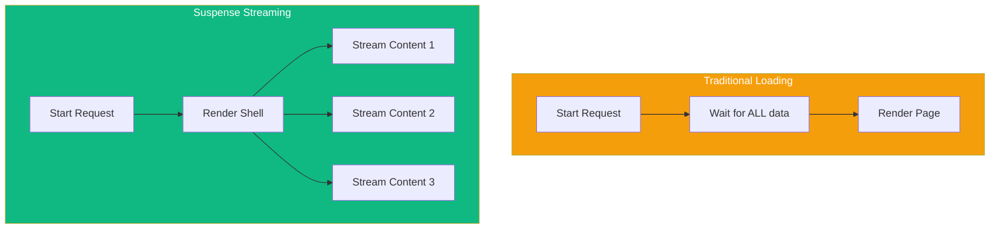

React Suspense enables you to show fallback content while waiting for async operations to complete. In Next.js, this powers streaming SSR and granular loading states.

## Understanding Suspense



## Basic Suspense Usage

### Wrapping Async Components

```tsx
import { Suspense } from 'react';

async function SlowData() {
  // Simulates slow API call
  await new Promise((resolve) => setTimeout(resolve, 2000));
  const data = await fetch('https://api.example.com/data');
  return <div>{data}</div>;
}

export default function Page() {
  return (
    <div>
      <h1>Dashboard</h1>

      <Suspense fallback={<p>Loading data...</p>}>
        <SlowData />
      </Suspense>
    </div>
  );
}
```

### Multiple Suspense Boundaries

```tsx
import { Suspense } from 'react';

async function UserProfile() {
  const user = await getUser();
  return <div>{user.name}</div>;
}

async function RecentPosts() {
  const posts = await getPosts();
  return <ul>{posts.map((p) => <li key={p.id}>{p.title}</li>)}</ul>;
}

async function Notifications() {
  const notifications = await getNotifications();
  return <span>({notifications.length})</span>;
}

export default function DashboardPage() {
  return (
    <div>
      <h1>Dashboard</h1>

      {/* Each section loads independently */}
      <Suspense fallback={<UserSkeleton />}>
        <UserProfile />
      </Suspense>

      <Suspense fallback={<PostsSkeleton />}>
        <RecentPosts />
      </Suspense>

      <Suspense fallback={<span>(0)</span>}>
        <Notifications />
      </Suspense>
    </div>
  );
}
```

## File-Based Loading UI

### loading.tsx

Next.js automatically wraps page content with Suspense using `loading.tsx`:

```tsx
// app/dashboard/loading.tsx
export default function Loading() {
  return (
    <div className="loading-container">
      <div className="spinner" />
      <p>Loading dashboard...</p>
    </div>
  );
}
```

```tsx
// app/dashboard/page.tsx
export default async function DashboardPage() {
  const data = await getSlowData();

  return (
    <div>
      <h1>Dashboard</h1>
      <p>{data.message}</p>
    </div>
  );
}
```

### Skeleton Components

```tsx
// app/posts/loading.tsx
export default function Loading() {
  return (
    <div className="posts-skeleton">
      {[1, 2, 3].map((i) => (
        <div key={i} className="post-skeleton">
          <div className="skeleton-title" />
          <div className="skeleton-text" />
          <div className="skeleton-text short" />
        </div>
      ))}
    </div>
  );
}
```

```css
/* styles/skeleton.css */
.skeleton-title,
.skeleton-text {
  background: linear-gradient(90deg, #f0f0f0 25%, #e0e0e0 50%, #f0f0f0 75%);
  background-size: 200% 100%;
  animation: shimmer 1.5s infinite;
  border-radius: 4px;
}

.skeleton-title {
  height: 24px;
  width: 60%;
  margin-bottom: 12px;
}

.skeleton-text {
  height: 16px;
  width: 100%;
  margin-bottom: 8px;
}

.skeleton-text.short {
  width: 40%;
}

@keyframes shimmer {
  0% { background-position: -200% 0; }
  100% { background-position: 200% 0; }
}
```

## Streaming Patterns

### Progressive Rendering

```tsx
import { Suspense } from 'react';

// Fast data - renders immediately
async function Header() {
  const user = await getUser(); // Fast query
  return <header>Welcome, {user.name}</header>;
}

// Slow data - streams in later
async function Analytics() {
  const data = await getAnalytics(); // Slow query
  return <div>{data.visitors} visitors today</div>;
}

// Very slow data - streams in last
async function Recommendations() {
  const recs = await getRecommendations(); // ML model, very slow
  return <ul>{recs.map((r) => <li key={r.id}>{r.title}</li>)}</ul>;
}

export default function Page() {
  return (
    <div>
      {/* Renders first */}
      <Suspense fallback={<HeaderSkeleton />}>
        <Header />
      </Suspense>

      {/* Renders second */}
      <Suspense fallback={<AnalyticsSkeleton />}>
        <Analytics />
      </Suspense>

      {/* Renders last */}
      <Suspense fallback={<RecommendationsSkeleton />}>
        <Recommendations />
      </Suspense>
    </div>
  );
}
```

### Nested Suspense

```tsx
import { Suspense } from 'react';

async function PostList() {
  const posts = await getPosts();

  return (
    <div>
      {posts.map((post) => (
        <article key={post.id}>
          <h2>{post.title}</h2>
          {/* Nested Suspense for comments */}
          <Suspense fallback={<CommentsSkeleton />}>
            <Comments postId={post.id} />
          </Suspense>
        </article>
      ))}
    </div>
  );
}

async function Comments({ postId }: { postId: string }) {
  const comments = await getComments(postId);
  return (
    <ul>
      {comments.map((c) => (
        <li key={c.id}>{c.text}</li>
      ))}
    </ul>
  );
}

export default function BlogPage() {
  return (
    <Suspense fallback={<PostListSkeleton />}>
      <PostList />
    </Suspense>
  );
}
```

## The use() Hook

React 19's `use()` hook allows reading resources in render:

```tsx
'use client';

import { use } from 'react';

async function fetchUser(id: string) {
  const res = await fetch(`/api/users/${id}`);
  return res.json();
}

function UserProfile({ userPromise }: { userPromise: Promise<User> }) {
  // use() suspends until promise resolves
  const user = use(userPromise);

  return (
    <div>
      <h2>{user.name}</h2>
      <p>{user.email}</p>
    </div>
  );
}

export default function Page({ params }: { params: { id: string } }) {
  // Create promise outside component
  const userPromise = fetchUser(params.id);

  return (
    <Suspense fallback={<UserSkeleton />}>
      <UserProfile userPromise={userPromise} />
    </Suspense>
  );
}
```

### use() with Context

```tsx
'use client';

import { use, createContext } from 'react';

const ThemeContext = createContext<string>('light');

function ThemedButton() {
  // use() can read context too
  const theme = use(ThemeContext);

  return (
    <button className={`btn-${theme}`}>
      Click me
    </button>
  );
}
```

## Error Handling with Suspense

### Error Boundaries

```tsx
// app/dashboard/error.tsx
'use client';

export default function Error({
  error,
  reset,
}: {
  error: Error;
  reset: () => void;
}) {
  return (
    <div className="error-container">
      <h2>Something went wrong!</h2>
      <p>{error.message}</p>
      <button onClick={reset}>Try again</button>
    </div>
  );
}
```

### Combining Error and Loading

```
app/
├── dashboard/
│   ├── page.tsx      # Main content
│   ├── loading.tsx   # Loading UI
│   ├── error.tsx     # Error UI
│   └── not-found.tsx # 404 UI
```

```tsx
// How Next.js wraps your page
<ErrorBoundary fallback={<Error />}>
  <Suspense fallback={<Loading />}>
    <Page />
  </Suspense>
</ErrorBoundary>
```

## Streaming with Route Groups

```
app/
├── (with-sidebar)/
│   ├── layout.tsx
│   ├── loading.tsx    # Shared loading for group
│   ├── dashboard/
│   │   └── page.tsx
│   └── settings/
│       └── page.tsx
└── (no-sidebar)/
    ├── layout.tsx
    ├── loading.tsx    # Different loading for this group
    └── login/
        └── page.tsx
```

## Instant Loading States

### Shared Layouts Don't Re-render

```tsx
// app/dashboard/layout.tsx
export default function DashboardLayout({
  children,
}: {
  children: React.ReactNode;
}) {
  return (
    <div>
      {/* This stays visible during navigation */}
      <nav>Dashboard Navigation</nav>

      {/* Only this part shows loading state */}
      {children}
    </div>
  );
}
```

### Parallel Routes for Modals

```tsx
// app/layout.tsx
export default function Layout({
  children,
  modal,
}: {
  children: React.ReactNode;
  modal: React.ReactNode;
}) {
  return (
    <div>
      {children}
      {modal}
    </div>
  );
}

// app/@modal/photo/[id]/page.tsx
export default function PhotoModal({ params }: { params: { id: string } }) {
  return (
    <div className="modal">
      <Suspense fallback={<PhotoSkeleton />}>
        <Photo id={params.id} />
      </Suspense>
    </div>
  );
}
```

## Best Practices

### 1. Strategic Suspense Placement

```tsx
// ❌ Bad: Single boundary for everything
<Suspense fallback={<Loading />}>
  <Header />
  <Sidebar />
  <Content />
  <Footer />
</Suspense>

// ✅ Good: Granular boundaries
<Header />
<Sidebar />
<Suspense fallback={<ContentSkeleton />}>
  <Content />
</Suspense>
<Footer />
```

### 2. Meaningful Skeletons

```tsx
// ❌ Bad: Generic spinner
<Suspense fallback={<Spinner />}>
  <ProductList />
</Suspense>

// ✅ Good: Layout-matching skeleton
<Suspense fallback={<ProductListSkeleton />}>
  <ProductList />
</Suspense>
```

### 3. Avoid Suspense Waterfalls

```tsx
// ❌ Bad: Sequential loading
<Suspense fallback={<Loading />}>
  <UserData>
    <Suspense fallback={<Loading />}>
      <Posts>
        <Suspense fallback={<Loading />}>
          <Comments />
        </Suspense>
      </Posts>
    </Suspense>
  </UserData>
</Suspense>

// ✅ Good: Parallel loading
<Suspense fallback={<UserSkeleton />}>
  <UserData />
</Suspense>
<Suspense fallback={<PostsSkeleton />}>
  <Posts />
</Suspense>
<Suspense fallback={<CommentsSkeleton />}>
  <Comments />
</Suspense>
```

## Summary

| Feature | Purpose |
|---------|---------|
| `<Suspense>` | Wrap async components with fallback |
| `loading.tsx` | Route-level loading UI |
| `error.tsx` | Route-level error handling |
| `use()` | Read promises/context in render |
| Streaming | Progressive page rendering |
| Nested Suspense | Granular loading states |

Key takeaways:

- Suspense shows fallback UI while async content loads
- `loading.tsx` automatically wraps page content with Suspense
- Use multiple Suspense boundaries for independent loading
- Streaming allows parts of the page to render progressively
- `use()` hook enables reading promises in Client Components
- Combine `error.tsx` with `loading.tsx` for complete UX
- Create layout-matching skeleton components for best UX
- Avoid Suspense waterfalls by loading data in parallel

Suspense and streaming transform how users experience loading states in your Next.js application.

## References

- [Next.js Loading UI and Streaming](https://nextjs.org/docs/app/building-your-application/routing/loading-ui-and-streaming)
- [React Suspense](https://react.dev/reference/react/Suspense)
- [React use() Hook](https://react.dev/reference/react/use)
- Schwarzmüller, Maximilian. *React Key Concepts - Second Edition*. Packt, 2025.
