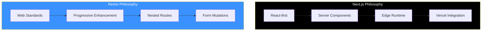

Next.js and Remix are the two leading React frameworks for building full-stack applications. Understanding their differences helps you choose the right tool for your project.

## Framework Philosophy



| Aspect | Next.js | Remix |
|--------|---------|-------|
| Philosophy | React innovations | Web standards |
| Data Fetching | Server Components | Loaders |
| Mutations | Server Actions | Actions |
| Forms | Progressive enhancement optional | Progressive enhancement core |
| Deployment | Vercel-optimized | Platform agnostic |

## Routing Comparison

### Next.js App Router

```
app/
├── page.tsx                    # /
├── about/
│   └── page.tsx                # /about
├── blog/
│   ├── page.tsx                # /blog
│   └── [slug]/
│       └── page.tsx            # /blog/:slug
└── (marketing)/
    └── pricing/
        └── page.tsx            # /pricing
```

```tsx
// app/blog/[slug]/page.tsx
export default async function BlogPost({
  params,
}: {
  params: Promise<{ slug: string }>;
}) {
  const { slug } = await params;
  const post = await getPost(slug);

  return <article>{post.content}</article>;
}
```

### Remix Routes

```
app/
├── routes/
│   ├── _index.tsx              # /
│   ├── about.tsx               # /about
│   ├── blog._index.tsx         # /blog
│   ├── blog.$slug.tsx          # /blog/:slug
│   └── _marketing.pricing.tsx  # /pricing (with layout)
└── root.tsx
```

```tsx
// app/routes/blog.$slug.tsx
import { useLoaderData } from '@remix-run/react';
import type { LoaderFunctionArgs } from '@remix-run/node';

export async function loader({ params }: LoaderFunctionArgs) {
  const post = await getPost(params.slug);
  return { post };
}

export default function BlogPost() {
  const { post } = useLoaderData<typeof loader>();

  return <article>{post.content}</article>;
}
```

## Data Fetching

### Next.js: Server Components

```tsx
// app/users/page.tsx
// Data fetched directly in component
export default async function UsersPage() {
  const users = await fetch('https://api.example.com/users').then((r) =>
    r.json()
  );

  return (
    <ul>
      {users.map((user) => (
        <li key={user.id}>{user.name}</li>
      ))}
    </ul>
  );
}
```

### Remix: Loaders

```tsx
// app/routes/users.tsx
import { json } from '@remix-run/node';
import { useLoaderData } from '@remix-run/react';

export async function loader() {
  const users = await fetch('https://api.example.com/users').then((r) =>
    r.json()
  );
  return json({ users });
}

export default function UsersPage() {
  const { users } = useLoaderData<typeof loader>();

  return (
    <ul>
      {users.map((user) => (
        <li key={user.id}>{user.name}</li>
      ))}
    </ul>
  );
}
```

### Key Differences

| Aspect | Next.js | Remix |
|--------|---------|-------|
| Location | In component | Separate loader function |
| Return type | Component props | Serialized JSON |
| Caching | Built-in fetch cache | Manual headers |
| Parallel | Promise.all in component | Automatic with nested routes |

## Form Handling

### Next.js: Server Actions

```tsx
// app/actions.ts
'use server';

export async function createUser(formData: FormData) {
  const name = formData.get('name') as string;
  await db.users.create({ name });
  revalidatePath('/users');
}

// app/users/page.tsx
import { createUser } from './actions';

export default function UsersPage() {
  return (
    <form action={createUser}>
      <input name="name" required />
      <button type="submit">Create</button>
    </form>
  );
}
```

### Remix: Actions

```tsx
// app/routes/users.tsx
import { Form, useActionData } from '@remix-run/react';
import type { ActionFunctionArgs } from '@remix-run/node';
import { redirect } from '@remix-run/node';

export async function action({ request }: ActionFunctionArgs) {
  const formData = await request.formData();
  const name = formData.get('name') as string;

  await db.users.create({ name });

  return redirect('/users');
}

export default function UsersPage() {
  return (
    <Form method="post">
      <input name="name" required />
      <button type="submit">Create</button>
    </Form>
  );
}
```

### Progressive Enhancement

```tsx
// Remix: Works without JavaScript
<Form method="post">
  <input name="name" />
  <button>Submit</button>
</Form>

// Next.js: Requires client-side enhancement for full functionality
'use client';

import { useActionState } from 'react';
import { createUser } from './actions';

export function CreateUserForm() {
  const [state, formAction] = useActionState(createUser, null);

  return (
    <form action={formAction}>
      <input name="name" />
      <button>Submit</button>
      {state?.error && <p>{state.error}</p>}
    </form>
  );
}
```

## Error Handling

### Next.js

```tsx
// app/users/error.tsx
'use client';

export default function Error({
  error,
  reset,
}: {
  error: Error;
  reset: () => void;
}) {
  return (
    <div>
      <h2>Error loading users</h2>
      <button onClick={reset}>Try again</button>
    </div>
  );
}
```

### Remix

```tsx
// app/routes/users.tsx
import { useRouteError, isRouteErrorResponse } from '@remix-run/react';

export function ErrorBoundary() {
  const error = useRouteError();

  if (isRouteErrorResponse(error)) {
    return (
      <div>
        <h2>{error.status} {error.statusText}</h2>
      </div>
    );
  }

  return (
    <div>
      <h2>Error loading users</h2>
    </div>
  );
}
```

## Nested Layouts

### Next.js

```tsx
// app/dashboard/layout.tsx
export default function DashboardLayout({
  children,
}: {
  children: React.ReactNode;
}) {
  return (
    <div className="dashboard">
      <Sidebar />
      <main>{children}</main>
    </div>
  );
}

// app/dashboard/page.tsx
export default function DashboardPage() {
  return <h1>Dashboard</h1>;
}

// app/dashboard/settings/page.tsx
export default function SettingsPage() {
  return <h1>Settings</h1>;
}
```

### Remix

```tsx
// app/routes/dashboard.tsx - Parent layout
import { Outlet } from '@remix-run/react';

export default function DashboardLayout() {
  return (
    <div className="dashboard">
      <Sidebar />
      <main>
        <Outlet />
      </main>
    </div>
  );
}

// app/routes/dashboard._index.tsx
export default function DashboardPage() {
  return <h1>Dashboard</h1>;
}

// app/routes/dashboard.settings.tsx
export default function SettingsPage() {
  return <h1>Settings</h1>;
}
```

## Loading States

### Next.js

```tsx
// app/dashboard/loading.tsx
export default function Loading() {
  return <Skeleton />;
}

// Or with Suspense
import { Suspense } from 'react';

export default function Page() {
  return (
    <Suspense fallback={<Skeleton />}>
      <SlowComponent />
    </Suspense>
  );
}
```

### Remix

```tsx
// app/routes/dashboard.tsx
import { useNavigation } from '@remix-run/react';

export default function Dashboard() {
  const navigation = useNavigation();
  const isLoading = navigation.state === 'loading';

  return (
    <div>
      {isLoading && <LoadingSpinner />}
      <Outlet />
    </div>
  );
}
```

## Meta Tags / SEO

### Next.js

```tsx
// app/blog/[slug]/page.tsx
import { Metadata } from 'next';

export async function generateMetadata({
  params,
}: {
  params: Promise<{ slug: string }>;
}): Promise<Metadata> {
  const { slug } = await params;
  const post = await getPost(slug);

  return {
    title: post.title,
    description: post.excerpt,
    openGraph: {
      title: post.title,
      images: [post.image],
    },
  };
}
```

### Remix

```tsx
// app/routes/blog.$slug.tsx
import type { MetaFunction } from '@remix-run/node';

export const meta: MetaFunction<typeof loader> = ({ data }) => {
  return [
    { title: data.post.title },
    { name: 'description', content: data.post.excerpt },
    { property: 'og:title', content: data.post.title },
    { property: 'og:image', content: data.post.image },
  ];
};
```

## When to Choose Next.js

Next.js is ideal when:

- **Vercel deployment**: Optimal integration with Vercel platform
- **React Server Components**: Want cutting-edge React features
- **Image optimization**: Need built-in image handling
- **Incremental adoption**: Migrating from existing React app
- **Large ecosystem**: Need extensive plugin ecosystem
- **Static generation**: Heavy static site requirements

```tsx
// Next.js strengths
import Image from 'next/image';

export default function Gallery() {
  return (
    <div>
      {/* Automatic image optimization */}
      <Image
        src="/photo.jpg"
        width={800}
        height={600}
        alt="Photo"
        placeholder="blur"
      />
    </div>
  );
}
```

## When to Choose Remix

Remix is ideal when:

- **Progressive enhancement**: Forms must work without JS
- **Web standards**: Prefer standard APIs (fetch, FormData)
- **Platform flexibility**: Deploy anywhere (not just Vercel)
- **Nested routing**: Complex nested layouts with data
- **Error handling**: Granular error boundaries
- **Optimistic UI**: Built-in optimistic update patterns

```tsx
// Remix strengths: Progressive enhancement
import { useFetcher } from '@remix-run/react';

export function LikeButton({ postId }: { postId: string }) {
  const fetcher = useFetcher();
  const isLiking = fetcher.state !== 'idle';

  return (
    <fetcher.Form method="post" action="/like">
      <input type="hidden" name="postId" value={postId} />
      <button disabled={isLiking}>
        {isLiking ? 'Liking...' : 'Like'}
      </button>
    </fetcher.Form>
  );
}
```

## Feature Comparison

| Feature | Next.js | Remix |
|---------|---------|-------|
| Server Components | ✅ Native | ❌ Not yet |
| Streaming SSR | ✅ Built-in | ✅ Built-in |
| Static Generation | ✅ Strong | ⚠️ Limited |
| Image Optimization | ✅ Built-in | ❌ External |
| Edge Runtime | ✅ Native | ✅ Supported |
| Progressive Enhancement | ⚠️ Optional | ✅ Core |
| Nested Routes Data | ✅ Parallel routes | ✅ Automatic |
| Platform Lock-in | ⚠️ Vercel-optimized | ✅ Agnostic |

## Migration Considerations

### From Next.js to Remix

```tsx
// Next.js
export default async function Page() {
  const data = await getData();
  return <div>{data}</div>;
}

// Remix equivalent
export async function loader() {
  const data = await getData();
  return json({ data });
}

export default function Page() {
  const { data } = useLoaderData<typeof loader>();
  return <div>{data}</div>;
}
```

### From Remix to Next.js

```tsx
// Remix
export async function loader() {
  return json({ users: await getUsers() });
}

export default function Users() {
  const { users } = useLoaderData<typeof loader>();
  return <ul>{users.map(u => <li key={u.id}>{u.name}</li>)}</ul>;
}

// Next.js equivalent
export default async function Users() {
  const users = await getUsers();
  return <ul>{users.map(u => <li key={u.id}>{u.name}</li>)}</ul>;
}
```

## Summary

| Aspect | Next.js | Remix |
|--------|---------|-------|
| Best for | Vercel, RSC, static sites | Web standards, forms |
| Data fetching | In-component async | Loader functions |
| Mutations | Server Actions | Action functions |
| Philosophy | React innovations | Progressive enhancement |
| Deployment | Vercel-optimized | Platform agnostic |
| Learning curve | Moderate | Moderate |

Key takeaways:

- Next.js leads with React Server Components and Vercel integration
- Remix prioritizes web standards and progressive enhancement
- Both support streaming SSR and nested layouts
- Next.js has better static generation and image optimization
- Remix has stronger progressive enhancement and form handling
- Choose Next.js for Vercel deployment and cutting-edge React
- Choose Remix for platform flexibility and web standard focus
- Both are excellent choices for production React applications

The best choice depends on your team's priorities, deployment needs, and preferred development patterns.

## References

- [Next.js Documentation](https://nextjs.org/docs)
- [Remix Documentation](https://remix.run/docs)
- Kumar, Tejas. *Fluent React*. O'Reilly, 2024.
- Barklund, Morten. *React in Depth*. Manning, 2024.
