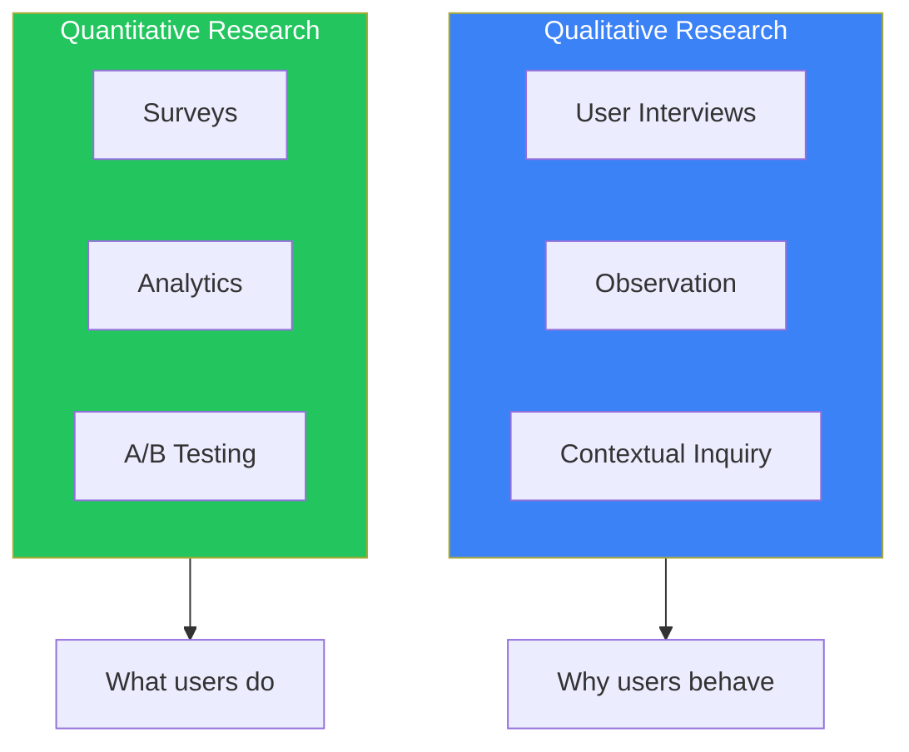
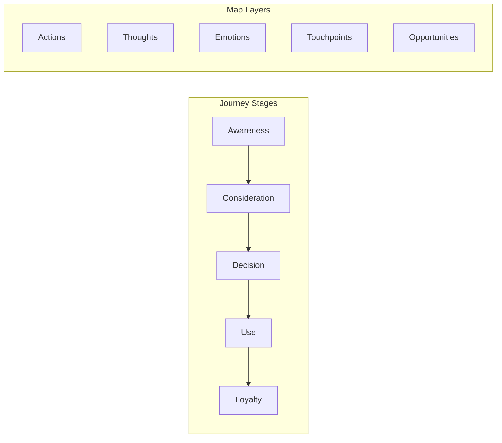
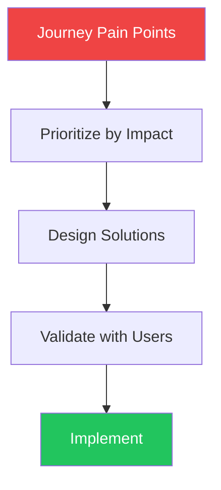

## Introduction

Design thinking is about solving other people's problems. To do this effectively, we need to understand who we're designing for, what their experiences are like, and what problems we want to solve for them.

Personas and user journey maps are foundational tools that help teams build empathy and make user-centered design decisions. This article covers how to create and use these tools effectively.

## Understanding Your Users Through Research

Before creating personas or journey maps, you need to understand your users through research.

### Types of Research



### User Interviews

The most valuable research for creating personas comes from direct conversations with users.

**Interview preparation:**

```markdown
## Interview Guide Template

### Introduction (5 min)
- Thank them for their time
- Explain the purpose (learning, not selling)
- Ask permission to record

### Background (10 min)
- Tell me about your role/daily work
- How long have you been doing this?
- What tools do you currently use?

### Experience Deep Dive (20 min)
- Walk me through the last time you [did relevant task]
- What was the hardest part?
- What would have made it easier?
- Show me how you currently do this

### Pain Points (10 min)
- What frustrates you most about [current solution]?
- If you had a magic wand, what would you change?
- What have you tried that didn't work?

### Wrap Up (5 min)
- Is there anything else I should know?
- Can I follow up if I have more questions?
```

**Key interview principles:**
- Ask open-ended questions (how, what, why)
- Listen more than you talk (80/20 rule)
- Follow interesting threads
- Ask for specific examples, not hypotheticals

### Affinity Mapping

After interviews, organize your findings into themes.

```tsx
function AffinityMap({ notes }) {
  const [groups, setGroups] = useState({});

  // Group related notes together
  const addToGroup = (noteId: string, groupName: string) => {
    setGroups(prev => ({
      ...prev,
      [groupName]: [...(prev[groupName] || []), noteId]
    }));
  };

  return (
    <div className="flex gap-4">
      {/* Ungrouped notes */}
      <div className="w-64 bg-gray-100 p-4 rounded">
        <h3 className="font-semibold mb-3">Ungrouped Notes</h3>
        {notes.filter(n => !isGrouped(n.id)).map(note => (
          <Note key={note.id} note={note} draggable />
        ))}
      </div>

      {/* Theme groups */}
      {Object.entries(groups).map(([groupName, noteIds]) => (
        <div key={groupName} className="w-64 bg-blue-50 p-4 rounded">
          <h3 className="font-semibold mb-3">{groupName}</h3>
          {noteIds.map(id => (
            <Note key={id} note={notes.find(n => n.id === id)} />
          ))}
        </div>
      ))}
    </div>
  );
}
```

## Creating Personas

Personas are fictional characters that represent your key user types. They help teams make decisions by asking "What would [persona] think about this?"

### Anatomy of a Persona

```tsx
interface Persona {
  // Identity
  name: string;
  photo: string;
  quote: string;  // Captures their essence

  // Demographics
  age: number;
  occupation: string;
  location: string;

  // Context
  goals: string[];
  frustrations: string[];
  motivations: string[];

  // Behavior
  techSavviness: 'low' | 'medium' | 'high';
  preferredChannels: string[];
  typicalDay: string;
}
```

### Persona Template

```markdown
## [Name] - [Role/Archetype]

![Photo placeholder]

> "[Representative quote that captures their perspective]"

### Background
- **Age:** 34
- **Occupation:** Marketing Manager
- **Location:** Urban, works remotely
- **Family:** Married, two kids

### Goals
1. Get more done in less time
2. Look competent to leadership
3. Reduce manual reporting work

### Frustrations
1. Too many tools that don't integrate
2. Spending hours on tasks that should be simple
3. Missing important updates buried in email

### Motivations
- Career advancement
- Work-life balance
- Recognition for good work

### A Day in Their Life
6:00 AM - Wakes up, checks phone for urgent messages
8:00 AM - Reviews dashboard, prioritizes tasks
10:00 AM - Back-to-back meetings
12:00 PM - Eats lunch at desk while catching up on email
3:00 PM - Finally has time for focused work
5:30 PM - Wraps up, makes notes for tomorrow
7:00 PM - Kids' activities, family dinner

### Technology Profile
- **Devices:** MacBook, iPhone, iPad
- **Apps:** Slack, Google Suite, Asana, Figma
- **Comfort level:** High - early adopter of new tools
```

### Good vs. Bad Personas

| Good Persona | Bad Persona |
|--------------|-------------|
| Based on research data | Based on assumptions |
| Specific and memorable | Generic and forgettable |
| Includes goals and frustrations | Only demographics |
| Actionable for design decisions | Just marketing segments |
| Limited number (3-5) | Too many to remember |

### Using Personas in Design

```tsx
function DesignDecision({ options, personas }) {
  return (
    <div>
      <h2>Design Decision: {options.question}</h2>

      <table className="w-full mt-4">
        <thead>
          <tr>
            <th>Option</th>
            {personas.map(p => (
              <th key={p.name}>{p.name}</th>
            ))}
          </tr>
        </thead>
        <tbody>
          {options.choices.map(choice => (
            <tr key={choice.id}>
              <td>{choice.description}</td>
              {personas.map(persona => (
                <td key={persona.name}>
                  {/* Evaluate how each persona would react */}
                  <PersonaReaction
                    persona={persona}
                    choice={choice}
                  />
                </td>
              ))}
            </tr>
          ))}
        </tbody>
      </table>
    </div>
  );
}
```

## User Journey Mapping

A user journey map visualizes the experience a user has while trying to accomplish a goal with your product.

### Journey Map Structure



### Creating a Journey Map

```tsx
interface JourneyStage {
  name: string;
  userActions: string[];
  thoughts: string[];
  emotions: 'positive' | 'neutral' | 'negative';
  touchpoints: string[];
  painPoints: string[];
  opportunities: string[];
}

function JourneyMap({ persona, stages }: {
  persona: Persona;
  stages: JourneyStage[];
}) {
  return (
    <div className="overflow-x-auto">
      <div className="min-w-max">
        {/* Header */}
        <div className="flex border-b pb-4 mb-4">
          <div className="w-32">
            
            <h3 className="font-semibold mt-2">{persona.name}</h3>
          </div>
          <div className="flex-1">
            <h2 className="text-xl font-bold">Journey: {persona.goal}</h2>
          </div>
        </div>

        {/* Stage columns */}
        <div className="flex">
          {stages.map((stage, index) => (
            <div key={stage.name} className="flex-1 min-w-48 px-4">
              {/* Stage header */}
              <h3 className="font-semibold text-center py-2 bg-gray-100 rounded">
                {stage.name}
              </h3>

              {/* Actions */}
              <div className="mt-4">
                <h4 className="text-sm font-medium text-gray-500">Actions</h4>
                <ul className="mt-2 space-y-1">
                  {stage.userActions.map((action, i) => (
                    <li key={i} className="text-sm">{action}</li>
                  ))}
                </ul>
              </div>

              {/* Thoughts */}
              <div className="mt-4">
                <h4 className="text-sm font-medium text-gray-500">Thinking</h4>
                <div className="mt-2 p-2 bg-blue-50 rounded text-sm italic">
                  "{stage.thoughts[0]}"
                </div>
              </div>

              {/* Emotion indicator */}
              <div className="mt-4">
                <h4 className="text-sm font-medium text-gray-500">Feeling</h4>
                <EmotionIndicator emotion={stage.emotions} />
              </div>

              {/* Pain points */}
              <div className="mt-4">
                <h4 className="text-sm font-medium text-gray-500">Pain Points</h4>
                <ul className="mt-2 space-y-1">
                  {stage.painPoints.map((pain, i) => (
                    <li key={i} className="text-sm text-red-600">• {pain}</li>
                  ))}
                </ul>
              </div>

              {/* Opportunities */}
              <div className="mt-4">
                <h4 className="text-sm font-medium text-gray-500">Opportunities</h4>
                <ul className="mt-2 space-y-1">
                  {stage.opportunities.map((opp, i) => (
                    <li key={i} className="text-sm text-green-600">• {opp}</li>
                  ))}
                </ul>
              </div>
            </div>
          ))}
        </div>

        {/* Emotion curve */}
        <EmotionCurve stages={stages} />
      </div>
    </div>
  );
}

function EmotionIndicator({ emotion }) {
  const config = {
    positive: { icon: '😊', color: 'text-green-500', label: 'Happy' },
    neutral: { icon: '😐', color: 'text-gray-500', label: 'Neutral' },
    negative: { icon: '😤', color: 'text-red-500', label: 'Frustrated' },
  };

  const { icon, color, label } = config[emotion];

  return (
    <div className={`flex items-center gap-2 ${color}`}>
      <span className="text-2xl">{icon}</span>
      <span className="text-sm">{label}</span>
    </div>
  );
}
```

### Example Journey Map

```markdown
## Journey: First-time User Signing Up for SaaS Tool

### Persona: Sarah, Marketing Manager

### Stage 1: Awareness
**Actions:** Sees ad on LinkedIn, clicks to learn more
**Thinking:** "This might solve my reporting problem"
**Feeling:** 😐 Curious but skeptical
**Touchpoints:** LinkedIn ad, Landing page
**Pain Points:** Ad promises seem too good
**Opportunities:** Clear, honest messaging

### Stage 2: Evaluation
**Actions:** Watches demo video, reads pricing
**Thinking:** "Looks good but is it worth the price?"
**Feeling:** 😊 Interested
**Touchpoints:** Demo video, Pricing page, Reviews
**Pain Points:** Pricing is confusing
**Opportunities:** Clearer pricing tiers

### Stage 3: Sign-up
**Actions:** Creates account, enters payment
**Thinking:** "Hope this doesn't take forever"
**Feeling:** 😤 Anxious
**Touchpoints:** Sign-up form, Payment flow
**Pain Points:** Too many required fields
**Opportunities:** Streamline sign-up, offer trial

### Stage 4: Onboarding
**Actions:** Goes through setup wizard
**Thinking:** "Where do I even start?"
**Feeling:** 😤 Overwhelmed
**Touchpoints:** Welcome email, Setup wizard
**Pain Points:** Too many options, no clear path
**Opportunities:** Guided first-run experience

### Stage 5: First Success
**Actions:** Creates first report, shares with team
**Thinking:** "This actually worked!"
**Feeling:** 😊 Accomplished
**Touchpoints:** Dashboard, Export feature
**Pain Points:** None at this stage
**Opportunities:** Celebrate the win, suggest next steps
```

## From Insights to Design

### Identifying Opportunities



### Problem Statements

Turn journey insights into actionable problem statements:

```markdown
## Problem Statement Template

[Persona] needs a way to [user need]
because [insight from research].

## Example

Sarah (Marketing Manager) needs a way to **set up integrations quickly**
because **she has limited time and gets frustrated when setup takes
more than 10 minutes**.

## Design Principle Derived

"Setup should be completable in under 5 minutes with no technical knowledge required."
```

### Measuring Success

Define how you'll know if your solution works:

```tsx
interface SuccessMetrics {
  // Quantitative
  taskCompletionRate: number;    // Target: > 90%
  timeOnTask: number;            // Target: < 5 minutes
  errorRate: number;             // Target: < 5%

  // Qualitative
  satisfactionScore: number;     // Target: > 4/5
  npsScore: number;              // Target: > 50
}
```

## Summary

| Tool | Purpose | Key Output |
|------|---------|------------|
| User Interviews | Understand user context | Raw insights, quotes |
| Affinity Mapping | Organize findings | Themes, patterns |
| Personas | Represent user types | Decision-making reference |
| Journey Maps | Visualize experience | Pain points, opportunities |
| Problem Statements | Focus design efforts | Actionable design briefs |

The goal of these tools is not the artifacts themselves—it's building genuine empathy for your users and making decisions that serve their real needs.

## References

- Conta, Anthony. "The Art and Science of UX Design", Chapters 2-3
- Cooper, Alan. "About Face: The Essentials of Interaction Design"
- Nielsen Norman Group - Journey Mapping
- IDEO - Design Thinking
