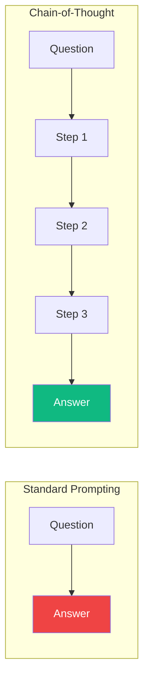
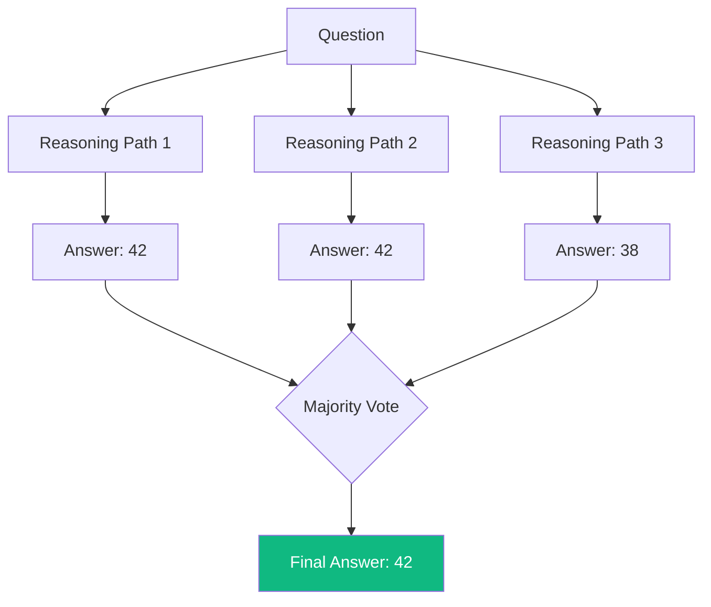
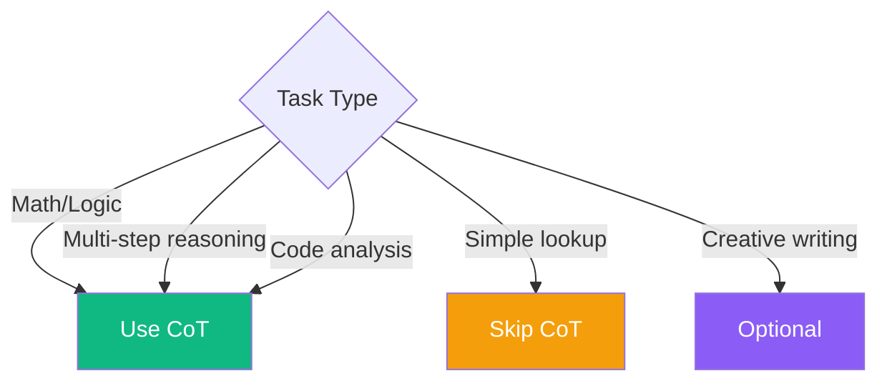

Large language models can produce impressive results, but they sometimes struggle with complex reasoning tasks. Chain-of-Thought (CoT) prompting is a technique that dramatically improves reasoning performance by encouraging the model to "think out loud" and work through problems step by step.

## What Is Chain-of-Thought Prompting?

Chain-of-Thought prompting asks the model to show its reasoning process rather than jumping directly to an answer. This mimics how humans solve complex problems—by breaking them down into smaller steps.



### Standard Prompting

```
Q: A store has 45 apples. They sell 17 and receive a shipment of 32.
How many apples do they have now?
A: 60
```

### Chain-of-Thought Prompting

```
Q: A store has 45 apples. They sell 17 and receive a shipment of 32.
How many apples do they have now?

Let me work through this step by step:
1. Starting apples: 45
2. After selling 17: 45 - 17 = 28
3. After receiving 32: 28 + 32 = 60

A: The store now has 60 apples.
```

## Why Does It Work?

Chain-of-Thought prompting works because:

1. **Reduces compound errors**: Breaking down problems prevents mistakes from cascading
2. **Leverages training data**: LLMs have seen many step-by-step solutions during training
3. **Provides checkpoints**: Each step can be verified independently
4. **Manages complexity**: Complex problems become a series of simple steps

## Techniques for Chain-of-Thought

### 1. Zero-Shot CoT

Simply add "Let's think step by step" to your prompt:

```
Q: If John has 3 times as many apples as Mary, and Mary has 4 more
apples than Tom, and Tom has 5 apples, how many apples does John have?

Let's think step by step.
```

Output:
```
Let's think step by step.

1. Tom has 5 apples (given)
2. Mary has 4 more than Tom: 5 + 4 = 9 apples
3. John has 3 times as many as Mary: 9 × 3 = 27 apples

Therefore, John has 27 apples.
```

### 2. Few-Shot CoT

Provide examples that demonstrate step-by-step reasoning:

```
Q: A train travels at 60 mph for 2 hours, then 40 mph for 1 hour.
What is the total distance traveled?

Reasoning:
- Distance at 60 mph: 60 × 2 = 120 miles
- Distance at 40 mph: 40 × 1 = 40 miles
- Total distance: 120 + 40 = 160 miles
Answer: 160 miles

Q: A car travels at 50 mph for 3 hours, then 70 mph for 2 hours.
What is the total distance traveled?

Reasoning:
```

### 3. Self-Consistency

Generate multiple reasoning paths and take the majority answer:



```
Generate 3 different approaches to solve this problem.
For each approach, show your reasoning and final answer.
Then determine which answer is most likely correct.

Problem: [Your complex problem here]
```

## Practical Applications

### Code Debugging

```
The following code has a bug. Think through how it executes step by step
to identify the issue.

```python
def find_average(numbers):
    total = 0
    for i in range(len(numbers)):
        total += numbers[i]
    return total / len(numbers)

result = find_average([])
```

Let me trace through the execution:
1. Function is called with an empty list []
2. total is initialized to 0
3. range(len([])) = range(0), so the loop doesn't execute
4. Return statement: total / len(numbers) = 0 / 0

Bug identified: Division by zero when the list is empty.

Solution: Add a check for empty input.
```

### Complex Analysis

```
Analyze whether this business decision makes sense. Think through
the implications step by step.

Scenario: A company wants to reduce prices by 20% to increase sales volume,
expecting that this will lead to higher overall revenue.

Let me analyze this step by step:

1. **Price reduction impact**: A 20% price reduction means each unit
   brings in 80% of the previous revenue.

2. **Break-even calculation**: To maintain the same revenue with 80%
   of the price, sales volume must increase by:
   1/0.8 = 1.25, meaning a 25% increase in volume.

3. **Market considerations**:
   - Is demand elastic enough for 25%+ volume increase?
   - Will competitors respond with their own price cuts?
   - What are the production capacity constraints?

4. **Cost implications**:
   - 25% more sales means 25% more variable costs
   - Fixed costs per unit decrease with higher volume

Conclusion: This decision only makes sense if...
```

### Multi-Step Reasoning

```
Determine if the conclusion follows from the premises.
Show your reasoning at each step.

Premises:
1. All programmers know at least one programming language.
2. Some programmers are also designers.
3. No designers work in finance.

Conclusion: Some people who know programming languages don't work in finance.

Reasoning:
Step 1: From premise 2, there exist some people who are both programmers
        and designers.

Step 2: From premise 1, these programmer-designers know at least one
        programming language.

Step 3: From premise 3, these programmer-designers (being designers)
        don't work in finance.

Step 4: Therefore, there exist people who know programming languages
        (the programmer-designers) and don't work in finance.

The conclusion is VALID.
```

## When to Use Chain-of-Thought



**Best for:**
- Mathematical word problems
- Logical reasoning
- Code debugging and analysis
- Complex decision-making
- Multi-step planning

**Less useful for:**
- Simple factual questions
- Creative tasks without structure
- Tasks where the answer is obvious

## Tips for Effective Chain-of-Thought

### 1. Be Explicit About Format

```
Solve this problem using the following format:
- Given: [list what's provided]
- Find: [what we need to determine]
- Steps: [numbered reasoning steps]
- Answer: [final answer]
```

### 2. Encourage Verification

```
After solving, verify your answer by:
1. Checking each calculation
2. Ensuring the answer makes sense
3. Trying an alternative approach if possible
```

### 3. Handle Uncertainty

```
If you're uncertain about any step:
- State your assumption clearly
- Explain why you made that assumption
- Note how different assumptions might change the result
```

## Summary

| Technique | Description | Best For |
|-----------|-------------|----------|
| Zero-Shot CoT | Add "Let's think step by step" | Quick improvements |
| Few-Shot CoT | Provide reasoning examples | Consistent format |
| Self-Consistency | Multiple paths + voting | High-stakes decisions |

Chain-of-Thought prompting is one of the most powerful techniques for improving LLM reasoning. By encouraging step-by-step thinking, you can dramatically improve accuracy on complex tasks while also gaining transparency into the model's reasoning process.

## References

- Wei, Jason, et al. "Chain-of-Thought Prompting Elicits Reasoning in Large Language Models." NeurIPS 2022.
- Phoenix, James and Taylor, Mike. *Prompt Engineering for Generative AI*. O'Reilly Media, 2024.
