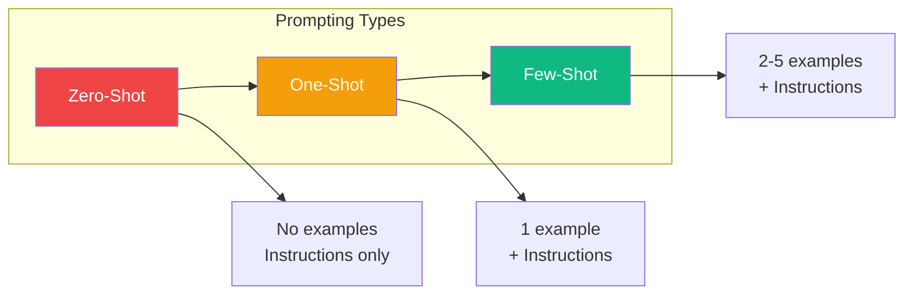
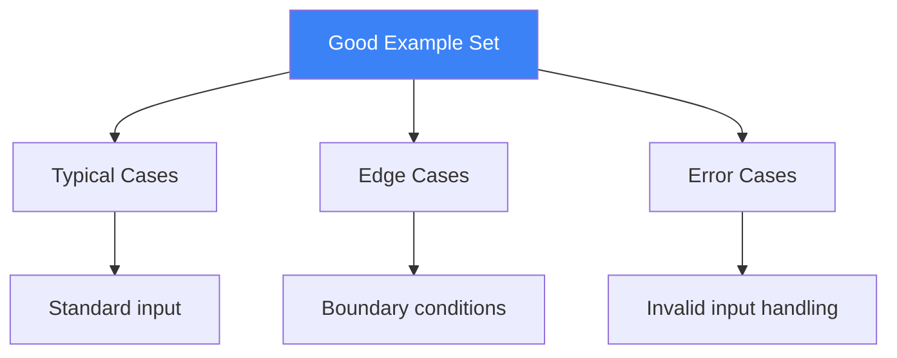
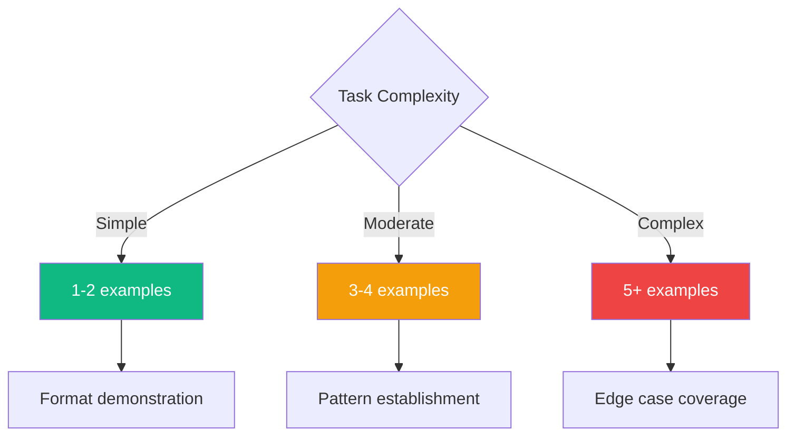

One of the most effective ways to guide large language models is through examples. This technique, known as few-shot prompting, allows you to demonstrate the desired behavior rather than just describe it. In this article, we'll explore the spectrum from zero-shot to few-shot prompting and learn when to use each approach.

## The Prompting Spectrum



## Zero-Shot Prompting

Zero-shot prompting relies entirely on instructions without providing any examples. Modern LLMs are remarkably capable at zero-shot tasks.

```
Classify the following text as either "spam" or "not spam":

Text: "Congratulations! You've won a free iPhone. Click here to claim."
Classification:
```

**When Zero-Shot Works Well:**
- Simple, well-defined tasks
- Common tasks the model has seen during training
- When format is obvious

**When Zero-Shot Falls Short:**
- Ambiguous output formats
- Subjective or nuanced tasks
- Domain-specific classifications

## One-Shot Prompting

One-shot prompting provides a single example to demonstrate the expected format and behavior.

```
Convert the following product description into a JSON object.

Example:
Description: "Blue cotton t-shirt, size medium, $29.99"
JSON: {"color": "blue", "material": "cotton", "type": "t-shirt", "size": "medium", "price": 29.99}

Now convert this:
Description: "Red leather wallet with zipper, $45.00"
JSON:
```

One example is often sufficient when:
- The format needs demonstration
- The task is straightforward
- You want to minimize token usage

## Few-Shot Prompting

Few-shot prompting uses multiple examples (typically 2-5) to establish patterns and handle edge cases.

### Example: Entity Extraction

```
Extract the person names and their roles from the following sentences.

Example 1:
Sentence: "Dr. Sarah Chen, the lead researcher, presented the findings."
Output: {"name": "Sarah Chen", "role": "lead researcher"}

Example 2:
Sentence: "The project was managed by James Wilson, senior PM."
Output: {"name": "James Wilson", "role": "senior PM"}

Example 3:
Sentence: "CEO Maria Garcia announced the partnership yesterday."
Output: {"name": "Maria Garcia", "role": "CEO"}

Now extract from this sentence:
Sentence: "Technical lead Alex Kim reviewed the architecture proposal."
Output:
```

### Example: Code Translation

```
Convert Python code to JavaScript.

Python:
def greet(name):
    return f"Hello, {name}!"

JavaScript:
function greet(name) {
    return `Hello, ${name}!`;
}

---

Python:
numbers = [1, 2, 3, 4, 5]
doubled = [x * 2 for x in numbers]

JavaScript:
const numbers = [1, 2, 3, 4, 5];
const doubled = numbers.map(x => x * 2);

---

Python:
data = {"name": "Alice", "age": 30}
if "name" in data:
    print(data["name"])

JavaScript:
```

## Designing Effective Examples

### 1. Cover Edge Cases

Include examples that handle boundary conditions:

```
Format phone numbers to (XXX) XXX-XXXX format.

Example 1 (standard):
Input: 5551234567
Output: (555) 123-4567

Example 2 (with country code):
Input: +1-555-123-4567
Output: (555) 123-4567

Example 3 (with spaces):
Input: 555 123 4567
Output: (555) 123-4567

Example 4 (already formatted):
Input: (555) 123-4567
Output: (555) 123-4567

Now format:
Input: 555.987.6543
Output:
```

### 2. Show Diverse Scenarios



### 3. Maintain Consistent Format

All examples should follow the exact same structure:

```
# Good: Consistent format
Input: [data]
Category: [result]

Input: "I love this product!"
Category: positive

Input: "Worst purchase ever."
Category: negative

# Bad: Inconsistent format
"I love this product!" -> positive
Input: "Worst purchase ever."
Category: negative
```

## Advanced Few-Shot Techniques

### Chain-of-Thought Few-Shot

Combine few-shot with reasoning steps:

```
Solve the math problem step by step.

Problem: A store has 45 apples. They sell 12 in the morning and receive
a shipment of 30 in the afternoon. How many apples do they have now?
Thinking:
1. Start with 45 apples
2. Subtract morning sales: 45 - 12 = 33
3. Add afternoon shipment: 33 + 30 = 63
Answer: 63 apples

Problem: A baker makes 24 cupcakes. She gives 8 to her neighbor and
her friend brings 15 more. How many cupcakes does she have?
Thinking:
1. Start with 24 cupcakes
2. Subtract given away: 24 - 8 = 16
3. Add received: 16 + 15 = 31
Answer: 31 cupcakes

Problem: A library has 156 books. They donate 42 books and receive
a grant to buy 78 new ones. How many books do they have now?
Thinking:
```

### Dynamic Few-Shot Selection

For production systems, select examples dynamically based on the input:

```javascript
function selectExamples(input, examplePool, k = 3) {
  // Find examples most similar to the input
  const similarities = examplePool.map(example => ({
    example,
    similarity: computeSimilarity(input, example.input)
  }));

  // Return top-k most similar examples
  return similarities
    .sort((a, b) => b.similarity - a.similarity)
    .slice(0, k)
    .map(item => item.example);
}
```

## How Many Examples?



| Number | Best For |
|--------|----------|
| 1-2 | Simple format changes, clear transformations |
| 3-4 | Pattern recognition, consistent styling |
| 5+ | Complex reasoning, many edge cases |

**Note:** More examples mean higher token usage and cost. Find the minimum number that achieves your quality goals.

## Common Pitfalls

### 1. Inconsistent Examples

```
# Bad: Different formats
Example 1: The sentiment is positive.
Example 2: negative
Example 3: Sentiment: neutral

# Good: Same format every time
Example 1: positive
Example 2: negative
Example 3: neutral
```

### 2. Biased Example Selection

```
# Bad: All examples are positive
Example 1: "Great product!" -> positive
Example 2: "Love it!" -> positive
Example 3: "Amazing quality!" -> positive

# Good: Balanced examples
Example 1: "Great product!" -> positive
Example 2: "Terrible service." -> negative
Example 3: "It's okay." -> neutral
```

### 3. Overly Complex Examples

Keep examples simple and focused on the pattern you want to teach.

## Summary

| Technique | Examples | Best Use Case |
|-----------|----------|---------------|
| Zero-Shot | 0 | Simple, common tasks |
| One-Shot | 1 | Format demonstration |
| Few-Shot | 2-5 | Pattern establishment |
| Many-Shot | 5+ | Complex, nuanced tasks |

Few-shot prompting is one of the most powerful techniques in prompt engineering. By showing rather than telling, you can guide LLMs to produce exactly the output format and style you need, even for complex or domain-specific tasks.

## References

- Phoenix, James and Taylor, Mike. *Prompt Engineering for Generative AI*. O'Reilly Media, 2024.
- Berryman, John and Ziegler, Albert. *Prompt Engineering for LLMs*. O'Reilly Media, 2024.
