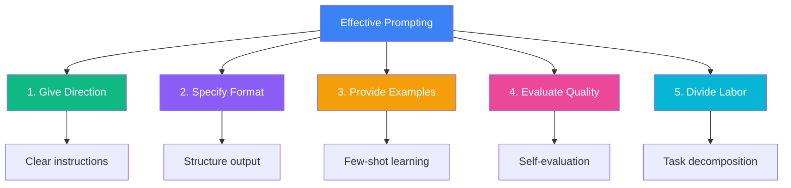
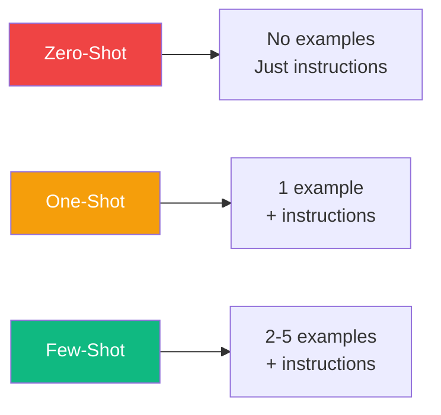
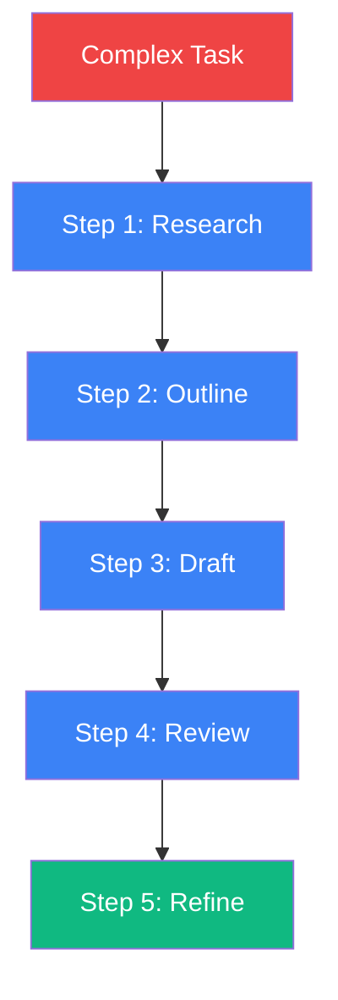

Prompt engineering is the art and science of crafting inputs that reliably produce useful outputs from large language models (LLMs). While modern AI models like GPT-4 and Claude can produce impressive results even with naive prompts, investing in proper prompt design becomes crucial when you need consistent, production-quality outputs.

In this article, we'll explore five fundamental principles that form the foundation of effective prompt engineering.

## Overview of the Five Principles



## 1. Give Direction

The first principle is to provide clear, specific instructions about what you want the AI to do. Vague prompts lead to vague results.

### Poor Prompt
```
Write something about JavaScript.
```

### Better Prompt
```
Write a concise explanation of JavaScript closures for intermediate
developers. Include a practical code example demonstrating how closures
enable data privacy. Keep the tone technical but approachable.
```

### Key Elements of Good Direction

| Element | Description | Example |
|---------|-------------|---------|
| Task | What to do | "Explain", "Generate", "Analyze" |
| Subject | Topic focus | "JavaScript closures", "REST APIs" |
| Audience | Who it's for | "Beginners", "Senior engineers" |
| Tone | Writing style | "Technical", "Casual", "Formal" |
| Constraints | Limitations | "Under 200 words", "No jargon" |

```
You are a senior software engineer writing documentation.
Explain [TOPIC] to junior developers who understand basic programming
but are new to this concept. Use analogies where helpful.
Include one code example. Keep it under 300 words.
```

## 2. Specify Format

Tell the AI exactly how you want the output structured. This is especially important for programmatic use of AI outputs.

### Unstructured Output
```
List some popular JavaScript frameworks.
```
Output: "Some popular JavaScript frameworks include React, Vue, and Angular..."

### Structured Output
```
List the top 5 JavaScript frameworks in JSON format with the following fields:
- name: framework name
- type: "library" or "framework"
- useCase: primary use case
- popularity: "high", "medium", or "low"
```

Output:
```json
[
  {
    "name": "React",
    "type": "library",
    "useCase": "Building user interfaces",
    "popularity": "high"
  },
  ...
]
```

### Common Format Specifications

- **JSON/YAML**: For structured data that will be parsed programmatically
- **Markdown**: For documentation and formatted text
- **Tables**: For comparisons and organized data
- **Bullet points**: For lists and key takeaways
- **Code blocks**: For executable examples

## 3. Provide Examples (Few-Shot Prompting)

Examples are one of the most powerful ways to guide AI behavior. This technique is called "few-shot prompting."



### Example: Sentiment Analysis

```
Classify the sentiment of the following reviews as "positive", "negative",
or "neutral".

Examples:
Review: "This product exceeded my expectations!"
Sentiment: positive

Review: "Terrible quality, broke after one day."
Sentiment: negative

Review: "It works as described, nothing special."
Sentiment: neutral

Now classify this review:
Review: "The shipping was slow but the product itself is amazing."
Sentiment:
```

### When to Use Examples

- When the task format isn't obvious
- When you need consistent output structure
- When the task involves subjective judgment
- When fine-tuning the AI's "style" or approach

## 4. Evaluate Quality

Build self-evaluation into your prompts. Ask the AI to critique its own work or think through potential issues.

### Self-Critique Pattern

```
Generate a function that validates email addresses.

After generating the code:
1. List potential edge cases this function might miss
2. Rate the code quality from 1-10 and explain why
3. Suggest one improvement if the rating is below 8
```

### Confidence Scoring

```
Answer the following question. After your answer, rate your confidence
from 1-10 and explain any uncertainties.

Question: What is the time complexity of JavaScript's Array.sort()?
```

Output:
```
JavaScript's Array.sort() typically uses Timsort, which has:
- Best case: O(n)
- Average case: O(n log n)
- Worst case: O(n log n)

Confidence: 7/10
Uncertainty: The actual algorithm can vary between JavaScript engines.
V8 (Chrome/Node) uses Timsort, but other engines might differ.
```

## 5. Divide Labor (Task Decomposition)

Complex tasks should be broken into smaller, manageable steps. This reduces errors and improves output quality.



### Example: Blog Post Generation

Instead of:
```
Write a blog post about microservices.
```

Use a multi-step approach:

**Step 1: Generate outline**
```
Create an outline for a technical blog post about microservices
architecture. Target audience: developers considering migrating
from monoliths. Include 5-7 main sections.
```

**Step 2: Expand each section**
```
Using this outline, write the "Benefits of Microservices" section.
Include specific examples and keep it under 200 words.
```

**Step 3: Review and refine**
```
Review the following section for technical accuracy and clarity.
Suggest improvements if needed.
```

### Benefits of Task Decomposition

| Benefit | Explanation |
|---------|-------------|
| Better quality | Each step can be optimized independently |
| Easier debugging | Identify where things go wrong |
| More control | Adjust individual steps as needed |
| Consistent results | Reduce variance in outputs |

## Putting It All Together

Here's a comprehensive prompt using all five principles:

```
# Direction
You are a technical writer creating API documentation for developers.

# Task
Document the following function for a REST API reference guide.

# Format
Use this structure:
- **Description**: One sentence summary
- **Parameters**: Table with name, type, required, description
- **Returns**: What the function returns
- **Example**: Code example with curl
- **Errors**: Possible error responses

# Example
[Include a complete example of documented function]

# Quality Check
After generating, verify:
1. All parameters are documented
2. Example is syntactically correct
3. Error cases are covered

# Function to Document
[Your function details here]
```

## Summary

| Principle | Key Question | Action |
|-----------|--------------|--------|
| Give Direction | What should the AI do? | Be specific about task and constraints |
| Specify Format | How should output look? | Define structure explicitly |
| Provide Examples | What does good look like? | Include 2-5 examples |
| Evaluate Quality | Is the output good enough? | Build in self-critique |
| Divide Labor | Can this be broken down? | Split complex tasks into steps |

Mastering these five principles will dramatically improve your prompt engineering results. Start with clear direction, add format specifications, include examples when needed, build in quality checks, and break complex tasks into manageable pieces.

## References

- Phoenix, James and Taylor, Mike. *Prompt Engineering for Generative AI*. O'Reilly Media, 2024.
- [OpenAI Prompt Engineering Guide](https://platform.openai.com/docs/guides/prompt-engineering)
