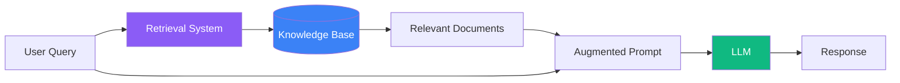
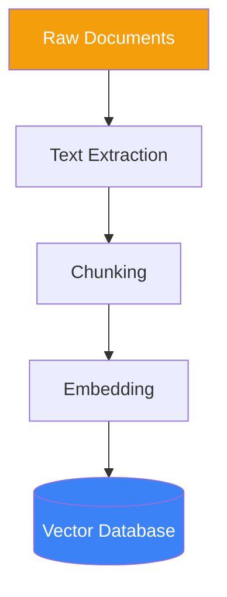
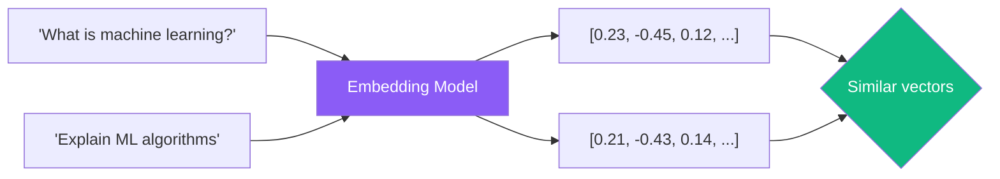
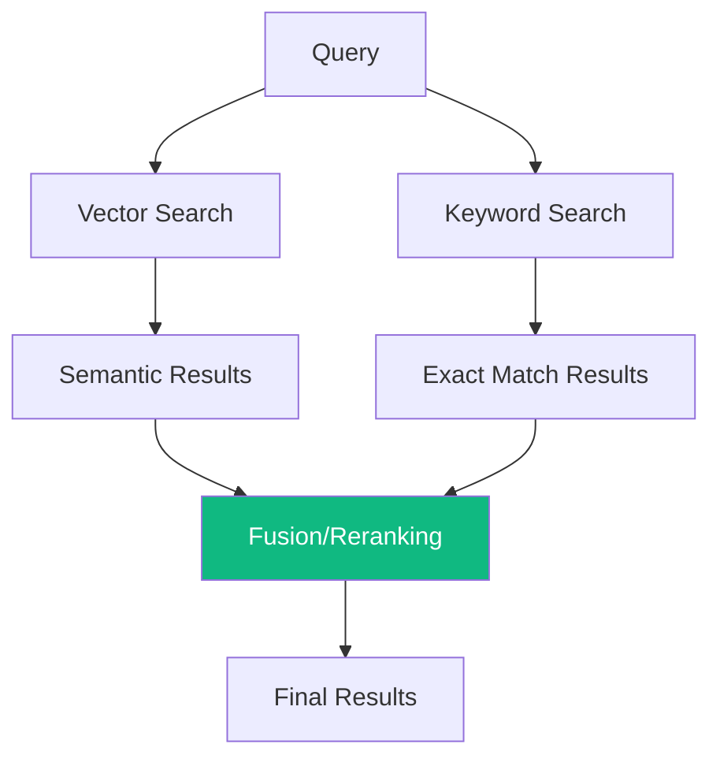

Large language models have a fundamental limitation: their knowledge is frozen at training time. Retrieval-Augmented Generation (RAG) solves this by combining LLMs with external knowledge retrieval, enabling accurate responses based on current information, private documents, or specialized data.

## What Is RAG?

RAG is an architecture that retrieves relevant information from a knowledge base and includes it in the prompt before generating a response.



### Without RAG

```
User: What's our company's refund policy?
LLM: I don't have access to your company's specific policies...
```

### With RAG

```
[Retrieved context: "Our refund policy allows returns within 30 days
of purchase. Items must be unused and in original packaging. Digital
products are non-refundable after download."]

User: What's our company's refund policy?
LLM: Based on your company policy, refunds are available within 30 days
of purchase. Items need to be unused and in original packaging. Note
that digital products cannot be refunded once downloaded.
```

## The RAG Pipeline

### 1. Document Ingestion

Documents are processed and converted into searchable chunks:



**Chunking Strategies:**

| Strategy | Description | Best For |
|----------|-------------|----------|
| Fixed size | Split by character/token count | Simple documents |
| Sentence | Split at sentence boundaries | Narrative text |
| Paragraph | Split at paragraph breaks | Structured documents |
| Semantic | Split by topic/meaning | Complex content |

### 2. Query Processing

When a user asks a question:

```javascript
async function processQuery(userQuery) {
  // 1. Convert query to embedding
  const queryEmbedding = await embedText(userQuery);

  // 2. Search vector database for similar chunks
  const relevantChunks = await vectorDB.search(queryEmbedding, {
    topK: 5,
    threshold: 0.7
  });

  // 3. Build augmented prompt
  const context = relevantChunks.map(c => c.text).join('\n\n');

  return buildPrompt(context, userQuery);
}
```

### 3. Prompt Construction

Combine retrieved context with the user's question:

```
Use the following context to answer the question. If the answer is not
in the context, say "I don't have enough information to answer that."

Context:
---
{retrieved_documents}
---

Question: {user_question}

Answer:
```

## Embedding and Vector Search

Embeddings convert text into numerical vectors that capture semantic meaning:



### Similarity Measures

| Measure | Description | Range |
|---------|-------------|-------|
| Cosine similarity | Angle between vectors | -1 to 1 |
| Euclidean distance | Straight-line distance | 0 to ∞ |
| Dot product | Magnitude-aware similarity | -∞ to ∞ |

## RAG Best Practices

### 1. Chunk Size Optimization

```
Too small chunks:
- Lose context
- More retrieval noise
- Incomplete information

Too large chunks:
- Diluted relevance
- Token limit issues
- Slower processing

Sweet spot: 200-500 tokens with overlap
```

### 2. Add Metadata for Filtering

```javascript
const document = {
  text: "Our Q3 2024 revenue increased by 15%...",
  metadata: {
    source: "quarterly_report",
    date: "2024-10-01",
    department: "finance",
    confidentiality: "internal"
  }
};

// Filter retrieval by metadata
const results = await vectorDB.search(query, {
  filter: {
    department: "finance",
    date: { $gte: "2024-01-01" }
  }
});
```

### 3. Hybrid Search

Combine vector search with keyword search for better results:



### 4. Context Window Management

```javascript
function buildContext(chunks, maxTokens = 3000) {
  let context = [];
  let tokenCount = 0;

  for (const chunk of chunks) {
    const chunkTokens = countTokens(chunk.text);
    if (tokenCount + chunkTokens > maxTokens) break;

    context.push(chunk.text);
    tokenCount += chunkTokens;
  }

  return context.join('\n\n---\n\n');
}
```

## Advanced RAG Patterns

### Query Transformation

Improve retrieval by reformulating queries:

```
Original query: "Why isn't it working?"

Transformed queries:
1. "Common errors and troubleshooting steps"
2. "Error messages and their solutions"
3. "Debugging guide for [product]"
```

### Multi-Query RAG

Generate multiple query variations and merge results:

```javascript
async function multiQueryRAG(originalQuery) {
  // Generate query variations
  const variations = await llm.generate(`
    Generate 3 different ways to ask this question:
    "${originalQuery}"
  `);

  // Retrieve for each variation
  const allResults = await Promise.all(
    [originalQuery, ...variations].map(q => retrieve(q))
  );

  // Deduplicate and rerank
  return rerank(deduplicate(allResults.flat()));
}
```

### Self-RAG (Critique and Refine)

Have the LLM evaluate retrieval quality:

```
Given this context and question, first evaluate:
1. Is the context relevant to the question? (yes/no)
2. Does the context contain enough information? (yes/no)
3. Is any information potentially outdated? (yes/no)

If all answers are "yes", provide your answer.
If not, explain what additional information is needed.

Context: {context}
Question: {question}
```

## Common RAG Challenges

### 1. Retrieval Quality

| Problem | Solution |
|---------|----------|
| Irrelevant results | Improve chunking, add metadata filters |
| Missing information | Increase top-K, use hybrid search |
| Outdated content | Implement document versioning |

### 2. Hallucination Prevention

```
Answer based ONLY on the provided context.
If the information is not in the context, respond with:
"I cannot find this information in the available documents."

DO NOT use any external knowledge or make assumptions.
```

### 3. Citation and Attribution

```
When answering, cite your sources in this format:
- Use [1], [2], etc. for inline citations
- List sources at the end with document names

Context:
[1] company_policy.pdf: "Employees receive 20 vacation days..."
[2] hr_handbook.pdf: "Unused vacation days can be carried over..."
```

## Summary

| Component | Purpose | Key Consideration |
|-----------|---------|-------------------|
| Chunking | Break documents into searchable units | Size and overlap |
| Embedding | Convert text to vectors | Model selection |
| Vector DB | Store and search embeddings | Scalability |
| Retrieval | Find relevant context | Precision vs recall |
| Prompt | Combine context with query | Clear instructions |

RAG transforms LLMs from static knowledge systems into dynamic tools that can work with your specific data. By combining the reasoning capabilities of LLMs with accurate information retrieval, you can build reliable AI applications for documentation, customer support, research, and more.

## References

- Phoenix, James and Taylor, Mike. *Prompt Engineering for Generative AI*. O'Reilly Media, 2024.
- Lewis, Patrick, et al. "Retrieval-Augmented Generation for Knowledge-Intensive NLP Tasks." NeurIPS 2020.
