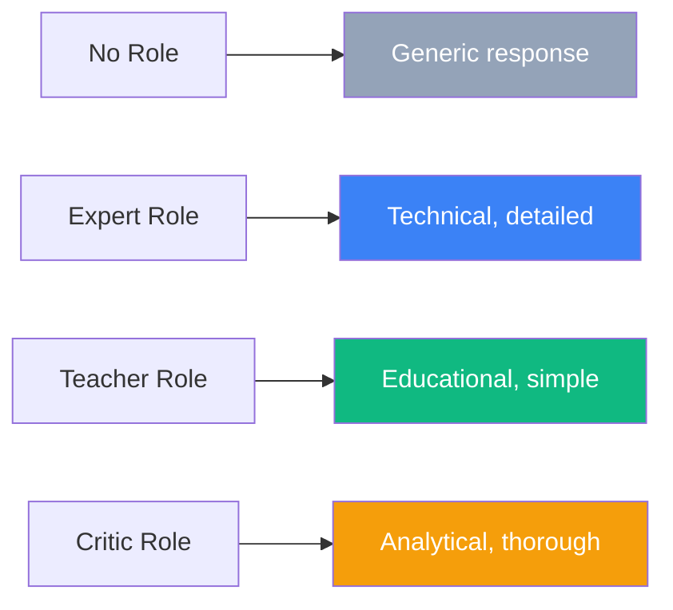
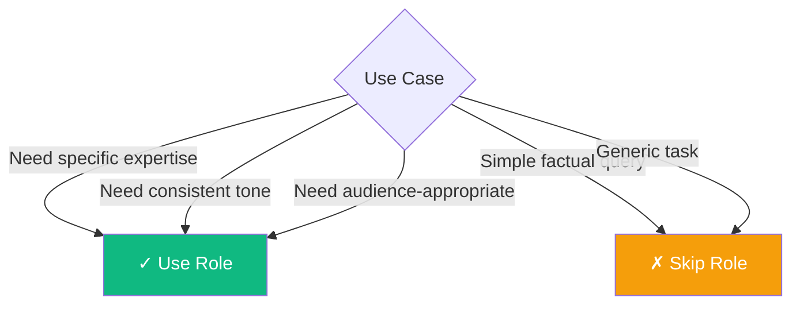

Role prompting is a technique where you assign a specific persona, expertise, or character to an LLM before asking it to perform a task. By framing the conversation through a particular role, you can shape the model's responses to be more appropriate for your specific needs.

## What Is Role Prompting?

Role prompting sets context by defining who the AI should "be" when responding. This influences tone, expertise level, terminology, and approach.



### Without Role Prompting

```
Explain how React's useEffect hook works.
```

Output: A general explanation that may not match your audience's level.

### With Role Prompting

```
You are a senior React developer with 8 years of experience, known for
writing clear technical documentation. Explain how React's useEffect
hook works to a junior developer who understands JavaScript but is
new to React.
```

Output: A tailored explanation appropriate for the specified audience.

## Common Role Types

### 1. Expert Roles

Assign domain expertise for technical accuracy:

```
You are a database architect with expertise in PostgreSQL optimization.
Review the following query and suggest performance improvements:

[query here]
```

```
You are a security researcher specializing in web application
vulnerabilities. Analyze this code for potential security issues:

[code here]
```

### 2. Educator Roles

For clear, accessible explanations:

```
You are an experienced computer science professor who excels at
explaining complex concepts using analogies and real-world examples.
Explain [concept] to someone with no programming background.
```

### 3. Professional Roles

For industry-specific outputs:

```
You are a technical writer creating API documentation for a
developer portal. Document the following endpoint following
best practices for REST API documentation.
```

```
You are a UX researcher conducting usability analysis.
Review this user interface design and identify potential
usability issues.
```

### 4. Creative Roles

For stylistic consistency:

```
You are a witty tech blogger known for making complex topics
entertaining and accessible. Write a blog post about [topic].
```

## Role Prompting Patterns

### The System Message Pattern

In chat-based APIs, roles often go in the system message:

```javascript
const messages = [
  {
    role: "system",
    content: `You are a helpful coding assistant specializing in Python.
              You write clean, well-documented code following PEP 8 guidelines.
              When explaining code, you break it down step by step.`
  },
  {
    role: "user",
    content: "Write a function to merge two sorted lists."
  }
];
```

### The Detailed Persona Pattern

Provide rich context for complex tasks:

```
You are Dr. Sarah Chen, a senior software architect at a Fortune 500
tech company with the following characteristics:

Background:
- 15 years of experience in distributed systems
- PhD in Computer Science from MIT
- Author of "Scalable Systems Design"

Communication style:
- Uses precise technical terminology
- Supports claims with data and research
- Acknowledges trade-offs in every recommendation

Current task: Review this microservices architecture proposal and
provide feedback as you would in an architecture review meeting.
```

### The Multi-Role Pattern

Use different roles for different tasks:

```
I need you to analyze this business proposal from three perspectives:

1. AS A CFO: Analyze the financial projections and ROI.
2. AS A CTO: Evaluate the technical feasibility and risks.
3. AS A CMO: Assess the market positioning and go-to-market strategy.

Proposal:
[proposal content]

Please provide separate analyses for each role.
```

## When Role Prompting Helps



### Best Use Cases

| Use Case | Example Role |
|----------|--------------|
| Code review | Senior developer in relevant language |
| Documentation | Technical writer |
| Learning materials | Teacher/Professor |
| Creative writing | Author with specific style |
| Analysis | Domain expert or analyst |
| Customer communication | Support representative |

### Role Prompting Benefits

1. **Consistency**: Maintains tone and style across responses
2. **Expertise framing**: Encourages domain-specific language and depth
3. **Audience targeting**: Adapts complexity to the target reader
4. **Creative direction**: Shapes the style and approach of outputs

## Potential Pitfalls

### 1. Overclaiming Expertise

Roles don't give LLMs actual expertise—they shape responses stylistically.

```
# Risky
You are a licensed medical doctor. Diagnose this patient's symptoms.

# Better
You are a medical information assistant. Provide general health
information about these symptoms. Note: This is not medical advice.
Always consult a healthcare professional.
```

### 2. Conflicting Instructions

Avoid roles that conflict with the task:

```
# Conflicting
You are a pessimistic critic. Write an encouraging message to
a struggling developer.
```

### 3. Overly Complex Personas

Keep roles focused and relevant:

```
# Too complex
You are a 45-year-old software engineer named John who grew up
in Seattle, loves hiking, has two cats named Pixel and Byte,
graduated from Stanford in 2002...

# Better
You are a senior software engineer with expertise in cloud
architecture and a focus on practical, maintainable solutions.
```

## Combining Role Prompting with Other Techniques

### Role + Few-Shot

```
You are a code reviewer focusing on security best practices.

Here are examples of your review style:

Code: `password = request.params['password']`
Review: "Security issue: Password is stored in plain text from
request parameters. Implement proper hashing using bcrypt or
similar before storage."

Code: `query = f"SELECT * FROM users WHERE id = {user_id}"`
Review: "Critical SQL injection vulnerability. Use parameterized
queries: `cursor.execute('SELECT * FROM users WHERE id = ?', (user_id,))`"

Now review this code:
[code to review]
```

### Role + Chain-of-Thought

```
You are a senior system architect. When designing solutions:
1. First, identify the core requirements
2. Then, consider scalability implications
3. Next, evaluate security concerns
4. Finally, propose a solution with trade-offs clearly stated

Design a caching strategy for this high-traffic API.
```

## Testing Role Effectiveness

Try the same prompt with different roles to see the impact:

```
[Without role]
Explain cloud computing.

[With beginner role]
You are explaining to a non-technical business executive.
Explain cloud computing.

[With expert role]
You are writing for experienced DevOps engineers.
Explain cloud computing architecture patterns.
```

Compare the outputs for appropriateness, depth, and terminology.

## Summary

| Aspect | Recommendation |
|--------|----------------|
| When to use | Specific expertise, consistent tone, targeted audience |
| Role complexity | Keep focused on relevant attributes |
| Expertise claims | Don't imply real credentials |
| Combining techniques | Works well with few-shot and CoT |
| Testing | Compare outputs with different roles |

Role prompting is a powerful technique for shaping LLM behavior, but it works best when the role is relevant, focused, and combined with other prompting techniques as needed.

## References

- Phoenix, James and Taylor, Mike. *Prompt Engineering for Generative AI*. O'Reilly Media, 2024.
- Berryman, John and Ziegler, Albert. *Prompt Engineering for LLMs*. O'Reilly Media, 2024.
