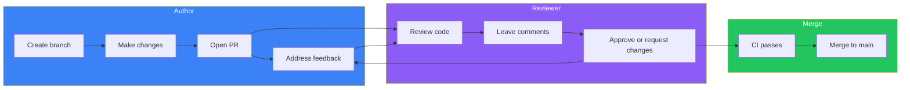
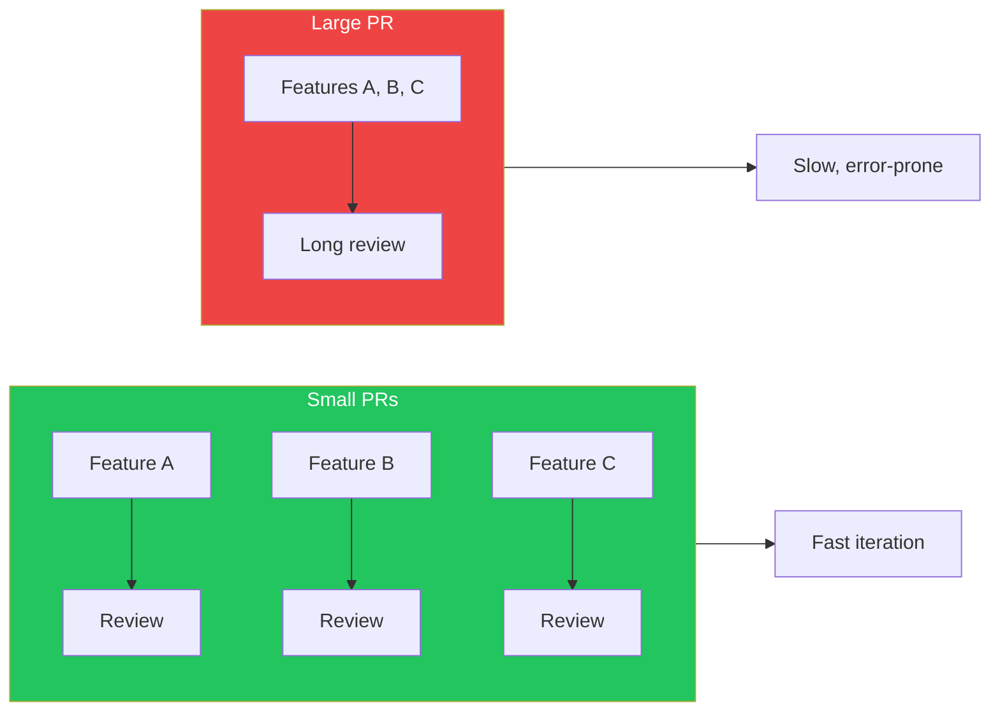
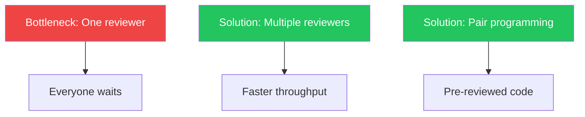

## Introduction

Code review through pull requests is one of the most valuable practices in software development. It catches bugs, shares knowledge, and maintains code quality. But poor review practices can slow down development and create friction.

This article covers best practices for both creating and reviewing pull requests.

## The Pull Request Process



## Creating Good Pull Requests

### Keep PRs Small

| PR Size | Lines Changed | Review Time | Quality |
|---------|---------------|-------------|---------|
| Small | < 200 | 15-30 min | High |
| Medium | 200-400 | 30-60 min | Medium |
| Large | > 400 | 1+ hour | Lower |



### Write Descriptive PR Titles

```markdown
## Bad Titles
- "Fix bug"
- "Update code"
- "Changes"

## Good Titles
- "Fix login validation for empty passwords"
- "Add retry logic to payment gateway calls"
- "Refactor user service to use repository pattern"
```

### PR Description Template

```markdown
## Summary
Brief description of what this PR does.

## Changes
- Added new endpoint for user preferences
- Updated User model with preference fields
- Added unit tests for preference service

## Testing
- [ ] Unit tests pass
- [ ] Manual testing completed
- [ ] E2E tests updated

## Screenshots (if applicable)
[Before/After screenshots for UI changes]

## Related Issues
Closes #123
```

### Configure PR Templates

```markdown
<!-- .github/PULL_REQUEST_TEMPLATE.md -->
## Description
<!-- What does this PR do? -->

## Type of Change
- [ ] Bug fix
- [ ] New feature
- [ ] Breaking change
- [ ] Documentation update

## Checklist
- [ ] I have tested my changes
- [ ] I have updated documentation
- [ ] I have added tests
- [ ] My code follows the style guidelines

## Related Issues
<!-- Link related issues -->
```

## CODEOWNERS

Automatically assign reviewers based on file paths:

```
# .github/CODEOWNERS

# Default reviewers for all files
* @org/developers

# Frontend team owns UI code
/src/components/ @org/frontend-team
/src/styles/ @org/frontend-team
*.tsx @org/frontend-team

# Backend team owns API
/src/api/ @org/backend-team
/src/services/ @org/backend-team

# DevOps owns infrastructure
/.github/ @org/devops
/terraform/ @org/devops
Dockerfile @org/devops

# Security team must review auth changes
/src/auth/ @org/security-team
/src/middleware/auth* @org/security-team

# Specific file owners
package.json @lead-developer
```

### CODEOWNERS with Required Reviews

Configure in repository settings:

1. Enable "Require review from Code Owners"
2. Set minimum number of reviewers
3. Dismiss stale reviews on new commits

## Review Automation

### Automated Checks Before Review

```yaml
# .github/workflows/pr-checks.yml
name: PR Checks

on:
  pull_request:
    types: [opened, synchronize]

jobs:
  lint:
    runs-on: ubuntu-latest
    steps:
      - uses: actions/checkout@v4
      - run: npm ci
      - run: npm run lint

  test:
    runs-on: ubuntu-latest
    steps:
      - uses: actions/checkout@v4
      - run: npm ci
      - run: npm test

  build:
    runs-on: ubuntu-latest
    steps:
      - uses: actions/checkout@v4
      - run: npm ci
      - run: npm run build
```

### Auto-Assign Reviewers

```yaml
# .github/workflows/auto-assign.yml
name: Auto Assign Reviewers

on:
  pull_request:
    types: [opened, ready_for_review]

jobs:
  assign:
    runs-on: ubuntu-latest
    steps:
      - uses: kentaro-m/auto-assign-action@v1
        with:
          configuration-path: '.github/auto-assign.yml'
```

```yaml
# .github/auto-assign.yml
addReviewers: true
addAssignees: author
numberOfReviewers: 2
reviewers:
  - reviewer1
  - reviewer2
  - reviewer3
```

### Auto-Label PRs

```yaml
# .github/workflows/labeler.yml
name: Label PRs

on:
  pull_request:
    types: [opened, synchronize]

jobs:
  label:
    runs-on: ubuntu-latest
    steps:
      - uses: actions/labeler@v4
        with:
          repo-token: ${{ secrets.GITHUB_TOKEN }}
```

```yaml
# .github/labeler.yml
frontend:
  - 'src/components/**'
  - '*.tsx'

backend:
  - 'src/api/**'
  - 'src/services/**'

documentation:
  - '*.md'
  - 'docs/**'

tests:
  - '**/*.test.ts'
  - '**/*.spec.ts'
```

## Conducting Effective Reviews

### Review Checklist

```markdown
## Code Review Checklist

### Functionality
- [ ] Does the code do what it's supposed to?
- [ ] Are edge cases handled?
- [ ] Is error handling appropriate?

### Code Quality
- [ ] Is the code readable and well-organized?
- [ ] Are variable/function names descriptive?
- [ ] Is there unnecessary complexity?

### Testing
- [ ] Are there adequate tests?
- [ ] Do tests cover edge cases?
- [ ] Are tests readable?

### Security
- [ ] No hardcoded secrets?
- [ ] Input validation present?
- [ ] No SQL injection vulnerabilities?

### Performance
- [ ] No obvious performance issues?
- [ ] Database queries optimized?
- [ ] No memory leaks?
```

### Comment Types

| Prefix | Meaning | Action Required |
|--------|---------|-----------------|
| `blocking:` | Must fix before merge | Yes |
| `suggestion:` | Consider this change | Optional |
| `question:` | Need clarification | Respond |
| `nitpick:` | Minor style issue | Optional |
| `praise:` | Good work! | None |

### Writing Constructive Feedback

```markdown
## Instead of:
"This is wrong."
"Why did you do it this way?"
"This code is confusing."

## Write:
"This might cause issues when X happens. Consider handling that case."
"I'm curious about the reasoning here. Could you explain?"
"I had trouble following this logic. Would it help to extract it into a function?"
```

### Asking Good Questions

```markdown
## Good Questions
- "What happens if this API call fails?"
- "Have you considered using X instead? It might simplify this."
- "Could you add a comment explaining why we need this?"

## Avoid
- "Why didn't you...?" (sounds accusatory)
- "You should have..." (sounds condescending)
```

## Responding to Reviews

### As the Author

```markdown
## Good Responses
- "Good catch! Fixed in abc123."
- "I chose this approach because X. Happy to change if you prefer Y."
- "Added a comment to clarify this."

## What to Avoid
- Getting defensive
- Ignoring feedback
- Making changes without responding to comments
```

### Resolving Conversations

1. **Address the feedback** in code or discussion
2. **Reply** to acknowledge you've seen it
3. **Resolve** the conversation when done
4. Let the **reviewer** resolve if they requested changes

## Review Efficiency

### Time-Boxing Reviews

```markdown
## Review Schedule
- Check PRs at start of day
- Check PRs after lunch
- Set aside 30 min for reviews

## Avoid
- Reviewing PRs constantly (context switching)
- Letting PRs sit for days
```

### Prioritizing Reviews

| Priority | Type | Response Time |
|----------|------|---------------|
| High | Blocking other work | < 4 hours |
| Medium | Regular features | < 24 hours |
| Low | Documentation, refactoring | < 48 hours |

### Using Review Tools

```yaml
# VS Code settings for review
{
  "github.pullRequests.showDiff": true,
  "github.pullRequests.diffLayout": "split"
}
```

## Building Review Culture

### Team Agreements

```markdown
## Our Review Guidelines

### Expectations
- All PRs need at least 1 approval
- Security-sensitive changes need 2 approvals
- Authors respond to feedback within 24 hours
- Reviewers provide feedback within 24 hours

### Communication
- Use conventional comment prefixes
- Be respectful and constructive
- Ask questions instead of making demands
- Acknowledge good work

### Efficiency
- Keep PRs under 400 lines
- Include tests with features
- Self-review before requesting review
```

### Avoiding Review Bottlenecks



### Measuring Review Health

Track these metrics:

| Metric | Target | Why |
|--------|--------|-----|
| Time to first review | < 4 hours | Fast feedback |
| Time to merge | < 24 hours | Keep momentum |
| Review iterations | < 3 | Clear requirements |
| PR size | < 400 lines | Quality reviews |

## Summary

| Area | Best Practice |
|------|---------------|
| **PR Size** | Keep under 400 lines |
| **Description** | Use templates, explain why |
| **CODEOWNERS** | Auto-assign experts |
| **Automation** | Lint, test, label before review |
| **Feedback** | Constructive, use prefixes |
| **Response** | < 24 hours for both parties |
| **Culture** | Respectful, learning-focused |

Good code review practices improve code quality, share knowledge, and build stronger teams.

## References

- Packt - DevOps Unleashed with Git and GitHub, Chapter 4
- O'Reilly - Version Control with Git, Chapter 18
- Google Engineering Practices - Code Review
- GitHub Docs - Pull Request Reviews
