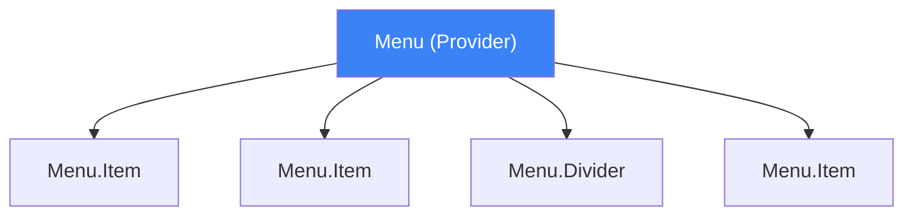
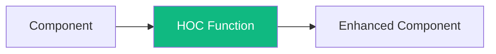

As your React applications grow, you'll need patterns that make components more flexible and reusable. Three fundamental patterns have stood the test of time: Compound Components, Render Props, and Higher-Order Components (HOCs).

Let's explore each pattern and when to use them.

## Compound Components

Compound components are a pattern where multiple components work together to form a complete UI. Think of `<select>` and `<option>` in HTML — they only make sense together.

### The Problem

Imagine building a customizable Menu component:

```jsx
// Inflexible: All customization through props
<Menu
  items={['Home', 'About', 'Contact']}
  onSelect={handleSelect}
  renderItem={(item) => <span>{item}</span>}
  showDividers={true}
  dividerAfter={[0, 1]}
/>
```

This "prop explosion" makes the component hard to use and maintain.

### The Solution: Compound Components

```jsx
// Flexible: Composition over configuration
<Menu>
  <Menu.Item onSelect={() => navigate('/home')}>Home</Menu.Item>
  <Menu.Item onSelect={() => navigate('/about')}>About</Menu.Item>
  <Menu.Divider />
  <Menu.Item onSelect={() => navigate('/contact')}>Contact</Menu.Item>
</Menu>
```



### Implementation

```jsx
const MenuContext = createContext();

function Menu({ children }) {
  const [activeIndex, setActiveIndex] = useState(null);

  return (
    <MenuContext.Provider value={{ activeIndex, setActiveIndex }}>
      <ul className="menu" role="menu">
        {children}
      </ul>
    </MenuContext.Provider>
  );
}

function MenuItem({ children, onSelect, disabled = false }) {
  const { setActiveIndex } = useContext(MenuContext);

  const handleClick = () => {
    if (!disabled) {
      onSelect?.();
    }
  };

  return (
    <li
      className={`menu-item ${disabled ? 'disabled' : ''}`}
      onClick={handleClick}
      role="menuitem"
    >
      {children}
    </li>
  );
}

function MenuDivider() {
  return <li className="menu-divider" role="separator" />;
}

// Attach sub-components
Menu.Item = MenuItem;
Menu.Divider = MenuDivider;

export default Menu;
```

### Real-World Examples

- Headless UI's `<Menu>`, `<Listbox>`, `<Dialog>`
- Radix UI's primitive components
- Reach UI's accessible components

## Render Props

Render props is a pattern for sharing code between components using a prop whose value is a function.

### The Pattern

```jsx
// The component calls the render prop with data
<DataFetcher
  url="/api/users"
  render={(data, loading, error) => {
    if (loading) return <Spinner />;
    if (error) return <Error error={error} />;
    return <UserList users={data} />;
  }}
/>
```

### Implementation

```jsx
function DataFetcher({ url, render }) {
  const [data, setData] = useState(null);
  const [loading, setLoading] = useState(true);
  const [error, setError] = useState(null);

  useEffect(() => {
    setLoading(true);
    fetch(url)
      .then(res => res.json())
      .then(setData)
      .catch(setError)
      .finally(() => setLoading(false));
  }, [url]);

  return render(data, loading, error);
}
```

### Children as a Function

A common variation uses `children` instead of a named prop:

```jsx
<Mouse>
  {({ x, y }) => (
    <div>Mouse position: {x}, {y}</div>
  )}
</Mouse>

function Mouse({ children }) {
  const [position, setPosition] = useState({ x: 0, y: 0 });

  useEffect(() => {
    const handleMove = (e) => setPosition({ x: e.clientX, y: e.clientY });
    window.addEventListener('mousemove', handleMove);
    return () => window.removeEventListener('mousemove', handleMove);
  }, []);

  return children(position);
}
```

### When to Use Render Props

- When you need to share behavior, not just data
- When the consumer needs full control over rendering
- As an alternative to HOCs when you need dynamic composition

### Render Props vs Custom Hooks

Custom hooks have largely replaced render props for logic sharing:

```jsx
// Render props approach
<WindowSize>
  {({ width, height }) => <div>{width} x {height}</div>}
</WindowSize>

// Custom hook approach (preferred)
function Component() {
  const { width, height } = useWindowSize();
  return <div>{width} x {height}</div>;
}
```

However, render props still shine when you need:
- To share behavior across class components
- Dynamic composition based on render-time conditions

## Higher-Order Components (HOCs)

A Higher-Order Component is a function that takes a component and returns a new component with additional props or behavior.



### Basic HOC

```jsx
function withLogger(WrappedComponent) {
  return function LoggedComponent(props) {
    useEffect(() => {
      console.log('Component mounted:', WrappedComponent.name);
      return () => console.log('Component unmounted:', WrappedComponent.name);
    }, []);

    return <WrappedComponent {...props} />;
  };
}

// Usage
const LoggedButton = withLogger(Button);
```

### Practical HOC: withAuth

```jsx
function withAuth(WrappedComponent) {
  return function AuthenticatedComponent(props) {
    const { user, loading } = useAuth();

    if (loading) {
      return <Spinner />;
    }

    if (!user) {
      return <Redirect to="/login" />;
    }

    return <WrappedComponent {...props} user={user} />;
  };
}

// Usage
const ProtectedDashboard = withAuth(Dashboard);
```

### HOC Best Practices

#### 1. Pass Through Unrelated Props

```jsx
function withExtraProps(WrappedComponent) {
  return function Enhanced(props) {
    const extraProps = { extra: 'value' };
    return <WrappedComponent {...props} {...extraProps} />;
  };
}
```

#### 2. Preserve Display Name

```jsx
function withAuth(WrappedComponent) {
  function WithAuth(props) {
    // ...
  }

  WithAuth.displayName = `WithAuth(${WrappedComponent.displayName || WrappedComponent.name})`;

  return WithAuth;
}
```

#### 3. Don't Use HOCs Inside Render

```jsx
// BAD: Creates new component type every render
function Component() {
  const Enhanced = withAuth(Child); // Don't do this!
  return <Enhanced />;
}

// GOOD: Create HOC outside component
const Enhanced = withAuth(Child);
function Component() {
  return <Enhanced />;
}
```

#### 4. Copy Static Methods

```jsx
import hoistNonReactStatics from 'hoist-non-react-statics';

function withAuth(WrappedComponent) {
  function WithAuth(props) {
    // ...
  }

  hoistNonReactStatics(WithAuth, WrappedComponent);
  return WithAuth;
}
```

### HOCs vs Custom Hooks

Custom hooks have largely replaced HOCs for new code:

```jsx
// HOC approach
const EnhancedComponent = withWindowSize(withTheme(withAuth(Component)));

// Custom hooks approach (preferred)
function Component() {
  const size = useWindowSize();
  const theme = useTheme();
  const auth = useAuth();
  // ...
}
```

HOCs are still useful when:
- Working with class components
- Applying the same behavior to many components
- Creating component variations for a library

## Comparing the Patterns

| Pattern | Best For | Trade-offs |
|---------|----------|------------|
| Compound Components | Flexible, related UI components | More setup, requires context |
| Render Props | Dynamic rendering decisions | Can lead to nested callbacks |
| HOCs | Cross-cutting concerns | Can cause prop collisions |
| Custom Hooks | Logic sharing | Function components only |

## Combining Patterns

Patterns often work together:

```jsx
// Compound components with render props
<Tabs>
  <Tabs.List>
    <Tabs.Tab>One</Tabs.Tab>
    <Tabs.Tab>Two</Tabs.Tab>
  </Tabs.List>
  <Tabs.Panels>
    {({ activeIndex }) => (
      <Tabs.Panel active={activeIndex === 0}>Content One</Tabs.Panel>
      <Tabs.Panel active={activeIndex === 1}>Content Two</Tabs.Panel>
    )}
  </Tabs.Panels>
</Tabs>
```

## Summary

- **Compound Components**: Use for related UI elements that work together (menus, tabs, accordions)
- **Render Props**: Use when consumers need control over what renders
- **HOCs**: Use for cross-cutting concerns, especially in class components
- **Custom Hooks**: Prefer for logic sharing in function components

Each pattern has its place. Modern React favors custom hooks and compound components, but understanding all patterns helps you choose the right tool for each situation.

## References

- [React Documentation: Render Props](https://react.dev/reference/react/cloneElement#passing-data-with-a-render-prop)
- Kumar, Tejas. *Fluent React*. O'Reilly Media, 2024.
- Barklund, Morten. *React in Depth*. Manning Publications, 2024.
